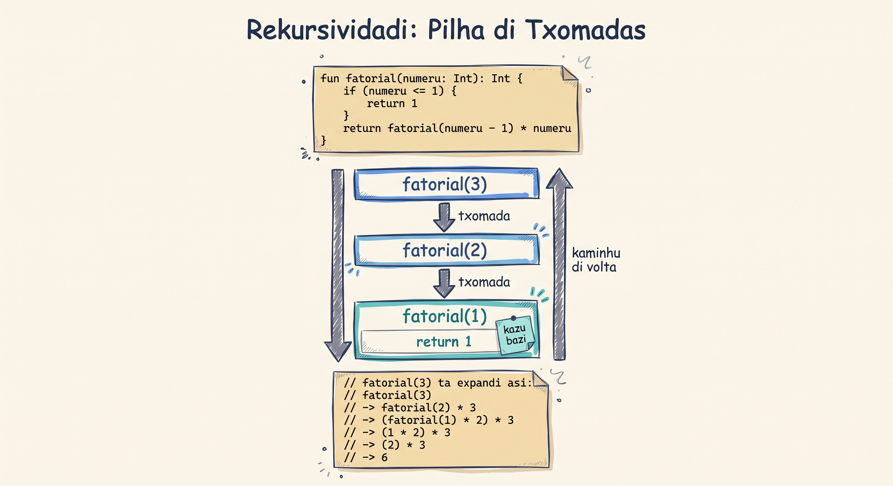

# Loops, Rekursividadi i Exsesons

Bu ka meste skrebe kes mesmu kódiku 10 vezes — bu ta manda Kotlin repeti-l pa bu. Nes lisan, bu ta prende kumo ripiti kódiku ku **loops** (`for` i `while`), kumo un funsan pode txoma se própi (rekursividadi), i kumo garanti ki bu programa ka ta kebra kuandu kuza ta kore mal, uzandu **exsesons** (exceptions).

<SectionHeading variant="concept" seq={1}>Ranges: `..`, `until`, `downTo`, `step`</SectionHeading>

Kada bez ki bu meste kore kódiku pa kada númeru di 0 te 5, ou di 10 pa 1, Kotlin ta da-bu un forma kurtu di skrebe kel: un **range**. Ten kuatru forma prinsipal:

- **`a..b`** — inkluzivu, ta kore di `a` te `b`, **inkluindu `b`**.
- **`a until b`** — eksklusivu, ta para **antis** di `b`.
- **`a downTo b`** — di `a` pa `b`, kaminhu pa baxu.
- **`step c`** — djunta ku kualker un di kes tres, ta pula di `c` na `c`.

Un range só ta fasi sentidu kuandu bu ta uza-l — normalmenti dentu di un **for-loop**, ki ta kore kódiku pa kada númeru dentu di el.

**`..` inkluzivu**

```kotlin
fun main() {
    for (i in 0..5) {
        println(i)
    }
}
```

**`until` eksklusivu**

```kotlin
fun main() {
    for (i in 0 until 5) {
        println(i)
    }
}
```

**`downTo` pa baxu**

```kotlin
fun main() {
    for (i in 5 downTo 0) {
        println(i)
    }
}
```

**`step` ku pasu**

```kotlin
fun main() {
    for (i in 0..10 step 3) {
        println(i)
    }
}
```

:::callout{type=warning}
`a..b` inklui `b`; `a until b` para antis di `b`. Es diferensa di un númeru só ("off-by-one") é un eru kumun. I atensan: `step` só ta seta valoris pozitivu — mesmu kuandu bu ta uza `downTo`, `step` ka pode ser negativu.
:::

<SectionHeading variant="concept" seq={2}>Loop `for`</SectionHeading>

Kumbina un range ku un `for-loop` pa ripiti kódiku pa kada valor di el. Li em baxu, un `for-loop` ta soma tudu numerus di 1 te un limiti:

```kotlin
fun main() {
    val limiti = 5
    var total = 0
    for (numeru in 1..limiti) {
        total += numeru
    }
    println("Total: $total") // Total: 15
}
```

<SectionHeading variant="concept" seq={3}>Loop `while`</SectionHeading>

Un `while`-loop ta ripiti se korpu **enkuantu** se kondisan ta `true`. Diferenti di `for`, `while` ka sabe antis kantu bez el ta kore — el só ta para kuandu kondisan ta `false`.

```kotlin
fun main() {
    // Telma sta ta konta kantu mangas ki resta
    var mangas = 5
    while (mangas > 0) {
        println("Manga: $mangas")
        mangas--
    }
    println("Kabadu!")
}
```

:::callout{type=warning}
Si kondisan di un `while` nunka ta bira `false`, loop ka ta para nunka — kel ta kria un **loop infinitu**. Sénpri garanti ki alguma kuza dentu di korpu di loop ta muda kondisan pa `false` (sima `mangas--` li em riba).
:::

<CompareTable
  title="`for` vs `while`"
  cornerLabel="Kritériu"
  cols={[
    { name: "for", syntax: "for (i in range)", accent: "blue" },
    { name: "while", syntax: "while (kondisan)", accent: "teal" },
  ]}
  rows={[
    { label: "Bu sabe kantidadi antis", kind: "bool", vals: [true, false] },
    { label: "Baziadu na un range", kind: "bool", vals: [true, false] },
    { label: "Riscu di loop infinitu", kind: "bool", vals: [false, true] },
    { label: "Kuandu uza", kind: "text", vals: ["Ripiti pa un **kantidadi konxedu** di elementu ou númeru", "Ripiti **te** un kondisan muda — kantidadi **deskonxedu** antis"] },
  ]}
/>

Kompleta kódiku li — kual linha ta garanti ki es `while`-loop ka ta bira infinitu?

<CodeCloze
  chrome="inline"
  lang="kotlin"
  title="Kompleta: while-loop sen loop infinitu"
  prompt="Kompleta kódiku pa `mangas` diminui kada bez, sinon loop nunka ta para."
  template={[
    "fun main() {",
    "    var mangas = 5",
    "    while (mangas > 0) {",
    "        println(\"Manga: $mangas\")",
    "        {{0}}",
    "    }",
    "    println(\"Kabadu!\")",
    "}",
  ]}
  answers={["mangas--"]}
  hints={["Kondisan di while ta uza `mangas`; algu dentu di korpu meste muda-l pa `false` eventualmenti."]}
  solved="Korretu! `mangas--` ta diminui `mangas` kada bez, te kondisan `mangas > 0` bira `false` i loop para."
/>

<SectionHeading variant="concept" seq={4}>Sai Sedu di un Loop: `break` i `continue`</SectionHeading>

Bu ka sénpri meste kore un loop te se fin natural. Kotlin ta da dos palavra-txavi pa muda kumo un loop ta kontinua:

- **`break`** — para loop **kompletamenti**, na hora, sen kompleta iterasons ki resta.
- **`continue`** — salta restu di es **un** iterasan, i kontinua diretu pa próxima.

Sara sta ta buska primeru numeru par dentu di un lista. Un bez ki el atxa-l, ka ten sentidu kontinua verifika restu:

```kotlin
fun main() {
    val numerus = listOf(3, 7, 9, 12, 5, 8)
    for (numeru in numerus) {
        if (numeru % 2 == 0) {
            println("Primeru par atxadu: $numeru")
            break
        }
    }
}
// Primeru par atxadu: 12
```

Nota ki `8` tanbe é par, ma loop **nunka txiga la** — `break` para tudu na hora ki `12` é atxadu.

`continue` é diferenti: el ka para loop, el só ta salta pa próxima iterasan.

```kotlin
fun main() {
    for (numeru in 1..10) {
        if (numeru % 2 != 0) {
            continue
        }
        println(numeru)
    }
}
// 2
// 4
// 6
// 8
// 10
```

Kada bez ki `numeru` é impar, `continue` ta salta `println` i ta bai diretu pa próximu valor di range — loop **kontinua** kore te `10`, diferenti di `break`.

:::callout{type=tip}
Dentu di loops aninhadu (li em baxu), `break`/`continue` só ta afeta loop **más pertu** unde el sta skritu — ka loop(s) más pa fora.
:::

<SectionHeading variant="concept" seq={5}>Loops aninhadu — dezenha triangulus</SectionHeading>

Un loop pode sta dentu di otu loop — kel ta txomadu **loop aninhadu** (nested loop). É un padran poderozu pa dezenha forma, sima triangulus di estrelas. Nu ta kumesa simplis i nu ta aumenta komplexidadi pasu-pa-pasu.

<Steps
  chrome="inline"
  variant="phases"
  phaseWord="Nível"
  eyebrow="Loop aninhadu"
  title="Triangulu di estrelas"
  steps={[
    {
      title: "Triangulu bázicu, parametrizadu pa altura",
      content: [
        { type: "prose", t: "Loop di fora (`i`) ta kontrola kada **fila**; loop di dentu (`j`) ta imprimi `i` estrela na kel fila. Muda sô `altura` pa muda tamanhu di tudu triangulu." },
        { type: "code", t: "for (j in 1..i) print(\"*\")" },
      ],
    },
    {
      title: "Invertidu, ku `downTo`",
      content: [
        { type: "prose", t: "Si bu troka loop di fora pa `downTo`, `i` ta kumesa na `altura` i ta diminui — triangulu ta sai invertidu, sen meste kalkula `altura - i`." },
        { type: "code", t: "for (numeruDiEstrelas in altura downTo 1)" },
      ],
    },
    {
      title: "Isósceles, ku spasu na fila",
      content: [
        { type: "prose", t: "Kada fila gosi meste **dos** parti: spasus (pa alinha triangulu na sentru) i estrelas. Padran: `spasus = altura - i` i `estrelas = i * 2 - 1`." },
        { type: "code", t: "estrelas = i * 2 - 1" },
      ],
    },
  ]}
/>

**Bázicu**

```kotlin
fun main() {
    val altura = 5
    for (i in 1..altura) {
        for (j in 1..i) {
            print("*")
        }
        println()
    }
}
```

**Invertidu (downTo)**

```kotlin
fun main() {
    val altura = 5
    for (numeruDiEstrelas in altura downTo 1) {
        for (j in 1..numeruDiEstrelas) {
            print("*")
        }
        println()
    }
}
```

**Isósceles spasadu**

```kotlin
fun main() {
    val altura = 5
    for (i in 1..altura) {
        val spasus = altura - i
        for (j in 1..spasus) {
            print(" ")
        }
        val estrelas = i * 2 - 1
        for (j in 1..estrelas) {
            print("*")
        }
        println()
    }
}
```

<SectionHeading variant="concept" seq={6}>Rekursividadi</SectionHeading>

Imajina un jogu di bonékas russa: bu abri kel más grandi i drentu del ten otu bonéka más pikinoti, i drentu di kel otu inda más pikinoti — te bu txiga na kel última, más pikinoti di tudu, ki ka abri más. Kel última bonéka é kazu bazi di jogu: el ka ten nada más pa abri, el sô é el mesmu.

Un funsan **rekursivu** ta trabadja parecidu: el ta txoma se própi drentu di se própi kódiku, i kada txomada ta "abri" un versan más pikinoti di mesmu problema — sima abri kada bonéka pa atxa otu más pikinoti drenti — te el txiga na un **kazu bazi** (base case), kel kondisan ki ta para rekursividadi, sima kel bonéka ki ka abri más. Sen kazu bazi, funsan ta kontinua txoma se própi pa senpri, te `StackOverflowError`.

Nu ta uza **fatorial** sima izemplu: fatorial di un númeru `n` é o produtu di tudu inteiru pozitivu di 1 te `n` (ex.: fatorial di 4 é `1*2*3*4 = 24`). Nu pode difini `fatorial(n)` na termu di el própi: `fatorial(n) = fatorial(n - 1) * n`, ku kazu bazi `fatorial(1) = 1`.

<AnnotatedCode
  chrome="inline"
  lang="kotlin"
  title="fatorial() rekursivu"
  code={[
    { t: "fun fatorial(numeru: Int): Int {", m: 0 },
    { t: "    if (numeru <= 1) {", m: 1 },
    { t: "        return 1", m: 1 },
    { t: "    }", m: 1 },
    { t: "    return fatorial(numeru - 1) * numeru", m: 2 },
    { t: "}", m: 0 },
  ]}
  notes={[
    { m: 1, title: "Kazu bazi", body: "Kuandu `numeru` ka é más grandi ki 1, funsan ta para di txoma se própi i ta devolve `1` direto." },
    { m: 2, title: "Kazu rekursivu", body: "Kaminhu kontráriu: funsan ta txoma **se própi** ku `numeru - 1`, dipos multiplika rezultadu pa `numeru`." },
  ]}
/>

```kotlin
// fatorial(3) ta expandi asi:
// fatorial(3)
// -> fatorial(2) * 3
// -> (fatorial(1) * 2) * 3
// -> (1 * 2) * 3
// -> (2) * 3
// -> 6
```



Kada txomada ta "enpilha" riba di otu, na un strutura ki ta txomadu **pilha di txomadas** (call stack), te ki `fatorial(1)` devolve `1` — i dipos kada nível ta multiplika se rezultadu, kaminhu di volta, te txiga na rezultadu final di `fatorial(3)`.

:::callout{type=warning}
Si bu skese di skrebe kazu bazi (ou si kondisan di el nunka ta kontise), funsan rekursivu ta txoma se própi **pa senpri**, te `StackOverflowError` — pilha di txomadas ta oja limiti di memória.
:::

<SectionHeading variant="concept" seq={7}>Exsesons</SectionHeading>

Imajina un artista di trapézi na sirku, ta salta di un baransa pa otu, txeu altu di txon. Normalmenti el ta panha baransa dretu — ma bez en kuandu el pode skorega. Sen un **rede di sigurãnsa** pa baxu, kualker skorega ta un dizastri pa el.

Na programasan, un **exsesan** é kumo kel skorega — algu inisperadu ki pode kontise duranti izekuson di programa. Kotlin ka ta dexa-bu ku rede di sigurãnsa pa grasa: bu meste konstrui-l bu mesmu, ku `try`/`catch`.

Kuandu un kuza ta kore mal durante ki programa sta na kursu, Kotlin ta permiti bu **lansa** (throw) un exsesan pa avisa ki ten un problema. Si es exsesan ka é **kapturadu** (catch), el ta para programa i ta imprimi un **relatóriu di eru** (stack trace) na terminal.

Un blóku `try`/`catch` ta permiti bu **tenta** kore un kódiku i **kaptura** kualker exsesan ki kontise, sen para programa. Un blóku `finally` (opsional) sénpri ta kore — ku ou sen eru — útil pa limpa rekursu.

Kotlin ten dos exsesan importanti ki bu ta uza txeu:

- **`IllegalArgumentException`** — kuandu un argumentu ten un valor inválidu.
- **`IllegalStateException`** — kuandu **stadu** di programa ka sta korretu pa kontinua.

```kotlin
// Zeca ta verifika si idadi ta válidu antis di kontinua
fun verificaIdadi(idadi: Int) {
    if (idadi < 0) {
        throw IllegalArgumentException("Idadi ka pode ser negativu: $idadi")
    }
}

fun main() {
    try {
        verificaIdadi(-5)
    } catch (e: IllegalArgumentException) {
        println("Eru kapturadu: ${e.message}")
    } finally {
        println("Verifikasan kabadu.")
    }
}
```

```kotlin
var nomiUtilizador = ""

fun imprimeNomiUtilizador() {
    if (nomiUtilizador == "") {
        throw IllegalStateException("Nomi di utilizador ka pode ser vazi")
    }
    println(nomiUtilizador)
}
```

Si `imprimeNomiUtilizador()` é txomadu sen `try`/`catch` i exsesan ka é kapturadu, es é o ki terminal ta mostra:

<TerminalBlock
  chrome="inline"
  title="Kuandu exsesan ka é kapturadu"
  lines={[
    { type: "cmd", t: "kotlin Main.kt" },
    { type: "err", t: "Exception in thread \"main\" java.lang.IllegalStateException: Nomi di utilizador ka pode ser vazi" },
    { type: "trace", t: "at MainKt.imprimeNomiUtilizador(Main.kt:5)" },
    { type: "trace", t: "at MainKt.main(Main.kt:10)" },
  ]}
/>

:::callout{type=warning}
Evita kaptura `Exception` di forma jeral (`catch (e: Exception)`) — kel ta skonde erus inesperadu ki bu ka staba spera. Kaptura só tipu **espesífiku** ki bu sabe ki pode kontise.
:::

Gosi bu sabe ripiti kódiku sen kopia-l, faze un funsan txoma se própi, i garanti ki bu programa ka ta kebra kuandu kuza kore mal — tres ferramenta ki bu ta uza na kuazi tudu programa ki bu ta skrebe daí pa diante.

<SectionHeading variant="practice">Tenta gosi</SectionHeading>
<TentaGosi chrome="inline" showHeader={false} />

<SectionHeading variant="quiz">Testa bu konhesimentu</SectionHeading>
<QuizSet chrome="inline" showHeader={false}>
  <Quiz position={0} />
  <Quiz position={1} />
  <Quiz position={2} />
  <Quiz position={3} />
  <Quiz position={4} />
  <Quiz position={5} />
</QuizSet>

<SectionHeading variant="summary">Pa lembra</SectionHeading>
<KeyTakeaways chrome="inline" showHeader={false}>
  <RezumuItem term="Ranges" code>`a..b` inklui `b`; `a until b` para antis; `a downTo b` ta desse; `step c` ta pula di `c` na `c`.</RezumuItem>
  <RezumuItem>Uza `for` kuandu bu sabe kantidadi antis; uza `while` kuandu kondisan ta muda i kantidadi é deskonxedu.</RezumuItem>
  <RezumuItem term="break / continue" code>`break` ta para loop kompletamenti; `continue` só ta salta pa próxima iterasan. Dentu di loops aninhadu, es só ta afeta loop más pertu.</RezumuItem>
  <RezumuItem term="Rekursividadi" code>Un funsan ki ta txoma se própi — sénpri meste un kazu bazi.</RezumuItem>
  <RezumuItem variant="gold" term="Regra di oru">Sen kazu bazi, rekursividadi ka ta para — `StackOverflowError`.</RezumuItem>
  <RezumuItem variant="warning" term="Érus kumuns">Loop infinitu (`while` sen kondisan ki muda) i kaptura `Exception` jeral demás.</RezumuItem>
  <RezumuItem variant="tip" term="Pista">Kaptura sénpri tipu di exsesan más espesífiku ki bu sabe.</RezumuItem>
</KeyTakeaways>
