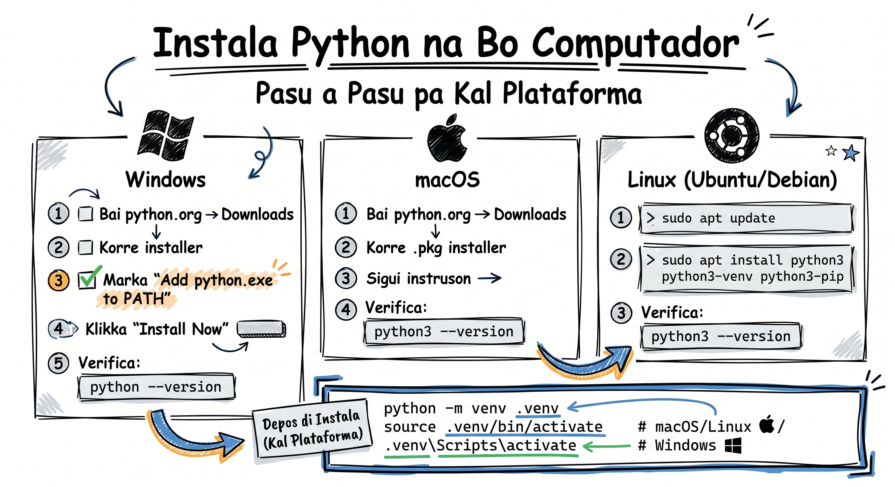

# Instala Python i Konfigura VS Code

Antis di kumesa programá, nu meste prepara nôs ferramentas. É manera un kuzinheru ki ta organiza ingredientis antis di kumesa fazi katchupa — bu presisa tudu na lugar sertu! Na es lisan, nu ta instala Python, konfigura VS Code, kria un virtual environment, i kore nôs priméru programa.

## Pasu 1: Instala Python



Python é grátis i disponível pa tudu sistema operasional. Bai na **[python.org/downloads](https://www.python.org/downloads/)** i fazi download di versan más resenti (Python 3.13+).

### Windows

1. Bai na [python.org/downloads](https://www.python.org/downloads/) i klika na **"Download Python 3.13.x"**
2. Abri fixeru ki bo fazi download (`python-3.13.x-amd64.exe`)
3. **MUTU IMPORTANTI:** Marka txekbox **"Add python.exe to PATH"** na parti di baxu!
4. Klika **"Install Now"**
5. Spera instalasun akaba i klika **"Close"**

:::callout{type=tip}
**O ki é PATH?** PATH é un lista di pastas undi sistema ta buska programas. Sin Python na PATH, kuandu bo skrebi `python` na terminal, sistema ka ta atxa-l.
:::

:::callout{type=warning}
**⚠️ Atensun:** Si bo skesi marka "Add python.exe to PATH", Python ka ta funsiona na terminal. Si bo dja instala sem marka, roda installer otu ves i skolhi "Modify" → marka "Add to PATH".
:::

Pa verifika ki tudu ta funsiona, abri **Command Prompt** (o PowerShell) i skrebi:

```bash
python --version
```

Bo debe odja algu manera: `Python 3.13.2`

### macOS

1. Bai na [python.org/downloads](https://www.python.org/downloads/) i fazi download di fixeru `.pkg` pa macOS
2. Abri fixeru `.pkg` i sigui instrusun di instalador
3. Klika **"Install"** i po bo password si pidi

Pa verifika, abri **Terminal** i skrebi:

```bash
python3 --version
```

:::callout{type=tip}
**Dika:** Na macOS, uza `python3` (ku 3) na lugar di `python`. macOS ta ben ku un Python antigu pré-instaladu, nton `python3` garanti ki bo ta uza versaun novu.
:::

### Linux (Ubuntu/Debian)

Na maioria di distribuisoens Linux, Python dja ta ben instaladu. Pa atualiza o instala:

```bash
sudo apt update
sudo apt install python3 python3-venv python3-pip
```

Verifika ku:

```bash
python3 --version
```

:::callout{type=tip}
**Dika:** Na Linux, é importanti instala tanbe `python3-venv` pamodi e ta permiti bo kria virtual environments. Sen kel pakoti, `python -m venv` ta da erru.
:::

## Pasu 2: Instala VS Code

**VS Code** (Visual Studio Code) é un editor di kódiku grátis di Microsoft. É editor más uzadu na mundu, ku suporti exelenti pa Python.

1. Bai na **[code.visualstudio.com](https://code.visualstudio.com/)** i fazi download pa bo sistema
2. Instala sigindi instrusun normal (Next → Next → Install)
3. Abri VS Code

### Instala Extensun di Python

Extensun di Python ta da-bu:
- Sintaxi highlighting (korís na kódiku)
- Autocomplete intelizenti
- Detesun di erru na tempu real
- Debugger integradu

Pa instala:

1. Abri VS Code
2. Klika na íconi di **Extensions** na barra lateral (o primi `Ctrl+Shift+X`)
3. Skrebi **"Python"** na barra di buska
4. Skolhi extensun **"Python"** di Microsoft (e ta mostru *ms-python.python*)
5. Klika **"Install"**

Extensun ta instala automátikamenti **Pylance** (pa autocomplete) i **Python Debugger**.

## Pasu 3: Kria Bo Priméru Projetu

Gosi nôs ta kria un pasta pa nôs priméru projetu Python. Es é un bom ábitu — kada projetu deve tene si própriu pasta.

### Kria Pasta di Projetu

```bash
# Windows (na Command Prompt)
mkdir meu-priméru-python
cd meu-priméru-python

# macOS/Linux (na Terminal)
mkdir meu-priméru-python
cd meu-priméru-python
```

### Abri na VS Code

```bash
code .
```

Es komandu ta abri VS Code ku pasta atual kumo projetu. Si `code` ka ta funsiona, abri VS Code manualmenti i uza **File → Open Folder** pa skolhi bo pasta.

## Pasu 4: Kria Virtual Environment (.venv)

Un **virtual environment** é un espasu izoladu pa kada projetu Python. Pamodi é importanti? Imagina:

- **Projetu A** precisa di biblioteka versaun 1.0
- **Projetu B** precisa di mesmu biblioteka ma versaun 2.0
- Sen virtual environment, un ta kibra otru!

Ku virtual environment, kada projetu tene si própriu "mundu" separadu.

### Kria .venv

Na terminal di VS Code (abri ku `` Ctrl+` ``), skrebi:

```bash
# Windows
python -m venv .venv

# macOS/Linux
python3 -m venv .venv
```

Es ta kria un pasta `.venv` dentru di bo projetu ku un kópia isoladu di Python.

### Ativa .venv

Antis di uza virtual environment, bo precisa **ativa** el:

```bash
# Windows (Command Prompt)
.venv\Scripts\activate

# Windows (PowerShell)
.venv\Scripts\Activate.ps1

# macOS/Linux
source .venv/bin/activate
```

Kuandu .venv ta ativu, bo ta odja `(.venv)` na kumessu di prompt:

```
(.venv) C:\Users\Nilton\meu-priméru-python>
```

Kel `(.venv)` ta indika ki tudu pakoti ki bo instala gosi ta bai pa es projetu so, ka pa sistema interu.

:::callout{type=warning}
**⚠️ Atensun (Windows PowerShell):** Si bo odja erru di "execution policy", roda es komandu primeiru:
```powershell
Set-ExecutionPolicy RemoteSigned -Scope CurrentUser
```
Dipôs tenta ativa .venv otu ves.
:::

### VS Code i .venv

VS Code é intelizenti — kuandu e deteta un pasta `.venv`, e ta propoe automátikamenti pa uza kel Python. Odja na barra di status (parti di baxu) — e deve mostru algu manera:

```
Python 3.13.2 ('.venv')
```

Si ka ta mostra, klika na versaun di Python na barra di status i skolhi interpreter (kel programa Python ki ta roda bo kódiku) ki ta stá dentru di `.venv`.

## Pasu 5: Nha Priméru Programa!

Gosi si! Nôs ta skrebi nôs priméru programa Python.

### Kria Fixeru

1. Na VS Code, klika na **New File** (o `Ctrl+N`)
2. Salva kumo **`ola.py`** (File → Save, o `Ctrl+S`)

:::callout{type=tip}
**Dika:** Fixeru Python sempri tene extensun **`.py`**. Kel é manera Python sabi ki é un programa pa roda.
:::

### Skrebi Kódiku

Skrebi es kódiku na fixeru `ola.py`:

:::callout{type=tip}
**Dika:** Es `f` antis di aspras (`f"..."`) é un **f-string** — e ta permiti po variáveis dentru di tekstu ku `{nomi}`. Bo ta prende más na lisan 7 (Strings).
:::

```python
# Nha priméru programa Python!
# Kriadu pa aprendedores di Skola.dev

nomi = input("Kel ki é bo nomi? ")
ilha = input("Bo é di kal ilha? ")

print(f"Ola, {nomi}! Ben-vindu a Python!")
print(f"{ilha} é un ilha sabi! Morabeza! 🇨🇻")
print("Nôs ta kriá djunta!")
```

### Roda Programa

Tene 3 maneras di roda bo programa:

**Manera 1: Botan Play** (más fásil)
- Klika na botan ▶️ (play) na kantu superiór direitu di VS Code

**Manera 2: Terminal**
```bash
# Sertifika ki .venv ta ativu!
python ola.py
```

**Manera 3: Ataju di Tekladu**
- Primi `Ctrl+F5` (roda sem debugger)

Bo debe odja algu manera:

```
Kel ki é bo nomi? Cesária
Bo é di kal ilha? São Vicente
Ola, Cesária! Ben-vindu a Python!
São Vicente é un ilha sabi! Morabeza! 🇨🇻
Nôs ta kriá djunta!
```

**Parabéns! Bo dja skrebi i roda bo priméru programa Python!** 🎉

## Pasu 6: Komandus Esensiais pa Lembra

Aki tene un rezimu di komandus ki bo ta uza sempri:

### Virtual Environment

```bash
# Kria virtual environment
python -m venv .venv          # Windows
python3 -m venv .venv         # macOS/Linux

# Ativa
.venv\Scripts\activate         # Windows (cmd)
.venv\Scripts\Activate.ps1    # Windows (PowerShell)
source .venv/bin/activate      # macOS/Linux

# Dezativa (kuandu bo akaba)
deactivate
```

### pip (Instalador di Pakotis)

Un **pakoti** é un biblioteka di kódiku ki otru pesoa skrebi pa bo uza. `pip` é programa ki ta instala-l dentru di bo `.venv`.

```bash
# Instala un pakoti dentru di bo .venv
pip install requests
```

:::callout{type=tip}
**Pa más sobri pip:** Lisan 21 (Ambiente Virtual i pip) ta mostra `pip list`, `pip freeze` i `requirements.txt` ku detalhe.
:::

### Roda Programa

```bash
# Roda un fixeru Python
python ola.py               # Windows
python3 ola.py              # macOS/Linux (fora di .venv)
```

:::callout{type=tip}
**Dika:** Kuandu `.venv` ta ativu, bo pode uza `python` (sem 3) na tudu sistema — virtual environment dja sabi kal versaun pa uza.
:::

## Errus Kumuns i Soluson

| Erru | Kauza | Soluson |
|------|-------|---------|
| `python ka ta axa` (Windows) | PATH ka ta konfiguradu | Roda installer otu ves, marka "Add to PATH" |
| `python: command not found` (macOS) | Uza `python3` na lugar | Skrebi `python3` o ativa .venv primeiru |
| PowerShell execution policy | Restrisun di seguransa | `Set-ExecutionPolicy RemoteSigned -Scope CurrentUser` |
| `pip install` ta da erru | .venv ka ta ativu | Verifika ki `(.venv)` ta na prompt |
| VS Code ka ta rekunhesi Python | Interpreter ka seleksionadu | Klika na barra di status → skolhi .venv interpreter |

## Tenta Gosi 🏋️

1. **Exersísiu 1:** Instala Python na bo komputador i verifika versaun ku `python --version` (o `python3 --version`). Skrebi ki versaun bo instala.

2. **Exersísiu 2:** Kria un pasta novu txamadu `prátika-python`, kria un `.venv` dentru del, i ativa el. Verifika ki `(.venv)` ta aparesi na bo prompt.

3. **Exersísiu 3:** Kria un fixeru `sobri-mi.py` ki ta pergunta 3 kuzas (nomi, idadi, pratu favoritu) i mostra un mensajen personalizadu. Ezemplu di output:

```
Kel ki é bo nomi? João
Kel ki é bo idadi? 25
Kel ki é bo pratu favoritu? Katchupa
João, bo tene 25 anu i bo ta gosta di Katchupa. Sabi!
```

<Quiz position={0} />

<Quiz position={1} />

<Quiz position={2} />

## Rezumu

- Instala Python di **python.org** — na Windows, sempri marka **"Add to PATH"**
- VS Code ku extensun Python ta da-bu un ambienti profisional grátis
- **Virtual environment** (`.venv`) izola pakotis di kada projetu — sempri kria un!
- Fixerus Python tene extensun **`.py`**
- `python -m venv .venv` kria, `source .venv/bin/activate` (o `.venv\Scripts\activate`) ativa
- Bo priméru programa uza `input()` pa resebe dadus i `print()` pa mostra rezultadus

---

**Prósimu lisan:** [Lé Errus (Tracebacks) →](/courses/intro-python/lessons/le-errus)
