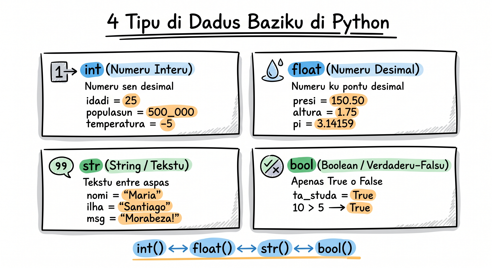

# Tipu di Dadus

Na mundu real, nu ta lida ku diferenti tipus di informasan: númerus, textus, sim/nun. Python tanbe tene diferenti **data types** pa representa kada tipu di informasan.

Na Lisan 5 bu dja konxe es kuatu tipus i `type()`. Gosi nu ta entra na detalhi: **kuandu** skodje kada un, pamodi `/` ta da senpri `float`, kumo `int()` ta trunka, i kumo evita `TypeError` ki ta parese kuandu bu mistura tipus.

## 4 Tipus Fundamentais



### Integer (`int`) — Númerus Interus

Númerus sen puntu desimal: positivu, negativu ó zeru.

```python
# Izemplus di int
populasan = 600000
temperatura = -5
anu = 2026
zero = 0

print(type(populasan))  # <class 'int'>
```

Undi uza `int`:
- Kontadoris (kantidadi di estudantis, anus, pájinas)
- Idadis
- Indexis (pozisan na un lista)
- Kualker númeru ki ka presiza puntu desimal

```python
# Python ta lida ku númerus mutu grandi sen problema
numeru_grandi = 1_000_000_000  # Underscore pa lejilidadi
print(numeru_grandi)           # 1000000000
print(type(numeru_grandi))     # <class 'int'>
```

:::callout{type=tip}
Bu pode uza underscore (`_`) dentu di númerus grandi pa lejilidadi: `1_000_000` é mesmu ki `1000000`.
:::

### Float — Númerus Desimais

Númerus ku puntu desimal.

```python
# Izemplus di float
presu_katxupa = 350.50
altura = 1.75
pi = 3.14159
temperatura = -2.5

print(type(presu_katxupa))  # <class 'float'>
```

Undi uza `float`:
- Presus i valores monetárius
- Medidas (altura, pezu, distánsia)
- Resultadus di divisan
- Kualker valor ki presiza prezisan desimal

```python
# ATENSAN: Divisan senpri ta retorna float!
rezultadu = 10 / 5
print(rezultadu)       # 2.0 (ka 2!)
print(type(rezultadu)) # <class 'float'>

# Mesmu kuandu rezultadu pode ser interu
rezultadu = 100 / 10
print(rezultadu)       # 10.0
print(type(rezultadu)) # <class 'float'>
```

:::callout{type=warning title="Kuidadu ku prezisan di float"}

```python
# Float tene limitasons di prezisan
print(0.1 + 0.2)  # 0.30000000000000004 (ka 0.3 ezatu!)
```

Kel é un limitasan di kumo komputador ta armazena númerus desimais. Pa maioria di kazus, ka é problema. Pa valores monetárius ezatus, ezisti módulu `decimal`, ma kel é avansadu.
:::

### String (`str`) — Textu

Textu dentu di aspas (simples ó dublu).

```python
# Izemplus di str
nomi = "Cesária Évora"
ilha = 'São Vicente'
mensajen = "Morabeza é alma di Kabu Verdi"
vazio = ""  # String vazio — tanbe é válidu

print(type(nomi))  # <class 'str'>
```

Bu pode uza aspas simples (`'`) ó dublu (`"`) — rezultadu é mesmu:

```python
# Tudu kel é válidu
greeting1 = "Ola!"
greeting2 = 'Ola!'
print(greeting1 == greeting2)  # True

# Sabi pa kuandu textu tene aspas dentu
frazi = "Funana é músika di 'batuku' kabu-verdianu"
frazi2 = 'El dizi "morabeza" pa tudu pesoa'
```

Strings tene propriedadis spesiais:

```python
nomi = "Djina"

# Komprimantu
print(len(nomi))  # 5

# Konkatenasan (djunta strings)
saudasan = "Ola, " + nomi + "!"
print(saudasan)  # Ola, Djina!

# Repetisan
print("-" * 30)  # ------------------------------

# f-string (midjór manera di mistura textu ku variáveis)
idadi = 20
print(f"{nomi} tene {idadi} anus")  # Djina tene 20 anus
```

:::callout{type=tip}
Senpri uza **f-strings** pa mistura textu ku variáveis. É más limpu ki konkatenasan ku `+`.
:::

*(F-strings ten más kapasidadi — formatasan, debug, ekspresons dentu. Bu ta prende más na Lisan 7.)*

### Boolean (`bool`) — Verdaderu ó Falsu

Só tene 2 valores: `True` ó `False` (ku T i F maiúskulu!).

```python
# Izemplus di bool
é_estudanti = True
ten_passaporti = False
ta_xobi = True

print(type(é_estudanti))  # <class 'bool'>
```

Booleans ta sai naturalmenti di **komparasons**:

```python
idadi = 20
print(idadi >= 18)      # True
print(idadi == 15)      # False
print(idadi != 20)      # False

nomi = "Pedro"
print(nomi == "Pedro")  # True
print(nomi == "pedro")  # False (case sensitive!)

presu = 350.50
print(presu > 300)      # True
print(presu < 100)      # False
```

```python
# Bool na kondisionais
nota = 85
pasou = nota >= 70

if pasou:
    print("Parabéns! Bo pasa!")
else:
    print("Bo ten ki studia más...")
```

*(Kondisionais `if`/`else` i operadoris di komparasan: bu ta prende más na Lisan 8 i Lisan 9.)*

<SectionHeading variant="concept">Kuandu Uza Kada Tipu</SectionHeading>

<CompareTable
  cornerLabel="Tipu"
  showHeader={false}
  cols={[
    { name: "int", syntax: "interu", accent: "blue" },
    { name: "float", syntax: "desimal", accent: "teal" },
    { name: "str", syntax: "textu", accent: "gold" },
    { name: "bool", syntax: "True / False", accent: "coral" },
  ]}
  rows={[
    {
      label: "Pa kuze",
      kind: "text",
      vals: [
        "Kontador, kantidadi, idadi",
        "Presu, medida, persentajen",
        "Nomi, mensajen, textu",
        "Sim/nun, ativu/inativu",
      ],
    },
    {
      label: "Izemplu",
      kind: "code",
      vals: ["estudantis = 45", "presu = 149.99", 'nomi = "Ana"', "ativu = True"],
    },
  ]}
/>

```python
# Izemplu prátiku: Rejistru di un estudanti
nomi = "Kelvin"           # str
idadi = 21                # int
nota_media = 82.5         # float
é_bolsista = True         # bool
ilha = "Fogo"             # str
kreditusECV = 15000       # int

print(f"Estudanti: {nomi}")
print(f"Idadi: {idadi} anus")
print(f"Nota média: {nota_media}")
print(f"Bolsista: {'Sim' if é_bolsista else 'Nun'}")
print(f"Ilha: {ilha}")
print(f"Kréditus: {kreditusECV} ECV")
```

## TypeError: Kuandu Tipus Ka Ta Kombina

Un di erus más komuns pa prinsipianti é **TypeError** — kuandu bo tenta faze un operasan ku tipus inkompatíveis.

<SectionHeading level={3} variant="concept">Eru #1: Soma di String ku Númeru</SectionHeading>

<CodeDiff
  lang="python"
  filename="mensajen.py"
  title="Soma di string ku int"
  note="Ka pode `+` un `str` ku un `int`. Konverti ku `str(idadi)`, ó — midjór — uza un f-string."
  diff={[
    { type: "ctx", t: 'nomi = "Maria"' },
    { type: "ctx", t: "idadi = 25" },
    { type: "del", t: 'mensajen = nomi + " tene " + idadi + " anus"' },
    { type: "add", t: 'mensajen = f"{nomi} tene {idadi} anus"' },
    { type: "ctx", t: "print(mensajen)  # Maria tene 25 anus" },
  ]}
/>

<SectionHeading level={3} variant="concept">Eru #2: Operasan Matemátika ku String</SectionHeading>

<CodeDiff
  lang="python"
  filename="taxa.py"
  title="Multiplika un string"
  note="`presu` é un string, ka un númeru. Konverti ku `float()` antis di multiplika."
  diff={[
    { type: "ctx", t: 'presu = "350"    # É string, ka int!' },
    { type: "ctx", t: "taxa = 0.15" },
    { type: "del", t: "total = presu * taxa" },
    { type: "add", t: "total = float(presu) * taxa" },
    { type: "ctx", t: 'print(f"Taxa: {total} ECV")  # Taxa: 52.5 ECV' },
  ]}
/>

<SectionHeading level={3} variant="concept">Eru #3: Komparasan di Tipus Diferenti</SectionHeading>

<CodeDiff
  lang="python"
  filename="kompara.py"
  title="Kompara tipus diferenti"
  note="Kompara un string ku un int ta da `False` sen lansa eru — un bug silensiozu. Konverti pa mesmu tipu antis di kompara."
  diff={[
    { type: "del", t: 'print("5" == 5)       # False — tipus diferenti' },
    { type: "add", t: 'print(int("5") == 5)  # True — mesmu tipu' },
  ]}
/>

:::callout{type=tip}
Kuandu bo enkontra `TypeError`, verifika tipus ku `type()`. Kuazi senpri, soluson é konverti un valor ku `int()`, `float()` ó `str()`.
:::

<SectionHeading level={3} variant="practice">Tenta: Koriji os Tipus</SectionHeading>

<CodeCloze
  lang="python"
  title="Inche os spasus"
  prompt="Koriji dos erus: konverti kada valor pa tipu sertu."
  template={[
    "idadi = 25",
    'presu = "350"',
    "taxa = 0.15",
    "# 1) int → textu pa konkatena",
    'mensajen = "Idadi: " + {{0}}(idadi)',
    "# 2) string → desimal pa multiplika",
    "total = {{1}}(presu) * taxa",
  ]}
  answers={["str", "float"]}
  hints={["Konverti int pa textu", "Konverti string pa desimal"]}
  solved="Korretu! `str()` ta konverti int pa textu, i `float()` ta konverti string pa númeru."
/>

## Tabela Rezumu di Konversan

```python
# int() — pa interu
print(int(3.14))       # 3 (trunka, ka aredonda!)
print(int("42"))       # 42
print(int(True))       # 1
print(int(False))      # 0

# float() — pa desimal
print(float(42))       # 42.0
print(float("3.14"))   # 3.14
print(float(True))     # 1.0

# str() — pa textu
print(str(42))         # "42"
print(str(3.14))       # "3.14"
print(str(True))       # "True"

# bool() — pa boolean
print(bool(0))         # False
print(bool(42))        # True
print(bool(""))        # False (string vazio)
print(bool("Ola"))     # True (kualker string ku konteúdu)
```

:::callout{type=warning}
`int()` ta **trunka** (korta parti desimal), ka ta aredonda. `int(3.9)` da `3`, ka `4`! Pa aredonda, uza `round(3.9)` ki da `4`.
:::

## Izemplu Prátiku: Loja di Katxupa

Nu ta kombina tudu tipus na un programa real:

:::callout{type=tip}
**Ka preokupa si bu ka kompriendi tudu kódiku gosi.** Lisan-li é so pa odja kumo kuatu tipus (`str`, `float`, `int`, `bool`) ta vivi djuntu na un programa. Operadoris matemátikus (`*`, `+`, `-`), `input()`, i formatasan `:.2f` ta ben más tardi (Lisan 7, 8 i 9). Repara na **tipus**, ka na lójika.
:::

```python
# === Loja di Katxupa di Nha Cesária ===
print("=" * 35)
print("  Loja di Katxupa di Nha Cesária")
print("=" * 35)
print()

# Dadus di pratu (diferentes tipus)
nomi_pratu = "Katxupa Rica"           # str
presu_unitáriu = 450.00               # float
porsun_disponível = 12                # int
é_spesialidadi = True                 # bool

# Mostra menu
print(f"Pratu: {nomi_pratu}")
print(f"Presu: {presu_unitáriu} ECV")
print(f"Disponível: {porsun_disponível} porsons")
print(f"Spesialidadi di kaza: {'Sim' if é_spesialidadi else 'Nun'}")
print()

# Resebe pedidu
kantidadi = int(input("Kantu porsan bo kre? "))

# Kalkula
subtotal = presu_unitáriu * kantidadi
taxa = subtotal * 0.15
total = subtotal + taxa
porsun_resta = porsun_disponível - kantidadi

# Mostra rezumu
print()
print("--- Rezumu di Pedidu ---")
print(f"Pratu: {nomi_pratu} x{kantidadi}")
print(f"Subtotal: {subtotal:.2f} ECV")
print(f"Taxa (15%): {taxa:.2f} ECV")
print(f"Total: {total:.2f} ECV")
print(f"Porsons ki resta: {porsun_resta}")
```

Kuandu bo roda:

<TerminalBlock
  title="python loja.py"
  lines={[
    { type: "cmd", t: "python loja.py" },
    { type: "out", t: "===================================" },
    { type: "out", t: "  Loja di Katxupa di Nha Cesária" },
    { type: "out", t: "===================================" },
    { type: "out", t: "Pratu: Katxupa Rica" },
    { type: "out", t: "Presu: 450.0 ECV" },
    { type: "out", t: "Disponível: 12 porsons" },
    { type: "out", t: "Spesialidadi di kaza: Sim" },
    { type: "out", t: "Kantu porsan bo kre? 3" },
    { type: "out", t: "--- Rezumu di Pedidu ---" },
    { type: "out", t: "Pratu: Katxupa Rica x3" },
    { type: "out", t: "Subtotal: 1350.00 ECV" },
    { type: "out", t: "Taxa (15%): 202.50 ECV" },
    { type: "out", t: "Total: 1552.50 ECV" },
    { type: "out", t: "Porsons ki resta: 9" },
  ]}
/>

*(Pa kel izemplu-li, bu skrebe `3` na `input()`. Repara: `subtotal` é `float` (pamodi `presu_unitáriu` é float), nton tudu kálkulu ta da float — `:.2f` só ta kontrola kuantu kasa desimal ta parese.)*

## Verifikasan Rápida di Tipus

Kel é un truki útil — uza `isinstance()` pa verifika si un valor é di un sertu tipu:

```python
valor = 42

print(isinstance(valor, int))     # True
print(isinstance(valor, float))   # False
print(isinstance(valor, str))     # False

# Verifica vários tipus di un bez
print(isinstance(valor, (int, float)))  # True — é int ó float
```

:::callout{type=tip}
`isinstance()` é más profisional ki `type() ==`. Pa gosi, `type()` ta sirvi, ma lenbra `isinstance()` pa futuru.
:::

*(Nu ta volta pa `isinstance()` ku más detalji na Lisan 18.)*

<SectionHeading variant="practice">Repete pa Lembra: Funsons di Konversan</SectionHeading>

Antis di pratika, vira es kartas pa fixa o ki kada funsan ta faze. Klika pa odja definison.

<Flashcard
  showHeader={false}
  cards={[
    { term: "int()", def: "Ta konverti un valor pa interu i ta trunka parti desimal — int(3.9) ta da 3, ka 4." },
    { term: "float()", def: "Ta konverti un valor pa númeru desimal — float(42) ta da 42.0." },
    { term: "str()", def: 'Ta konverti kualker valor pa textu — str(42) ta da textu "42".' },
    { term: "bool()", def: "Ta konverti un valor pa True ó False — 0, textu vaziu i None ta da False; tudu otu ta da True." },
    { term: "round()", def: "Ta aredonda un desimal pa interu más prósimu — round(3.9) ta da 4." },
    { term: "isinstance()", def: "Ta verifika si un valor é di un sertu tipu i ta da True ó False — más profisional ki type() == pa kel verifikasan." },
  ]}
/>

<SectionHeading variant="practice">Tenta Gosi</SectionHeading>
<TentaGosi showHeader={false} />

<SectionHeading variant="quiz">Testa bu Konhesimentu</SectionHeading>
<QuizSet showHeader={false}>
  <Quiz position={0} /><Quiz position={1} /><Quiz position={2} />
</QuizSet>

<SectionHeading variant="summary">Rezumu</SectionHeading>
<KeyTakeaways showHeader={false}>
  <RezumuItem variant="gold" term="Regra di oru">Kuandu bu atxa un `TypeError`, verifika tipus ku `type()` — kuazi senpri soluson é konverti un valor ku `int()`, `float()` o `str()`.</RezumuItem>
  <RezumuItem term="4 tipus">`int` (interus), `float` (desimais), `str` (textu) i `bool` (`True`/`False`) é tipus fundamentais.</RezumuItem>
  <RezumuItem term="f-strings">Midjór manera di mistura textu ku variáveis — más limpu ki `+`, i ta evita `TypeError`.</RezumuItem>
  <RezumuItem>Divisan `/` ta retorna **senpri** float — `10 / 5` é `2.0`, ka `2`.</RezumuItem>
  <RezumuItem variant="warning" term="Errus kumuns">`TypeError` ta parese kuandu bu ta mistura tipus inkompatíveis (`"Maria" + 25`). I `int(3.9)` ta **trunka** pa `3` — pa aredonda, uza `round()`.</RezumuItem>
  <RezumuItem variant="tip" term="Pista">`isinstance(valor, int)` é más profisional ki `type(valor) == int` pa verifika tipu — bu ta volta pa el na Lisan 18.</RezumuItem>
</KeyTakeaways>
