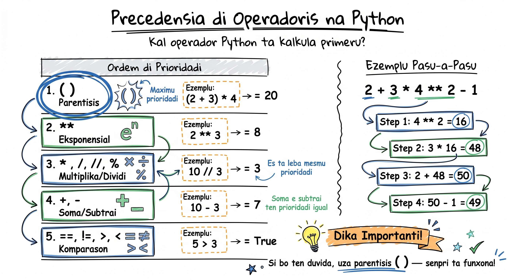

# Operadoris

Operadoris é sinais ki ta dize Python pa faze un operasan ku valoris. Kuandu bo skrebe `10 + 5`, sinal `+` é operador i `10` ku `5` é operandus. Na es lisan, nos ta prende tres tipu prinsipal di operadoris: aritmétiku (pa kalkula), komparasan (pa kompara), i lójiku (pa kombina kondisons). Es é ferramentas fundamentál ki bu ta uza na tudu programa ki bo skrebe.

## Operadoris Aritmétiku

Es operadoris ta faze kálkulus matemátiku. Si bo sabe matemátika báziku, bo djá konxe maioria.

```python
# Adisan i Subtrasan
print(10 + 5)    # 15
print(10 - 3)    # 7

# Multiplikasan
print(4 * 3)     # 12

# Divisan (SENPRI retorna float!)
print(10 / 5)    # 2.0  ← nota: 2.0, KA 2!
print(7 / 2)     # 3.5
```

:::callout{type=tip}
**Dika:** Divisan ku `/` SENPRI ta retorna un float (nùmeru ku pontu desimal), mesmu kuandu rezultadu é "interu". `10 / 5` ta da `2.0`, ka `2`. Es é un armadilha komun!
:::

```python
# Divisan Interu (floor division) — tira parti desimal
print(7 // 2)    # 3  (ka 3.5 — tira desimal)
print(10 // 3)   # 3
print(21 // 5)   # 4

# Módulu (restu di divisan)
print(10 % 3)    # 1  (10 ÷ 3 = 3 restu 1)
print(15 % 5)    # 0  (divisan exata — sen restu)
print(7 % 2)     # 1  (ímpar: restu é 1)
```

```python
# Esponensasan (potensia)
print(2 ** 3)    # 8   (2 × 2 × 2)
print(5 ** 2)    # 25  (5 × 5)
print(10 ** 0)   # 1   (kualker nùmeru elevadu a 0 é 1)
print(9 ** 0.5)  # 3.0 (rais kuadrada!)
```

### Izemplu Prátiku: Kalkula Troku ku Eskudu

```python
# Kalkula troku na loja
presu = 750      # presu na Eskudus (ECV)
pagamentu = 1000 # klientu pagá ku nota di 1000

troku = pagamentu - presu
print(f"Troku: {troku} ECV")  # Troku: 250 ECV

# Kuantas notas di 100 i kuantas moedas?
notas_100 = troku // 100     # 2 notas di 100
restu = troku % 100          # 50 ECV sobra
print(f"{notas_100} nota(s) di 100 ECV i {restu} ECV na moeda")
```

### Izemplu Prátiku: Konversor di Moeda

```python
# Konversor Eskudu → Euro
eskudus = 5000
taxa_kambiu = 110.265  # 1 EUR = 110.265 ECV

euros = eskudus / taxa_kambiu
print(f"{eskudus} ECV = {euros:.2f} EUR")
# 5000 ECV = 45.35 EUR
```

### Par o Ímpar?

```python
# Truque ku módulu: verifica si nùmeru é par o ímpar
numeru = 17

if numeru % 2 == 0:
    print(f"{numeru} é par")
else:
    print(f"{numeru} é ímpar")
# 17 é ímpar
```

### Operadoris di Atribuisan Konposta

Bu pode kombina operadoris aritmétiku ku atribuisan pa atalhu.

```python
# Atalhu: operador + atribuisan
saldo = 1000

saldo += 500   # mesmu ki: saldo = saldo + 500
print(saldo)   # 1500

saldo -= 200   # mesmu ki: saldo = saldo - 200
print(saldo)   # 1300

saldo *= 2     # mesmu ki: saldo = saldo * 2
print(saldo)   # 2600

saldo //= 3    # mesmu ki: saldo = saldo // 3
print(saldo)   # 866
```

| Atalhu | Ekivalenti |
|--------|------------|
| `x += 5` | `x = x + 5` |
| `x -= 3` | `x = x - 3` |
| `x *= 2` | `x = x * 2` |
| `x /= 4` | `x = x / 4` |
| `x //= 2` | `x = x // 2` |
| `x %= 3` | `x = x % 3` |
| `x **= 2` | `x = x ** 2` |

## Operadoris di Komparasan

Es operadoris ta kompara dois valoris i ta retorna `True` o `False` (boolean). Es é essensial pa kondisionais (`if/elif/else`) ki bu ta prende na prósimu lisan.

```python
# Igual i Diferenti
print(10 == 10)   # True   (é igual?)
print(10 == 5)    # False
print(10 != 5)    # True   (é diferenti?)
print(10 != 10)   # False

# Maior i Menor
print(10 > 5)     # True
print(10 < 5)     # False
print(10 >= 10)   # True   (maior O igual)
print(10 <= 9)    # False  (menor O igual)
```

:::callout{type=tip}
**Dika:** Ka konfundi `=` (atribuisan) ku `==` (komparasan)! `x = 5` ta guarda valor 5 na `x`. `x == 5` ta pergunta "x é igual a 5?".
:::

```python
# Komparasan di strings — é CASE SENSITIVE!
print("Praia" == "Praia")    # True
print("Praia" == "praia")    # False! (P maiúskula ≠ p minúskula)
print("Praia".lower() == "praia".lower())  # True (soluson!)
```

```python
# Komparasan ku variáveis
idadi_joao = 25
idadi_ana = 30

print(f"João é más velhu ki Ana? {idadi_joao > idadi_ana}")   # False
print(f"Ana é más velhu ki João? {idadi_ana > idadi_joao}")    # True
print(f"Es tene mesmu idadi? {idadi_joao == idadi_ana}")       # False
```

### Izemplu Prátiku: Verifikasan di Idadi

```python
# Verifica si pesoa pode vota (>= 18 anu)
nomi = "Nilton"
idadi = 17

pode_vota = idadi >= 18
print(f"{nomi} pode vota? {pode_vota}")  # Nilton pode vota? False
```

## Operadoris Lójiku

Operadoris lójiku ta kombina vários kondisons. Pensa es kumo "i", "ó", "ka" na Kriolu.

### `and` — AMBOS ten ki ser True

```python
# and: tudu kondisons ten ki ser verdaderu
idadi = 25
tene_bilheti = True

print(idadi >= 18 and tene_bilheti)  # True (25 >= 18 É tene bilheti)
print(idadi >= 30 and tene_bilheti)  # False (25 ka >= 30)
```

### `or` — ALGUN ten ki ser True

```python
# or: pelo menus UN kondisan ten ki ser verdaderu
é_studanti = False
é_idosu = True

tene_diskontu = é_studanti or é_idosu
print(tene_diskontu)  # True (pelo menus un é True)
```

### `not` — inverte True/False

```python
# not: inverte valor lójiku
ta_xobe = True
print(not ta_xobe)  # False

loja_aberta = False
print(not loja_aberta)  # True
```

### Kombina Tudu Djuntu

```python
# Ezemplu kompletu: validasan di bilheti
idadi = 22
é_studanti = True
tene_dinheru = True

# Pode entra si: (tene 18+ anu I tene dinheru) O é studanti
pode_entra = (idadi >= 18 and tene_dinheru) or é_studanti
print(f"Pode entra? {pode_entra}")  # True
```

```python
# Ezemplu prátiku: validasan di senha
senha = "Py2026!"

tene_tamanhu = len(senha) >= 6
tene_numeru = any(c.isdigit() for c in senha)
tene_letra = any(c.isalpha() for c in senha)

senha_forte = tene_tamanhu and tene_numeru and tene_letra
print(f"Senha forte? {senha_forte}")  # True
```

## Tabela di Verdadi (Truth Table)

Pa intende `and`, `or`, i `not`, es tabela ta ajuda:

```python
# Tabela di verdadi pa 'and'
print(True and True)    # True
print(True and False)   # False
print(False and True)   # False
print(False and False)  # False
# Rezumu: and só é True kuandu AMBOS é True

# Tabela di verdadi pa 'or'
print(True or True)     # True
print(True or False)    # True
print(False or True)    # True
print(False or False)   # False
# Rezumu: or só é False kuandu AMBOS é False

# Tabela di verdadi pa 'not'
print(not True)    # False
print(not False)   # True
```

## Presedensia di Operadoris (Orden di Exekusan)



Python ta sigi un orden espesífiku kuandu tene vários operadoris na mesmu expresan. É igualzinhu ki matemátika — multiplikasan antis di adisan.

```python
# Sen paréntesis: Python sigi presedensia
resultado = 2 + 3 * 4
print(resultado)  # 14 (ka 20! — * antis di +)

# Ku paréntesis: bo kontrola orden
resultado = (2 + 3) * 4
print(resultado)  # 20
```

**Orden di presedensia (di más altu pa más baixu):**

| Priuridad | Operador | Deskrisan |
|-----------|----------|-----------|
| 1 (más altu) | `**` | Esponensasan |
| 2 | `not` | Negasan lójika |
| 3 | `*`, `/`, `//`, `%` | Multiplikasan, divisan, módulu |
| 4 | `+`, `-` | Adisan, subtrasan |
| 5 | `==`, `!=`, `>`, `<`, `>=`, `<=` | Komparasan |
| 6 | `and` | E lójiku |
| 7 (más baixu) | `or` | Ou lójiku |

```python
# Ezemplu di presedensia
resultado = 2 ** 3 + 4 * 2 - 1
# Pasu 1: 2 ** 3 = 8       (esponensasan primeiru)
# Pasu 2: 4 * 2 = 8        (multiplikasan)
# Pasu 3: 8 + 8 - 1 = 15   (adisan i subtrasan)
print(resultado)  # 15
```

:::callout{type=tip}
**Dika:** Na dúvida, uza **paréntesis**! `(2 + 3) * 4` é más klaru ki depende di presedensia. Kódiku klaru é más importante ki kódiku kurtu.
:::

## Armadilhas Komun

```python
# ARMADILHA 1: / senpri retorna float
print(type(10 / 5))   # <class 'float'> — 2.0, ka 2!
print(type(10 // 5))  # <class 'int'>   — 2 (si bo kre interu, uza //)

# ARMADILHA 2: = vs ==
x = 5      # atribuisan (guarda valor)
x == 5     # komparasan (pergunta si é igual) → True

# ARMADILHA 3: komparasan di string é case-sensitive
nomi = "Pedro"
print(nomi == "pedro")  # False!
print(nomi.lower() == "pedro")  # True (soluson)

# ARMADILHA 4: divisan interu ku negativus
print(7 // 2)    #  3  ← normal
print(-7 // 2)   # -4  ← arredonda pa BAIXU, ka pa zeru!
```

## Tenta Gosi 🏋️

1. **Izersisiu 1 — Kalkuladora di Troku:** Pedi utilizador pa skrebe presu di un produtu i kuantu el pagá. Kalkula troku, kuantas notas di 200 ECV, kuantas di 100 ECV, i kuantu sobra na moeda.

2. **Izersisiu 2 — Verifikador di Idadi:** Pedi nomi i idadi di un pesoa. Mostra si el pode:
   - Vota (>= 18)
   - Konduz karu (>= 18)
   - Bebe alkól (>= 18)
   - Aposenta (>= 65)
   Uza operadoris di komparasan i f-strings pa tudu.

3. **Izersisiu 3 — Kalkuladora di IMC:** Pedi pezu (kg) i altura (m). Kalkula IMC (`pezu / altura ** 2`) i mostra kategoria:
   - `IMC < 18.5`: "Abaixu di pezu"
   - `18.5 <= IMC < 25`: "Pezu normal"
   - `25 <= IMC < 30`: "Subrepézu"
   - `IMC >= 30`: "Obezidadi"

<Quiz position={0} />

<Quiz position={1} />

<Quiz position={2} />

## Rezumu

- **Aritmétiku:** `+`, `-`, `*` funsiona kumo esperadu; `/` SENPRI retorna float; `//` pa divisan interu; `%` pa restu; `**` pa potensia
- **Atribuisan konposta:** `+=`, `-=`, `*=` é atalhu pa `x = x op valor`
- **Komparasan:** `==` (igual), `!=` (diferenti), `>`, `<`, `>=`, `<=` — tudu retorna True/False
- **Lójiku:** `and` (ambos True), `or` (algun True), `not` (inverte)
- **Presedensia:** `**` > `not` > `* / // %` > `+ -` > komparasan > `and` > `or`
- **Ka konfundi** `=` (atribuisan) ku `==` (komparasan)
- **Na dúvida, uza paréntesis** pa torna kódiku más klaru

---

**Prósimu lisan:** [Kondisionais (if/elif/else) →](/courses/intro-python/lessons/kondisionais)
