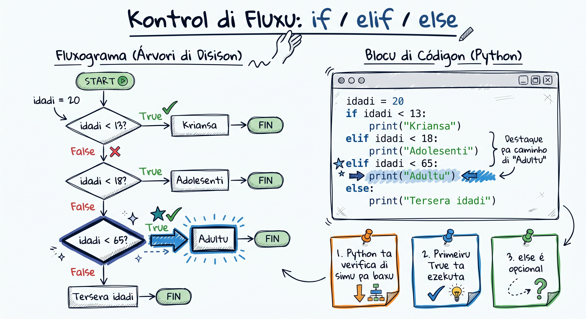

# Kondisionais (if/elif/else)

Na vida real, nôs ta toma desizun a tudu momentu: "Si sta txobê, nha ta léba garda-txuva. Si nau, nha ta bai sin el." Programas ta funsiona mesmu maneira -- és ta presiza toma desizun baseadu na kondisaun. Na Python, nôs ta uza `if`, `elif` i `else` pa kontrola kaminhu ki programa ta sigui. Dipos di kel lisun li, bo ta sabi fazi bo programa pensa i disidi!

## If i Else Báziku



Estrutura `if` ta verifica un kondisun. Si kondisun é `True`, Python ta izekuta bloku di kódiku dentru. Si é `False`, el ta pula pa `else`.

```python
# Verifikasun simples di idadi
idadi = 18

if idadi >= 18:
    print("Bo é adultu.")
else:
    print("Bo é menor di idadi.")
```

**Kumé ki funsiona:**

1. Python ta avalia kondisun `idadi >= 18`
2. Si é `True` -- izekuta priméru bloku (dipos di `if`)
3. Si é `False` -- izekuta bloku `else`

> **Dika:** Nunka skexi dois-pontus `:` dipos di `if` i `else`. Python ta uza indentasun (4 espasu) pa sabi ki kódiku ta pertensi a kál bloku.

Ma uzus simples:

```python
# Verifikasun di senhu
temperatura = 35

if temperatura > 30:
    print("Sta kenti! Bai praia di Kebra Kanela!")
else:
    print("Temperatura ta normal.")
```

```python
# Verifikasun di sáldu
saldu = 1500  # Eskudu (ECV)

if saldu >= 1000:
    print("Bo tene sáldu sufisiente.")
else:
    print("Sáldu insufisiente!")
```

## Kadeia If/Elif/Else

Kuandu bo tene más ki dos opsaun, bo ta uza `elif` (ki é "else if" abreviadu). Python ta verifica kada kondisun di riba pa baxu i ta izekuta priméru ki é `True`.

```python
# Klasifikasun di idadi
idadi = 15

if idadi < 13:
    print("Bo é kriansa.")
elif idadi < 18:
    print("Bo é adolesenti.")
elif idadi < 65:
    print("Bo é adultu.")
else:
    print("Bo é terseiru idadi.")
```

Kel ezemplu li ta funsiona pa kualker idadi:
- `idadi = 8` -- "Bo é kriansa."
- `idadi = 15` -- "Bo é adolesenti."
- `idadi = 30` -- "Bo é adultu."
- `idadi = 70` -- "Bo é terseiru idadi."

> **Dika:** Órdin ta importa! Python ta para na priméru kondisun ki é `True`. Si bo pô `idadi < 65` primeru, un kriansa di 8 anu ta kái nkel bloku pamodi `8 < 65` tanbe é `True`.

Ma un ezemplu prátiku -- klasifikasun di nota:

```python
# Klasifikasun di nota di skola
nota = float(input("Inseri bo nota (0-20): "))

if nota >= 17:
    print("Eksélenti! 🌟")
elif nota >= 14:
    print("Bon!")
elif nota >= 10:
    print("Sufisiente.")
elif nota >= 0:
    print("Insufisiente. Tenta más!")
else:
    print("Nota inválidu!")
```

## Kondisionais Aninhadu

Bo podi pô un `if` dentru di otu `if`. Es ta txomá "kondisionais aninhadu" (nested conditionals). Útil kuandu bo presiza verifica más ki un koza di ves.

```python
# Verifica si numeru é par/ímpar i positivu/negativu
numeru = int(input("Inseri un numeru: "))

if numeru > 0:
    print(f"{numeru} é positivu.")
    if numeru % 2 == 0:
        print("I tanbe é par.")
    else:
        print("I tanbe é ímpar.")
elif numeru < 0:
    print(f"{numeru} é negativu.")
    if numeru % 2 == 0:
        print("I tanbe é par.")
    else:
        print("I tanbe é ímpar.")
else:
    print("É zeru! Nen positivu, nen negativu.")
```

> **Dika:** Kuidadu ku kondisionais aninhadu demás! Si bo tene más di 3 nivéis, programa ta fika difísil di lé. Más tardi nôs ta prende formas di simplifika.

## Ezemplu Prátiku: Verifikador di Anu Bisextu

Un anu é bisextu si:
- É divisível pa 4 **I**
- **KA** é divisível pa 100 **OU** é divisível pa 400

```python
# Verifikador di anu bisextu
anu = int(input("Inseri un anu: "))

if anu % 4 == 0:
    if anu % 100 == 0:
        if anu % 400 == 0:
            print(f"{anu} é anu bisextu! 📅")
        else:
            print(f"{anu} KA é anu bisextu.")
    else:
        print(f"{anu} é anu bisextu! 📅")
else:
    print(f"{anu} KA é anu bisextu.")
```

Testa ku anus diferenti:
- `2024` -- bisextu (divisível pa 4, nau pa 100)
- `1900` -- NAU bisextu (divisível pa 100, ma nau pa 400)
- `2000` -- bisextu (divisível pa 400)
- `2023` -- NAU bisextu (nau divisível pa 4)

Bo tanbe podi skrévi mesmu lójika na un linha ku operadoris `and` i `or`:

```python
# Versan simplifikadu ku operadoris lójiku
anu = int(input("Inseri un anu: "))

if (anu % 4 == 0 and anu % 100 != 0) or (anu % 400 == 0):
    print(f"{anu} é anu bisextu! 📅")
else:
    print(f"{anu} KA é anu bisextu.")
```

## Kalkuladora Simples

Gosi nôs ta djunta tudu ki nôs ta prende pa kria un kalkuladora:

```python
# Kalkuladora simples
print("=== Kalkuladora di Kabu Verdi ===")
num1 = float(input("Priméru numeru: "))
num2 = float(input("Sigundu numeru: "))
operasun = input("Operasun (+, -, *, /): ")

if operasun == "+":
    resultadu = num1 + num2
    print(f"{num1} + {num2} = {resultadu}")
elif operasun == "-":
    resultadu = num1 - num2
    print(f"{num1} - {num2} = {resultadu}")
elif operasun == "*":
    resultadu = num1 * num2
    print(f"{num1} * {num2} = {resultadu}")
elif operasun == "/":
    if num2 != 0:
        resultadu = num1 / num2
        print(f"{num1} / {num2} = {resultadu}")
    else:
        print("Erru: Ka podi dividi pa zeru!")
else:
    print(f"Operasun '{operasun}' ka é válidu. Uza +, -, * ó /.")
```

> **Dika:** Nota kumé ki nôs pô un `if` dentru di `elif operasun == "/"` pa verifica si `num2` é zeru. Divizun pa zeru ta kauza `ZeroDivisionError` na Python!

## Kondisionais na Un Linha (Ternary Operator)

Pa kondisionais simples, Python ta permiti skrévi tudu na un linha só:

```python
# Forma normal
idadi = 20
if idadi >= 18:
    status = "adultu"
else:
    status = "menor"

# Mesmu koza na un linha (ternary operator)
status = "adultu" if idadi >= 18 else "menor"
print(f"Bo é {status}.")
```

```python
# Más ezemplus
nomi = "Maria"
saudason = f"Bon dia, {nomi}!" if idadi >= 18 else f"Ola, {nomi}!"
print(saudason)
```

> **Dika:** Uza ternary operator só pa kazus simples. Si lójika é kompleksu, uza `if/elif/else` normal pa kódiku fika más klaru.

## Kondisionais ku Operadoris Lójiku

Bo podi kombina kondisun ku `and`, `or` i `not`:

```python
# Verifikasun pa entra na diskoteka
idadi = 20
tene_bilheti = True

if idadi >= 18 and tene_bilheti:
    print("Ben-vindu pa festa di funana! 🎵")
else:
    print("Bo ka podi entra.")
```

```python
# Verifikasun di disku na menu
presu = 450  # ECV
é_pratu_dia = True

if presu <= 500 or é_pratu_dia:
    print("Kel presu li sta bon!")
else:
    print("Sta un pokitu karu.")
```

```python
# Verifikasun di temperatura pa viaja pa Sal
temperatura = 28
sta_txobê = False

if temperatura > 25 and not sta_txobê:
    print("Dia perfeitu pa bai praia na Sal! 🏖️")
else:
    print("Talves oxi ka é milhor dia.")
```

## Pitu di Match/Case (Python 3.10+)

Dezdi Python 3.10, tene un alternativa modernu pa kadeia di `if/elif` -- `match/case`. É más limpu kuandu bo ta kompara un valór ku txeu opsaun:

```python
# Kalkuladora ku match/case (Python 3.10+)
operasun = input("Operasun (+, -, *, /): ")

match operasun:
    case "+":
        print("Adisun")
    case "-":
        print("Subtrasun")
    case "*":
        print("Multiplikasun")
    case "/":
        print("Divizun")
    case _:
        print("Operasun diskonxidu!")
```

`case _` é komu `else` -- el ta apanha tudu ki ka kombina ku kazus anterióris.

```python
# Klasifikasun di dia di simana
dia = input("Dia di simana: ").lower()

match dia:
    case "sigunda" | "tersa" | "kuarta" | "kinta" | "sesta":
        print("Dia di trabadju! 💼")
    case "sábadu" | "dumingu":
        print("Fin di simana! 🎉")
    case _:
        print("Kel ka é un dia di simana válidu.")
```

> **Dika:** `match/case` é opsional -- `if/elif/else` ta funsiona sénpri. Ma `match/case` é más eleganti kuandu bo tene txeu opsaun pa kompara. Nôs ta uza más di el na Module 2 ku estruturas di dadus.

## Erus Komun ku Kondisionais

```python
# ERRU 1: Uza = na vés di ==
# if idadi = 18:    # SyntaxError! = é atribuisun
if idadi == 18:      # == é komparasun ✓
    print("18 anus!")

# ERRU 2: Skexi dois-pontus
# if idadi >= 18     # SyntaxError! Falta ':'
if idadi >= 18:      # ✓
    print("Adultu")

# ERRU 3: Indentasun inkorretu
# if idadi >= 18:
# print("Adultu")    # IndentationError! Falta espasu
if idadi >= 18:
    print("Adultu")  # 4 espasu di indentasun ✓

# ERRU 4: Kompara tipu diferenti
# if "18" == 18:     # False! string ka é igual a int
if int("18") == 18:  # True ✓
    print("Igual!")
```

## Tenta Gosi 🏋️

1. **Exersísiu 1: Klassifikador di IMC** -- Pidi uzuáriu pa inseri pezu (kg) i altura (m). Kalkula IMC (pezu / altura ** 2) i mostra klasifikasun:
   - Menor ki 18.5: "Baxu pezu"
   - 18.5 a 24.9: "Pezu normal"
   - 25.0 a 29.9: "Sobrepezu"
   - 30 ó más: "Obezidadi"

2. **Exersísiu 2: Konversor di moeda** -- Kria un programa ki konverti entre Eskudu (ECV), Euro (EUR) i Dólar (USD). Pidi montanti i moeda di orijin, dipos mostra valór na kes otu dos moedas. (1 EUR = 110 ECV, 1 USD = 100 ECV)

3. **Exersísiu 3: Klasifikador di triángulu** -- Pidi 3 ladus di un triángulu. Priméru, verifica si ladus ta forma un triángulu válidu (soma di kualker dos ladus ten ki ser maior ki terseiru). Dipos, klasifika:
   - Ekiáteru (3 ladus igual)
   - Isóseles (2 ladus igual)
   - Eskalenu (tudu diferenti)

<Quiz position={0} />

<Quiz position={1} />

<Quiz position={2} />

## Rezumu

- `if` ta verifica un kondisun i izekuta bloku si é `True`
- `elif` ta djunta kondisun adisional (podi tene txeu `elif`)
- `else` ta apanha tudu ki ka kombina ku kondisaun anterióris
- Kondisionais aninhadu ta permiti lójika más kompleksu, ma kuidadu ku profundidadi
- Operadoris lójiku (`and`, `or`, `not`) ta kombina kondisaun
- Ternary operator (`valór if kondisun else otu_valór`) é útil pa kazus simples
- `match/case` (Python 3.10+) é un alternativa modernu pa kadeia di `if/elif`
- Sénpri uza `==` pa komparasun, nunka `=`

---

**Prósimu lisun:** [Loops (for/while) →](/courses/intro-python/lessons/loops)
