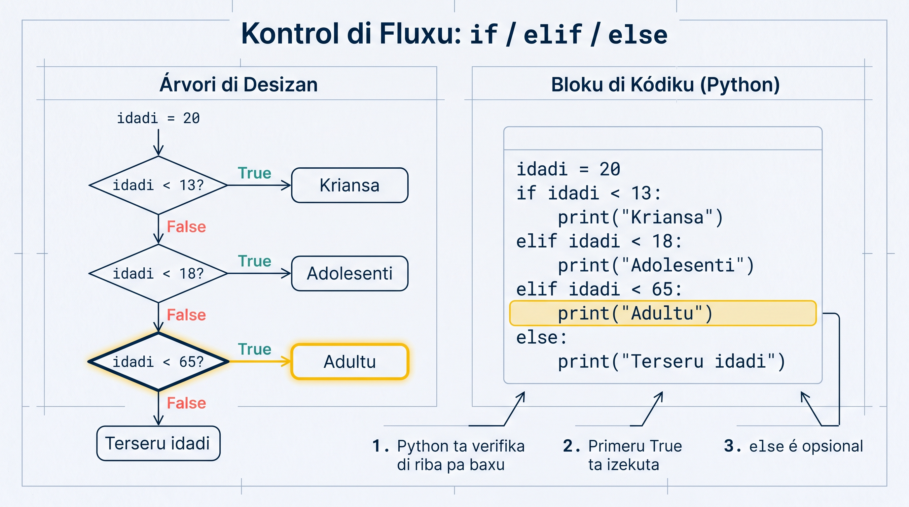

# Kondisionais (if/elif/else)

Na vida real, nos ta toma desizan a tudu momentu: "Si sta txobe, N ta leba garda-txuva. Si nau, N ta bai sen el." Programas ta funsiona mesmu maneira — és ta presiza toma desizan baseadu na kondisan. Na Python, nos ta uza `if`, `elif` i `else` pa kontrola kaminhu ki programa ta sigi. Dipos di kel lisan li, bu ta sabi faze bo programa pensa i disidi!

<GlossaryText
  text="Un programa ta toma desizan avaliandu un [[kondisan]] — un pergunta ki ta da `True` ou `False` (un valor [[boolean]])."
  terms={{
    kondisan: { en: "condition", definition: "Un expresan ki Python ta avalia kumo `True` ou `False` — pa izemplu idadi >= 18. É o ki un if ta verifika antis di disidi." },
    boolean: { en: "boolean", definition: "Tipu di dadu ku dos valor sô: True ou False. Tudu komparasan (==, >, <...) ta produzi un boolean." },
  }}
/>

:::callout{type=tip}
Na L08 bu prende es operadoris di komparasan (`==`, `>`, `<`, `>=`) i lójiku (`and`, `or`, `not`). Kada un di es ta da un `boolean` (`True`/`False`) — i é izatamenti kel ki un `if` ta presiza. Nes lisan nu ta uza-s pa toma desizan.
:::

## If i Else Báziku



Estrutura `if` ta verifika un kondisan. Si kondisan é `True`, Python ta izekuta bloku di kódiku dentu. Si é `False`, el ta pula pa `else`.

<AnnotatedCode
  lang="python"
  title="Kumé ki un if/else ta funsiona"
  code={[
    { t: "idadi = 18", m: 0 },
    { t: "if idadi >= 18:", m: 1 },
    { t: '    print("Bo é adultu.")', m: 2 },
    { t: "else:", m: 0 },
    { t: '    print("Bo é menor di idadi.")', m: 3 },
  ]}
  notes={[
    { m: 1, title: "Avalia kondisan", body: "Python ta avalia `idadi >= 18` — ta da `True` ou `False`." },
    { m: 2, title: "Si é True", body: "Si kondisan é `True`, ta izekuta bloku **indentadu** dipos di `if`." },
    { m: 3, title: "Si é False", body: "Si é `False`, Python ta salta diretu pa bloku `else`." },
  ]}
/>

:::callout{type=warning}
Nunka skise `:` dipos di `if` i `else`. Python ta uza indentasan (4 espasu) pa sabe ki kódiku ta pertensi pa kual bloku.
:::

Ma uzus simples:

```python
# Verifikasan di senhu
temperatura = 35

if temperatura > 30:
    print("Sta kenti! Bai praia di Kebra Kanela!")
else:
    print("Temperatura ta normal.")
```

```python
# Verifikasan di sáldu
saldu = 1500  # Eskudu (ECV)

if saldu >= 1000:
    print("Bo tene sáldu sufisiente.")
else:
    print("Sáldu insufisiente!")
```

## Kadeia If/Elif/Else

Kuandu bu tene más ki dos opsan, bu ta uza `elif` (ki é "else if" abreviadu). Python ta verifika kada kondisan di riba pa baxu i ta izekuta primeru ki é `True`.

```python
# Klasifikasan di idadi
idadi = 15

if idadi < 13:
    print("Bo é kriansa.")
elif idadi < 18:
    print("Bo é adolesenti.")
elif idadi < 65:
    print("Bo é adultu.")
else:
    print("Bo é terseru idadi.")
```

Kel izemplu li ta funsiona pa kualker idadi:
- `idadi = 8` — "Bo é kriansa."
- `idadi = 15` — "Bo é adolesenti."
- `idadi = 30` — "Bo é adultu."
- `idadi = 70` — "Bo é terseru idadi."

:::callout{type=tip}
Órdin ta importa! Python ta para na primeru kondisan ki é `True`. Si bo po `idadi < 65` primeru, un kriansa di 8 anu ta kái nkel bloku pamodi `8 < 65` tanbe é `True`.
:::

Ma un izemplu prátiku — klasifikasan di nota:

```python
# Klasifikasan di nota di skola
nota = float(input("Inseri bo nota (0-20): "))

if nota >= 17:
    print("Eksélenti! 🌟")
elif nota >= 14:
    print("Bon!")
elif nota >= 10:
    print("Sufisiente.")
elif nota >= 0:
    print("Insufisiente. Tenta más!")
else:
    print("Nota inválidu!")
```

## Kondisionais Aninhadu

Bu pode po un `if` dentu di otu `if`. Es ta txoma "kondisionais aninhadu" (nested conditionals). Útil kuandu bo presiza verifika más ki un koza di bez.

```python
# Verifica si numeru é par/ímpar i positivu/negativu
numeru = int(input("Inseri un numeru: "))

if numeru > 0:
    print(f"{numeru} é positivu.")
    if numeru % 2 == 0:
        print("I tanbe é par.")
    else:
        print("I tanbe é ímpar.")
elif numeru < 0:
    print(f"{numeru} é negativu.")
    if numeru % 2 == 0:
        print("I tanbe é par.")
    else:
        print("I tanbe é ímpar.")
else:
    print("É zeru! Nen positivu, nen negativu.")
```

:::callout{type=warning}
Kuidadu ku kondisionais aninhadu demás! Si bu tene más di 3 nivéis, programa ta fika difísil di ler. Más tardi nos ta prende formas di simplifika.
:::

## Izemplu Prátiku: Verifikador di Anu Bisextu

Un anu é bisextu si:
- É divisível pa 4 **I**
- **KA** é divisível pa 100 **OU** é divisível pa 400

Es dos versons ta da **mesmu rezultadu** — vira es tabs pa kompara `if` aninhadu ku versan nun linha só (ku operadoris `and` i `or` ki bu prende na L08; nu ta volta na es más baxu na seksan "Kondisionais ku Operadoris Lójiku"):

<CodeExample position={1} showTabs />

Testa ku anus diferenti:

| Anu | Bisextu? | Pamodi |
|-----|----------|--------|
| `2024` | ✅ Sin | Divisível pa 4, nau pa 100 |
| `1900` | ❌ Nau | Divisível pa 100, ma nau pa 400 |
| `2000` | ✅ Sin | Divisível pa 400 |
| `2023` | ❌ Nau | Nau divisível pa 4 |

## Kalkuladora Simples

Gosi nos ta djunta tudu ki nos ta prende pa kria un kalkuladora:

```python
# Kalkuladora simples
print("=== Kalkuladora di Kabu Verdi ===")
num1 = float(input("Primeru numeru: "))
num2 = float(input("Sigundu numeru: "))
operasan = input("Operasan (+, -, *, /): ")

if operasan == "+":
    rezultadu = num1 + num2
    print(f"{num1} + {num2} = {rezultadu}")
elif operasan == "-":
    rezultadu = num1 - num2
    print(f"{num1} - {num2} = {rezultadu}")
elif operasan == "*":
    rezultadu = num1 * num2
    print(f"{num1} * {num2} = {rezultadu}")
elif operasan == "/":
    if num2 != 0:
        rezultadu = num1 / num2
        print(f"{num1} / {num2} = {rezultadu}")
    else:
        print("Eru: Ka pode dividi pa zeru!")
else:
    print(f"Operasan '{operasan}' ka é válidu. Uza +, -, * ou /.")
```

:::callout{type=tip}
Nota kumo ki nos po un `if` dentu di `elif operasan == "/"` pa verifika si `num2` é zeru. Divizan pa zeru ta kauza `ZeroDivisionError` na Python!
:::

## Kondisionais na Un Linha (Ternary Operator)

Pa kondisionais simples, Python ta permiti skrebe tudu na un linha só. Es dos forma ta da **mesmu rezultadu** — vira es tabs pa kompara:

<CodeExample position={0} showTabs />

```python
# Más izemplus
idadi = 20
nomi = "Maria"
saudasan = f"Bon dia, {nomi}!" if idadi >= 18 else f"Ola, {nomi}!"
print(saudasan)
```

:::callout{type=tip}
Uza ternary operator só pa kazus simples. Si lójika é kompleksu, uza `if/elif/else` normal pa kódiku fika más klaru.
:::

## Kondisionais ku Operadoris Lójiku

Bu pode kombina kondisan ku `and`, `or` i `not`:

```python
# Verifikasan pa entra na diskoteka
idadi = 20
tene_bilheti = True

if idadi >= 18 and tene_bilheti:
    print("Ben-vindu pa festa di funana! 🎵")
else:
    print("Bo ka pode entra.")
```

```python
# Verifikasan di disku na menu
presu = 450  # ECV
é_pratu_dia = True

if presu <= 500 or é_pratu_dia:
    print("Kel presu li sta bon!")
else:
    print("Sta un pokitu karu.")
```

```python
# Verifikasan di temperatura pa viaja pa Sal
temperatura = 28
sta_txobe = False

if temperatura > 25 and not sta_txobe:
    print("Dia perfeitu pa bai praia na Sal! 🏖️")
else:
    print("Talvez oji ka é midjór dia.")
```

## Pitu di Match/Case (Python 3.10+)

Dezdi Python 3.10, tene un alternativa modernu pa kadeia di `if/elif` — `match/case`. É más limpu kuandu bu ta kompara un valór ku txeu opsan:

```python
# Kalkuladora ku match/case (Python 3.10+)
operasan = input("Operasan (+, -, *, /): ")

match operasan:
    case "+":
        print("Adisan")
    case "-":
        print("Subtrasan")
    case "*":
        print("Multiplikasan")
    case "/":
        print("Divizan")
    case _:
        print("Operasan diskonxidu!")
```

`case _` é kumo `else` — el ta apanha tudu ki ka kombina ku kazus anterióris.

```python
# Klasifikasan di dia di semana
dia = input("Dia di semana: ").lower()

match dia:
    case "sigunda" | "tersa" | "kuarta" | "kinta" | "sesta":
        print("Dia di trabadju! 💼")
    case "sábadu" | "dumingu":
        print("Fin di semana! 🎉")
    case _:
        print("Kel ka é un dia di semana válidu.")
```

:::callout{type=tip}
`match/case` é opsional — `if/elif/else` ta funsiona senpri. Ma `match/case` é más eleganti kuandu bu tene txeu opsan pa kompara. Nos ta uza más di el na Module 2 ku estruturas di dadus.
:::

## Erus Komun ku Kondisionais

<DetailDisclosure
  items={[
    {
      q: "Uza `=` en bez di `==`",
      tag: "Eru",
      a: "`=` é atribuisan (guarda valor); komparasan é `==`. `if idadi = 18:` ta da un `SyntaxError`.",
      code: "if idadi == 18:",
    },
    {
      q: "Skese `:` na fin di liña",
      tag: "Eru",
      a: "Tudu `if`, `elif` i `else` ten ki kaba ku dos pontus `:`. Sen el, `SyntaxError`.",
      code: "if idadi >= 18:",
    },
    {
      q: "Indentasan inkorretu",
      tag: "Eru",
      a: "Kódiku dentu di un `if` ten ki ser indentadu ku 4 espasu. Sen indentasan, `IndentationError`.",
      code: '    print("Adultu")',
    },
    {
      q: "Kompara tipu diferenti (string ku int)",
      tag: "Eru",
      a: '`"18" == 18` ta da `False` — un string nunka é igual a un int. Konverti primeru ku `int()`.',
      code: 'int("18") == 18',
    },
  ]}
/>

<SectionHeading variant="practice">Tenta Gosi</SectionHeading>
<TentaGosi showHeader={false} />

<SectionHeading variant="quiz">Testa bu Konhesimentu</SectionHeading>
<QuizSet showHeader={false}>
  <Quiz position={0} /><Quiz position={1} /><Quiz position={2} />
</QuizSet>

<SectionHeading variant="summary">Rezumu</SectionHeading>
<KeyTakeaways showHeader={false}>
  <RezumuItem variant="gold" term="Regra di oru">**Orden** ta importa — Python ta para na primeru kondisan ki é `True`. Po kondisons más estrita antis di más larga.</RezumuItem>
  <RezumuItem term="if / elif / else">`if` ta verifika un kondisan; `elif` ta djunta más opsons; `else` ta apanha tudu restu.</RezumuItem>
  <RezumuItem term="Aninhadu">Bu pode po un `if` dentu di otu pa lójika kompleksu — ma kuidadu ku profundidadi (más di 3 nível ta fika difísil di ler).</RezumuItem>
  <RezumuItem term="Ternary">`valor if kondisan else otu_valor` é útil pa kazus simples nun linha.</RezumuItem>
  <RezumuItem term="match/case">Python 3.10+ — un alternativa eleganti pa kadeia di `if`/`elif` ku txeu opsan; `case _` é kumo `else`.</RezumuItem>
  <RezumuItem variant="warning" term="Erus kumuns">Ka skese `:` dipos di `if`/`elif`/`else`, indenta ku 4 spasus, i uza senpri `==` (ka `=`) pa komparasan.</RezumuItem>
</KeyTakeaways>
