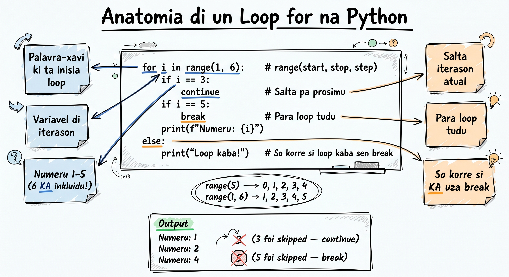

# Loops (for/while)

Imajina ki bu ta presiza konta di 1 té 100. Bu ta skrebe `print(1)`, `print(2)`, `print(3)`... té `print(100)`? Klaru ki nau! Loops ta permiti bo repeti un bloku di kódiku txeu bez sen skrebe mesmu koza repetidu. Na Python, nos tene dos tipu prinsipál di loop: `for` i `while`. Nos ta domina ambos na kel lisan li!

## For Loop ku Range()



`for` loop é forma más komun di repetisan na Python. Funsan `range()` ta jera un sekuénsia di numerus pa nos itera.

```python
# Konta di 0 a 4
for i in range(5):
    print(i)
# Saída: 0, 1, 2, 3, 4
```

`range()` ta aséita até 3 argumentus: `range(start, stop, step)`:

```python
# range(stop) -- kumesa na 0
for i in range(5):
    print(i)         # 0, 1, 2, 3, 4

# range(start, stop) -- stop ka ta inkluídu!
for i in range(1, 6):
    print(i)         # 1, 2, 3, 4, 5

# range(start, stop, step)
for i in range(0, 10, 2):
    print(i)         # 0, 2, 4, 6, 8

# Kontajen disendenti
for i in range(10, 0, -1):
    print(i)         # 10, 9, 8, 7, 6, 5, 4, 3, 2, 1
```

:::callout{type=tip}
**Dika:** `range(stop)` ta kumesa SENPRI na 0 i ta para ANTES di `stop`. Nton `range(5)` ta dá 0, 1, 2, 3, 4 -- sinku numerus, ma nunka txiga na 5!
:::

Izemplu prátiku -- kontajen regresivu:

```python
# Kontajen regresivu pa lansamentu di fogeti na Fogu 🌋
print("Lansamentu na Ilha du Fogu!")
for i in range(10, 0, -1):
    print(f"{i}...")
print("FOGETI! 🚀")
```

## Itera Sima Strings

`for` loop ta funsiona dirétamenti ku strings -- el ta pasa pu kada karáter:

```python
# Itera sima kada letra
nomi = "Cesária"
for letra in nomi:
    print(letra)
# Saída: C, e, s, á, r, i, a

# Konta vogais na un nomi
nomi = "Amilcar"
vogais = "aeiouAEIOU"
kontador = 0

for letra in nomi:
    if letra in vogais:
        kontador += 1

print(f"'{nomi}' tene {kontador} vogais.")  # 'Amilcar' tene 3 vogais.
```

## Itera Sima Listas

Bo tanbe pode itera dirétamenti sima listas (nos ta prende listas na Module 2, ma li ta mostru pitu):

```python
# Lista di ilhas di Kabu Verdi
ilhas = ["Santiago", "São Vicente", "Sal", "Fogo", "Santo Antão"]

for ilha in ilhas:
    print(f"Ilha: {ilha}")
```

```python
# Kalkula média di notus
notus = [14, 17, 12, 19, 15]
soma = 0

for nota in notus:
    soma += nota

media = soma / len(notus)
print(f"Média: {media}")  # Média: 15.4
```

## While Loop

`while` loop ta repeti enkuantu kondisan é `True`. Útil kuandu bu ka sabe kuántus bez loop ta presiza kori.

```python
# Konta di 1 a 5 ku while
kontador = 1
while kontador <= 5:
    print(kontador)
    kontador += 1     # IMPORTANTI: sen kel li, loop ta kori pa senpri!
```

:::callout{type=tip}
**Dika:** Senpri garanti ki kondisan di `while` ta txiga a `False` na algun momentu. Sen kél, bu ta kria un "loop infinitu" ki ka ta para nunka! Pa para un loop infinitu, primi `Ctrl + C` na terminal.
:::

Izemplu prátiku -- jogu di adivinha:

```python
# Jogu di adivinha numeru
import random

numeru_sekretu = random.randint(1, 10)
tentativa = 0

print("Nha ta pensa na un numeru di 1 a 10...")

while True:
    resposta = int(input("Bo palpiti: "))
    tentativa += 1

    if resposta == numeru_sekretu:
        print(f"Paraben! Bo adivinha na {tentativa} tentativa(s)! 🎉")
        break
    elif resposta < numeru_sekretu:
        print("Más altu!")
    else:
        print("Más baxu!")
```

Otu izemplu -- validasan di input:

```python
# Pidi un numeru positivu
numeru = -1
while numeru <= 0:
    numeru = int(input("Inseri un numeru positivu: "))
    if numeru <= 0:
        print("Kel ka é positivu! Tenta más.")

print(f"Bo inseri: {numeru}")
```

## Break, Continue i Pass

Python tene 3 instruson spesiál pa kontrola kumé loop ta funsiona:

### Break -- Sai di Loop

`break` ta termina loop imediatamenti, mesmu si kondisan ainda é `True`:

```python
# Buska primeru numeru divisível pa 7
for i in range(1, 100):
    if i % 7 == 0:
        print(f"Primeru divisível pa 7: {i}")
        break
# Saída: Primeru divisível pa 7: 7
```

```python
# Para kuandu txiga na un nomi spesífiku
nomis = ["João", "Ana", "Maria", "Pedro", "Carla"]

for nomi in nomis:
    if nomi == "Maria":
        print("Nha atxa Maria! 🎯")
        break
    print(f"Verifikandu: {nomi}...")
```

### Continue -- Pula pa Prósimu

`continue` ta pula restu di iterasan atual i ta bai pa prósimu:

```python
# Mostra só numerus ímpar di 1 a 10
for i in range(1, 11):
    if i % 2 == 0:
        continue       # Pula numerus par
    print(i)
# Saída: 1, 3, 5, 7, 9
```

```python
# Mostra tudu ilhas MENUS Sal
ilhas = ["Santiago", "São Vicente", "Sal", "Fogo", "Santo Antão"]

for ilha in ilhas:
    if ilha == "Sal":
        continue
    print(f"Ilha: {ilha}")
```

### Pass -- Ka Faze Nada

`pass` é un "placeholder" -- el ka ta faze nada, ma ta permiti bu tene un bloku vazio sen eru:

```python
# Placeholder pa kódiku ki bo ta skrévi dipos
for i in range(10):
    if i % 2 == 0:
        pass  # TODO: Prosesa numerus par dipos
    else:
        print(f"{i} é ímpar")
```

:::callout{type=tip}
**Dika:** `pass` é útil kuandu bu ta planeja bo programa i bu kre dexa un bloku vazio pa dipos. Sen `pass`, Python ta dá `IndentationError`.
:::

## For-Else: Bloku Else Dipos di Loop

Python tene un karaterístika únika: bu pode po `else` dipos di un `for` loop. Bloku `else` ta kori SÓ si loop termina normalmenti (sen `break`):

```python
# Buska un numeru na lista
numerus = [2, 4, 6, 8, 10]
buska = 7

for n in numerus:
    if n == buska:
        print(f"Atxa {buska}!")
        break
else:
    print(f"{buska} ka sta na lista.")
# Saída: 7 ka sta na lista.
```

Kel é perfeitu pa buska: si bo atxa, `break` ta pula `else`. Si bu ka atxa, `else` ta kori.

Izemplu klásku -- verifikador di numeru primu:

```python
# Verifica si un numeru é primu
numeru = int(input("Inseri un numeru: "))

if numeru <= 1:
    print(f"{numeru} ka é primu.")
else:
    for i in range(2, numeru):
        if numeru % i == 0:
            print(f"{numeru} ka é primu (divisível pa {i}).")
            break
    else:
        print(f"{numeru} é primu! ✨")
```

## Loops Aninhadu

Bu pode po un loop dentu di otu loop. Loop di dentu ta kori kompletu pa KADA iterasan di loop di fora:

```python
# Tábua di multiplikasan di 1 a 5
for i in range(1, 6):
    print(f"\n--- Tábua di {i} ---")
    for j in range(1, 11):
        print(f"{i} x {j} = {i * j}")
```

Izemplu más kurtu -- gridu di koordenadas:

```python
# Gridu 3x3
for linha in range(3):
    for koluna in range(3):
        print(f"({linha},{koluna})", end="  ")
    print()  # Nova linha dipos di kada linha di gridu

# Saída:
# (0,0)  (0,1)  (0,2)
# (1,0)  (1,1)  (1,2)
# (2,0)  (2,1)  (2,2)
```

Izemplu dekorativu -- triángulu di estrelas:

```python
# Triángulu di estrelas
andaris = 5
for i in range(1, andaris + 1):
    print("⭐" * i)

# Saída:
# ⭐
# ⭐⭐
# ⭐⭐⭐
# ⭐⭐⭐⭐
# ⭐⭐⭐⭐⭐
```

## Ezemplus Prátikus

### Soma di N Numerus

```python
# Kalkula soma di numerus di 1 a N
n = int(input("Kalkula soma di 1 a: "))
soma = 0

for i in range(1, n + 1):
    soma += i

print(f"Soma di 1 a {n} = {soma}")

# Verifikasan: soma di 1 a 10 = 55
```

:::callout{type=tip}
**Dika:** Python tene un atalhu pa kel: `soma = sum(range(1, n + 1))`. Funsan `sum()` ta soma tudu elementus di un sekuénsia!
:::

### Atxador di Numerus Primu

```python
# Atxa tudu numerus primu di 1 a 50
print("Numerus primu di 1 a 50:")
print("-" * 30)

for num in range(2, 51):
    for i in range(2, num):
        if num % i == 0:
            break    # Ka é primu
    else:
        print(num, end=" ")

print()
# Saída: 2 3 5 7 11 13 17 19 23 29 31 37 41 43 47
```

### Konversor di Temperatura pa Ilhas

```python
# Konverti temperaturás di Fahrenheit pa Celsius
# Temperaturas típiku di ilhas di Kabu Verdi

print("=== Temperaturas di Ilhas di Kabu Verdi ===")
print(f"{'Ilha':<15} {'°F':>6} {'°C':>6}")
print("-" * 30)

ilhas_temp = [
    ("Santiago", 82),
    ("São Vicente", 79),
    ("Sal", 86),
    ("Fogo", 75),
    ("Santo Antão", 77),
]

for ilha, temp_f in ilhas_temp:
    temp_c = (temp_f - 32) * 5 / 9
    print(f"{ilha:<15} {temp_f:>5}°F {temp_c:>5.1f}°C")
```

### FizzBuzz (Ezersísiu Klásku)

```python
# FizzBuzz -- un ezersísiu famózu di programasan
for i in range(1, 31):
    if i % 3 == 0 and i % 5 == 0:
        print("FizzBuzz")
    elif i % 3 == 0:
        print("Fizz")
    elif i % 5 == 0:
        print("Buzz")
    else:
        print(i)
```

## Pitu di Enumerate()

Kuandu bu ta itera sima un lista i bo presiza tanbe sabé índisi (pozisan), `enumerate()` é bo amigu milhor:

```python
# Sen enumerate -- funsiona ma ka é eleganti
ilhas = ["Santiago", "São Vicente", "Sal", "Fogo", "Santo Antão"]

for i in range(len(ilhas)):
    print(f"{i + 1}. {ilhas[i]}")

# Ku enumerate -- más limpu i Pythonic!
for i, ilha in enumerate(ilhas, start=1):
    print(f"{i}. {ilha}")
```

Ambos ta dá mesmu resultadu:
```
1. Santiago
2. São Vicente
3. Sal
4. Fogo
5. Santo Antão
```

:::callout{type=tip}
**Dika:** `enumerate()` é un funsan inkorporadu ki nos ta explora na detalhi na Module 3 (Lisan 18: Funsons Inkorporadus Úteis). Pa gosi, lembra ki el ta dá un kontador automátiku kuandu bu ta itera.
:::

## Erus Komun ku Loops

```python
# ERU 1: Loop infinitu (skise atualiza variável)
# kontador = 0
# while kontador < 5:
#     print(kontador)
#     # Skise: kontador += 1  --> loop ta kori pa senpri!

# ERU 2: Off-by-one ku range()
# range(1, 5) ta dá 1, 2, 3, 4 -- KA inklui 5!
# Pa inklui 5: range(1, 6)

# ERU 3: Modifika lista enkuantu ta itera
# nomis = ["João", "Ana", "Maria"]
# for nomi in nomis:
#     if nomi == "Ana":
#         nomis.remove(nomi)  # PERIGOZU! Ta kauza bugs

# ERU 4: Uza = en bez di == na kondisan
# while kontador = 5:    # SyntaxError!
# while kontador == 5:   # Korretu ✓
```

## Tenta Gosi
<TentaGosi />

## Testa bu Konhesimentu
<QuizSet>
  <Quiz position={0} /><Quiz position={1} /><Quiz position={2} />
</QuizSet>

## Rezumu
<KeyTakeaways>
  <RezumuItem variant="gold" term="Regra di oru">Nun `while` loop, garanti senpri ki a kondisan ta txiga a `False` — atualiza a variável di kontrol, senan bu ta kria un **loop infinitu**.</RezumuItem>
  <RezumuItem term="for + range">`for` ta itera sima un sekuénsia; `range(start, stop, step)` ta jera númerus i o `stop` **ka** ta entra.</RezumuItem>
  <RezumuItem term="while">Ta repeti enkuantu a kondisan é `True` — bon kuandu bu ka sabe kuantas bez.</RezumuItem>
  <RezumuItem term="break / continue / pass">`break` ta sai di o loop; `continue` ta pula pa a prósima iterasan; `pass` é un placeholder ki ka ta faze nada.</RezumuItem>
  <RezumuItem term="for-else">O `else` di un `for` ta kore só si o loop termina **sen** `break` — perfeitu pa buskas.</RezumuItem>
  <RezumuItem variant="warning" term="Errus kumuns">Off-by-one ku `range()` (`range(1, 5)` ka inklui `5`), loop infinitu na `while`, i modifika un lista enkuantu bu ta itera-l.</RezumuItem>
  <RezumuItem variant="tip" term="Pista">`enumerate()` ta da índisi i valor djuntu — más Pythonic ki `range(len(...))`. Bu ta volta a el na Lisan 18.</RezumuItem>
</KeyTakeaways>
