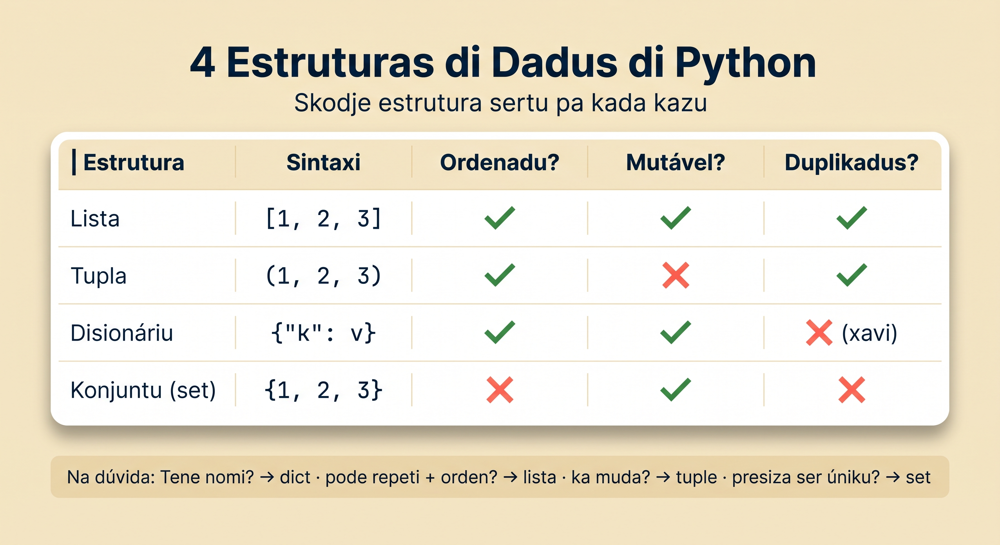
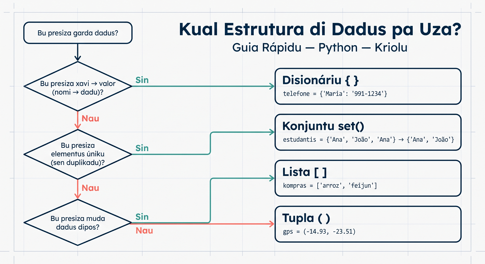

# Kazus Real ku Estruturas di Dadus

Nu dja prende 4 estruturas di dadus fundamentais: listas, tuplas, disionárius, i konjuntus. Gosi é óra di po tudu djuntu! Na kel lisan li, nu ta rezolve problemas reais ki bu ta nkontra na dia-a-dia kumo programador. Kada izemplu ta mostra kumé ki bu ta skodje estrutura sertu pa situasan sertu.



## Lista di Tarefa (To-Do List)

Listas é perfeitu pa jestan di tarefas — bu pode djunta, elimina, i reorganiza elementus. Nu ta kria un sistema simples di tarefas:

:::callout{type=note title="Kual estrutura — i pamodi?"}
Pa tarefas nu ta uza un **lista**: orden ta importa i nu meste djunta, tira i reorganiza elementus.
:::

```python
# Sistema di tarefa pa un estudanti na Praia
tarefas = []

# Djunta tarefas
tarefas.append("Studu Python kapítulu 3")
tarefas.append("Kunpra material pa skola")
tarefas.append("Manda emali pa profesóra")
tarefas.append("Fazi ezersísiu di matemátika")

print("📋 Lista di tarefa:")
for i, tarefa in enumerate(tarefas, 1):
    print(f"  {i}. {tarefa}")
```

:::callout{type=tip title="Para i pensa"}
Dipos di kuatru `.append()`, o ki `len(tarefas)` ta da? *(Resposta: `4`.)*
:::

```python
# Marka tarefa kumo konpletadu (elimina)
tarefa_feitu = "Kunpra material pa skola"
if tarefa_feitu in tarefas:
    tarefas.remove(tarefa_feitu)
    print(f"\n✅ Konpletadu: '{tarefa_feitu}'")

# Djunta tarefa urjenti na komésu
tarefas.insert(0, "Entrega projetu final ODJE!")

# Mostra lista atualizadu
print("\n📋 Lista atualizadu:")
for i, tarefa in enumerate(tarefas, 1):
    print(f"  {i}. {tarefa}")

print(f"\nTotal di tarefas pendenti: {len(tarefas)}")
```

```python
# Versan más konpletu ku prioridadi
tarefas_ku_prioridadi = [
    ("Entrega projetu final", "alta"),
    ("Studu Python", "média"),
    ("Limpa kaza", "baxa"),
    ("Paga konta di luz", "alta"),
]

# Filtra só tarefas di prioridadi alta
urgenti = [tarefa for tarefa, prio in tarefas_ku_prioridadi if prio == "alta"]
print(f"⚠️ Tarefas urgenti: {urgenti}")
```

:::callout{type=tip}
Listas é ótimus kuandu bu presiza mante órdin i modifika konteúdu ku frekuénsia. Pa un to-do list real, lista ta permiti `.append()`, `.insert()`, `.remove()` i reordenasan.
:::

## Nota di Estudanti (Student Grades)

Listas kombina perfeitamenti ku funsons built-in (`sum`, `max`, `min`, `len`, `sorted`) pa analiza dadus numériku:

:::callout{type=note title="Kual estrutura — i pamodi?"}
Pa notas nu ta uza un **lista** di númeru — asi nu pode aplika funsons built-in (`sum`, `max`, `min`, `len`) pa analiza.
:::

```python
# Notas di Maria na diferentes matérias
nomis_materia = ["Python", "Matemátika", "Inglés", "Istória", "Fizika"]
notas_maria = [17, 14, 16, 12, 15]

# Estatístikas báziku
media = sum(notas_maria) / len(notas_maria)
nota_max = max(notas_maria)
nota_min = min(notas_maria)

print(f"📊 Notas di Maria:")
print(f"  Média: {media:.1f}")
print(f"  Nota más altu: {nota_max}")
print(f"  Nota más baxu: {nota_min}")
```

:::callout{type=tip title="Para i pensa"}
Ku `notas_maria = [17, 14, 16, 12, 15]`, o ki `sum(notas_maria) / len(notas_maria)` ta da? *(Resposta: `74 / 5 = 14.8`.)*
:::

:::callout{type=info title="Pa frenti: funsons (Módulu 3)"}
Li nu ta uza `def` pa kria un **funsan** — un manera di djunta kódiku ki nu pode txoma várias bez. Funsons é tema di Módulu 3; pa gosi, só presiza intende ki `def klasifika_nota(nota)` ta da un nomi pa un bloku di kódiku ki ta risibi un nota i ta da se klasifikasan.
:::

```python
# Klasifika notas
def klasifika_nota(nota):
    if nota >= 17:
        return "Eksélenti"
    elif nota >= 14:
        return "Bon"
    elif nota >= 10:
        return "Sufisiente"
    else:
        return "Insufisiente"

print("\n📝 Detalhes:")
for i in range(len(nomis_materia)):
    materia = nomis_materia[i]
    nota = notas_maria[i]
    klasifikasan = klasifika_nota(nota)
    print(f"  {materia}: {nota}/20 - {klasifikasan}")

# Konta kuantus é "Bon" ou milhor
aprovadu = sum(1 for nota in notas_maria if nota >= 10)
print(f"\nMatérias aprovadu: {aprovadu}/{len(notas_maria)}")
```

```python
# Kompara ku otu estudanti
notas_joao = [13, 18, 11, 16, 14]

print(f"\n🏆 Komparasan:")
print(f"  Maria - Média: {sum(notas_maria)/len(notas_maria):.1f}")
print(f"  João  - Média: {sum(notas_joao)/len(notas_joao):.1f}")

# Ken tene nota más altu na kada matéria?
print("\n  Milhor na kada matéria:")
for i in range(len(nomis_materia)):
    materia = nomis_materia[i]
    nota_m = notas_maria[i]
    nota_j = notas_joao[i]
    if nota_m > nota_j:
        milhor = "Maria"
    elif nota_j > nota_m:
        milhor = "João"
    else:
        milhor = "Empati"
    print(f"    {materia}: {milhor}")
```

## Inventáriu di Loja (Store Inventory)

Disionárius é estrtura ideal pa inventáriu — bu ta mapeia produktu pa informasons (presu, kantidadi, etc.):

:::callout{type=note title="Kual estrutura — i pamodi?"}
Pa inventáriu nu ta uza un **disionáriu**: kada produtu (xavi) ta mapia pa se informasan (presu, stoki), ku buska rápidu.
:::

```python
# Inventáriu di un merkadu na Mindelo
inventariu = {
    "banana": {"presu": 50, "kantidadi": 120, "unidadi": "kg"},
    "manga": {"presu": 80, "kantidadi": 45, "unidadi": "kg"},
    "atum": {"presu": 350, "kantidadi": 30, "unidadi": "lata"},
    "feijun": {"presu": 180, "kantidadi": 60, "unidadi": "kg"},
    "milhu": {"presu": 150, "kantidadi": 80, "unidadi": "kg"},
    "grogu": {"presu": 500, "kantidadi": 15, "unidadi": "garafa"},
}

# Mostra inventáriu kompletu
print("🏪 Inventáriu -- Merkadu di Mindelo")
print("-" * 45)
for produktu, info in inventariu.items():
    print(f"  {produktu.capitalize():12} | {info['presu']:>5} ECV/{info['unidadi']} | Stock: {info['kantidadi']}")
```

```python
# Busca produktu
def buska_produktu(inventariu, nomi):
    produktu = inventariu.get(nomi)
    if produktu:
        print(f"✅ '{nomi}' disponível: {produktu['kantidadi']} {produktu['unidadi']} a {produktu['presu']} ECV")
    else:
        print(f"❌ '{nomi}' ka ta ezisti na inventáriu")

buska_produktu(inventariu, "manga")
buska_produktu(inventariu, "laranja")
```

```python
# Atualiza stock (venda i repozisan)
def vendi(inventariu, produktu, kantidadi):
    if produktu not in inventariu:
        print(f"Eru: '{produktu}' ka ezisti!")
        return
    if inventariu[produktu]["kantidadi"] < kantidadi:
        print(f"Eru: Stock insufisiente di '{produktu}'!")
        return
    inventariu[produktu]["kantidadi"] -= kantidadi
    total = kantidadi * inventariu[produktu]["presu"]
    print(f"💰 Vendidu: {kantidadi} {inventariu[produktu]['unidadi']} di {produktu} = {total} ECV")

vendi(inventariu, "grogu", 3)
vendi(inventariu, "atum", 50)  # Stock insufisiente!

# Produktus ku stock baxu (alerta)
print("\n⚠️ Stock baxu (menos di 20):")
stock_baxu = {prod: info for prod, info in inventariu.items() if info["kantidadi"] < 20}
for prod, info in stock_baxu.items():
    print(f"  {prod}: só {info['kantidadi']} {info['unidadi']} resta!")
```

:::callout{type=tip title="Para i pensa"}
Dipos di vende 3 garafa di grogu (di 15), ki produtu ta entra na lista di stoki baxu (`< 20`)? *(Resposta: grogu, ku 12.)*
:::

:::callout{type=tip}
Disionárius ta permiti asesu rápidu pa xavi (nomi di produktu). `.get()` é más siguru ki `[]` pamodi el ta retorna `None` en bez di `KeyError` si produktu ka ezisti.
:::

## Removi Duplikadus (Sets + Lists)

Sets é arma perfetu pa deteta i elimina duplikadus. Nu ta ve diferenti senárius:

:::callout{type=note title="Kual estrutura — i pamodi?"}
Pa tira duplikadus nu ta uza un **set**: el ta garanti elementus úniku. Pa mante orden orijinal, kombina ku un lista (padrón `vistu`).
:::

```python
# Senáriu 1: Kontatus ku emali duplikadu
kontatus = [
    "maria@email.cv",
    "joao@email.cv",
    "ana@email.cv",
    "maria@email.cv",   # duplikadu
    "pedro@email.cv",
    "ana@email.cv",     # duplikadu
    "carla@email.cv",
    "joao@email.cv",    # duplikadu
]

print(f"Total kontatus: {len(kontatus)}")
print(f"Kontatus úniku: {len(set(kontatus))}")

# Removi duplikadus preservandu órdin (mesmu padrun ki nu odja na Lisan 14)
vistu = set()
kontatus_limpu = []
for emali in kontatus:
    if emali not in vistu:
        vistu.add(emali)
        kontatus_limpu.append(emali)

print(f"\n📧 Lista limpu ({len(kontatus_limpu)} kontatus):")
for emali in kontatus_limpu:
    print(f"  - {emali}")
```

:::callout{type=tip title="Para i pensa"}
Lista `kontatus` ten 8 email ku duplikadus. Kuantu email úniku `len(set(kontatus))` ta da? *(Resposta: 5.)*
:::

```python
# Senáriu 2: Palavaras repetidu na un textu
textu = "funana é músika funana é kultura funana é vida na Kabu Verdi"
palavras = textu.split()

# Palavras únikas
unikas = set(palavras)
print(f"Total palavras: {len(palavras)}")
print(f"Palavras únikas: {len(unikas)}")

# Palavras ki ta repeti (ku padrun di kontador di Lisan 13)
kontador = {}
for palavra in palavras:
    kontador[palavra] = kontador.get(palavra, 0) + 1
repetidus = {palavra: konta for palavra, konta in kontador.items() if konta > 1}
print(f"Palavras ki ta repeti: {repetidus}")
```

```python
# Senáriu 3: Verifica intersesan -- ki klientis ta kunpra na ambos lojas?
klients_loja_praia = {"Maria", "João", "Ana", "Nilton", "Edna", "Carla"}
klients_loja_mindelo = {"Pedro", "Ana", "Gil", "Nilton", "Lara", "Nuno"}

klients_ambos = klients_loja_praia & klients_loja_mindelo
klients_so_praia = klients_loja_praia - klients_loja_mindelo
klients_total = klients_loja_praia | klients_loja_mindelo

print(f"Klientis total (úniku): {len(klients_total)}")
print(f"Klientis na ambos lojas: {klients_ambos}")
print(f"Klientis só na Praia: {klients_so_praia}")
```

## Izemplu Final: Kombina Tudu Estruturas

Gosi nu ta uza **listas, tuplas, disionárius i sets** djuntu pa rezolve un problema más konpleksu — un sistema di jestan di evento kultural:

```python
# 🎵 Sistema di Jestan di Festival di Músika na Praia

# TUPLAS -- informasons fixu di kada artista (ka ta muda)
artistas = [
    ("Cesária Évora", "morna", "São Vicente"),
    ("Gil Semedo", "funana", "Santiago"),
    ("Mayra Andrade", "morna", "Santiago"),
    ("Bana", "morna", "São Vicente"),
    ("Ferro Gaita", "funana", "Santiago"),
    ("Lura", "batuku", "Santiago"),
]

# DICIONÁRIU -- detalhes di bilhetu i vendas
bilhetus = {
    "VIP": {"presu": 5000, "total": 50, "vendidu": 42},
    "Normal": {"presu": 2000, "total": 200, "vendidu": 187},
    "Estudanti": {"presu": 1000, "total": 100, "vendidu": 98},
}

# LISTA -- registru di vendas (órdin ta importa)
vendas_resenti = [
    {"tipu": "Normal", "kliente": "Maria", "data": "2025-03-15"},
    {"tipu": "VIP", "kliente": "João", "data": "2025-03-15"},
    {"tipu": "Estudanti", "kliente": "Ana", "data": "2025-03-16"},
    {"tipu": "Normal", "kliente": "Pedro", "data": "2025-03-16"},
    {"tipu": "Estudanti", "kliente": "Djina", "data": "2025-03-16"},
]

# SET -- jéneru di músika disponível (sen repetisan)
jeneru_disponivel = {jeneru for _, jeneru, _ in artistas}

print("🎵 Festival di Músika di Praia 2025")
print("=" * 50)

# 1. Mostra artistas pa jéneru
print("\n📌 Artistas pa jéneru:")
for jeneru in sorted(jeneru_disponivel):
    artistas_jeneru = [nomi for nomi, j, _ in artistas if j == jeneru]
    print(f"  {jeneru.capitalize()}: {', '.join(artistas_jeneru)}")

# 2. Rezumu di vendas di bilhetu
print("\n🎫 Vendas di bilhetu:")
reseta_total = 0
for tipu, info in bilhetus.items():
    disponivel = info["total"] - info["vendidu"]
    reseta = info["vendidu"] * info["presu"]
    reseta_total += reseta
    print(f"  {tipu:10} | {info['vendidu']}/{info['total']} vendidu | {disponivel} disponível | {reseta:,} ECV")
print(f"  {'':10} | Reseta total: {reseta_total:,} ECV")

# 3. Atividade resenti
print(f"\n📊 Últimas {len(vendas_resenti)} vendas:")
klientis_resenti = set()
for venda in vendas_resenti:
    klientis_resenti.add(venda["kliente"])
    print(f"  {venda['data']} -- {venda['kliente']} ({venda['tipu']})")
print(f"\n  Klientis úniku resenti: {len(klientis_resenti)}")

# 4. Ilhas representadu
ilhas = {ilha for _, _, ilha in artistas}
print(f"\n🏝️ Ilhas representadu: {', '.join(sorted(ilhas))}")
```

## Rezumu: Kuandu Skodje Kual Estrutura



| Estrutura | Uza Kuandu... | Izemplu |
|-----------|--------------|---------|
| **Lista** | Presiza órdin, modifikasan, repetisan | Tarefas, notas, playlist |
| **Tupla** | Dadus fixu ki ka ta muda | Koordenadas, registrus, retornu múltiplu |
| **Disionáriu** | Mapeia xavi pa valór, buska rápidu | Inventáriu, konfigurasons, kontadoris |
| **Set** | Elementus úniku, membership testing, operasons di konjuntus | Deduplikasan, filtragem, komparasan |

:::callout{type=tip}
Na dúvida, pensa asim: "Nha dadus tene nomi?" (dict). "Nha dadus pode repeti?" (lista). "Nha dadus ka pode muda?" (tupla). "Nha dadus presiza ser úniku?" (set).
:::

## Tenta Gosi
<TentaGosi />

## Testa bu Konhesimentu
<QuizSet>
  <Quiz position={0} /><Quiz position={1} /><Quiz position={2} /><Quiz position={3} /><Quiz position={4} />
</QuizSet>

## Rezumu
<KeyTakeaways>
  <RezumuItem variant="gold" term="Regra di oru">Skodje estrutura sertu ta faze kódiku más simples i rápidu. Na dúvida: "Tene nomi?" → dict; "pode repeti + orden?" → lista; "ka muda?" → tuple; "presiza ser úniku?" → set.</RezumuItem>
  <RezumuItem term="Lista">Ideal pa dadus **ordenadu** ku modifikasan — tarefas, notas, registrus. Ta kombina ku `sum`, `max`, `min`, `sorted`, `len`.</RezumuItem>
  <RezumuItem term="Disionáriu">Midjór pa mapia **xavi → valor** ku buska rápidu — inventáriu, konfigurasan.</RezumuItem>
  <RezumuItem term="Set">Ta rezolve elegante problema di duplikasan i pertensa.</RezumuItem>
  <RezumuItem>Problema real ta presiza kuazi senpri un **kombinasan** di estruturas — uza kada un pa o ki el ta faze midjór.</RezumuItem>
  <RezumuItem variant="tip" term="Pista">Pa perkore dos lista djuntu, uza `range(len(...))` ku índisi; pa konta frekuénsia, uza padrun `.get(xavi, 0) + 1` (Lisan 13).</RezumuItem>
</KeyTakeaways>
