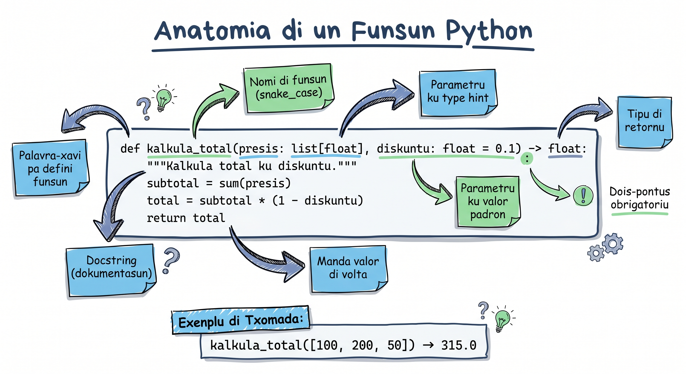

# Funsons Báziku

Imajina bu ta kuzinha katxupa tudu dia. Kada bez bu ten ki lembra pasu pa pasu: korta midju, ferbe feijun, djunta ingredientis... Sería más fásil si bo pudesse dize "faze katxupa" i tudu pasu korre automatikamenti? É exatamenti isu ki funsons ta faze na programasan — es ta guarda un konjuntu di instrusons ku un nomi, i bu pode txoma-l kuantas bez bu kre.

Funsons é un dos konseitus más importanti di Python. Es ta permite bo organiza kódiku, evita repetisan, i torna programa más fásil pa intende i mantene.

## Kria Funsan ku `def`



Pa defini un funsan na Python, bo uza keyword `def`, seguidu di nomi di funsan i paréntesis:

```python
# Estrutura báziku di un funsan
def saudasan():
    print("Bon dia! Morabeza!")

# Txoma funsan
saudasan()   # Bon dia! Morabeza!
saudasan()   # Bon dia! Morabeza! (pode txoma kuantas bez bo kre)
```

```python
# Funsan ki verifica si nùmeru é par o ímpar
def par_o_impar(numeru):
    if numeru % 2 == 0:
        print(f"{numeru} é par")
    else:
        print(f"{numeru} é ímpar")

par_o_impar(7)    # 7 é ímpar
par_o_impar(10)   # 10 é par
```

:::callout{type=tip}
**Dika:** Nomi di funsan debe ser deskritivu i uza snake_case (palavra separadu ku `_`). `kalkula_total` é midjor ki `kt` o `func1`.
:::

## Parámetrus i Argumentus

**Parámetrus** é variáveis ki funsan ta resebe (na definisan). **Argumentus** é valoris ki bu ta pasa kuandu bo txoma funsan.

```python
# 'nomi' i 'ilha' é PARÁMETRUS (na definisan)
def apresenta(nomi, ilha):
    print(f"Nha nomi é {nomi}, N é di {ilha}.")

# "Maria" i "Santiago" é ARGUMENTUS (na txomada)
apresenta("Maria", "Santiago")    # Nha nomi é Maria, N é di Santiago.
apresenta("João", "São Vicente")  # Nha nomi é João, N é di São Vicente.
```

```python
# Funsan ku vários parámetrus
def kalkula_area(largura, konprimentu):
    area = largura * konprimentu
    print(f"Área: {area} m²")

kalkula_area(5, 3)    # Área: 15 m²
kalkula_area(10, 8)   # Área: 80 m²
```

## Parámetrus Predefinidu (Default Parameters)

Bu pode da un valor predefinidu a un parámetru. Si ninguén pasa argumentu, Python ta uza valor predefinidu.

```python
def saudasan(nomi="Vizitanti"):
    print(f"Bon dia, {nomi}! Ben-vindu!")

saudasan("Ana")      # Bon dia, Ana! Ben-vindu!
saudasan()           # Bon dia, Vizitanti! Ben-vindu! (uza valor predefinidu)
```

```python
# Funsan pa kalkula presu ku diskontu opsinál
def kalkula_presu(presu, diskontu=0):
    final = presu - (presu * diskontu / 100)
    print(f"Presu final: {final:.0f} ECV")

kalkula_presu(5000)       # Presu final: 5000 ECV (sen diskontu)
kalkula_presu(5000, 10)   # Presu final: 4500 ECV (10% diskontu)
kalkula_presu(5000, 25)   # Presu final: 3750 ECV (25% diskontu)
```

:::callout{type=tip}
**Dika:** Parámetrus ku valor predefinidu SENPRI ten ki ben DIPOS di parámetrus sen valor predefinidu. `def f(a, b=5)` é koretu. `def f(a=5, b)` ta da eru!
:::

## Return — Retorna Valoris

`print()` ta mostra rezultadu na tela, ma `return` ta "manda" valor di volta pa kel ki txoma funsan. Es é diferensa fundamentál.

```python
# Ku print — SÓ mostra, ka retorna nada
def soma_print(a, b):
    print(a + b)

resultado = soma_print(3, 4)   # mostra: 7
print(resultado)               # None! (funsan ka retorná nada)

# Ku return — retorna valor pa uza más tardi
def soma_return(a, b):
    return a + b

resultado = soma_return(3, 4)
print(resultado)               # 7
print(resultado * 2)           # 14 (pode uza valor)
```

```python
# Konversor di temperatura
def celsius_pa_fahrenheit(celsius):
    return celsius * (9/5) + 32

def fahrenheit_pa_celsius(fahrenheit):
    return (fahrenheit - 32) * (5/9)

# Temperatura na Praia oji
temp_praia = 28
temp_f = celsius_pa_fahrenheit(temp_praia)
print(f"{temp_praia}°C = {temp_f}°F")  # 28°C = 82.4°F

# Konverte volta
print(f"{temp_f}°F = {fahrenheit_pa_celsius(temp_f):.1f}°C")  # 82.4°F = 28.0°C
```

```python
# Funsan pode retorna más ki un valor (tuple)
def divide(a, b):
    kosiente = a // b
    restu = a % b
    return kosiente, restu

k, r = divide(17, 5)
print(f"17 ÷ 5 = {k} restu {r}")  # 17 ÷ 5 = 3 restu 2
```

## Docstrings — Dokumenta Bo Funsan

Docstring é un string di dokumentasan logo na inísiu di funsan. El ta splika kel ki funsan ta faze.

```python
def verifica_senha(senha):
    """Verifica si un senha é forti.

    Un senha forti ten ki tene:
    - Pelo menus 8 karáteris
    - Pelo menus un nùmeru
    - Pelo menus un letra maiúskula
    - Pelo menus un karáter spesiál

    Args:
        senha: String ku senha pa verifica.

    Returns:
        True si senha é forti, False si ka é.
    """
    if len(senha) < 8:
        return False
    if not any(c.isdigit() for c in senha):
        return False
    if not any(c.isupper() for c in senha):
        return False
    if not any(c.islower() for c in senha):
        return False
    if not any(c in "!@#$%^&*()_+-=" for c in senha):
        return False
    return True

# Testa
print(verifica_senha("abc"))           # False (mutu kurtu)
print(verifica_senha("Pr@ia2026!"))    # True (forti!)

# Asei dokumentasan
help(verifica_senha)
```

## `*args` — Argumentus Pozisionais Variáveis

Kuandu bu ka sabe kuantu argumentus funsan vai resebe, uza `*args`. Python ta koloka tudu na un tuple.

```python
def soma_tudu(*numeros):
    """Soma kuantu nùmeru ki bo manda."""
    total = 0
    for n in numeros:
        total += n
    return total

print(soma_tudu(10, 20))           # 30
print(soma_tudu(100, 200, 300))    # 600
print(soma_tudu(5, 10, 15, 20))    # 50
```

```python
# Kalkula média di nota di studantis
def media(*notas):
    """Kalkula média di kuantu notas ki entra."""
    if len(notas) == 0:
        return 0
    return sum(notas) / len(notas)

print(f"Média di Kelvin: {media(14, 16, 18):.1f}")    # 16.0
print(f"Média di Edna: {media(12, 15, 17, 19):.1f}")  # 15.8
```

## `**kwargs` — Argumentus Nomiadu Variáveis

`**kwargs` ta resebe argumentus nomiadu kumo un disionáriu (dict).

```python
def fixa_perfil(**dados):
    """Mostra perfil ku kuantu dados ki entra."""
    print("=== Perfil ===")
    for xave, valor in dados.items():
        print(f"  {xave}: {valor}")

fixa_perfil(nomi="Cesária", ilha="São Vicente", profisan="Kantora")
# === Perfil ===
#   nomi: Cesária
#   ilha: São Vicente
#   profisan: Kantora

fixa_perfil(nomi="Amilcar", idadi=30, sidade="Praia")
# === Perfil ===
#   nomi: Amilcar
#   idadi: 30
#   sidade: Praia
```

```python
# Kombina parámetrus normais, *args i **kwargs
def registra_pedidu(klienti, *ítens, **opsons):
    """Registra pedidu di un klienti."""
    print(f"Klienti: {klienti}")
    print(f"Ítens: {list(ítens)}")
    if opsons:
        print(f"Opsons: {opsons}")

registra_pedidu("Pedro", "katxupa", "grogu", entrega=True, urgenti=False)
# Klienti: Pedro
# Ítens: ['katxupa', 'grogu']
# Opsons: {'entrega': True, 'urgenti': False}
```

:::callout{type=tip}
**Dika:** Orden senpri é: parámetrus normais, dipos `*args`, dipos `**kwargs`. `def f(a, b, *args, **kwargs)` — nunka inverte!
:::

## Izemplu Prátiku: Karrinhu di Konpras

```python
def kalkula_total(karrinhu):
    """Kalkula total di un karrinhu di konpras.

    Args:
        karrinhu: Lista di disionárius ku 'nomi', 'presu', 'kuantidadi'.

    Returns:
        Total na ECV.
    """
    total = 0
    for item in karrinhu:
        total += item["presu"] * item["kuantidadi"]
    return total

# Konpras na merkadu di Sukupira
karrinhu = [
    {"nomi": "Banana", "presu": 50, "kuantidadi": 6},
    {"nomi": "Atun", "presu": 350, "kuantidadi": 2},
    {"nomi": "Midju", "presu": 120, "kuantidadi": 3},
]

total = kalkula_total(karrinhu)
print(f"Total: {total} ECV")  # Total: 1360 ECV
```

## Verifikador di Palíndromu

```python
def é_palíndromu(tekstu):
    """Verifica si un tekstu é palíndromu (ler igual di frenti e di trás).

    Ignora espasus e maiúskulas/minúskulas.
    """
    tekstu = tekstu.lower().replace(" ", "")
    return tekstu == tekstu[::-1]

# Testa
print(é_palíndromu("Ana"))          # True (a-n-a)
print(é_palíndromu("Arara"))        # True (a-r-a-r-a)
print(é_palíndromu("Python"))       # False
print(é_palíndromu("A man a plan"))  # False
```

## Rekursan — Funsan ki ta Txoma Si Mesmu

Un funsan rekursiva é un funsan ki ta txoma si mesmu pa resolve un problema. É kumo un espelhu dentu di otru espelhu — ma SENPRI ten ki tene un pontu di paradu (kazu bazi), sinon ta roda pa senpri!

```python
# Fatoriál: 5! = 5 × 4 × 3 × 2 × 1 = 120
def fatoriál(n):
    """Kalkula fatoriál di n (n!).

    Kazu bazi: 0! = 1
    Kazu rekursivu: n! = n × (n-1)!
    """
    # Kazu bazi — OBRIGATÓRIU!
    if n == 0:
        return 1
    # Kazu rekursivu
    return n * fatoriál(n - 1)

print(fatoriál(5))   # 120 (5 × 4 × 3 × 2 × 1)
print(fatoriál(0))   # 1
print(fatoriál(10))  # 3628800
```

```python
# Komu rekursan ta funsiona pasu a pasu:
# fatoriál(4)
#   → 4 * fatoriál(3)
#       → 3 * fatoriál(2)
#           → 2 * fatoriál(1)
#               → 1 * fatoriál(0)
#                   → 1  ← kazu bazi! para aki
#               → 1 * 1 = 1
#           → 2 * 1 = 2
#       → 3 * 2 = 6
#   → 4 * 6 = 24
```

```python
# Kontajen regresiva rekursiva
def kontajen(n):
    """Konta di n até 0."""
    if n < 0:
        print("Lansamentu! 🚀")
        return
    print(n)
    kontajen(n - 1)

kontajen(5)
# 5
# 4
# 3
# 2
# 1
# 0
# Lansamentu! 🚀
```

:::callout{type=tip}
**Dika:** Senpri pensa na **kazu bazi** primeru kuandu bu ta skrebe funsan rekursiva. Sen el, programa ta entra na loop infinitu i Python ta da `RecursionError`.
:::

## Tenta Gosi 🏋️

1. **Izersisiu 1 — Konversor di Temperatura:** Skrebe un funsan `konverte_temp(temp, di, pa)` ki konverte entri Celsius, Fahrenheit i Kelvin. Izemplu: `konverte_temp(100, "C", "F")` debe retorna `212.0`.

2. **Izersisiu 2 — Validador di Senha:** Skrebe un funsan `verifica_forsa(senha)` ki retorna "fraku", "médiu" o "forti" bazadu na:
   - Fraku: menus di 6 karáteris
   - Médiu: 6+ karáteris ku letras i nùmerus
   - Forti: 8+ karáteris ku maiúskulas, minúskulas, nùmerus i karáteris spesiál

3. **Izersisiu 3 — Soma Rekursiva:** Skrebe un funsan rekursiva `soma_ate(n)` ki retorna soma di tudu nùmerus di 1 até n. Izemplu: `soma_ate(5)` → 15 (1+2+3+4+5).

4. **Izersisiu 4 — Perfil Flexível:** Skrebe un funsan `kria_perfil(nomi, **info)` ki resebe nomi obrigatóriu i kuantu info adisionál ki utilizador kre (ilha, idadi, profisan, etc.) i retorna un disionáriu kompletu.

<Quiz position={0} />

<Quiz position={1} />

<Quiz position={2} />

<Quiz position={3} />

## Rezumu

- **`def`** ta defini un funsan; nomi debe ser deskritivu na snake_case
- **Parámetrus** ta na definisan; **argumentus** ta na txomada
- **Parámetrus predefinidu** ta da valor si ninguén pasa argumentu
- **`return`** ta manda valor di volta; sen return, funsan retorna `None`
- **Docstrings** (string na inísiu) ta dokumenta kel ki funsan ta faze
- **`*args`** ta resebe argumentus pozisionais variáveis (tuple)
- **`**kwargs`** ta resebe argumentus nomiadu variáveis (dict)
- **Rekursan** é funsan ki ta txoma si mesmu — SENPRI presiza kazu bazi
- Funsons ta torna kódiku más organizadu, reutilizável i fásil di testa

---

**Prósimu lisan:** [Lambda, Map i Filter →](/courses/intro-python/lessons/lambda-map-filter)
