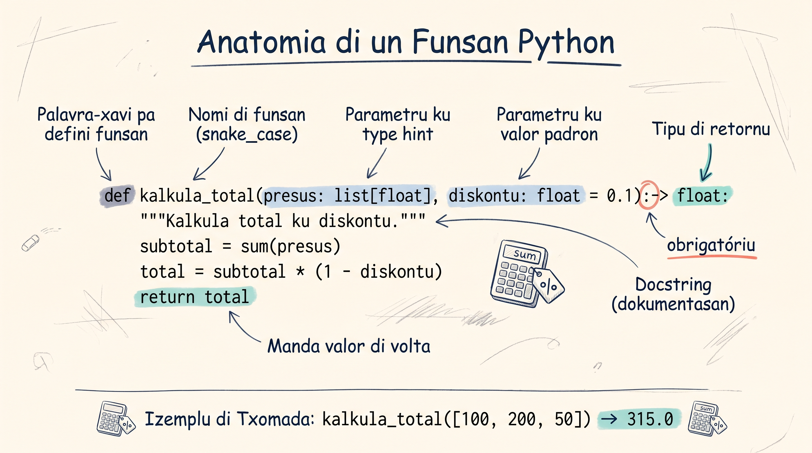

# Funsons Báziku

Imajina un kaxa fitxadu: bu ta po kuza dentu (entrada), kaxa ta faze algu ku es — bu ka ta odja kuzê ki ta kontise la dentu — i kaxa ta dá-u un rezultadu (saída). Kel é un kaxa preta: bu ka meste sabe kuzê ki ta kontise pa dentu pa uza-l, sô bu meste sabe kuzê ki bu ta po i kuzê ki bu ta risebi.

Na programasan, funsan ta funsiona di mesmu manera. Un funsan ta risebi parámetru (entrada), ta izekuta un konjuntu di instrusons (kuzê ki ta kontise pa dentu, txeu bez ka importanti pa kenha ta uza-l), i ta divolve un rezultadu (saída) — kumo un reseta: ingredientis ta entra, pasus ta korri, un pratu ta sai, i bu pode txoma mesmu reseta kuantas bez bu kre, ku ingredientis diferenti kada bez.

:::callout{type=tip}
Kel metáfora di kaxa preta/reseta ta funsiona bèn pa kuandu bu ta **txoma** un funsan — ma el ka ta kobri kuandu un funsan é uzadu kumo un **valor** (guardadu dentu di un variável, pasadu kumo argumentu, ou divolvidu di otu funsan). Kel é un tema más avansadu ki ka ta kobridu li.
:::

Funsons é un dos konseitus más importanti di Python. Es ta permite bu organiza kódiku, evita repetisan, i torna programa más fáxi pa intende i mantene.

<SectionHeading variant="concept" seq={1}>Kria Funsan ku `def`</SectionHeading>



Pa defini un funsan na Python, bu uza keyword `def`, seguidu di nomi di funsan i paréntesis:

```python
# Estrutura báziku di un funsan
def saudasan():
    print("Bon dia! Morabeza!")

# Txoma funsan
saudasan()   # Bon dia! Morabeza!
saudasan()   # Bon dia! Morabeza! (pode txoma kuantas bez bu kre)
```

```python
# Funsan ki verifika si nùmeru é par ou ímpar
def par_o_impar(numeru):
    if numeru % 2 == 0:
        print(f"{numeru} é par")
    else:
        print(f"{numeru} é ímpar")

par_o_impar(7)    # 7 é ímpar
par_o_impar(10)   # 10 é par
```

:::callout{type=tip}
Nomi di funsan debe ser deskritivu i uza snake_case (palavra separadu ku `_`). `kalkula_total` é midjór ki `kt` ou `func1`.
:::

<SectionHeading variant="concept" seq={2}>Parámetrus i Argumentus</SectionHeading>

**Parámetrus** é variáveis ki funsan ta resebe (na definisan). **Argumentus** é valoris ki bu ta pasa kuandu bu txoma funsan.

```python
# 'nomi' i 'ilha' é PARÁMETRUS (na definisan)
def apresenta(nomi, ilha):
    print(f"Nha nomi é {nomi}, N é di {ilha}.")

# "Maria" i "Santiago" é ARGUMENTUS (na txomada)
apresenta("Maria", "Santiago")    # Nha nomi é Maria, N é di Santiago.
apresenta("João", "São Vicente")  # Nha nomi é João, N é di São Vicente.
```

```python
# Funsan ku vários parámetrus
def kalkula_area(largura, komprimentu):
    area = largura * komprimentu
    print(f"Área: {area} m²")

kalkula_area(5, 3)    # Área: 15 m²
kalkula_area(10, 8)   # Área: 80 m²
```

<SectionHeading variant="concept" seq={3}>Parámetrus Predefinidu (Default Parameters)</SectionHeading>

Bu pode da un valor predefinidu pa un parámetru. Si ningen ka pasa argumentu, Python ta uza kel valor predefinidu.

```python
def saudasan(nomi="Vizitanti"):
    print(f"Bon dia, {nomi}! Ben-vindu!")

saudasan("Ana")      # Bon dia, Ana! Ben-vindu!
saudasan()           # Bon dia, Vizitanti! Ben-vindu! (uza valor predefinidu)
```

```python
# Funsan pa kalkula presu ku diskontu opsinál
def kalkula_presu(presu, diskontu=0):
    final = presu - (presu * diskontu / 100)
    print(f"Presu final: {final:.0f} ECV")

kalkula_presu(5000)       # Presu final: 5000 ECV (sen diskontu)
kalkula_presu(5000, 10)   # Presu final: 4500 ECV (10% diskontu)
kalkula_presu(5000, 25)   # Presu final: 3750 ECV (25% diskontu)
```

:::callout{type=tip}
Parámetrus ku valor predefinidu SENPRI ten ki ben DIPOS di parámetrus sen valor predefinidu. `def f(a, b=5)` é koretu. `def f(a=5, b)` ta da eru!
:::

<SectionHeading variant="concept" seq={4}>Return — Retorna Valoris</SectionHeading>

`print()` ta mostra rezultadu na tela, ma `return` ta "manda" valor di volta pa kel ki txoma funsan. Es é diferensa fundamentál.

```python
# Ku print — SÓ mostra, ka retorna nada
def soma_print(a, b):
    print(a + b)

resultado = soma_print(3, 4)   # mostra: 7
print(resultado)               # None! (funsan ka retorná nada)

# Ku return — retorna valor pa uza más tardi
def soma_return(a, b):
    return a + b

resultado = soma_return(3, 4)
print(resultado)               # 7
print(resultado * 2)           # 14 (pode uza valor)
```

```python
# Konversor di temperatura
def celsius_pa_fahrenheit(celsius):
    return celsius * (9/5) + 32

def fahrenheit_pa_celsius(fahrenheit):
    return (fahrenheit - 32) * (5/9)

# Temperatura na Praia oji
temp_praia = 28
temp_f = celsius_pa_fahrenheit(temp_praia)
print(f"{temp_praia}°C = {temp_f}°F")  # 28°C = 82.4°F

# Konverte volta
print(f"{temp_f}°F = {fahrenheit_pa_celsius(temp_f):.1f}°C")  # 82.4°F = 28.0°C
```

```python
# Funsan pode retorna más ki un valor (tuple)
def divide(a, b):
    kosiente = a // b
    restu = a % b
    return kosiente, restu

k, r = divide(17, 5)
print(f"17 ÷ 5 = {k} restu {r}")  # 17 ÷ 5 = 3 restu 2
```

<SectionHeading variant="concept" seq={5}>Docstrings — Dokumenta Bu Funsan</SectionHeading>

Docstring é un string di dokumentasan logo na inísiu di funsan. El ta splika kel ki funsan ta faze.

```python
def verifica_senha(senha):
    """Verifica si un senha é forti.

    Un senha forti ten ki tene:
    - Pelo menus 8 karáteris
    - Pelo menus un nùmeru
    - Pelo menus un letra maiúskula
    - Pelo menus un karáter spesiál

    Args:
        senha: String ku senha pa verifica.

    Returns:
        True si senha é forti, False si ka é.
    """
    if len(senha) < 8:
        return False
    if not any(c.isdigit() for c in senha):
        return False
    if not any(c.isupper() for c in senha):
        return False
    if not any(c.islower() for c in senha):
        return False
    if not any(c in "!@#$%^&*()_+-=" for c in senha):
        return False
    return True

# Testa
print(verifica_senha("abc"))           # False (mutu kurtu)
print(verifica_senha("Pr@ia2026!"))    # True (forti!)

# Asei dokumentasan
help(verifica_senha)
```

<SectionHeading variant="concept" seq={6}>`*args` — Argumentus Pozisionais Variáveis</SectionHeading>

Kuandu bu ka sabe kuantu argumentus funsan vai resebe, uza `*args`. Python ta koloka tudu na un tuple.

```python
def soma_tudu(*numeros):
    """Soma kuantu nùmeru ki bo manda."""
    total = 0
    for n in numeros:
        total += n
    return total

print(soma_tudu(10, 20))           # 30
print(soma_tudu(100, 200, 300))    # 600
print(soma_tudu(5, 10, 15, 20))    # 50
```

```python
# Kalkula média di nota di studantis
def media(*notas):
    """Kalkula média di kuantu notas ki entra."""
    if len(notas) == 0:
        return 0
    return sum(notas) / len(notas)

print(f"Média di Kelvin: {media(14, 16, 18):.1f}")    # 16.0
print(f"Média di Edna: {media(12, 15, 17, 19):.1f}")  # 15.8
```

<SectionHeading variant="concept" seq={7}>`**kwargs` — Argumentus Nomiadu Variáveis</SectionHeading>

`**kwargs` ta resebe argumentus nomiadu kumo un disionáriu (dict).

```python
def fixa_perfil(**dados):
    """Mostra perfil ku kuantu dados ki entra."""
    print("=== Perfil ===")
    for xave, valor in dados.items():
        print(f"  {xave}: {valor}")

fixa_perfil(nomi="Cesária", ilha="São Vicente", profisan="Kantora")
# === Perfil ===
#   nomi: Cesária
#   ilha: São Vicente
#   profisan: Kantora

fixa_perfil(nomi="Amilcar", idadi=30, sidade="Praia")
# === Perfil ===
#   nomi: Amilcar
#   idadi: 30
#   sidade: Praia
```

```python
# Kombina parámetrus normais, *args i **kwargs
def registra_pedidu(klienti, *ítens, **opsons):
    """Registra pedidu di un klienti."""
    print(f"Klienti: {klienti}")
    print(f"Ítens: {list(ítens)}")
    if opsons:
        print(f"Opsons: {opsons}")

registra_pedidu("Pedro", "livru", "moxila", entrega=True, urgenti=False)
# Klienti: Pedro
# Ítens: ['livru', 'moxila']
# Opsons: {'entrega': True, 'urgenti': False}
```

:::callout{type=tip}
Orden senpri é: parámetrus normais, dipos `*args`, dipos `**kwargs`. `def f(a, b, *args, **kwargs)` — nunka inverte!
:::

<SectionHeading variant="concept" seq={8}>Izemplu Prátiku: Karrinhu di Kompras</SectionHeading>

```python
def kalkula_total(karrinhu):
    """Kalkula total di un karrinhu di kompras.

    Args:
        karrinhu: Lista di disionárius ku 'nomi', 'presu', 'kuantidadi'.

    Returns:
        Total na ECV.
    """
    total = 0
    for item in karrinhu:
        total += item["presu"] * item["kuantidadi"]
    return total

# Kompras na merkadu di Sukupira
karrinhu = [
    {"nomi": "Banana", "presu": 50, "kuantidadi": 6},
    {"nomi": "Atun", "presu": 350, "kuantidadi": 2},
    {"nomi": "Midju", "presu": 120, "kuantidadi": 3},
]

total = kalkula_total(karrinhu)
print(f"Total: {total} ECV")  # Total: 1360 ECV
```

<SectionHeading variant="concept" seq={9}>Verifikador di Palíndromu</SectionHeading>

```python
def e_palíndromu(tekstu):
    """Verifica si un tekstu é palíndromu (ler igual di frenti e di trás).

    Ignora espasus e maiúskulas/minúskulas.
    """
    tekstu = tekstu.lower().replace(" ", "")
    return tekstu == tekstu[::-1]

# Testa
print(e_palíndromu("Ana"))          # True (a-n-a)
print(e_palíndromu("Arara"))        # True (a-r-a-r-a)
print(e_palíndromu("Python"))       # False
print(e_palíndromu("A man a plan"))  # False
```

<SectionHeading variant="concept" seq={10}>Rekursan — Funsan ki ta Txoma Si Mesmu</SectionHeading>

Un funsan rekursiva é un funsan ki ta txoma si mesmu pa resolve un problema. É kumo un jogu di bonékas russa (matryoshka): bu abri un bonéka i atxa otu más pikinoti drenti, i drenti di kel, otu inda más pikinoti — té ki bu txiga na bonéka más pikinoti di tudu, kel ki ka abri más. Kel bonéka final é bu **kazu bazi** — ma SENPRI ten ki tene un, sinon ta roda pa senpri!

```python
# Fatoriál: 5! = 5 × 4 × 3 × 2 × 1 = 120
def fatoriál(n):
    """Kalkula fatoriál di n (n!).

    Kazu bazi: 0! = 1
    Kazu rekursivu: n! = n × (n-1)!
    """
    # Kazu bazi — OBRIGATÓRIU!
    if n == 0:
        return 1
    # Kazu rekursivu
    return n * fatoriál(n - 1)

print(fatoriál(5))   # 120 (5 × 4 × 3 × 2 × 1)
print(fatoriál(0))   # 1
print(fatoriál(10))  # 3628800
```

```python
# Kumo rekursan ta funsiona pasu a pasu:
# fatoriál(4)
#   → 4 * fatoriál(3)
#       → 3 * fatoriál(2)
#           → 2 * fatoriál(1)
#               → 1 * fatoriál(0)
#                   → 1  ← kazu bazi! para aki
#               → 1 * 1 = 1
#           → 2 * 1 = 2
#       → 3 * 2 = 6
#   → 4 * 6 = 24
```

```python
# Kontajen regresiva rekursiva
def kontajen(n):
    """Konta di n te 0."""
    if n < 0:
        print("Lansamentu! 🚀")
        return
    print(n)
    kontajen(n - 1)

kontajen(5)
# 5
# 4
# 3
# 2
# 1
# 0
# Lansamentu! 🚀
```

:::callout{type=tip}
Senpri pensa na **kazu bazi** primeru kuandu bu ta skrebe funsan rekursiva. Sen el, programa ta entra na loop infinitu i Python ta da `RecursionError`.
:::

<SectionHeading variant="practice">Tenta Gosi</SectionHeading>
<TentaGosi showHeader={false} />

<SectionHeading variant="quiz">Testa bu Konhesimentu</SectionHeading>
<QuizSet showHeader={false}>
  <Quiz position={0} /><Quiz position={1} /><Quiz position={2} /><Quiz position={3} />
</QuizSet>

<SectionHeading variant="summary">Rezumu</SectionHeading>
<KeyTakeaways showHeader={false}>
  <RezumuItem variant="gold" term="Regra di oru">`return` ta manda un valor di volta pa uza más tardi; `print` só ta mostra na ekran. Un funsan sen `return` ta retorna `None`.</RezumuItem>
  <RezumuItem term="def">Ta defini un funsan — nomi deskritivu na snake_case. Parámetrus ta na definisan; argumentus ta na txomada.</RezumuItem>
  <RezumuItem term="Predefinidu">Un parámetru ku valor predefinidu ta da un valor si ningen ka pasa argumentu — i ten ki ben **dipos** di kes sen valor predefinidu.</RezumuItem>
  <RezumuItem term="*args / **kwargs">`*args` ta apanha argumentu pozisionál (tuple); `**kwargs` ta apanha nomiadu (dict). Orden: normais → `*args` → `**kwargs`.</RezumuItem>
  <RezumuItem term="Docstrings">Un string na inísiu di funsan ta dokumenta kuze ki el ta faze — `help(funsan)` ta mostra-l.</RezumuItem>
  <RezumuItem variant="warning" term="Errus kumuns">Un funsan rekursiva **senpri** presiza un kazu bazi — sen el, Python ta da `RecursionError`.</RezumuItem>
</KeyTakeaways>
