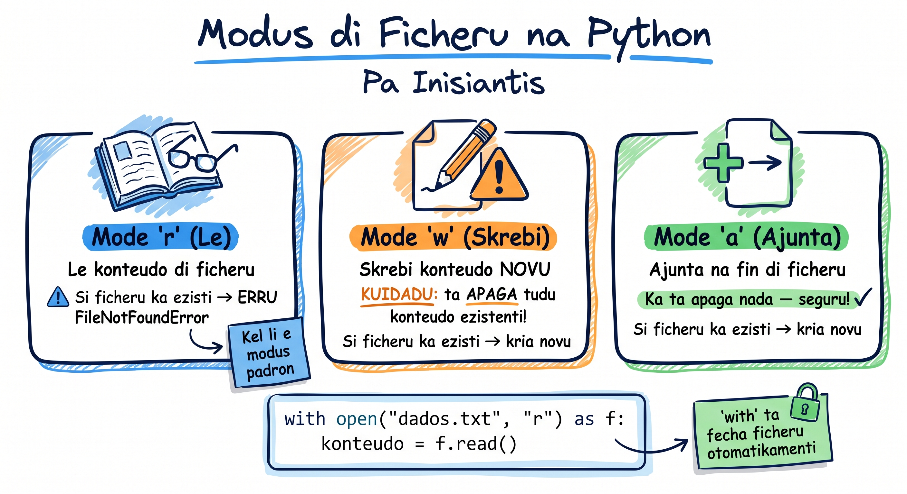

# Operasons ku Ficheru

Programas di mundu real presiza guarda dadus — nota di estudantis, lista di klientes, konfigurasan di aplikasan. Tudu es ta vivi na **ficheru** na disku. Na es lisan, nos ta prende kumo ler, skrebe, i adisiona konteúdu na fixerus uzandu Python.

Imajina ki bu ta kria un programa pa registra vendas na merkadu di Sukupira na Praia. Kada venda presiza fika gravadu nun ficheru pa ka perdi kuandu programa fexá!

## Modus di Ficheru



Antis di abri un ficheru, bo presiza dizi a Python **o ki bu kre faze** ku el. Es é modus prinsipais:

| Modu | Signifikadu | Konportamentu |
|------|-------------|---------------|
| `'r'` | Read (ler) | Só ler. Ficheru ten ki ezisti |
| `'w'` | Write (skrebe) | Skrebe. **APAGA tudu ki ta existia!** |
| `'a'` | Append (adisiona) | Adisiona na final. Ka apaga nada |
| `'w+'` | Write + Read | Skrebe + ler. Apaga i kria novu |

:::callout{type=tip}
**Dika:** Modu padran é `'r'`. Si bu ka espesifika nada, Python ta abri pa leitura.
:::

## Abri i Ler Ficheru

### Ler Tudu di un Bez

```python
# Ler ficheru interu pa un string
with open("notas.txt", "r") as ficheru:
    konteúdu = ficheru.read()
    print(konteúdu)
```

### Ler Linha pa Linha

Pa ficheru grandi, ler linha pa linha é más efisienti — ka ta karrega tudu pa memória:

```python
# Ler linha pa linha (melhor pa ficheru grandi)
with open("estudantis.txt", "r") as ficheru:
    for linha in ficheru:
        print(linha.strip())  # strip() ta tira \n di final
```

### Ler Tudu Linhas pa un Lista

```python
# Kada linha ta vira un elementu di lista
with open("ilhas.txt", "r") as ficheru:
    linhas = ficheru.readlines()
    print(linhas)  # ['Santiago\n', 'São Vicente\n', 'Sal\n']
```

:::callout{type=tip}
**Dika:** `readlines()` ta mantene `\n` na final di kada linha. Uza `linha.strip()` pa tira.
:::

## O ki É `with` Statement?

`with` é un **context manager** — el ta garanti ki ficheru ta fexá automátikamenti, mesmu si eru akontesi. É manera seguru di trabadja ku ficheru.

**Sen `with` (modu antigu — ka rekomendadu):**

```python
# PERIGO: si eru akontesi antis di .close(), ficheru fika abertu!
ficheru = open("dadus.txt", "r")
konteúdu = ficheru.read()
ficheru.close()  # Si skise es linha, ficheru fika abertu na memória
```

**Ku `with` (senpri uza es!):**

```python
# SEGURU: ficheru ta fexá automátikamenti kuandu bloku akaba
with open("dadus.txt", "r") as ficheru:
    konteúdu = ficheru.read()
# Aki ficheru dja fexá — mesmu si tinha eru!
```

Pensa na `with` manera un guarda ki ta abri porta, dixa bo entra, i ta fexá porta kuandu bo sai — mesmu si bo kai la dentu!

## Skrebe na Ficheru

### Modu `'w'` — Kuidadu! Ta Apaga Tudu!

```python
# ATENSAN: 'w' ta apaga tudu ki existia na ficheru!
with open("lista_kompras.txt", "w") as ficheru:
    ficheru.write("Katxupa ingredientis:\n")
    ficheru.write("- Milhu\n")
    ficheru.write("- Fejun\n")
    ficheru.write("- Banana verdi\n")
```

```python
# Si bo roda di novu ku 'w', konteúdu anteriu ta PERDI!
with open("lista_kompras.txt", "w") as ficheru:
    ficheru.write("Lista novu — tudu anteriu ta bai!\n")
```

:::callout{type=tip}
**Dika:** Modu `'w'` é manera "apagador" — el ta limpa tudu i kumesa di novu. Si bu kre mantene o ki dja stá, uza `'a'`!
:::

### Modu `'a'` — Adisiona Sen Apaga

```python
# 'a' ta adisiona na final sen apaga nada ki existia
with open("vendas.txt", "a") as ficheru:
    ficheru.write("2024-01-15: Grogu - 500 ECV\n")
    ficheru.write("2024-01-15: Ponche - 300 ECV\n")

# Roda di novu — ta adisiona más, ka ta apaga!
with open("vendas.txt", "a") as ficheru:
    ficheru.write("2024-01-16: Katxupa - 250 ECV\n")
```

### Skrebe Múltiplu Linhas di un Bez

```python
# writelines() ta skrebi un lista di strings
ilhas = ["Santiago\n", "São Vicente\n", "Sal\n", "Santo Antão\n", "Fogo\n"]

with open("ilhas_kv.txt", "w") as ficheru:
    ficheru.writelines(ilhas)
```

:::callout{type=tip}
**Dika:** `writelines()` ka ta adisiona `\n` automátikamenti — bo presiza inkluí na kada string!
:::

## Modu `'w+'` — Skrebe i Ler (ku seek)

`'w+'` dixa bo skrebe i dipos ler mesmu ficheru. Ma tene un armadidja: dipos di skrebe, **kursor ta na final** di ficheru. Bo presiza uza `seek(0)` pa volta pa kumesu!

```python
with open("notas_maria.txt", "w+") as ficheru:
    # Skrebi
    ficheru.write("Matimátika: 85\n")
    ficheru.write("Portugues: 92\n")
    ficheru.write("Istória: 78\n")

    # Tenta ler sen seek — ka ta sai nada!
    konteúdu = ficheru.read()
    print(f"Sen seek: '{konteúdu}'")  # Sen seek: ''

    # Volta pa kumesu i ler
    ficheru.seek(0)
    konteúdu = ficheru.read()
    print(f"Ku seek: '{konteúdu}'")  # Mostra tudu!
```

## Kaminhu di Fixeru ku `os.path`

Kuandu programa ta roda na diferenti sistéma (Windows, macOS, Linux), kaminhus di ficheru é diferenti:
- Windows: `C:\Users\Maria\documentus\notas.txt`
- macOS/Linux: `/home/maria/documentus/notas.txt`

Módulu `os.path` ta rezolve es problema:

```python
import os

# Kria kaminhu di forma seguru (funsiona na tudu sistéma)
kaminhu = os.path.join("documentus", "notas", "maria.txt")
print(kaminhu)
# Windows: documentus\notas\maria.txt
# macOS/Linux: documentus/notas/maria.txt

# Verifika si ficheru ezisti
si_ezisti = os.path.exists("vendas.txt")
print(f"Ficheru ezisti? {si_ezisti}")

# Verifika si é ficheru o pasta
print(os.path.isfile("vendas.txt"))    # True si é ficheru
print(os.path.isdir("documentus"))     # True si é pasta

# Kaminhu absolutu
print(os.path.abspath("vendas.txt"))
# /home/maria/projetu/vendas.txt

# Lista ficheru na un pasta
fixerus = os.listdir(".")
print(fixerus)  # ['vendas.txt', 'notas.txt', 'ilhas_kv.txt']
```

## Izemplu Prátiku: Rejistu di Vendas

Nu ta kria un programa konpletu ki ta registra vendas na un ficheru:

```python
import os

FIXERU_VENDAS = "vendas_sukupira.txt"

def registra_venda(prudotu, presu, kliente):
    """Adisiona un venda na ficheru"""
    with open(FIXERU_VENDAS, "a") as ficheru:
        ficheru.write(f"{prudotu} | {presu} ECV | Klienti: {kliente}\n")
    print(f"Venda registradu: {prudotu} pa {kliente}")

def mostra_vendas():
    """Mostra tudu vendas gravadu"""
    if not os.path.exists(FIXERU_VENDAS):
        print("Nenhun venda registradu inda.")
        return

    print("\n=== VENDAS DI SUKUPIRA ===")
    with open(FIXERU_VENDAS, "r") as ficheru:
        for linha in ficheru:
            print(f"  {linha.strip()}")
    print("========================\n")

def konta_vendas():
    """Konta kuantus vendas foi feitu"""
    if not os.path.exists(FIXERU_VENDAS):
        return 0

    with open(FIXERU_VENDAS, "r") as ficheru:
        linhas = ficheru.readlines()
    return len(linhas)

# Registra algunhas vendas
registra_venda("Grogu", 500, "Nilton")
registra_venda("Katxupa", 250, "Ana")
registra_venda("Ponche di koku", 300, "Pedro")

# Mostra tudu
mostra_vendas()
print(f"Total di vendas: {konta_vendas()}")
```

## Izemplu: Kopia Ficheru ku Múltiplu Kontekstus

Bu pode abri dos ficheru na mesmu `with`:

```python
# Kopia konteúdu di un ficheru pa otru
with open("orijinal.txt", "r") as fonte, open("kopia.txt", "w") as destinu:
    for linha in fonte:
        destinu.write(linha.upper())  # Kopia ku letra maiúskula

print("Kopia feitu!")
```

## Erus Kumun ku Ficheru

### 1. FileNotFoundError — Ficheru Ka Ezisti

```python
# Eru: ficheru ka ezisti
with open("ficheru_ki_ka_ezisti.txt", "r") as f:
    konteúdu = f.read()
# FileNotFoundError: [Errno 2] No such file or directory
```

**Soluson:** Verifika antis di abri, o uza try/except (prósimu lisan!):

```python
import os

if os.path.exists("vendas.txt"):
    with open("vendas.txt", "r") as f:
        print(f.read())
else:
    print("Ficheru inda ka foi kriadu.")
```

### 2. Modu 'w' Ta Destrui Konteúdu

```python
# PERIGO! Es ta apaga tudu ki tinha na ficheru!
with open("dadus_importanti.txt", "w") as f:
    f.write("Ops...")  # Tudu anteriu ta bai pa senpri!
```

**Soluson:** Uza `'a'` pa adisiona, o ler primeru i dipos skrebe.

### 3. Skise `seek(0)` ku `'w+'`

```python
with open("testu.txt", "w+") as f:
    f.write("Ola Mundu!")
    # Kursor ta na final — ler ta retorna string váziu!
    print(f.read())  # '' (nada!)

    # Korresan:
    f.seek(0)
    print(f.read())  # 'Ola Mundu!'
```

## Tenta Gosi
<TentaGosi />

## Testa bu Konhesimentu
<QuizSet>
  <Quiz position={0} /><Quiz position={1} /><Quiz position={2} />
</QuizSet>

## Rezumu
<KeyTakeaways>
  <RezumuItem variant="gold" term="Regra di oru">Senpri uza `with open(...) as f:` — el ta fexa o ficheru automátikamenti, mesmu si un eru akontese.</RezumuItem>
  <RezumuItem term="Modus">`"r"` (lé), `"w"` (skrebe — **apaga** tudu!), `"a"` (adisiona na fin), `"w+"` (skrebe + lé).</RezumuItem>
  <RezumuItem term="Lé">`read()` (tudu), `readlines()` (lista), o `for linha in ficheru` (linha pa linha — midjór pa ficheru grandi).</RezumuItem>
  <RezumuItem term="Skrebe">`write(string)` i `writelines(lista)` — ka ta po `\n` sózin, bu ten ki inkluí-l.</RezumuItem>
  <RezumuItem term="os.path">`os.path.join()` pa kaminhus kompatível, `os.path.exists()` pa verifika si un ficheru izisti.</RezumuItem>
  <RezumuItem variant="warning" term="Errus kumuns">Modu `"w"` ta **destrui** tudu o konteúdu anteriu — uza `"a"` si bu kre mante-l. I `"r"` nun ficheru ki ka izisti ta da `FileNotFoundError`.</RezumuItem>
</KeyTakeaways>
