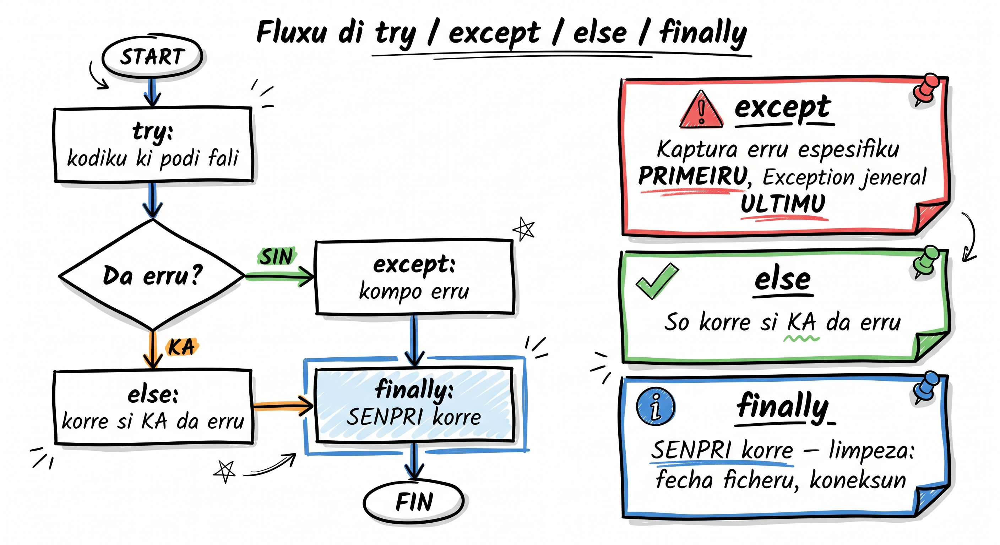
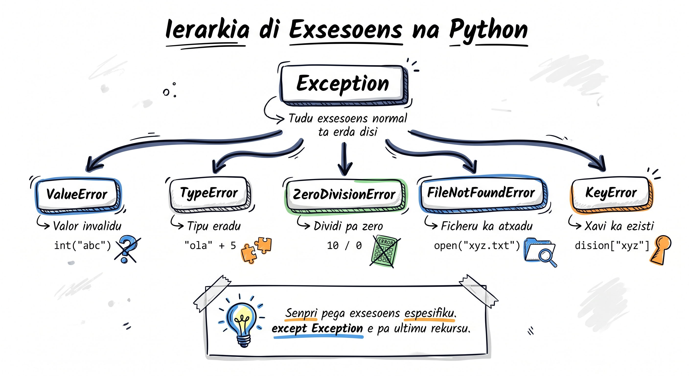

# Tratamentu di Erru

Na lisun 3, nôs prende a **lé** errus. Gosi nôs ta prende a **trata** kes — a fazi programa reagí di forma intelijenti kuandu algu ta korri mal, na lugar di simplesmente para i mostra un traceback feiu pa uzuáriu.

Imajina un kaixa eletrónika na Praia ki ta para tudu vez ki algen ta mete numeru eradu. Kel ka é atxeitável! Programa profisionál ten ki reagí: mostra mensajen klaru, pidi di novu, o sigui ku otru alternativa.

## Báziku: try/except

`try` ta dizi a Python: "Tenta es kódiku. Si dа erru, ka para — fazi kel otru koza."

```python
# Sem tratamentu — programa ta para!
numeru = int(input("Mete un numeru: "))  # Si uzuáriu mete "abc" → CRASH!
print(f"Bo numeru é {numeru}")
```

```python
# Ku tratamentu — programa ta reagí!
try:
    numeru = int(input("Mete un numeru: "))
    print(f"Bo numeru é {numeru}")
except ValueError:
    print("Kel ka é un numeru válidu! Tenta di novu.")
```

Gosi si uzuáriu mete "abc", na lugar di crash, programa ta mostra mensajen amigável.

## Kaptura Exsesoens Espesífiku

Sempri kaptura exsesoens espesífiku — ka uza `except:` sozinhu (sem tipu). Es ta ajuda bo identifika exatamenti o ki korreu mal:

```python
def dividi(a, b):
    """Dividi dôs numeru ku tratamentu di erru"""
    try:
        rezultadu = a / b
    except ZeroDivisionError:
        print("Erru: ka pode dividi pa zero!")
        return None
    except TypeError:
        print("Erru: argumеntus ten ki ser numerus!")
        return None
    return rezultadu

print(dividi(10, 2))    # 5.0
print(dividi(10, 0))    # Erru: ka pode dividi pa zero! → None
print(dividi("a", 2))   # Erru: argumеntus ten ki ser numerus! → None
```

### Múltiplu Handlers ku Asеsu a Mensajen

Bo pode asesa mensajen di erru ku `as`:

```python
try:
    numeru = int(input("Mete presu na ECV: "))
    rezultadu = 1000 / numeru
except ValueError as e:
    print(f"Valór inválidu: {e}")
except ZeroDivisionError as e:
    print(f"Erru matimátiku: {e}")
except Exception as e:
    print(f"Erru inesperadu: {e}")
```

:::callout{type=tip}
**Dika:** Sempri mete `Exception` (catch-all) na **últimu lugar**. Python ta verifika handlers di sima pa baxu — primeiru ki kombina é kel ki ta roda.
:::

## else — Só Roda Si Ka Teve Erru

`else` ta roda **somente si `try` akaba sem nenhun exsesun**. É perfeitu pa kódiku ki deve roda só kuandu tudu korri ben:

```python
def prosesa_nota(tekstu):
    """Konverti tekstu pa nota numérika"""
    try:
        nota = float(tekstu)
    except ValueError:
        print(f"'{tekstu}' ka é un nota válidu!")
        return None
    else:
        # Só roda si konversun funxiona
        if nota < 0 or nota > 20:
            print(f"Nota {nota} fora di rangu (0-20)!")
            return None
        print(f"Nota registradu: {nota}")
        return nota

prosesa_nota("15.5")   # Nota registradu: 15.5
prosesa_nota("abc")    # 'abc' ka é un nota válidu!
prosesa_nota("25")     # Nota 25.0 fora di rangu (0-20)!
```

### Pamodi Uza `else` na Lugar di Mete Tudu na `try`?

```python
# MODU ERADU — tudu na try ta maská errus
try:
    nota = float(tekstu)
    # Si es linha ta da erru, bo ka sabi si é di float() o di otru koza
    guarda_na_bazi(nota)
except ValueError:
    print("Erru!")  # Undi exatamenti?

# MODU KORETU — só kódiku ki PODE faya ta na try
try:
    nota = float(tekstu)
except ValueError:
    print("Konversun fayo!")
else:
    guarda_na_bazi(nota)  # Erru aki ta ser separadu
```

## finally — SEMPRI Roda

`finally` ta roda **sempri** — si teve erru o si ka teve. É perfeitu pa limpeza: fexá ficheru, fexá koneksun di bazi di dadus, libera rekursu.

```python
def lé_konfigurason(kaminhu):
    """Lé ficheru di konfigurasun ku garantia di fexamentu"""
    ficheru = None
    try:
        ficheru = open(kaminhu, "r")
        konteúdu = ficheru.read()
        return konteúdu
    except FileNotFoundError:
        print(f"Ficheru '{kaminhu}' ka foi atxadu!")
        return None
    finally:
        # SEMPRI roda — mesmu si teve erru, mesmu si teve return!
        if ficheru and not ficheru.closed:
            ficheru.close()
            print("Ficheru fexadu ku susesu.")
```

```python
# Melhor: uza with (ki ta fazi mesmu koza!)
def lé_konfigurason_melhor(kaminhu):
    """Versun ku with — más limpu i seguru"""
    try:
        with open(kaminhu, "r") as ficheru:
            return ficheru.read()
    except FileNotFoundError:
        print(f"Ficheru '{kaminhu}' ka foi atxadu!")
        return None
```

:::callout{type=tip}
**Dika:** `with` ta substitui padrаun `try/finally/close` pa ficheru. Ma `finally` inda é útil pa otru tipo di limpeza!
:::

## Fluxu Konpletu: try/except/else/finally



```python
def transferi_saldу(konta_origem, konta_destinu, montanti):
    """Transferénsia bankária ku tudu fazi di tratamentu"""
    print(f"\nInisiandu transferénsia di {montanti} ECV...")

    try:
        # Kódiku ki pode faya
        if montanti <= 0:
            raise ValueError("Montanti ten ki ser pozitivu!")
        if montanti > konta_origem["saldу"]:
            raise ValueError("Saldу insufisienti!")

    except ValueError as e:
        # Trata erru espesífiku
        print(f"Transferénsia falha: {e}")
        return False

    else:
        # Só roda si try akaba sem erru
        konta_origem["saldу"] -= montanti
        konta_destinu["saldу"] += montanti
        print(f"Transferénsia di {montanti} ECV feitu ku susesu!")
        return True

    finally:
        # SEMPRI roda — loga resultado
        print(f"Saldу {konta_origem['nomi']}: {konta_origem['saldу']} ECV")
        print(f"Saldу {konta_destinu['nomi']}: {konta_destinu['saldу']} ECV")

# Testa
konta_maria = {"nomi": "Maria", "saldу": 5000}
konta_joao = {"nomi": "João", "saldу": 3000}

transferi_saldу(konta_maria, konta_joao, 2000)  # Susesu!
transferi_saldу(konta_maria, konta_joao, 9000)  # Faya: saldу insufisienti
```

## raise — Lansa Bo Própriu Erru

`raise` ta dizi a Python: "Es é un problema! Para i aviza kemi ta uza nha funsan."

```python
def kalkula_média(notas):
    """Kalkula média di notas — erru si lista váziu"""
    if not notas:
        raise ValueError("Lista di notas ka pode ser váziu!")
    if not all(isinstance(n, (int, float)) for n in notas):
        raise TypeError("Tudu elementu ten ki ser numeru!")
    return sum(notas) / len(notas)

# Uza ku try/except
try:
    média = kalkula_média([])
except ValueError as e:
    print(f"Problema: {e}")  # Problema: Lista di notas ka pode ser váziu!

try:
    média = kalkula_média([85, 90, "abc", 78])
except TypeError as e:
    print(f"Problema: {e}")  # Problema: Tudu elementu ten ki ser numeru!
```

### Kuandu Uza `raise`?

Uza `raise` kuandu:
- Argumentu inválidu ta txega na bo funsan
- Kondisun di negósiu ka é satisfeitu (saldу insufisienti, idade inválidu)
- Bo kre informá kódigu ki ta txama bo funsan ki algu korreu mal

```python
def registra_estudanti(nomi, idadi):
    """Registra estudanti ku validasun"""
    if not nomi or not nomi.strip():
        raise ValueError("Nomi ka pode ser váziu!")
    if idadi < 5 or idadi > 100:
        raise ValueError(f"Idadi {idadi} ka é válidu (5-100)!")
    return {"nomi": nomi.strip(), "idadi": idadi}

# Testu
try:
    estudanti = registra_estudanti("", 20)
except ValueError as e:
    print(e)  # Nomi ka pode ser váziu!

try:
    estudanti = registra_estudanti("Djina", 3)
except ValueError as e:
    print(e)  # Idadi 3 ka é válidu (5-100)!

# Susesu
estudanti = registra_estudanti("Djina", 22)
print(estudanti)  # {'nomi': 'Djina', 'idadi': 22}
```

## Exsesoens Personalizadu

Pa projetus grandi, bo pode kria bo própriu klasis di exsesun. Es ta fazi kódiku más klaru i fásil di manté:

:::callout{type=info}
**Forward-ref:** Sintaxi di `class` é o tópiku di **Módulu 4** (lisun 26 +). Pa gosi, só odja ki bo pode kria un tipu novu di erru ku ~3 linha di kódiku — detalhi di klasis ta ben dipôs.
:::

```python
# Defini exsesoens personalizadu
class SalduInsufisientiError(Exception):
    """Lansa kuandu saldу ka txega pa operasun"""
    def __init__(self, saldу_atual, montanti):
        self.saldу_atual = saldу_atual
        self.montanti = montanti
        super().__init__(
            f"Saldу insufisienti: tene {saldу_atual} ECV, "
            f"ma ta precisa {montanti} ECV"
        )

class LimitiDiáriuExcedidуError(Exception):
    """Lansa kuandu limiti diáriu di levantamentu foi txegadu"""
    pass

# Uza na klasi
class KontaBankária:
    LIMITI_DIÁRIU = 50_000  # 50.000 ECV

    def __init__(self, titulár, saldу=0):
        self.titulár = titulár
        self.saldу = saldу
        self.levantadu_oji = 0

    def levanta(self, montanti):
        if montanti > self.saldу:
            raise SalduInsufisientiError(self.saldу, montanti)
        if self.levantadu_oji + montanti > self.LIMITI_DIÁRIU:
            raise LimitiDiáriuExcedidуError(
                f"Limiti diáriu di {self.LIMITI_DIÁRIU} ECV dja foi txegadu!"
            )
        self.saldу -= montanti
        self.levantadu_oji += montanti
        return montanti

# Testu
konta = KontaBankária("Amilcar", 10_000)

try:
    konta.levanta(15_000)
except SalduInsufisientiError as e:
    print(e)
    # Saldу insufisienti: tene 10000 ECV, ma ta precisa 15000 ECV
    print(f"Saldу atual: {e.saldу_atual} ECV")  # Asеsu a atributus
```

## Padrаun Prátiku: Ficheru ku Exsesoens

Un ezemplu ki kombina tudu ki nôs prende — leitura di ficheru ku tratamentu konpletu:

```python
import os

def prosesa_vendas(kaminhu):
    """Lé ficheru di vendas i kalkula total"""
    if not os.path.exists(kaminhu):
        raise FileNotFoundError(f"Ficheru '{kaminhu}' ka ezisti!")

    vendas = []
    try:
        with open(kaminhu, "r") as ficheru:
            for num_linha, linha in enumerate(ficheru, 1):
                linha = linha.strip()
                if not linha:
                    continue  # Pula linhas váziu
                try:
                    valór = float(linha)
                    vendas.append(valór)
                except ValueError:
                    print(f"Avizu: linha {num_linha} ka é numeru: '{linha}'")
    except PermissionError:
        print(f"Sem permisun pa lé '{kaminhu}'!")
        return None
    else:
        total = sum(vendas)
        média = total / len(vendas) if vendas else 0
        print(f"Total: {total:.2f} ECV | Média: {média:.2f} ECV")
        return vendas
    finally:
        print(f"Prosesamentu di '{kaminhu}' terminadu.")

# Uza
try:
    rezultadu = prosesa_vendas("vendas_janeru.txt")
except FileNotFoundError as e:
    print(e)
```

## Ierarkia di Exsesoens (Vizun Rápidu)



```
BaseException
├── KeyboardInterrupt    (Ctrl+C)
├── SystemExit           (sys.exit())
└── Exception            (tudu erru "normál")
    ├── ValueError       (valór inválidu)
    ├── TypeError        (tipu eradu)
    ├── FileNotFoundError (ficheru ka ezisti)
    ├── ZeroDivisionError (dividi pa zero)
    ├── IndexError       (índisi fora di rangu)
    ├── KeyError         (xavi ka ezisti na dict)
    ├── PermissionError  (sem permisun)
    └── ... (mutu más)
```

:::callout{type=tip}
**Dika:** Sempri kaptura `Exception` (ka `BaseException`). `BaseException` inklui `KeyboardInterrupt` i `SystemExit` ki bo normalmenti ka kre kaptura.
:::

## Tenta Gosi 🏋️

1. **Exersísiu 1:** Skrebi un funsan `dividi_seguru(a, b)` ki ta retorna rezultadu di `a / b`. Si `b` é zero, retorna mensajen "Ka pode dividi pa zero". Si `a` o `b` ka é numeru, retorna "Argumentus inválidus". Uza try/except.

2. **Exersísiu 2:** Kria un programa ki ta pidi uzuáriu pa mete si idadi (ku `input()`). Si uzuáriu mete algu ki ka é numeru, programa ta pidi di novu (uza un loop `while` ku try/except). Só para kuandu uzuáriu mete un numeru válidu entre 1 i 120.

3. **Exersísiu 3:** Kria un exsesun personalizadu `IdadiInváliduError` i un funsan `valida_idadi(idadi)` ki ta lansa el si idadi é negativu o maior ki 150. Testa ku try/except.

4. **Exersísiu 4:** Skrebi un programa ki ta lé un ficheru di notas (un numeru por linha), kaptura `FileNotFoundError` si ficheru ka ezisti, kaptura `ValueError` pa linhas ki ka é numeru, i na final (`else`) mostra média das notas válidus.

<Quiz position={0} />

<Quiz position={1} />

<Quiz position={2} />

<Quiz position={3} />

## Rezumu

- **`try/except`** — tenta kódiku i kaptura erru si akonteси
- **Exsesoens espesífiku primeru** — `ValueError`, `TypeError`, etc. antis di `Exception`
- **`else`** — só roda si `try` ka teve nenhun erru (mantene kódiku separadu)
- **`finally`** — SEMPRI roda (limpeza: fexá ficheru, fexá koneksun)
- **`raise`** — lansa erru di bo própriu kódiku pa sinalizа problemus
- **Exsesoens personalizadu** — `class MeuError(Exception)` pa errus espesífiku di bo projetu
- **`as e`** — asesa mensajen i atributus di exsesun
- **Regra di oru:** kaptura espesífiku, ka kaptura tudu ku `except:` sem tipu

---

**Prósimu lisun:** [Annotasoens di Tipu →](/courses/intro-python/lessons/annotasoens-tipu)
