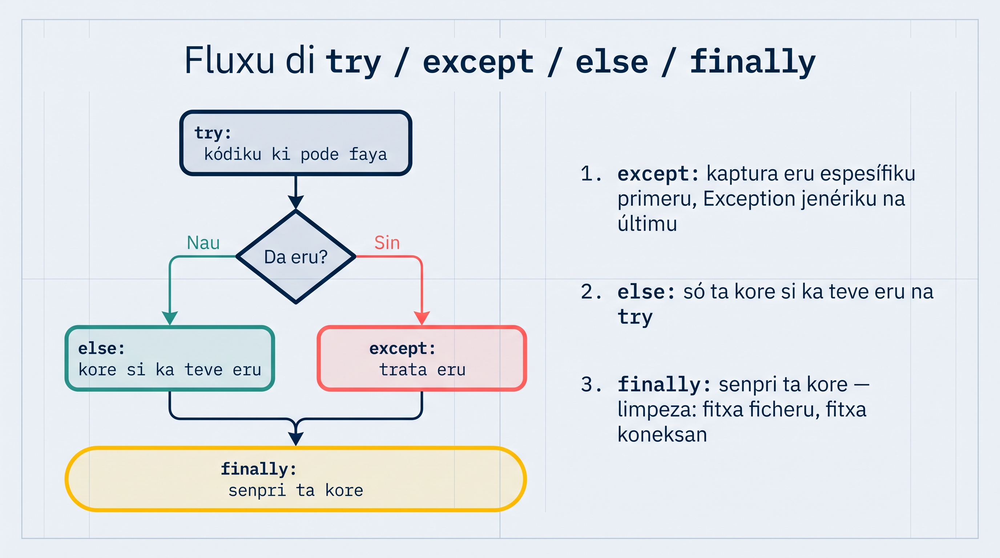
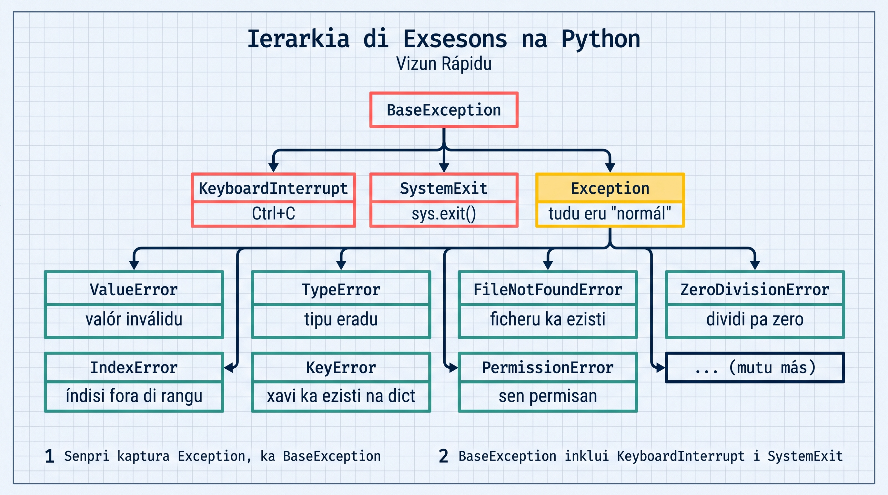

# Tratamentu di Eru

Na lisan 3, nos prende a **ler** erus. Gosi nos ta prende a **trata** kes — a faze programa reagí di forma intelijenti kuandu algu ta korri mal, na lugar di simplesmente para i mostra un traceback feiu pa uzuáriu.

Imajina un kaixa eletrónika na Praia ki ta para tudu bez ki algen ta mete numeru eradu. Kel ka é atxeitável! Programa profisionál ten ki reagí: mostra mensajen klaru, pidi di novu, ou sigi ku otru alternativa.

## Báziku: try/except

`try` ta dizi pa Python: "Tenta es kódiku. Si da eru, ka para — faze kel otru koza."

```python
# Sen tratamentu — programa ta para!
numeru = int(input("Mete un numeru: "))  # Si uzuáriu mete "abc" → CRASH!
print(f"Bo numeru é {numeru}")
```

```python
# Ku tratamentu — programa ta reagí!
try:
    numeru = int(input("Mete un numeru: "))
    print(f"Bo numeru é {numeru}")
except ValueError:
    print("Kel ka é un numeru válidu! Tenta di novu.")
```

Gosi si uzuáriu mete "abc", na lugar di crash, programa ta mostra mensajen amigável.

## Kaptura Exsesons Espesífiku

Senpri kaptura exsesons espesífiku — ka uza `except:` sozinhu (sen tipu). Es ta ajuda bo identifika exatamenti o ki koreu mal:

```python
def dividi(a, b):
    """Dividi dos numeru ku tratamentu di eru"""
    try:
        rezultadu = a / b
    except ZeroDivisionError:
        print("Eru: ka pode dividi pa zero!")
        return None
    except TypeError:
        print("Eru: argumentus ten ki ser numerus!")
        return None
    return rezultadu

print(dividi(10, 2))    # 5.0
print(dividi(10, 0))    # Eru: ka pode dividi pa zero! → None
print(dividi("a", 2))   # Eru: argumentus ten ki ser numerus! → None
```

### Múltiplu Handlers ku Asesu a Mensajen

Bu pode asesa mensajen di eru ku `as`:

```python
try:
    numeru = int(input("Mete presu na ECV: "))
    rezultadu = 1000 / numeru
except ValueError as e:
    print(f"Valór inválidu: {e}")
except ZeroDivisionError as e:
    print(f"Eru matimátiku: {e}")
except Exception as e:
    print(f"Eru inesperadu: {e}")
```

:::callout{type=tip}
Senpri mete `Exception` (catch-all) na **últimu lugar**. Python ta verifika handlers di riba pa baxu — primeru ki kombina é kel ki ta roda.
:::

## else — Só Roda Si Ka Teve Eru

`else` ta roda **somente si `try` akaba sen nenhun exsesan**. É perfeitu pa kódiku ki debe roda só kuandu tudu korri ben:

```python
def prosesa_nota(tekstu):
    """Konverti tekstu pa nota numérika"""
    try:
        nota = float(tekstu)
    except ValueError:
        print(f"'{tekstu}' ka é un nota válidu!")
        return None
    else:
        # Só roda si konversan funsiona
        if nota < 0 or nota > 20:
            print(f"Nota {nota} fora di rangu (0-20)!")
            return None
        print(f"Nota registradu: {nota}")
        return nota

prosesa_nota("15.5")   # Nota registradu: 15.5
prosesa_nota("abc")    # 'abc' ka é un nota válidu!
prosesa_nota("25")     # Nota 25.0 fora di rangu (0-20)!
```

### Pamodi Uza `else` na Lugar di Mete Tudu na `try`?

```python
# MODU ERADU — tudu na try ta maská erus
try:
    nota = float(tekstu)
    # Si es linha ta da eru, bo ka sabe si é di float() ou di otru koza
    guarda_na_bazi(nota)
except ValueError:
    print("Eru!")  # Undi exatamenti?

# MODU KORETU — só kódiku ki PODE faya ta na try
try:
    nota = float(tekstu)
except ValueError:
    print("Konversan fayo!")
else:
    guarda_na_bazi(nota)  # Eru aki ta ser separadu
```

## finally — SENPRI Roda

`finally` ta roda **senpri** — si teve eru ou si ka teve. É perfeitu pa limpeza: fexá ficheru, fexá koneksan di bazi di dadus, libera rekursu.

```python
def ler_konfigurasan(kaminhu):
    """Ler ficheru di konfigurasan ku garantia di fexamentu"""
    ficheru = None
    try:
        ficheru = open(kaminhu, "r")
        konteúdu = ficheru.read()
        return konteúdu
    except FileNotFoundError:
        print(f"Ficheru '{kaminhu}' ka foi atxadu!")
        return None
    finally:
        # SENPRI roda — mesmu si teve eru, mesmu si teve return!
        if ficheru and not ficheru.closed:
            ficheru.close()
            print("Ficheru fexadu ku susesu.")
```

```python
# Melhor: uza with (ki ta fazi mesmu koza!)
def ler_konfigurason_melhor(kaminhu):
    """Versan ku with — más limpu i seguru"""
    try:
        with open(kaminhu, "r") as ficheru:
            return ficheru.read()
    except FileNotFoundError:
        print(f"Ficheru '{kaminhu}' ka foi atxadu!")
        return None
```

:::callout{type=tip}
`with` ta substitui padran `try/finally/close` pa ficheru. Ma `finally` inda é útil pa otru tipo di limpeza!
:::

## Fluxu Konpletu: try/except/else/finally



```python
def transferi_saldu(konta_origem, konta_destinu, montanti):
    """Transferénsia bankária ku tudu fazi di tratamentu"""
    print(f"\nInisiandu transferénsia di {montanti} ECV...")

    try:
        # Kódiku ki pode faya
        if montanti <= 0:
            raise ValueError("Montanti ten ki ser pozitivu!")
        if montanti > konta_origem["saldu"]:
            raise ValueError("Saldu insufisienti!")

    except ValueError as e:
        # Trata eru espesífiku
        print(f"Transferénsia falha: {e}")
        return False

    else:
        # Só roda si try akaba sen eru
        konta_origem["saldu"] -= montanti
        konta_destinu["saldu"] += montanti
        print(f"Transferénsia di {montanti} ECV feitu ku susesu!")
        return True

    finally:
        # SENPRI roda — loga resultado
        print(f"Saldu {konta_origem['nomi']}: {konta_origem['saldu']} ECV")
        print(f"Saldu {konta_destinu['nomi']}: {konta_destinu['saldu']} ECV")

# Testa
konta_maria = {"nomi": "Maria", "saldu": 5000}
konta_joao = {"nomi": "João", "saldu": 3000}

transferi_saldu(konta_maria, konta_joao, 2000)  # Susesu!
transferi_saldu(konta_maria, konta_joao, 9000)  # Faya: saldu insufisienti
```

## raise — Lansa Bo Própriu Eru

`raise` ta dizi pa Python: "Es é un problema! Para i aviza kemi ta uza nha funsan."

```python
def kalkula_média(notas):
    """Kalkula média di notas — eru si lista váziu"""
    if not notas:
        raise ValueError("Lista di notas ka pode ser váziu!")
    if not all(isinstance(n, (int, float)) for n in notas):
        raise TypeError("Tudu elementu ten ki ser numeru!")
    return sum(notas) / len(notas)

# Uza ku try/except
try:
    média = kalkula_média([])
except ValueError as e:
    print(f"Problema: {e}")  # Problema: Lista di notas ka pode ser váziu!

try:
    média = kalkula_média([85, 90, "abc", 78])
except TypeError as e:
    print(f"Problema: {e}")  # Problema: Tudu elementu ten ki ser numeru!
```

### Kuandu Uza `raise`?

Uza `raise` kuandu:
- Argumentu inválidu ta txega na bo funsan
- Kondisan di negósiu ka é satisfeitu (saldu insufisienti, idadi inválidu)
- Bu kre informá kódiku ki ta txoma bo funsan ki algu koreu mal

```python
def registra_estudanti(nomi, idadi):
    """Registra estudanti ku validasan"""
    if not nomi or not nomi.strip():
        raise ValueError("Nomi ka pode ser váziu!")
    if idadi < 5 or idadi > 100:
        raise ValueError(f"Idadi {idadi} ka é válidu (5-100)!")
    return {"nomi": nomi.strip(), "idadi": idadi}

# Testu
try:
    estudanti = registra_estudanti("", 20)
except ValueError as e:
    print(e)  # Nomi ka pode ser váziu!

try:
    estudanti = registra_estudanti("Djina", 3)
except ValueError as e:
    print(e)  # Idadi 3 ka é válidu (5-100)!

# Susesu
estudanti = registra_estudanti("Djina", 22)
print(estudanti)  # {'nomi': 'Djina', 'idadi': 22}
```

## Exsesons Personalizadu

Pa projetus grandi, bu pode kria bo própriu klasis di exsesan. Es ta faze kódiku más klaru i fáxi di mantene:

:::callout{type=info title="Forward-ref"}
Sintaxi di `class` é tópiku di **Módulu 4** (lisan 26 +). Pa gosi, só odja ki bu pode kria un tipu novu di eru ku ~3 linha di kódiku — detalhi di klasis ta ben dipos.
:::

```python
# Defini un tipu novu di eru — só un linha!
class SalduInsufisientiError(Exception):
    pass

# Uza-l ku raise, mesmu manera ki kualker otu exsesan
def levanta(saldu, montanti):
    if montanti > saldu:
        raise SalduInsufisientiError(
            f"Saldu insufisienti: tene {saldu} ECV, ma ta precisa {montanti} ECV"
        )
    return saldu - montanti

# Kaptura-l pa nomi — más spesífiku ki un Exception jenériku
try:
    novu_saldu = levanta(10_000, 15_000)
except SalduInsufisientiError as e:
    print(e)
    # Saldu insufisienti: tene 10000 ECV, ma ta precisa 15000 ECV
```

:::callout{type=tip}
Un klasi di eru personalizadu ta dexa bo `except` kaptura **só** kel tipu di problema (`except SalduInsufisientiError`), na lugar di un `except Exception` ki ta apanha tudu. Kuandu bo prende klasis na Módulu 4, bo ta odja kumo da-l más detalhi (mensajen, atributus).
:::

## Padran Prátiku: Ficheru ku Exsesons

Un izemplu ki kombina tudu ki nos prende — leitura di ficheru ku tratamentu konpletu:

```python
import os

def prosesa_vendas(kaminhu):
    """Ler ficheru di vendas i kalkula total"""
    if not os.path.exists(kaminhu):
        raise FileNotFoundError(f"Ficheru '{kaminhu}' ka ezisti!")

    vendas = []
    try:
        with open(kaminhu, "r") as ficheru:
            for num_linha, linha in enumerate(ficheru, 1):
                linha = linha.strip()
                if not linha:
                    continue  # Pula linhas váziu
                try:
                    valór = float(linha)
                    vendas.append(valór)
                except ValueError:
                    print(f"Avizu: linha {num_linha} ka é numeru: '{linha}'")
    except PermissionError:
        print(f"Sen permisan pa ler '{kaminhu}'!")
        return None
    else:
        total = sum(vendas)
        média = total / len(vendas) if vendas else 0
        print(f"Total: {total:.2f} ECV | Média: {média:.2f} ECV")
        return vendas
    finally:
        print(f"Prosesamentu di '{kaminhu}' terminadu.")

# Uza
try:
    rezultadu = prosesa_vendas("vendas_janeru.txt")
except FileNotFoundError as e:
    print(e)
```

## Ierarkia di Exsesons (Vizun Rápidu)



```text
BaseException
├── KeyboardInterrupt    (Ctrl+C)
├── SystemExit           (sys.exit())
└── Exception            (tudu eru "normál")
    ├── ValueError       (valór inválidu)
    ├── TypeError        (tipu eradu)
    ├── FileNotFoundError (ficheru ka ezisti)
    ├── ZeroDivisionError (dividi pa zero)
    ├── IndexError       (índisi fora di rangu)
    ├── KeyError         (xavi ka ezisti na dict)
    ├── PermissionError  (sen permisan)
    └── ... (mutu más)
```

:::callout{type=tip}
Senpri kaptura `Exception` (ka `BaseException`). `BaseException` inklui `KeyboardInterrupt` i `SystemExit` ki bo normalmenti ka kre kaptura.
:::

## Tenta Gosi
<TentaGosi />

## Testa bu Konhesimentu
<QuizSet>
  <Quiz position={0} /><Quiz position={1} /><Quiz position={2} /><Quiz position={3} />
</QuizSet>

## Rezumu
<KeyTakeaways>
  <RezumuItem variant="gold" term="Regra di oru">Kaptura exseson **espesífiku** (`ValueError`, `ZeroDivisionError`…), ka un `except:` solu — asin bu sabe exatamenti o ki koreu mal.</RezumuItem>
  <RezumuItem term="try / except">Tenta un kódiku i kaptura eru si el akontese — po kes espesífiku primeru, `Exception` na fin.</RezumuItem>
  <RezumuItem term="else / finally">`else` só ta kore si `try` ka teve eru; `finally` ta kore **senpri** (limpeza: fexa ficheru, libera rekursu).</RezumuItem>
  <RezumuItem term="raise">Ta lansa un eru di bu própriu kódiku — pa sinaliza un argumentu inválidu ou un kondisan di negósiu ki ka é satisfeitu.</RezumuItem>
  <RezumuItem term="Personalizadu">`class MeuError(Exception)` ta da un tipu di eru spesífiku di bu projetu. `as e` ta da asesu a mensajen i atributus.</RezumuItem>
  <RezumuItem variant="warning" term="Errus kumuns">Ka po tudu kódiku dentu di `try` — só o ki **pode** faya; restu na `else`, senan bu ta maská di unde eru ben.</RezumuItem>
</KeyTakeaways>
