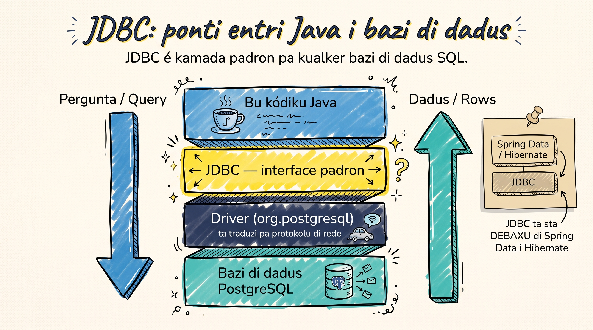

Imajina ki bu app di Java meste guarda uzuárius ki ta rejista, ou produtus di un loja. Enkuantu bu programa ta kore, kes dadus ta fika na memória — ma asin ki bu fitxa programa, **tudu ta dizaparesi**. Pa dadus fika guardadu, bu meste un **bazi di dadus**. I pa bu kódiku di Java papia ku un bazi di dadus PostgreSQL, bu meste **JDBC**.

## Kuzé ki é JDBC?

<GlossaryText
  text="JDBC (Java Database Connectivity) é un [[API]] padron ki ta permiti Java komunika ku kualker bazi di dadus SQL. Pensa na el kumo un **tradutor universal** entri bu kódiku i bazi di dadus: bu ta skrebe Java, JDBC ta traduzi-l pa kel ki bazi di dadus ta intende."
  terms={{
    "API": { en: "API", definition: "Application Programming Interface — un konjuntu di regra i métodu ki un programa ta uza pa fala ku otu software. JDBC é un API padron entri Java i kualker bazi SQL." },
  }}
/>

**Pamodi prende JDBC, si izisti framework?**
- É **fundasan** di tudu trabadju ku bazi di dadus na Java — mésmu Spring Data i Hibernate é un abstrasan ki ta sinta riba di el.
- Intende JDBC ta djuda-bu **debug** prubléma na es framework midjor.
- Pa script simples, batch jobs, ou kódiku unde performance e importanti, JDBC diretu txeu bez é midjór eskolha.

## Unde JDBC ta sta

JDBC é kamada entri bu kódiku i bazi di dadus. Kada pedidu ta dixi pa baxu (query), i dadus ta sobi di volta (rows):

## Es tres objetu prinsipal

JDBC ta trabadja ku tres objetu — kada un ku un papel na konversa ku bazi di dadus:

<AnalogyCard
  title="Es tres objetu di JDBC"
  analogyLabel="Na un txamada telefóniku"
  codeLabel="Na kódiku"
  hero="Pensa na JDBC kumo faze un **txamada telefóniku**: primeru bu ta abri linha, dipos bu ta fala bu mensajen, i na fin bu ta resebe un resposta. Kada pasu ten un objetu."
  rows={[
    { analogy: "Abri linha", analogyDesc: "liga pa bazi di dadus", tech: "Connection", code: "getConnection()" },
    { analogy: "Fala bu mensajen", analogyDesc: "leva bu query SQL", tech: "PreparedStatement", code: "prepareStatement()" },
    { analogy: "Resebe resposta", analogyDesc: "konten dadus ki bazi ta devolve", tech: "ResultSet", code: "executeQuery()" },
  ]}
  limit="Un txamada telefóniku é un konversa bibu di dos ladu. Un query é más sinples: `PreparedStatement` ta manda un bez, `ResultSet` ta txiga di volta, i tudu ta fitxa na fin."
/>

**Un query di prinsípiu te fin:** primeru, `Connection` ta abri linha pa bazi di dadus. Dipos, bu ta po bu SQL nun `PreparedStatement` i manda-l. Pa un `SELECT`, bazi di dadus ta responde ku un `ResultSet` ki bu ta perkore fila pa fila. Na fin, tudu ta fitxa. Es tres objetu ta parse na kada lisan di es kursu.

## JDBC diretu ou un framework (ORM)?

<GlossaryText
  text="Más tardi bu pode uza un [[ORM]] kumo Spring Data ou Hibernate. Ma prende JDBC primeru ta da-bu fundamentu ki bu meste:"
  terms={{
    "ORM": { en: "ORM", definition: "Object-Relational Mapping — un framework (Spring Data, Hibernate) ki ta mapia klasi Java pa tabela di bazi i ta jera SQL pa bo. Más abstrasan, menus kontrolu ki JDBC diretu." },
  }}
/>

<CompareTable
  title="JDBC diretu vs ORM"
  cornerLabel="Kritériu"
  cols={[
    { name: "JDBC diretu", accent: "blue" },
    { name: "ORM (Spring Data / Hibernate)", accent: "teal" },
  ]}
  rows={[
    { label: "Kontrolu", kind: "text", vals: ["Total — bu ta skrebe SQL", "Menus — framework ta jera SQL"] },
    { label: "Kódiku", kind: "text", vals: ["Más verboz", "Más kurtu"] },
    { label: "Majia", kind: "text", vals: ["Nenhun — tudu sta na vista", "Txeu abstrasan pa baxu"] },
    { label: "Kuandu uza", kind: "text", vals: ["Prende, script, performance", "Aplikasan grandi ku txeu entidade"] },
  ]}
/>

## Kuzé ki bu ta kria

Na es kursu, pasu a pasu, bu ta konstrui un programa Java real ki ta lé i skrebe dadus na PostgreSQL di forma seguru. Na fin, bu ta konsigi:

- Konekta bu aplikasan Java ku un bazi di dadus PostgreSQL
- Faze tudu operasan CRUD (Create, Read, Update, Delete)
- Skrebe query seguru ki ta privini ataki di SQL injection
- Jeri transasan — operasan ki ta susede ou falha tudu djuntu

<SectionHeading variant="practice">Tenta gosi</SectionHeading>
<CodeCloze
  lang="java"
  prompt="Kompleta kódiku ku es tres objetu di JDBC, na órden ki es ta entra pa un sô query."
  template={[
    "// 1. Abri linha pa bazi di dadus",
    "{{0}} conn = DriverManager.getConnection(URL, USER, PASSWORD);",
    "",
    "// 2. Prepara i manda query SQL",
    "{{1}} pstmt = conn.prepareStatement(\"SELECT version()\");",
    "",
    "// 3. Resebe resposta i perkore-l fila pa fila",
    "{{2}} rs = pstmt.executeQuery();",
  ]}
  answers={["Connection", "PreparedStatement", "ResultSet"]}
  hints={[
    "Ta liga pa bazi di dadus (a 'txamada telefóniku')",
    "Ta leva bu query SQL (a 'mensajen')",
    "Ta konten dadus ki bazi ta devolve (a 'resposta')",
  ]}
  solved="Korretu! `Connection` ta abri linha, `PreparedStatement` ta manda query, i `ResultSet` ta traze dadus di volta."
/>

<SectionHeading variant="quiz">Verifika konhesimentu</SectionHeading>
<QuizSet showHeader={false}>
  <Quiz position={0} />
  <Quiz position={1} />
  <Quiz position={2} />
</QuizSet>

<SectionHeading variant="summary">Pa lembra</SectionHeading>
<KeyTakeaways showHeader={false}>
  <RezumuItem term="JDBC" code>API padron ki ta liga Java ku kualker bazi di dadus SQL</RezumuItem>
  <RezumuItem>Es tres objetu ta trabadja djuntu: `Connection` → `PreparedStatement` → `ResultSet`.</RezumuItem>
  <RezumuItem>Framework kumo Spring Data i Hibernate é un abstrasan ki ta sinta riba di JDBC — prende JDBC primeru.</RezumuItem>
  <RezumuItem variant="tip" term="Pista">Pa script sinples i pa prende fundamentus, JDBC diretu é frekentimenti midjór skodja.</RezumuItem>
</KeyTakeaways>
