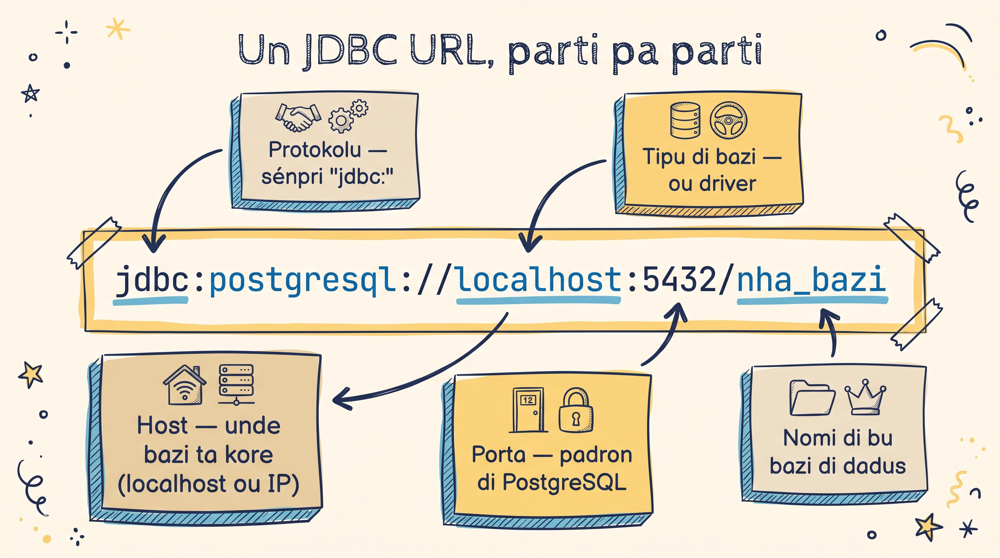

Gosi ki bu sabe kuzé ki é JDBC, nu ta faze algu funsiona primeru: un programa ki ta konekta ku PostgreSQL i ta konfirma versan. Dipos nu ta intende kada parti.

<Prerequisites
  items={[
    { icon: "code", title: "Core Java", meta: "klasi, métodu, try/catch", done: true },
    { icon: "settings", title: "Java 17+ (LTS) instaladu", meta: "pa text blocks i switch expressions" },
    { icon: "settings", title: "Maven (ou un .jar na classpath)" },
    { icon: "database", title: "Un PostgreSQL 12+ ki ta kore", meta: "lokal ou Docker, ku kredensial" },
  ]}
/>

## Pasu 1: Djunta driver

<GlossaryText
  text="JDBC meste un [[driver]] di PostgreSQL — un `.jar` ki ta traduzi txamadas Java pa protokolu di rede di bazi. Ku Maven bu ta djunta-l na `pom.xml`; sen Maven, bu ta po-l na bu [[classpath]] manualmenti."
  terms={{
    "driver": { en: "driver", definition: "Un `.jar` spesífiku pa un bazi (`org.postgresql`) ki ta implementa JDBC pa kel bazi — tradutor entri bu kódiku i protokolu di PostgreSQL." },
    "classpath": { en: "classpath", definition: "Lista di lugar unde JVM ta buska klasi i `.jar` na ténpu di kore. Si driver ka sta li, bu ta odja `No suitable driver found`." },
  }}
/>

Djunta es dependénsia na bu `pom.xml`:

```xml
<dependency>
    <groupId>org.postgresql</groupId>
    <artifactId>postgresql</artifactId>
    <version>42.7.11</version>
</dependency>
```

:::callout{type=tip}
Si bu ka ta uza Maven, baxa `.jar` di [jdbc.postgresql.org/download](https://jdbc.postgresql.org/download/) i djunta-l na bu classpath.
:::

## Pasu 2: Intende JDBC URL

JDBC URL é enderesu di bazi di dadus — el ta dizi Java unde pa konekta i ku kual driver. Nu diskonpo-l:



Kada parti ten un papel: **protokolu** i **tipu** ta dizi Java kual driver pa atxa; **host** i **porta** ta dizi unde bazi ta kore; **nomi** ta dizi kual bazi pa abri. Variasons komuns:

```java
// Bazi lokal
String URL = "jdbc:postgresql://localhost:5432/nha_bazi";

// Bazi remotu
String URL = "jdbc:postgresql://db.ezemplu.com:5432/produson";

// Ku SSL (konexon sigura)
String URL = "jdbc:postgresql://localhost:5432/nha_bazi?ssl=true";
```

## Pasu 3: Primeru programa

Kria un fixeru `JdbcDemo.java`. Repara ki konstantis `URL`, `USER`, i `PASSWORD` ta sirbi tudu izemplus di es kursu:

```java
import java.sql.Connection;
import java.sql.DriverManager;
import java.sql.PreparedStatement;
import java.sql.ResultSet;
import java.sql.SQLException;

public class JdbcDemo {

    private static final String URL = "jdbc:postgresql://localhost:5432/nha_bazi";
    private static final String USER = "nha_uzuariu";
    private static final String PASSWORD = "nha_senha";

    public static void main(String[] args) {

        // "try-with-resources" ta fitxa konexon automatikamenti
        try (Connection conn = DriverManager.getConnection(URL, USER, PASSWORD)) {

            System.out.println("Konektadu ku PostgreSQL!");

            String sql = "SELECT version()";
            try (PreparedStatement pstmt = conn.prepareStatement(sql);
                 ResultSet rs = pstmt.executeQuery()) {

                if (rs.next()) {
                    System.out.println("Versan di bazi: " + rs.getString(1));
                }
            }

        } catch (SQLException e) {
            System.err.println("Konexon falha!");
            e.printStackTrace();
        }
    }
}
```

**Saída esperadu:**

<TerminalBlock
  title="java JdbcDemo"
  lines={[
    { type: "cmd", t: "java JdbcDemo" },
    { type: "ok",  t: "Konektadu ku PostgreSQL!" },
    { type: "out", t: "Versan di bazi: PostgreSQL 16.2 on x86_64-pc-linux-gnu..." },
  ]}
/>

:::callout{type=warning}
Troka `nha_bazi`, `nha_uzuariu`, i `nha_senha` ku bu kredensial real di PostgreSQL.
:::

## Kuzé ki ta kontise pa baxu

Kuandu bu txoma `DriverManager.getConnection(...)`:

1. Java ta uza JDBC URL pa atxa driver di PostgreSQL (di `.jar` ki bu djunta)
2. Driver ta abri un **socket** (un linha di rede) pa host i porta
3. El ta otentika ku uzuáriu i senha, i ta devolve un objetu `Connection`

<GlossaryText
  text="Es `Connection` é karu i limitadu — pa isu nu ta **sénpri** uza [[try-with-resources]], ki ta fitxa-l automatikamenti, mésmu si un exsesan kontise. Sen isu, konexon vazadu ta sgota bazi i bu app ta krax ku `too many connections`."
  terms={{
    "try-with-resources": { en: "try-with-resources", definition: "Un `try (...)` ki ta **fitxa automatikamenti** kualker rekursu abertu na se paréntesis (`Connection`, `PreparedStatement`, `ResultSet`) na fin di bloku — mésmu si un exsesan kontise. Padron di seguransa pa nunka vaza konexon.", code: "try (Connection conn = ...) { ... }" },
  }}
/>

:::callout{type=info}
Si bu odja `No suitable driver found`, `.jar` ka sta na classpath. Si bu odja `Connection refused`, bazi ka ta kore ou host/porta sta eradu. Nu ta odja es éru a fundu na lisan **Rezolve Problema**.
:::

<SectionHeading variant="practice">Tenta gosi</SectionHeading>
<TentaGosi showHeader={false} />

<SectionHeading variant="quiz">Verifika konhesimentu</SectionHeading>
<QuizSet showHeader={false}>
  <Quiz position={0} />
  <Quiz position={1} />
  <Quiz position={2} />
</QuizSet>

<SectionHeading variant="summary">Pa lembra</SectionHeading>
<KeyTakeaways showHeader={false}>
  <RezumuItem term="JDBC URL" code>`jdbc:postgresql://host:porta/bazi` — protokolu, tipu, host, porta, nomi</RezumuItem>
  <RezumuItem term="getConnection()" code>ta atxa driver, abri socket, otentika, i devolve un `Connection`</RezumuItem>
  <RezumuItem variant="gold" term="Regra di oru">Sénpri try-with-resources — pa konexon nunka vaza.</RezumuItem>
</KeyTakeaways>
