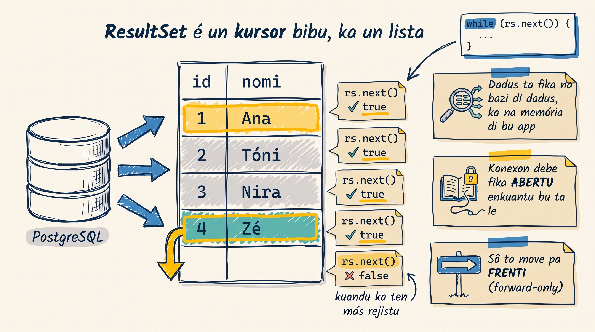

Dizenvolvedor nobu txeu bez ta konfundi `ResultSet` ku un `List` ou `Array` di Java. Ma el ta funsiona di un manera ben diferenti — i si bu trata-l kumo un koleson na memória, bu kódiku ta kebra.

<MisconceptionConfront
  belief="Un `ResultSet` é tipu un `List`: el ta karega tudu filas na memória di bu konputador, i bu pode ler-l kuandu bu kre."
  myth="Kuandu query kore, JDBC ta kopia tudu filas pa un koleson na memória — entãu ka ten prublema si `Connection` fitxa antis di bu ler."
  real="`ResultSet` é un **kursor bibu** riba di konexon. El ta pidi bazi pa próxima fila kada `rs.next()` — i si `Connection` fitxa, el ta móre na mésmu óra."
  proof={[
    "ResultSet rs = pstmt.executeQuery();",
    "conn.close();                    // konexon fitxa",
    "rs.next();   // SQLException: This ResultSet is closed",
  ]}
  takeaway="Kopia filas pa un `List` dentu di `try`, i devolve lista — nunka `ResultSet`."
/>

## Kumo kursor ta funsiona

Kursor ta kumesa **antis** di primeru fila. Kada `rs.next()` ta avansa un fila i ta devolve `true`; kuandu ka ten más fila, el ta devolve `false`. É pa isu ki `while (rs.next())` ta perkore tudu filas:

- **Txamada 1:** `rs.next()` → fila 1 (`true`) → bu ta ler ku `rs.getX(...)`
- **Txamada 2:** `rs.next()` → fila 2 (`true`)
- **...** te ka ten más → `rs.next()` → `false`, loop ta para

**Implikason importanti:**
- `Connection` debe fika ABERTU enkuantu bu ta perkore `ResultSet`
- Pa padron, bu sô pode move pa **frenti** (ka pode volta atras)
- Si bu fitxa `Connection`, `ResultSet` ta móre na mésmu óra

## Ler kolunas: métodu `getX`

Bu ta ler kada koluna ku métodu ki ta korresponde ku tipu SQL:

| Métodu | Pa tipu SQL | Izemplu |
|--------|-------------|---------|
| `getInt` | `INTEGER`, `SERIAL` | `rs.getInt("id")` |
| `getString` | `VARCHAR`, `TEXT` | `rs.getString("nomi_uzuariu")` |
| `getDouble` | `NUMERIC`, `DOUBLE` | `rs.getDouble("saldu")` |
| `getBoolean` | `BOOLEAN` | `rs.getBoolean("ativu")` |
| `getTimestamp` | `TIMESTAMP` | `rs.getTimestamp("kriadu_na")` |

:::callout{type=warning}
Pa koluna ki pode ser `NULL`, `getInt` ta devolve `0` i `getString` ta devolve `null`. Pa sabe si valor staba mesmu `NULL`, txoma `rs.wasNull()` logu dipos di `getX`.
:::

## Eradu vs. koretu

<CodeDiff
  lang="java"
  filename="pegaUzuarius()"
  title="Ka devolve un ResultSet — kopia-l pa un List"
  note="Devolve un `ResultSet` di un métodu ta kebra-l: `Connection` ta fitxa na fin di métodu i kursor ta móre. Kopia dadus pa un `List` dentu di `try`, i devolve **lista** — ka `ResultSet`."
  diff={[
    { type: "del", t: "// ÉRU — Connection ta fitxa na return, ResultSet ta móre!" },
    { type: "del", t: "ResultSet pegaUzuarius() throws SQLException {" },
    { type: "del", t: "    try (Connection conn = DriverManager.getConnection(URL, USER, PASSWORD);" },
    { type: "del", t: "         PreparedStatement pstmt = conn.prepareStatement(\"SELECT * FROM uzuarius\")) {" },
    { type: "del", t: "        return pstmt.executeQuery();  // try ta fitxa Connection gosi → kursor móre" },
    { type: "del", t: "    }" },
    { type: "del", t: "}" },
    { type: "add", t: "List<Uzuariu> pegaUzuarius() throws SQLException {" },
    { type: "add", t: "    List<Uzuariu> uzuarius = new ArrayList<>();" },
    { type: "add", t: "    try (Connection conn = DriverManager.getConnection(URL, USER, PASSWORD);" },
    { type: "add", t: "         PreparedStatement pstmt = conn.prepareStatement(\"SELECT * FROM uzuarius\");" },
    { type: "add", t: "         ResultSet rs = pstmt.executeQuery()) {" },
    { type: "add", t: "        while (rs.next()) {" },
    { type: "add", t: "            uzuarius.add(new Uzuariu(rs.getInt(\"id\"), rs.getString(\"nomi_uzuariu\")));" },
    { type: "add", t: "        }" },
    { type: "add", t: "    }" },
    { type: "add", t: "    return uzuarius;  // Connection fitxadu, ma dadus sta seguru na lista" },
    { type: "add", t: "}" },
  ]}
/>

:::callout{type=info}
`Uzuariu` é un POJO sinples (un klasi ku `id` i `nomiUzuariu`) ki bu ta kria pa guarda kada fila.
:::

**Kopia filas pa un `List` ou prosesa na streaming?** Pa mayoria di kazu — listas kurtu ki kabe na memória — kopia filas pa un `List` é más sinplis i seguru. Sô kuandu bu ten **txeu** fila (milharis ou milhons) ki ka kabe na memória, bu ta prosesa kada fila dentu di loop sen guarda tudu.

<SectionHeading variant="practice">Tenta gosi</SectionHeading>
<TentaGosi showHeader={false} />

<SectionHeading variant="quiz">Verifika konhesimentu</SectionHeading>
<QuizSet>
  <Quiz position={0} />
  <Quiz position={1} />
  <Quiz position={2} />
</QuizSet>

<SectionHeading variant="summary">Pa lembra</SectionHeading>
<KeyTakeaways showHeader={false}>
  <RezumuItem term="ResultSet" code>un kursor bibu pa riba di bazi di dadus — **ka** un koleson na memória</RezumuItem>
  <RezumuItem>`Connection` debe fika abertu enkuantu bu ta ler `ResultSet`; pa padron sô ta move pa frenti.</RezumuItem>
  <RezumuItem>Ler kada koluna ku `getX` ki ta korresponde; uza `wasNull()` pa valor `NULL`.</RezumuItem>
  <RezumuItem variant="gold" term="Regra di oru">Kopia filas pa un `List` dentu di `try`, i devolve lista — ka `ResultSet`.</RezumuItem>
</KeyTakeaways>
