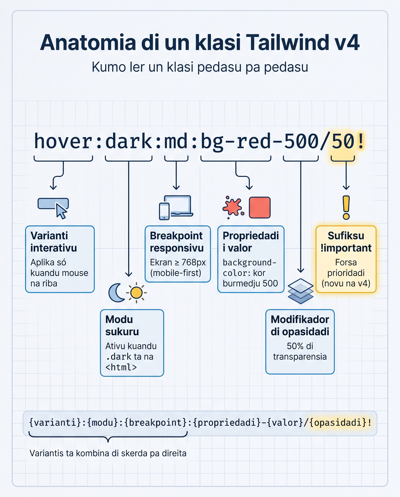

# Kuze ki é Tailwind CSS?

Imajina ki bu sta kria un página di web. Bu kre ki un boton tene kanto redondu, sonbra kalmu, kor azul i ki muda kor kuandu mouse pasa riba di el. Tradisionalmenti, bu ta skrebe CSS na un fixeru separadu, bu ta kria nomi pa klasis (`.btn-primariu`, `.btn-grandi`), bu ta pasa di HTML pa CSS i di volta.

Ma si dja ten un manera más rápidu? **Tailwind CSS** é es manera — i na es lisan nu ta diskubri kumo el ta funsiona.

<SectionHeading variant="concept" seq={1}>Definisan Simplis</SectionHeading>

Tailwind CSS é un **framework di CSS** ki ta dabu un kolesan di **klasis di utilidadi** (utility classes) pa bu kria stilu diretu na HTML, sen skrebe CSS tradisional.

Kada klasi di Tailwind ta kontrola **un só propriedadi** di CSS:

- `text-center` → ta sentra textu
- `bg-blue-500` → ta poi fundu azul
- `p-4` → ta da padding di tudu lado
- `rounded-sm` → ta da kanto redondu



Bu ta konbina es klasis pa konstrui kualker dizenhu — sem skrebe un linha di CSS tradisional.

```html
<!-- Sem Tailwind: bu ta skrebe CSS i HTML separadu -->
<button class="btn-primariu">Klika Li</button>

<style>
  .btn-primariu {
    background-color: #3b82f6;
    color: white;
    padding: 0.5rem 1rem;
    border-radius: 0.375rem;
  }
</style>

<!-- Ku Tailwind: tudu na HTML -->
<button class="bg-blue-500 text-white px-4 py-2 rounded-md">
  Klika Li
</button>
```

Tudu dizenhu, sen sai di HTML. Kel é "utility-first".

:::callout{type=tip}
Bu ta nota klasis moda `rounded-md` i `shadow-sm`? Es nomis é atualizadu na Tailwind v4. Na versan antigu (v3), kel boton di riba uzaba `rounded` (sen sufiksu). Na v4, kada klasi ten un tamanho klaru: `rounded-xs`, `rounded-sm`, `rounded-md`, `rounded-lg`.
:::

<SectionHeading variant="concept" seq={2}>Utility-First: Kuze ki el ta signifika na prátika?</SectionHeading>

Dokumentasan di Tailwind ta defini utility-first sima:

:::callout{type=quote}
Konstrui komponentes konplexu di un grupu di utilidadis primitivu.
:::

Nu ta odja un izemplu konkretu. Imajina ki bu sta kria un kartan pa anunsiu di kursu. Sen Tailwind, bu ten ki skrebe HTML i un fixeru di CSS separadu; ku Tailwind, bu ta skrebe mes kuza — sen CSS:

<CodeDiff
  lang="html"
  filename="kartan.html"
  title="Mesmu kartan, sen i ku Tailwind"
  note="Mesmu rezultadu. Sen fixeru di CSS. Sen inventa nomis di klasi. Sen sai di HTML."
  diff={[
    { type: "del", t: '<div class="alert">' },
    { type: "add", t: '<div class="flex max-w-sm mx-auto p-6 rounded-lg bg-white shadow-sm">' },
    { type: "del", t: '  ' },
    { type: "add", t: '  ' },
    { type: "del", t: '  <div class="alert-body">' },
    { type: "add", t: '  <div class="ml-4">' },
    { type: "del", t: '    <h4 class="alert-title">Novu Kursu!</h4>' },
    { type: "add", t: '    <h4 class="text-xl font-bold">Novu Kursu!</h4>' },
    { type: "del", t: '    <p class="alert-message">Aprende Tailwind ku nos</p>' },
    { type: "add", t: '    <p class="text-gray-500 text-sm">Aprende Tailwind ku nos</p>' },
    { type: "ctx", t: '  </div>' },
    { type: "ctx", t: '</div>' },
    { type: "del", t: '<style>' },
    { type: "del", t: '  .alert { display: flex; max-width: 24rem; margin: 0 auto; padding: 1.5rem;' },
    { type: "del", t: '           border-radius: 0.5rem; background-color: white;' },
    { type: "del", t: '           box-shadow: 0 1px 2px rgba(0,0,0,0.05); }' },
    { type: "del", t: '  .alert-logo { width: 3rem; height: 3rem; }' },
    { type: "del", t: '  .alert-body { margin-left: 1rem; }' },
    { type: "del", t: '  .alert-title { font-size: 1.25rem; font-weight: bold; }' },
    { type: "del", t: '  .alert-message { color: #6b7280; font-size: 0.875rem; }' },
    { type: "del", t: '</style>' },
  ]}
/>

### Vantajens di Utility-First

| Vantajen | Splikasan |
|----------|------------|
| **Sen inventa nomis** | Ka ten ki pensa "kumo bu ta txoma es klasi?" — utilidadis dja ten nomis klaru |
| **Mudansas rápidu** | Kre azul en bez di burmedju? Muda `bg-blue-500` pa `bg-red-500` na HTML. Pronto |
| **Konsisténsia** | Tudu spacing, kor, i fonti ten kel mesmu skala pa tudu projetu |
| **Sen CSS mortu** | Tailwind ta inklui só klasis ki bu uza — produsaun final é txeu pikinoti |
| **Vai pa frenti rápidu** | Bu ta tipa klasis diretu na HTML i odja rezultadu na tempu real |

:::callout{type=tip}
Algen ta fra ki HTML ta fika "txeu txeiu di klasis". É verdadi! Más na v4, extensan **Tailwind CSS IntelliSense** pa VS Code ta djuda-u — el ta sujiri klasis enkuantu bu ta skrebe, i ta mostra pré-vista di kor i tamanho. Nu ta instala el na prósimu lisan.
:::

<SectionHeading variant="concept" seq={3}>Tailwind vs Bootstrap: Diferensa Fundamental</SectionHeading>

Si dja bu uza **Bootstrap** (ou Foundation, Materialize, etc.), bu sabe ki es frameworks ta dabu **komponentes prontu**: un klasi sima `.btn` ki ta inklui kor, padding, bordu, fonti — tudu un só bez.

Tailwind ta toma un kaminhu diferenti.

### Bootstrap (Component-First)

```html
<button class="btn btn-primary">Klika Li</button>
```

Un klasi, un boton kompletu. Rápidu — ma **tudu boton ta fika igual** kuandu tudu mundu uza Bootstrap, tudu website ta fika igual.

### Tailwind (Utility-First)

```html
<button class="bg-blue-500 hover:bg-blue-600 text-white font-bold py-2 px-4 rounded-md">
  Klika Li
</button>
```

Más klasis — ma **es boton é mas personalizadu**. Bu dezenu, sen luta kontra stilus default.

<CompareTable
  title="Bootstrap vs Tailwind CSS"
  cornerLabel="Aspetu"
  cols={[
    { name: "Bootstrap", accent: "purple" },
    { name: "Tailwind CSS", accent: "blue" },
  ]}
  rows={[
    { label: "Filozofia", kind: "text", vals: ["Komponentes prontu (`.btn`, `.card`, `.nav`)", "Utilidadis di un propósitu só (`.bg-blue-500`, `.p-4`)"] },
    { label: "Personalizasan", kind: "text", vals: ["Difisil — luta kontra stilus default", "Fásil — kada klasi é independenti"] },
    { label: "Vizual", kind: "text", vals: ["Sítius ta paresi entri si", "Kada website ten seu próprio vizual"] },
    { label: "Tamanho di CSS final", kind: "text", vals: ["Grandi (mesmu si uza só 10%)", "Pikinoti — só ki bu uza"] },
    { label: "Kurva di aprendizajen", kind: "text", vals: ["Rápidu pa kumesa, difisil pa kustomiza", "Más nomis pa memoriza, ma pode total"] },
  ]}
/>

**Nenhun é "midjór"** — depende di kuze ki bu kre faze. Pa un MVP (Minimum Viable Product — un primeru versan sinplis di un produtu) rápidu sen muitu kustomizasan, Bootstrap pode ser sufisienti. Pa un produtu ku identidadi vizual própriu, Tailwind ta gana.

<SectionHeading variant="concept" seq={4}>Kuzê ki ta Faze Tailwind v4 Spesial?</SectionHeading>

Tailwind v4 (lansadu na Janeru 2025, atualmenti na versan v4.3) traze un **transformasan konpletu**. Es kursu ta ensina v4 di zero.

### Motor Oxide — Velosidadi Asustante

Tailwind v4 ten un motor novu, txamadu **Oxide**, programadu na Rust.

- **5× más rápidu** pa builds di zero
- **100× más rápidu** pa rebuilds inkremental (~5 millisegundu)
- Bu ta guarda un fixeru, i CSS dja sta atualizadu antis di bu volta pa browser

Mesmu na un laptop modestu, es velosidadi ta poupa-bu txeu tempu.

### Más ki sta pa ben na es kursu

Alén di velosidadi, v4 ta traze konfigurasan na CSS ku `@theme` (ka meste `tailwind.config.js`), container queries, sonbras di textu, máskaras i transformasan 3D — kada un ku se própriu lisan na frenti.

Pa gosi, kuze ki importa é: v4 é más rápidu **i** ten más poder — i nu ta konstrui tudu keli djuntu, un lisan di kada bez.

:::callout{type=tip}
Websites manera GitHub, Netflix, Shopify i Vercel ta uza Tailwind na produsaun. É un ferramenta profisional — ka so pa projetus pikinoti.
:::

Na es kursu, **Módulu 2 i 3 ta konstrui un página konpletu di Resort Brava** — un projetu ki bu pode adapta pa kualker negósiu real, di un hotel na Sal te un restoranti na Mindelo.

<SectionHeading variant="practice">Tenta Gosi</SectionHeading>
<TentaGosi showHeader={false} />

<SectionHeading variant="quiz">Verifika Bo Kunhesimentu</SectionHeading>
<QuizSet showHeader={false}>
  <Quiz position={0} />
  <Quiz position={1} />
  <Quiz position={2} />
</QuizSet>

<SectionHeading variant="summary">Rezumu</SectionHeading>
<KeyTakeaways showHeader={false}>
  <RezumuItem variant="gold" term="Tailwind CSS">un framework di utilidadi — kada klasi ta kontrola un só propriedadi di CSS.</RezumuItem>
  <RezumuItem term="Utility-first">bu ta konstrui dezenu diretu na HTML, sem skrebe CSS tradisional.</RezumuItem>
  <RezumuItem term="vs Bootstrap">utilidadis di un propósitu só en bez di komponentes prontu — más kontrole, ma más klasis na HTML.</RezumuItem>
  <RezumuItem term="Tailwind v4">motor novu (Oxide) 5–100× más rápidu, konfigurasan na CSS ku `@theme`, container queries, sonbras di textu, máskaras i 3D.</RezumuItem>
  <RezumuItem variant="tip">Bootstrap pa velosidadi, Tailwind pa identidadi vizual própriu — depende di bu projetu.</RezumuItem>
  <RezumuItem variant="tip" term="Pista">Instala **Tailwind CSS IntelliSense** pa VS Code — el ta sujiri klasis enkuantu bu ta skrebe.</RezumuItem>
</KeyTakeaways>
