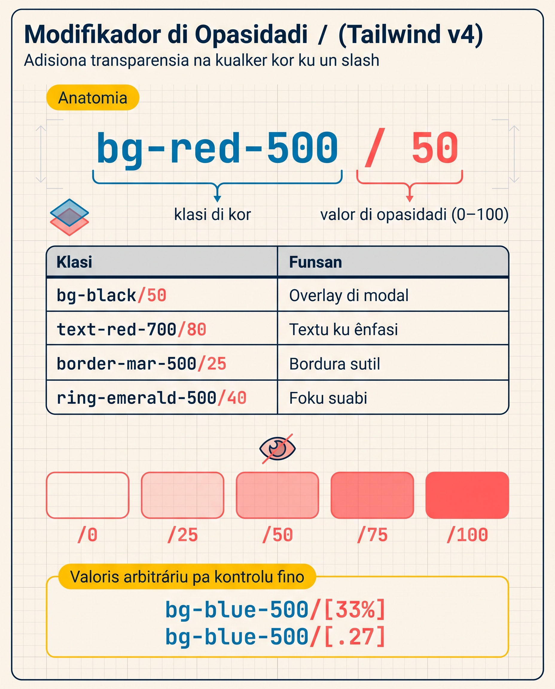

# Kores ku Modifikador `/`

Na lisan pasadu, bu kria Resort Brava sen un só klasi di Tailwind aplikadu. Página tene **estrutura** ma ka **personalidadi**. Tudu é pretu sobri branku, fonti default, sen umor. Gosi muda es.

Tailwind v4 traze un paleta di kores ki é **armoniozu pa dezenvolvedores ki ka sabi dezenhu**. Tudu kor é skodjidu ku kuidadu pa ki kualker un d'es, kombinadu, ten kontrasti i ekilíbriu. Nu ta uza-l pa transforma Resort Brava nun página ku alma di mar i areia.

<SectionHeading variant="concept" seq={1}>Paleta di Tailwind v4</SectionHeading>

Tailwind v4 ten **22 kores báziku** dispunivel sen konfigurasan — sen instala nada.

### Kores dispunivel pa default

```
slate    gray     zinc     neutral  stone
red      orange   amber    yellow   lime
green    emerald  teal     cyan     sky
blue     indigo   violet   purple   fuchsia
pink     rose
```

:::callout{type=tip}
Kontra v3 (ki tinha paleta similar), v4 ta uza **OKLCH** pa defini kores na lugar di hex/RGB. Es ta da un gamma di kor más larga. Pa bo, ka muda nada na sintaxi (`bg-blue-500` ta funsiona mesmu), ma kor é matematikamenti más profundu i konsistenti.
:::

### Tonalidadi: di klaru a sukuru

Kada kor ten **11 tonalidadis**, di `50` (kuazi branku) te `950` (kuazi pretu). v3 só tinha 50-900; **v4 adisiona 950** pa más kontrasti na temas sukuru.

```
50   100  200  300  400  500  600  700  800  900  950
↑                                                  ↑
klaru                                              sukuru
```

Sintaxi é simples: `{utilidadi}-{kor}-{tonalidadi}`. Izemplu: `text-blue-500`, `bg-amber-100`, `border-rose-700`.

<SectionHeading variant="concept" seq={2}>Aplika Kor a Textu, Fundu i Border</SectionHeading>

Tudu utilidadi di kor sigi mesmu padran. Nu ta odja tres familias konuns.

### Textu — `text-*`

```html
<p class="text-slate-900">Pretu di leitura — kor padran pa textu prinsipal</p>
<p class="text-slate-600">Sinzentu suabi — pa textu sekundáriu ou lejendas</p>
<p class="text-sky-700">Azul di mar — pa títulus ou ênfasi</p>
<p class="text-amber-600">Areia kentu — pa kalor i atensan</p>
```

Pretu i branku é spesial — es **ka ten tonalidadi**:

```html
<p class="text-black">Pretu puru</p>
<p class="text-white">Branku puru</p>
```

### Fundu — `bg-*`

```html
<div class="bg-sky-100">Fundu suabi di séu di Boavista</div>
<div class="bg-amber-50">Areia kuandu sol ta sai</div>
<div class="bg-slate-900">Noiti di Tarrafal</div>
```

### Border — `border-*` (ku `border` ativadu antes)

Pa odja un border, bu ten ki **ativa el primeru** ku `border` (ki ta poi 1px) i **dipos** poi kor:

```html
<input class="border border-sky-500" />
<input class="border-2 border-amber-400" />
```

:::callout{type=tip}
Atensan: na v4, kor di border padran é `currentColor` (ka más `gray-200` sima na v3). Si bu skrebe só `<div class="border">` sen kor, bu ta odja border na **mesmu kor di textu**. Más sobri es na Lisan 11.
:::

### Otru utilidadis ki ta toma kor

Mesmu padran ta funsiona pa:

| Utilidadi | Izemplu | Funsan |
|-----------|---------|--------|
| `text-*` | `text-sky-700` | Kor di textu |
| `bg-*` | `bg-amber-100` | Kor di fundu |
| `border-*` | `border-rose-500` | Kor di border |
| `divide-*` | `divide-slate-200` | Kor entri itens irmon |
| `outline-*` | `outline-blue-500` | Outline (fora di border) |
| `ring-*` | `ring-emerald-300` | Anel di kontornu |
| `shadow-*` | `shadow-purple-500/50` | Kor di sonbra |
| `accent-*` | `accent-violet-500` | Forma kontrolis (checkbox) |
| `decoration-*` | `decoration-amber-400` | Dekorasan di textu (underline) |

<SectionHeading variant="concept" seq={3}>Modifikador `/` di Opasidadi — Padran di v4</SectionHeading>



Li é diferensa kritiku entri v3 i v4. **Konxe el gosi, sen vísiu di v3.**

Imajina ki bu kre un karton ku fundu azul, ma **só 50% opaku** pa odja kor ki sta debaxu. Sintaxi é:

```html
<div class="bg-blue-500/50">Azul, 50% opaku</div>
```

Kel `/50` é **modifikador di opasidadi**. Bu pode uza-l ku **kualker utilidadi di kor**:

```html
<p class="text-slate-900/70">Pretu di leitura, 70% opaku</p>
<div class="bg-amber-200/40">Areia, 40% opaku</div>
<input class="border-2 border-sky-600/60" />
<button class="shadow-lg shadow-purple-500/30">Sonbra suabi</button>
```

Valoris dispunivel: `/0`, `/5`, `/10`, `/20`, `/25`, `/30`, `/40`, `/50`, `/60`, `/70`, `/75`, `/80`, `/90`, `/95`, `/100`.

Na v3, opasidadi era un klasi separadu (`bg-opacity-*`). Es klasis **ka existe na v4**. Repara o ki muda:

<CodeDiff
  lang="html"
  filename="opasidadi.html"
  title="Opasidadi: di v3 pa v4"
  note="Os klasis `bg-opacity-*` / `text-opacity-*` **ka existe na v4**. Opasidadi é un sufiksu `/N` diretu na klasi di kor. Si bu odja kódiku v3 ku `bg-opacity-*`, sabe ki é fora di data."
  diff={[
    { type: "del", t: '<!-- v3 — bg-opacity-* é un klasi separadu -->' },
    { type: "del", t: '<div class="bg-blue-500 bg-opacity-50">Azul, 50% opaku</div>' },
    { type: "add", t: '<!-- v4 — opasidadi é un modifikador ku / -->' },
    { type: "add", t: '<div class="bg-blue-500/50">Azul, 50% opaku</div>' },
  ]}
/>

Gosi tenta konstrui a sintaxi bu mesmu: kada utilidadi ta sigi `{utilidadi}-{kor}-{tonalidadi}`, i o modifikador `/` ta bai diretu na fin.

<CodeCloze
  lang="html"
  title="Konstrui a klasi di kor"
  prompt="Inche os spasus: un família di kor pa textu, i un modifikador di opasidadi di 80%."
  template={[
    '<p class="{{0}}-slate-700">Textu sekundáriu</p>',
    '<button class="bg-amber-500{{1}}">Boton más suabi</button>',
  ]}
  answers={["text", "/80"]}
  hints={["Utilidadi pa kor di textu", "Modifikador di opasidadi pa 80%"]}
  solved="Sertu! `text-` ta pinta o textu i `/80` ta da 80% di opasidadi — sen `bg-opacity`."
/>

<SectionHeading variant="concept" seq={4}>Kores Arbitráriu — Kuandu Paleta Ka Tchega</SectionHeading>

Si bu presiza un kor **espesífiku** ki ka sta na paleta — talvez kor exata di un logo ou un kor di marka — bu pode poi-l entri parêntesis kuadradu:

```html
<div class="bg-[#006994]">Azul di mar di Boavista (hex)</div>
<div class="bg-[rgb(255,180,0)]">Sol di Sal (RGB)</div>
<div class="bg-[steelblue]">Nomi di kor CSS native</div>
```

Es funsiona ku tudu utilidadis di kor: `text-[...]`, `border-[...]`, etc.

**Atensan pa frenti:** kores arbitráriu é poderoso ma ta perde konsisténsia. Si bu ta uza un kor repetidu na várius lugaris, dífini el na `@theme {}` (sima nu fez na Lisan 3 ku `--color-mar`). Kuza similar — kor uniku ki ka ta repete? `bg-[#hex]` é ok.

Antis di aplika tudu isu a Resort Brava, repete os pesas prinsipal di sistema di kores:

<Flashcard
  title="Repete: sistema di kores"
  deckId="tailwind-kores-utilidadis"
  cards={[
    { term: "text-sky-700", def: "Kor di textu. Tonalidadi 700 é sukuru." },
    { term: "bg-amber-50", def: "Kor di fundu. Tonalidadi 50 é kuazi branku." },
    { term: "border-rose-500", def: "Kor di border. Meste ativa border primeru." },
    { term: "/50", def: "Modifikador di opasidadi: 50% opaku. Ka más bg-opacity-50 di v3." },
    { term: "950", def: "Tonalidadi más sukuru, kuazi pretu. Novu na v4." },
    { term: "bg-[#006994]", def: "Kor arbitráriu: un valor exatu ki ka sta na paleta." },
  ]}
/>

<SectionHeading variant="install">Aplika Kor a Resort Brava</SectionHeading>

Nu ta ba fixeru `m2-resort-brava/index.html` ki bu kria na Lisan 4. Si Resort Brava era un dokumentu sen vida, gosi el ta ganha vida.

### Antis (di Lisan 4)

```html
<body class="min-h-screen">
  <header>
    <h1>Resort Brava</h1>
    ...
  </header>
  ...
</body>
```

### Dipos (gosi)

```html
<body class="min-h-screen bg-amber-50 text-slate-900">
  <header class="bg-sky-700 text-white">
    <h1>Resort Brava</h1>
    <nav>
      <a href="#kuartus" class="text-sky-100">Kuartus</a>
      <a href="#aktividadis" class="text-sky-100">Aktividadis</a>
      <a href="#kontaktu" class="text-sky-100">Kontaktu</a>
    </nav>
  </header>

  <main>
    <section id="hero">
      <h2 class="text-amber-600">Ben Vindo</h2>
      <p class="text-slate-700">Vive Brava sima nunka. Mar, monte, kalor — un só lugar.</p>
      <a href="#kuartus" class="bg-amber-500 text-white">Odja kuartus</a>
    </section>

    <section id="kuartus">
      <h3 class="text-sky-700">Kuartus</h3>
      <p class="text-slate-600">Três tipus di kuartus pa kada tipu di vizita.</p>
    </section>

    <!-- aktividadis i kontaktu sigi mesmu padran -->
  </main>

  <footer class="bg-slate-800 text-slate-300">
    <p>© 2026 Resort Brava · Vila Nova Sintra, Brava</p>
  </footer>
</body>
```

Salva, atualiza Live Server. **Gosi** Resort Brava é un website — ka más un dokumentu.

Repara skolha di kores:
- **`bg-sky-700` na header** — kor di mar profundu, autoritáriu
- **`bg-amber-50` na body** — kor di areia kuandu sol ta nase, kalor
- **`text-amber-600` na títulu** — kor di sol, atrai odju
- **`bg-amber-500` na boton** — sol vibrante, "klika-mi"
- **`bg-slate-800` na footer** — noiti, kalmu, lugar pa textu legal
- **`text-slate-700` / `text-slate-600`** — konsistentementi sukuru en bez di pretu puru (suabi pa ler)

Inda ten poku spacing, sen kanto redondu — kuza pa prósimus lisans. Ma kor dja sta. **Es é vitória primeru.**

<SectionHeading variant="practice">Tenta Gosi</SectionHeading>
<TentaGosi showHeader={false} />

<SectionHeading variant="quiz">Verifika Bo Kunhesimentu</SectionHeading>
<QuizSet showHeader={false}>
  <Quiz position={0} />
  <Quiz position={1} />
  <Quiz position={2} />
</QuizSet>

<SectionHeading variant="summary">Rezumu</SectionHeading>
<KeyTakeaways showHeader={false}>
  <RezumuItem variant="gold" term="Modifikador `/`">é a manera v4 di opasidadi: `bg-blue-500/50`, ka más `bg-opacity-50` di v3.</RezumuItem>
  <RezumuItem term="22 kores">22 paletas báziku dispunivel sen konfigurasan, kada un ku 11 tonalidadis (50-950).</RezumuItem>
  <RezumuItem term="Tonalidadi 50-950">v4 adisiona o 950 pa kontrasti más profundu na temas sukuru.</RezumuItem>
  <RezumuItem term="Sintaxi konstanti">`{utilidadi}-{kor}-{tonalidadi}` pa text/bg/border/ring/shadow/accent/decoration.</RezumuItem>
  <RezumuItem term="OKLCH">sistema interno di kor di v4 — más profundu, ka muda sintaxi.</RezumuItem>
  <RezumuItem variant="warning" term="Errus kumuns">`bg-opacity-*` ka existe na v4 — si bu odja el, é kódiku fora di data.</RezumuItem>
  <RezumuItem variant="tip" term="Pista">pa un kor ki bu ta repete, defini un token na `@theme`; `bg-[#hex]` só pa kasus únikus.</RezumuItem>
</KeyTakeaways>
