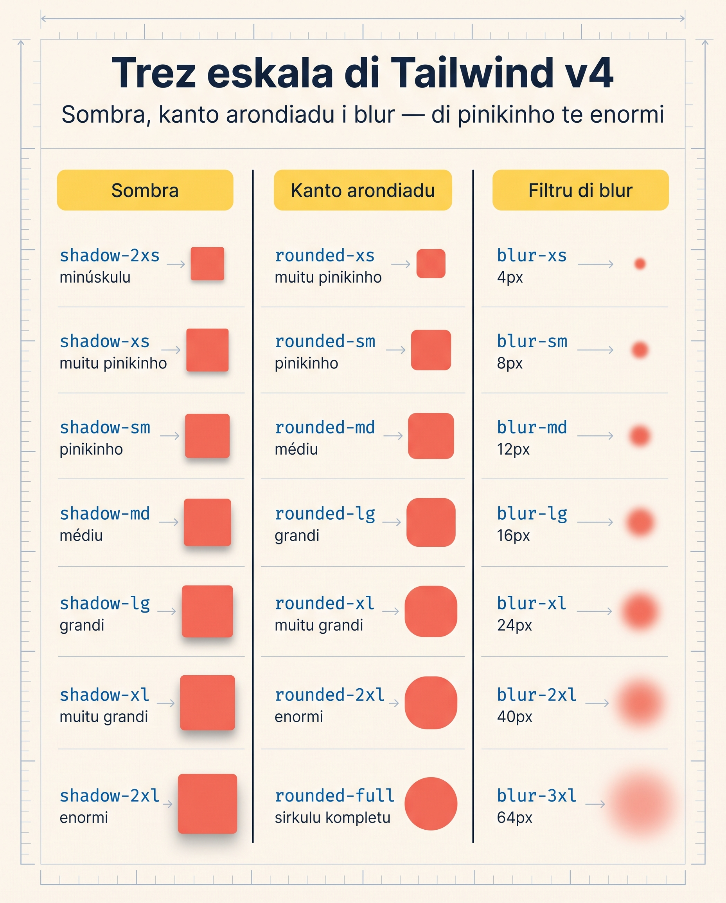

# Fundus, Gradientes i Sombras

Resort Brava ten estrutura, tipografia i un header sticky. Ma página inda parsi **plana** — kumo papel diretu. Esta lisan ta da-l profundidadi: fundus elegantes, gradientes ki ta traze mar i kéu, sombras ki ta poi kards a flutua.

I li é unde v4 ta separa kompletamente di v3. **Trez mudansas grandi ki bo meste sabe** primeru.

<SectionHeading variant="concept" seq={1}>Avizu: Skala di Sombra Muda na v4</SectionHeading>



Na v3, `shadow` (sen sufixu) era válidu — sombra default. **Na v4, klasi bare `shadow` ka izisti**. Tudu sombra ten ki ten sufixu:

```html
<!-- v3 (kaduku) -->
<div class="shadow">...</div>

<!-- v4 (korretu) -->
<div class="shadow-xs">...</div>
<div class="shadow-sm">...</div>
<div class="shadow-md">...</div>
```

Mesmu kuza ku `rounded` (prósimu lisan): na v4, `rounded-sm` o `rounded-md`, ka `rounded` sozinhu.

**Skala kompleta:**

| Klasi | Tamanhu di sombra |
|---|---|
| `shadow-2xs` | Mínimu — kuasi invizivel |
| `shadow-xs` | Bem suavi |
| `shadow-sm` | Suavi (substitui v3 `shadow`) |
| `shadow-md` | Moderadu |
| `shadow-lg` | Grandi |
| `shadow-xl` | Bem forti |
| `shadow-2xl` | Máximu |
| `shadow-none` | Sen sombra (pa anula) |

<SectionHeading variant="concept" seq={2}>Kor di Fundu — `bg-*`</SectionHeading>

Dja nu uza `bg-*` desdi Lisan 5 (`bg-sky-700`, `bg-amber-50`). Pa relembra:

```html
<div class="bg-sky-700">Fundu azul-mar</div>
<div class="bg-amber-50">Fundu kor di areia (klaru)</div>
<div class="bg-slate-800/90">Fundu sukuru ku 90% di opasidadi</div>
```

Tudu paleta di kor (22 padran + 4 di v4.2), tudu tonalidadi 50-950, slash modifier pa opasidadi. Ti dja ten es.

<SectionHeading variant="concept" seq={3}>Imajen di Fundu — `bg-[url(...)]`</SectionHeading>

Pa imajen di fundu, uza valor arbitráriu:

```html
<div class="bg-[url('/imagens/brava.jpg')] h-64">
  Imajen kumo fundu
</div>
```

Imajen ten 4 propriedadis ki bo meste kontrola:

```html
<div class="
  bg-[url('/brava.jpg')]
  bg-cover         <!-- imajen ta kobri tudu kontainer -->
  bg-center        <!-- sentradu -->
  bg-no-repeat     <!-- ka repeti kumo padraun -->
  h-64
">
  Hero ku foto di Brava
</div>
```

**Propriedadis:**

- **Tamanhu:** `bg-auto` (natural), `bg-cover` (kobri, korta si nesesáriu), `bg-contain` (kabe sen korta)
- **Pozisan:** `bg-center`, `bg-top`, `bg-bottom`, `bg-left`, `bg-right`, ou kombinasan (`bg-left-top`)
- **Repetisan:** `bg-repeat` (default), `bg-no-repeat`, `bg-repeat-x`, `bg-repeat-y`

<SectionHeading variant="concept" seq={4}>Gradientes — Sintaxi NOVA na v4</SectionHeading>

Na v3, gradientes uza `bg-gradient-to-r`. **Na v4, é `bg-linear-to-r`** (i ten primus radial/conic ki ka ezestia na v3). O kódiku antigu di v3 **ka ta funsiona** na v4 — repara o ki muda:

<CodeDiff
  lang="html"
  filename="index.html — gradient"
  title="Gradientes: di v3 pa v4"
  note="Só o prefiksu ta muda: `bg-gradient-to-*` ta vira `bg-linear-to-*`. I v4 ta traze `bg-radial` i `bg-conic` — ki ka izisti na v3."
  diff={[
    { type: "del", t: '<!-- v3 — KA USA -->' },
    { type: "del", t: '<div class="bg-gradient-to-r from-sky-500 to-cyan-500">...</div>' },
    { type: "add", t: '<!-- v4 — manera sertu -->' },
    { type: "add", t: '<div class="bg-linear-to-r from-sky-500 to-cyan-500">...</div>' },
    { type: "add", t: '<div class="bg-radial from-sky-300 to-sky-700">...</div>' },
    { type: "add", t: '<div class="bg-conic from-sky-500 via-purple-500 to-amber-500">...</div>' },
  ]}
/>

### Gradient Linear

```html
<div class="bg-linear-to-r from-sky-500 to-cyan-500 h-32">
  Azul a Cyan, skerda a direita
</div>
```

**Direksan:**

| Klasi | Direksan |
|---|---|
| `bg-linear-to-t` | A topu |
| `bg-linear-to-tr` | A top-right (diagonal) |
| `bg-linear-to-r` | A direita |
| `bg-linear-to-br` | A bottom-right (diagonal) |
| `bg-linear-to-b` | A baxu |
| `bg-linear-to-bl` | A bottom-left |
| `bg-linear-to-l` | A skerda |
| `bg-linear-to-tl` | A top-left |

Bo pode tambén usa ángulu eksatu:

```html
<div class="bg-linear-45 from-sky-500 to-cyan-500">45° ezatu</div>
<div class="bg-linear-[120deg] from-amber-300 to-rose-500">120° arbitráriu</div>
```

### Trez Kores ku `via-*`

```html
<div class="bg-linear-to-r from-amber-200 via-orange-400 to-rose-500">
  Trez kores ki transisiona
</div>
```

I bo pode kontrola **unde** kada kor para:

```html
<div class="bg-linear-to-r from-amber-200 from-10% via-orange-400 via-40% to-rose-500 to-90%">
  Kor 1 te 10%, kor 2 na 40%, kor 3 dês di 90%
</div>
```

### Gradient Radial — NOVU na v4

v3 ka ten klasi pa radial — era personalizadu manual. v4 ta da `bg-radial`:

```html
<div class="bg-radial from-sky-300 to-sky-700 h-32 rounded-full">
  Tudu di sentru a fora
</div>
```

I bo pode kontrola origem:

```html
<div class="bg-radial-[at_top_right] from-sky-300 to-sky-700">
  Radial saindu di top-right
</div>
```

### Gradient Konic — NOVU na v4

```html
<div class="bg-conic from-sky-500 via-purple-500 to-amber-500 h-32 rounded-full">
  Konic — kumo rolu di kor
</div>
```

Otimu pa loaders i visualizasan artistiku.

<SectionHeading variant="concept" seq={5}>Sombras (Box Shadows)</SectionHeading>

Sombras da profundidadi a kards, botan, modals.

```html
<div class="bg-white p-6 shadow-sm">Karta ku sombra suavi</div>
<div class="bg-white p-6 shadow-md">Karta ku sombra moderadu</div>
<div class="bg-white p-6 shadow-lg">Karta ku sombra grandi</div>
<div class="bg-white p-6 shadow-xl">Karta ku sombra forti</div>
```

### Kor di Sombra

Default é pretu ku opasidadi. Bo pode kustómiza:

```html
<button class="bg-sky-600 text-white px-4 py-2 shadow-md shadow-sky-500/50">
  Botaun ku sombra di mesmu kor (50% opasidadi)
</button>
```

`shadow-sky-500/50` = sombra azul, 50% di opasidadi. Es padran ta da botan un brilhu suavi.

### `inset-shadow-*` — Novu na v4

v4 traze sombra **internu** kumo família di utilidadis (v3 só tenia `shadow-inner` sozinhu):

```html
<input class="bg-slate-100 px-4 py-2 inset-shadow-sm">
<div class="bg-slate-200 p-4 inset-shadow-md">Pareci "afundadu"</div>
```

Tambén ten `inset-shadow-xs`, `inset-shadow-sm`, `inset-shadow-md`, `inset-shadow-lg`. Otimu pa inputs i ekrans di tiklas.

Pa fixa a skala tudu na kabesa, repete es kards te bo konxe kada sufixu di kor:

<Flashcard
  title="Skala di sombra di v4"
  deckId="tailwind-shadow-scale"
  showHeader={false}
  cards={[
    { term: "shadow-2xs", def: "Mínimu — kuasi invizivel." },
    { term: "shadow-sm", def: "Suavi — substitui o bare shadow di v3." },
    { term: "shadow-md", def: "Moderadu — padran pa kards." },
    { term: "shadow-lg", def: "Grandi — pa elementus ki ta flutua." },
    { term: "shadow-xl", def: "Bem forti — pa elementus ki ta destaka más." },
    { term: "shadow-none", def: "Sen sombra — pa anula un sombra." },
    { term: "inset-shadow-sm", def: "Sombra pa dentru — bom pa inputs." },
  ]}
/>

<SectionHeading variant="install">Aplika a Resort Brava</SectionHeading>

Es lisan traze mudansa visual ki vizitanti ta sente **imediatu**. Kompara o header, seksan i boton di Lisan 9 ku o rezultadu final:

<CodeDiff
  lang="html"
  filename="index.html — Resort Brava"
  title="Di plana pa profundidadi"
  note="Header ku gradient i sombra, seksan ki ta vira kards ki ta flutua, i un boton ki ta levanta. Mesmu HTML — só klasis ta muda."
  diff={[
    { type: "del", t: '<header class="sticky top-0 z-10 bg-sky-700 text-white px-6 py-4">' },
    { type: "add", t: '<header class="sticky top-0 z-10 bg-linear-to-r from-sky-700 to-sky-800 text-white px-6 py-4 shadow-md">' },
    { type: "del", t: '<section id="kuartus" class="space-y-2">' },
    { type: "add", t: '<section id="kuartus" class="space-y-2 bg-white p-6 shadow-sm">' },
    { type: "ctx", t: '  <h3 class="text-sky-700 text-2xl font-semibold">Kuartus</h3>' },
    { type: "ctx", t: '  <p class="text-slate-600">Três tipus di kuartus pa kada tipu di vizita.</p>' },
    { type: "ctx", t: '</section>' },
    { type: "del", t: '<a class="bg-amber-500 text-white px-4 py-2 font-semibold">Olha kuartus</a>' },
    { type: "add", t: '<a class="bg-amber-500 text-white px-4 py-2 font-semibold shadow-md">Olha kuartus</a>' },
  ]}
/>

**Mudansas:**

- **Header:** `bg-linear-to-r from-sky-700 to-sky-800` + `shadow-md` — header ten profundidadi, ta destaka di kontéudu
- **Seksan (kards):** `bg-white p-6 shadow-sm` — cada seksan ta torna karta ki ta flutua riba di fundu amber (aplika tambén a **aktividadis** i **kontaktu**)
- **Boton di hero:** `shadow-md` — boton ta levanta, parsi ki bu pode klika-l

Es é mudansa más grandi visual te li. Si bo abri na browser, Resort Brava parsi un **produtu real**, ka mais demo di tutorial.

<SectionHeading variant="practice">Tenta Gosi</SectionHeading>
<TentaGosi showHeader={false} />

<SectionHeading variant="quiz">Verifika Bo Kunhesimentu</SectionHeading>
<QuizSet showHeader={false}>
  <Quiz position={0} />
  <Quiz position={1} />
  <Quiz position={2} />
</QuizSet>

<SectionHeading variant="summary">Rezumu</SectionHeading>
<KeyTakeaways showHeader={false}>
  <RezumuItem variant="gold" term="Sombra shifted na v4">`shadow-xs/sm/md` etc. — **nunka** o bare `shadow` sozinhu, ki ka izisti na v4.</RezumuItem>
  <RezumuItem term="Gradientes">`bg-linear-to-*` na v4 — substitui `bg-gradient-to-*` di v3.</RezumuItem>
  <RezumuItem term="Trez kores">`via-*` + kontrolu di pozisan (`from-10%`, `via-40%`, `to-90%`).</RezumuItem>
  <RezumuItem term="Radial i konic">`bg-radial` i `bg-conic` son novus na v4 — antes era CSS arbitráriu.</RezumuItem>
  <RezumuItem term="inset-shadow-*" code>família nova pa sombra internu — bom pa inputs.</RezumuItem>
  <RezumuItem variant="warning" term="Erru kumun">o bare `shadow` (i o bare `rounded`) ka funsiona más na v4 — sempri poi un sufixu.</RezumuItem>
  <RezumuItem variant="tip" term="Pista">o padran di karta é `bg-white p-6 shadow-sm` + `rounded-*` (prósimu lisan) — kel ta da o vizual klásiku ki ta levanta Resort Brava.</RezumuItem>
</KeyTakeaways>
