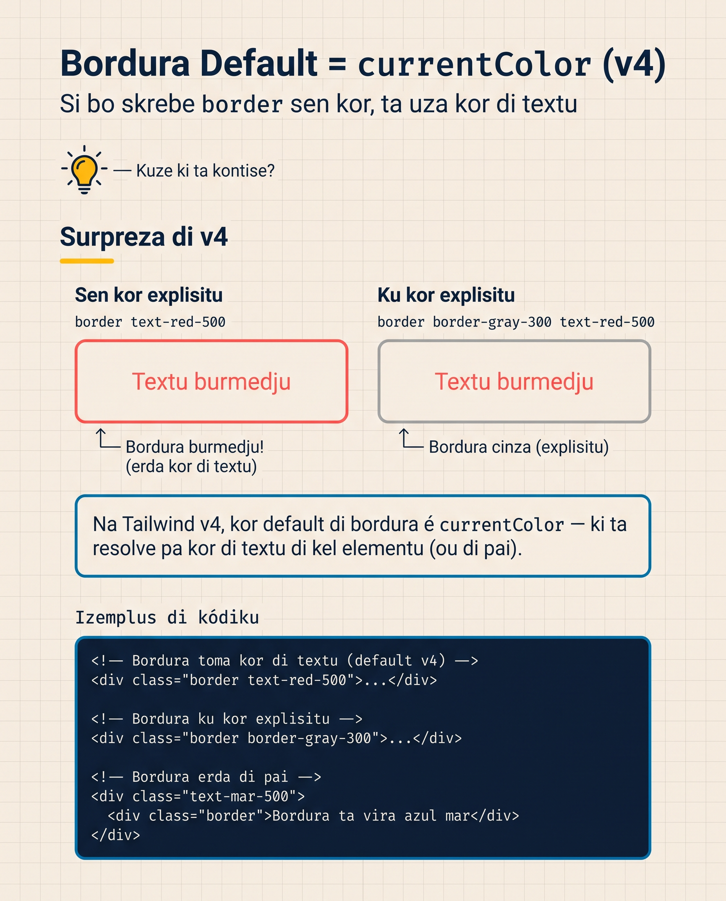

# Borduras i Rais

Kards di Resort Brava ten fundu, sombra i spacing. Ma kantus son **agudus** — ka tene suabidadi. Borduras i rais é o ki ta da forma a interfacis. Kantu redondu ta torna elementu más amigável. Bordura ta marka unde un kuza para i otru komesa.

I li ten **dos mudansas grandes di v4** ki bo meste sabe primeru — nun é só evolusan, é mudansa konseptual.

<SectionHeading variant="concept" seq={1}>Avizu: Default Border Color é `currentColor` na v4</SectionHeading>



**Es é mudansa más grandi di tudu Tailwind v4.**

Na v3, kuandu bo poi `border` (o `border-2`), kor era **`gray-200`** otomatikamenti. Tudu bordu na web v3 era sutil gray sen ki bo penso nada.

Na v4, **default é `currentColor`** — kor di textu di elementu. O mesmu HTML ta da un rezultadu diferenti:

<CompareTable
  title="Default di bordura: v3 vs v4"
  cornerLabel="Aspetu"
  cols={[
    { name: "Tailwind v3", accent: "orange" },
    { name: "Tailwind v4", accent: "blue" },
  ]}
  rows={[
    { label: "Kor default di `border`", kind: "code", vals: ["gray-200", "currentColor"] },
    { label: "O ki bo ta odja", kind: "text", vals: ["Sempri un **sinzentu klaru** sutil", "O **kor di textu** di elementu (ta eredita)"] },
    { label: "Sorpreza pusível?", kind: "text", vals: ["Nau — sempri mesmu sinzentu", "Sin — se textu é pretu, bordura é preta"] },
    { label: "O ki bo meste faze", kind: "text", vals: ["Nada", "**Sempri** spesifika `border-{kor}`"] },
  ]}
/>

**Pa konsisténsia, sempri spesifika kor di bordu:**

```html
<button class="border-2 border-slate-200">Click</button>
<div class="border border-sky-100">Karta</div>
```

Si bo ka spesifika, prepara pa surprezas. Pa migrasan di kódiku v3 a v4, **kel é di kuza más kumun di iskeci**.

:::callout{type=tip}
Pa lojika di v3 (default sinzentu), poi un linha `--color-border: var(--color-gray-200);` na `@theme {}` ou `* { @apply border-slate-200; }` na fonti.
:::

<SectionHeading variant="concept" seq={2}>Bordura — Largura, Kor, Ladu</SectionHeading>

### Largura

```html
<div class="border">1px (default si bo ten kor spesifikadu)</div>
<div class="border-2">2px</div>
<div class="border-4">4px</div>
<div class="border-8">8px</div>
<div class="border-0">Sen bordura</div>
```

Larguras válidas: 0, 1 (default), 2, 4, 8. (`border-3`, `border-5`, etc. ka izisti — uza valor arbitráriu si bo presisa.)

### Kor

Kor uza sintaxi konstanti ku otus paletas (Lisan 5):

```html
<div class="border border-sky-500">Bordura sky 500</div>
<div class="border-2 border-amber-300/50">Amber ku 50% opasidadi</div>
<div class="border border-slate-200">Gray klaru (padraun di karta klásiku)</div>
```

### Por Ladu Spesífiku

Família segui mesmu konvensan di margin/padding:

```html
<div class="border-t-2 border-sky-500">Bordura no topu</div>
<div class="border-r-4 border-amber-500">Bordura na direita</div>
<div class="border-b border-slate-200">Bordura no fundu</div>
<div class="border-l-4 border-amber-500 pl-4">Bordura na skerda (kumo callout)</div>

<div class="border-x border-slate-200">X = direita + skerda</div>
<div class="border-y-2 border-sky-300">Y = topu + fundu</div>
```

### Stilu di Bordura

Default é sólidu, ma ten otus:

```html
<div class="border-2 border-slate-300 border-solid">Sólidu (default)</div>
<div class="border-2 border-slate-300 border-dashed">Tracejadu</div>
<div class="border-2 border-slate-300 border-dotted">Pontiadu</div>
<div class="border-2 border-slate-300 border-double">Duplu</div>
```

`border-dashed` é poderozu pa outline de upload o drop-zonas.

<SectionHeading variant="concept" seq={3}>Avizu: Skala di Rounded Muda na v4</SectionHeading>

Mesmu padran ki sombra (Lisan 10): na v3 era `rounded` (sen sufixu) kumo default. **Na v4, `rounded` sozinhu ka izisti**. Tudu rais ten ki ten sufixu.

```html
<!-- v3 (kaduku) -->
<div class="rounded">...</div>

<!-- v4 (korretu) -->
<div class="rounded-xs">...</div>
<div class="rounded-sm">...</div>
<div class="rounded-md">...</div>
```

**Skala kompleta:**

| Klasi | Raiu |
|---|---|
| `rounded-none` | 0 (sen rais) |
| `rounded-xs` | 0.125rem (2px) |
| `rounded-sm` | 0.25rem (4px — substitui v3 `rounded`) |
| `rounded-md` | 0.375rem (6px) |
| `rounded-lg` | 0.5rem (8px) |
| `rounded-xl` | 0.75rem (12px) |
| `rounded-2xl` | 1rem (16px) |
| `rounded-3xl` | 1.5rem (24px) |
| `rounded-full` | 9999px (sirkulo si elementu é kuadradu) |

### Por Kantu Spesífiku

```html
<div class="rounded-t-lg">Top — top-left + top-right</div>
<div class="rounded-b-lg">Bottom — bottom-left + bottom-right</div>
<div class="rounded-l-lg">Skerda — top-left + bottom-left</div>
<div class="rounded-r-lg">Direita — top-right + bottom-right</div>

<div class="rounded-tl-lg">Só top-left</div>
<div class="rounded-tr-lg">Só top-right</div>
<div class="rounded-bl-lg">Só bottom-left</div>
<div class="rounded-br-lg">Só bottom-right</div>
```

Otimu pa `rounded-tl-lg rounded-br-lg` = kantus diagonal — moderno i ka kumun.

### `rounded-full` — Sirkulus i Botons Redondu

```html
  <!-- avatar redondu -->
<button class="bg-sky-600 text-white px-6 py-2 rounded-full">Boton redondu</button>
```

**Padran:**
- Karta normal: `rounded-lg`
- Boton moderno: `rounded-md` o `rounded-full`
- Avatar/ícon: `rounded-full`
- Modal grandi: `rounded-2xl` o `rounded-3xl`

<SectionHeading variant="concept" seq={4}>Outline — Bordura sen Spasu</SectionHeading>

`outline` parsi bordu, ma diferenti di bordura, **ka ta okupa spasu** no layout. Otimu pa stadios di foku (`:focus`).

```html
<input class="border border-slate-300 outline-2 outline-offset-2 outline-sky-500 focus:outline">
```

| Klasi | Funsan |
|---|---|
| `outline-{N}` | Largura (1, 2, 4, 8) |
| `outline-{kor}` | Kor (izemplu `outline-sky-500`) |
| `outline-offset-{N}` | Distansia di outline a elementu (1, 2, 4, 8) |
| `outline-dashed` | Tracejadu |
| `outline-none` | Removi outline (kuidadu — akseso pa teklas mesti outline) |

:::callout{type=tip}
**Nunka uza `outline-none` sen substitui** ku otru sinal visual di foku. Pesoa ki uza teklas pa navega ta perde pista de unde sta. Si bo removi outline default, adisiona `focus:ring-2 focus:ring-sky-500` o similar.
:::

<SectionHeading variant="concept" seq={5}>Klasis pa Lembra</SectionHeading>

Antis di aplika tudu a Resort Brava, repete os klasis-txavi di es lisan: bordura, stilu, rais i outline.

<Flashcard
  showHeader={false}
  deckId="tailwind-borduras-rais"
  cards={[
    { term: "border-t-2", def: "Bordura di 2px só no topu; a família ta segui mesmu konvensan di margin i padding." },
    { term: "border-x", def: "Bordura na direita i skerda a un bez (X = direita i skerda)." },
    { term: "border-dashed", def: "Bordura tracejadu — poderozu pa outline di drop-zonas di upload." },
    { term: "rounded-sm", def: "Raiu di 0.25rem (4px); ta substitui o v3 rounded sen sufixu." },
    { term: "rounded-full", def: "Raiu 9999px; sirkulu si o elementu é kuadradu — bon pa avatars i botons redondu." },
    { term: "outline-offset-2", def: "Distansia entri o outline i o elementu." },
    { term: "outline vs border", def: "Outline parsi bordura ma ka ta okupa spasu no layout — otimu pa foku." },
  ]}
/>

<SectionHeading variant="install">Aplika a Resort Brava</SectionHeading>

Kards di Lisan 10 ten fundu i sombra. Gosi nu adisiona rais i un bordura suavi pa kompletu.

<CodeDiff
  lang="html"
  filename="m2-resort-brava/index.html"
  title="Resort Brava: di Lisan 10 pa gosi"
  note="Tres mudansas: linha sutil no fundu di header, kards redondu ku bordura kuasi invizivel, i kantus suavi no boton di hero."
  diff={[
    { type: "del", t: '<header class="sticky top-0 z-10 bg-linear-to-r from-sky-700 to-sky-800 text-white px-6 py-4 shadow-md">' },
    { type: "add", t: '<header class="sticky top-0 z-10 bg-linear-to-r from-sky-700 to-sky-800 text-white px-6 py-4 shadow-md border-b border-sky-900/30">' },
    { type: "del", t: '<section id="kuartus" class="space-y-2 bg-white p-6 shadow-sm">' },
    { type: "add", t: '<section id="kuartus" class="space-y-2 bg-white p-6 shadow-sm rounded-lg border border-slate-100">' },
    { type: "del", t: '<a class="bg-amber-500 text-white px-4 py-2 font-semibold shadow-md">Olha kuartus</a>' },
    { type: "add", t: '<a class="bg-amber-500 text-white px-4 py-2 font-semibold shadow-md rounded-md">Olha kuartus</a>' },
  ]}
/>

**Mudansas:**

- **Header:** `border-b border-sky-900/30` — linha sutil na fundu di header, ki ta da fim limpu
- **Seksan (kards):** `rounded-lg border border-slate-100` — kards redondu ku bordura kuasi invizivel (define forma)
- **Boton di hero:** `rounded-md` — kantus suavi, ta da konfortu

Resort Brava ten gosi **forma**. Kards parsi ki bo pode toka, boton pa "klika", header termina.

<SectionHeading variant="practice">Tenta Gosi</SectionHeading>
<TentaGosi showHeader={false} />

<SectionHeading variant="quiz">Verifika Bo Kunhesimentu</SectionHeading>
<QuizSet showHeader={false}>
  <Quiz position={0} />
  <Quiz position={1} />
  <Quiz position={2} />
</QuizSet>

<SectionHeading variant="summary">Rezumu</SectionHeading>
<KeyTakeaways showHeader={false}>
  <RezumuItem variant="gold" term="Bordura kor na v4">default é `currentColor`, ka `gray-200` — **sempri spesifika o kor** di bordu.</RezumuItem>
  <RezumuItem term="Larguras válidas">0, 1 (default), 2, 4, 8 — pa otus valoris, uza valor arbitráriu.</RezumuItem>
  <RezumuItem term="Stilu">`border-solid` (default), `border-dashed`, `border-dotted`, `border-double`.</RezumuItem>
  <RezumuItem variant="warning" term="Erru kumun">`rounded` sen sufixu ka izisti na v4 — tudu rais ten ki ten sufixu (`rounded-xs/sm/md/lg/xl/2xl/3xl/full`).</RezumuItem>
  <RezumuItem term="rounded-full">+ elementu kuadradu = sirkulu (padran pa avatars).</RezumuItem>
  <RezumuItem variant="tip" term="Pista">`outline` ka ta okupa spasu — otimu pa foku; nunka `outline-none` sen un sinal visual di foku pa substitui-l.</RezumuItem>
</KeyTakeaways>
