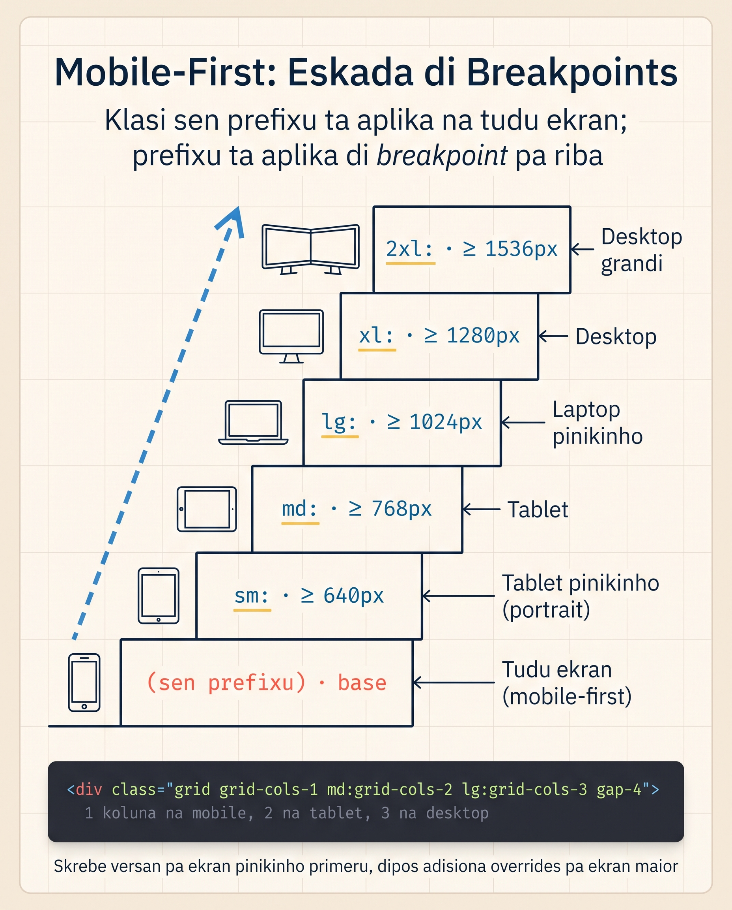

# Disenhu Responsivu

Resort Brava parsi bom na laptop. Abri-l no telefoni — nav links ta djunta un na otru, hero ten tipografia grandi demás ki ka kabe. Es lisan ta resolvi tudu: variantis responsivu di Tailwind son **un di razan ki tantu algen ta gosta di framework**.

Padran é simples: bo poi un prefixu antes di klasi ki só aplika a un breakpoint pa **riba**.

<SectionHeading variant="concept" seq={1}>5 Breakpoints di Default</SectionHeading>



Tailwind v4 ten 5 breakpoints, tudu baseadu na **min-width** (mobile-first). Klasi sen prefixu ta aplika a **tudu ekran** (di 0px pa riba); kada prefixu ta liga a partir di se tamanhu pa riba.

<Flashcard
  title="Os 5 breakpoints di Tailwind v4"
  deckId="tailwind-responsivu-breakpoints"
  cards={[
    { term: "sm:", def: "min-width: 640px — telefoni grandi o tablet en portrait. Aplika di 640px pa riba." },
    { term: "md:", def: "min-width: 768px — tablet en landscape. Aplika di 768px pa riba." },
    { term: "lg:", def: "min-width: 1024px — laptop o desktop pikinu. Aplika di 1024px pa riba." },
    { term: "xl:", def: "min-width: 1280px — desktop grandi. Aplika di 1280px pa riba." },
    { term: "2xl:", def: "min-width: 1536px — ekran ultra-wide. Aplika di 1536px pa riba." },
  ]}
/>

<SectionHeading variant="concept" seq={2}>Sintaxi — Aplika di un Breakpoint pa Riba</SectionHeading>

```html
<h1 class="text-2xl md:text-4xl lg:text-6xl">
  Pikinu na mobile, médiu na tablet, grandi na desktop
</h1>
```

- **`text-2xl`** — default (mobile, < 640px)
- **`md:text-4xl`** — aplika dês di 768px pa riba
- **`lg:text-6xl`** — aplika dês di 1024px pa riba

Es é manera **mobile-first**: bo skrebe stilu mobile primeru (sen prefixu), dipos adisiona overrides pa ekrans más grandi.

:::callout{type=tip}
**Nunka uza `max-*:` kumo padran**. v4 ten el (`max-sm:`, `max-md:`), ma é só pa kazus raru. Razon: mobile-first é más fásil di mante - bo sempri pensa "kuze ta funsiona mínimu, dipos ki ta melhora ku spasu?". Kontráriu é fragili.
:::

<MisconceptionConfront
  belief="O prefixu `sm:` só ta aplika na ekrans **pikinu** — tipu telefoni."
  myth="`sm:` ta signifika 'small', logu nu ta pensa ki el ta aplika só na ekrans pikinu."
  real="`sm:` é un breakpoint `min-width: 640px` — el ta aplika di 640px **pa riba**. Ekrans pikinu (< 640px) ta uza o stilu default sen prefixu."
  proof={[
    '<div class="sm:text-red-500">Olá</div>',
    '/* CSS ki Tailwind ta jera: */',
    '@media (min-width: 640px) { .sm\\:text-red-500 { color: red } }',
    '/* → aplika di 640px pa riba, ka só na telefonis pikinu */',
  ]}
  takeaway="Tudu varianti é `min-width` — el ta liga di kel tamanhu pa riba. Pa kazus só na ekrans pikinu, uza `max-sm:`."
/>

<SectionHeading variant="concept" seq={3}>Kombinasan Kumun</SectionHeading>

### Nav ki Stack na Mobile

```html
<nav class="flex flex-col gap-2 md:flex-row md:gap-6">
  <a href="#">Kuartus</a>
  <a href="#">Aktividadis</a>
  <a href="#">Kontaktu</a>
</nav>
```

- **`flex flex-col gap-2`** — na mobile, links en koluna vertikal ku 8px di gap
- **`md:flex-row md:gap-6`** — na tablet pa riba, vira fila ku 24px di gap

(Flex ben na Lisan 17 — kebra é OK li pa izemplu funsiona.)

### Tipografia ki Skala

```html
<h1 class="text-3xl sm:text-4xl md:text-5xl lg:text-6xl xl:text-7xl">
  Títulu ta krese
</h1>
```

### Padding ki Aumenta

```html
<section class="py-8 md:py-12 lg:py-16 xl:py-24">
  Mais spasu na ekrans grandi
</section>
```

### Display Kondisional

```html
<div class="hidden md:block">Só apareci na tablet pa riba</div>
<div class="block md:hidden">Só apareci na mobile</div>
```

Padran klásiku: menu hamburger no mobile, nav inline no desktop.

### Grid Kolunas

```html
<div class="grid grid-cols-1 sm:grid-cols-2 lg:grid-cols-3 xl:grid-cols-4 gap-4">
  ...
</div>
```

- Mobile: 1 koluna
- sm: 2 kolunas
- lg: 3 kolunas
- xl: 4 kolunas

(Grid ben na Lisan 18.)

<SectionHeading variant="concept" seq={4}>Personaliza Breakpoints — v4 (Sen JS Config)</SectionHeading>

Na v3, personaliza breakpoints era na `tailwind.config.js`:

```js
// v3 — kaduku na v4
module.exports = {
  theme: { screens: { sm: '600px', md: '900px' } }
}
```

**Na v4, é na CSS direta ku `@theme`:**

```html
<style type="text/tailwindcss">
  @theme {
    --breakpoint-sm: 600px;
    --breakpoint-md: 900px;
  }
</style>
```

Pa bo aplikasan, `sm:` gosi ta ativa na 600px en bez di 640.

### Adisiona un Breakpoint Personalizadu

Si bo presiza di más di 5, é simples:

```html
<style type="text/tailwindcss">
  @theme {
    --breakpoint-3xl: 1920px;
    --breakpoint-tv: 2560px;
  }
</style>

<h1 class="text-4xl 3xl:text-8xl tv:text-9xl">Títulu</h1>
```

**Klasi `3xl:` i `tv:` ezisti otomatikamenti** kuandu bo defini token. Es é poderozu di v4 — token CSS = klasi disponivel.

<SectionHeading variant="concept" seq={5}>`min-` vs `max-` Variantis</SectionHeading>

Pa kazus raru ki só faze sentidu na ekrans **pikinu**:

```html
<div class="block max-md:bg-amber-100">
  Fundu amber só na mobile (kuandu < md)
</div>
```

- `max-sm:` — aplika kuandu < 640px
- `max-md:` — < 768px
- `max-lg:` — < 1024px
- etc.

Mas un bez: **prefere mobile-first**. Reservu max-* pa kazus tipu "poi algo `hidden` só na mobile" si ka kabe naturalmenti.

<SectionHeading variant="install">Aplika Responsividadi a Resort Brava</SectionHeading>

Pa gosi, Resort Brava só ten stilus default — tudu aplikadu igual a kualker ekran. Nu ta adapta-l: klasi sen prefixu fika pa mobile, i nu adisiona overrides `md:` pa tablet pa riba.

<CodeDiff
  lang="html"
  filename="m2-resort-brava/index.html"
  title="Resort Brava: di stilu úniku pa responsivu"
  note="Kada mudansa é o mesmu padran: klasi sen prefixu = mobile; prefixu `md:` = override pa tablet pa riba."
  diff={[
    { type: "del", t: '<header class="...px-6 py-4">' },
    { type: "add", t: '<header class="...px-4 py-3 md:px-6 md:py-4">' },
    { type: "del", t: '  <h1 class="text-3xl font-bold tracking-tight">Resort Brava</h1>' },
    { type: "add", t: '  <h1 class="text-2xl md:text-3xl font-bold tracking-tight">Resort Brava</h1>' },
    { type: "del", t: '  <a class="text-sky-100 mr-4 ...">Kuartus</a>' },
    { type: "add", t: '  <a class="text-sky-100 block md:inline-block mr-0 md:mr-4 ...">Kuartus</a>' },
    { type: "ctx", t: '</header>' },
    { type: "del", t: '<section id="hero" class="relative space-y-4 min-h-[50vh]">' },
    { type: "add", t: '<section id="hero" class="relative space-y-4 min-h-[40vh] md:min-h-[50vh]">' },
    { type: "del", t: '  <h2 class="text-amber-600 text-5xl font-bold tracking-tight">Ben Vindo</h2>' },
    { type: "add", t: '  <h2 class="text-amber-600 text-3xl sm:text-4xl md:text-5xl lg:text-6xl font-bold tracking-tight">Ben Vindo</h2>' },
    { type: "del", t: '  <p class="text-slate-700 text-lg leading-relaxed max-w-2xl">...</p>' },
    { type: "add", t: '  <p class="text-slate-700 text-base md:text-lg leading-relaxed max-w-2xl">...</p>' },
    { type: "ctx", t: '</section>' },
    { type: "del", t: '<main class="container mx-auto px-6 py-12 space-y-12">' },
    { type: "add", t: '<main class="container mx-auto px-4 md:px-6 py-8 md:py-12 space-y-8 md:space-y-12">' },
  ]}
/>

**Mudansas:**

- **Header padding:** `px-4 py-3` (mobile) → `md:px-6 md:py-4` (desktop)
- **h1:** `text-2xl` → `md:text-3xl`
- **Nav links:** `block` na mobile (en koluna), `md:inline-block` na desktop (fila)
- **Hero min-height:** `min-h-[40vh]` (mobile) → `md:min-h-[50vh]` (tablet+)
- **Hero h2:** skala suavi: 3xl → 4xl → 5xl → 6xl
- **Hero p:** `text-base` (mobile) → `md:text-lg` (tablet+)
- **Main padding/spacing:** menus na mobile, más na desktop

Abri na browser, risiza janela. Tudu adapta naturalmenti. **Sen un só linha di JavaScript o media query manual.**

<SectionHeading variant="practice">Tenta Gosi</SectionHeading>
<TentaGosi showHeader={false} />

<SectionHeading variant="quiz">Verifika Bo Kunhesimentu</SectionHeading>
<QuizSet showHeader={false}>
  <Quiz position={0} />
  <Quiz position={1} />
  <Quiz position={2} />
</QuizSet>

<SectionHeading variant="summary">Rezumu</SectionHeading>
<KeyTakeaways showHeader={false}>
  <RezumuItem variant="gold" term="Mobile-first">klasi sen varianti = mobile; prefixos (`sm:`, `md:`…) = override pa ekrans grandi.</RezumuItem>
  <RezumuItem term="5 breakpoints">`sm:` (640), `md:` (768), `lg:` (1024), `xl:` (1280), `2xl:` (1536).</RezumuItem>
  <RezumuItem term="Son min-width">kada varianti ta aplika di se tamanhu **pa riba** — ka só na kel tamanhu.</RezumuItem>
  <RezumuItem term="Personaliza na v4">`@theme { --breakpoint-* }` na CSS — sen `tailwind.config.js`.</RezumuItem>
  <RezumuItem term="Tokens vira klasis">`--breakpoint-3xl` ta da o prefixu `3xl:` otomatikamenti.</RezumuItem>
  <RezumuItem variant="warning" term="Ka konfundi sm:">`sm:` ka é só pa telefoni — el ta liga di 640px pa riba. Pa ekrans pikinu, uza `max-sm:`.</RezumuItem>
  <RezumuItem variant="tip" term="Pista">testa na DevTools ku "Toggle device toolbar" — simula 375px, 768px i 1280px sen sai di browser.</RezumuItem>
</KeyTakeaways>
