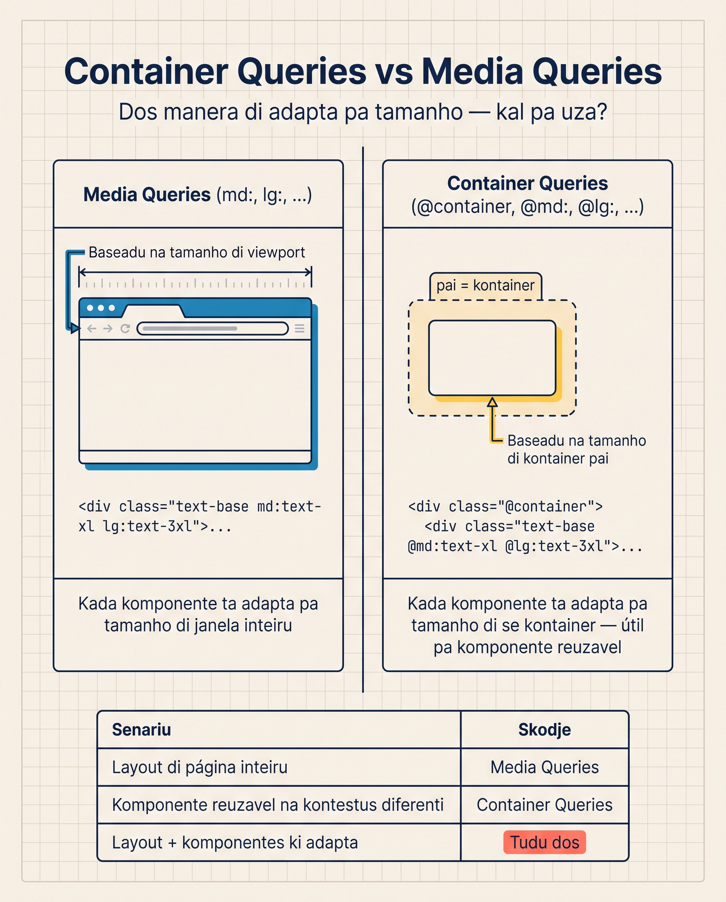

# Container Queries

Lisan pasadu, nu fala di breakpoints responsivu — `sm:`, `md:`, `lg:`. Es son baseadu na **viewport** (janela kompletu di browser). Funsiona pa layouts inteiru di página.

Ma kuandu bo ten un **widget** ki pode apareci en lugaris diferenti — un karta ki ta apareci na sidebar pikinu **ou** na main wide — viewport queries falha. Karta ka ta sabi si el ten 300px di largura no sidebar o 800px no main. Solusan: **container queries**.

Es é un di midjór features di Tailwind v4. Es ka izisti na v3 (era plugin extra). Na v4, é parte di kor.

<SectionHeading variant="concept" seq={1}>Problema ki Container Queries Resolvi</SectionHeading>

Imagina un karta ki mostra avatar + nome + bio:

```html
<div class="card">
  
  <h3>Camila</h3>
  <p>Hospedeira di Mindelo</p>
</div>
```

- Na **sidebar pikinu (200px)**: avatar i nome **en koluna** (vertikal). Bio skondidu.
- Na **main wide (800px)**: avatar **na skerda**, nome i bio na direita. Tudu vizivel.

Ku **media queries**, bo ta uza largura di **viewport**. Ma viewport pode ser 1500px ku karta na sidebar di 200px! Media queries da resposta **errada**. Container queries da resposta **direita**.

<CompareTable
  title="Media Query vs Container Query"
  cornerLabel="Aspetu"
  cols={[
    { name: "Media Query", accent: "orange" },
    { name: "Container Query", accent: "teal" },
  ]}
  rows={[
    { label: "Ta skuta", kind: "text", vals: ["Largura di **viewport** (janela di browser)", "Largura di **kontainer** (elementu pai)"] },
    { label: "Prefixu", kind: "code", vals: ["sm: md: lg:", "@sm: @md: @lg:"] },
    { label: "Midjór pa", kind: "text", vals: ["Layout di página inteiru", "Widget reuzavel na várius kontestu"] },
    { label: "Parte di kor na v3", kind: "bool", vals: [true, false] },
  ]}
/>

<SectionHeading variant="concept" seq={2}>Sintaxi — `@container` na Pai, `@sm:` na Filhus</SectionHeading>

Son dos passu: marka o pai ku `@container`, dipos aplika variantis `@md:` na filhus. Repara kada linha:

<AnnotatedCode
  lang="html"
  filename="karta.html"
  title="Anatomia di un container query"
  code={[
    { t: '<aside class="@container w-64">', m: 1 },
    { t: '  <div class="flex flex-col @md:flex-row gap-2">', m: 2 },
    { t: '    ', m: 0 },
    { t: '    <div>', m: 0 },
    { t: '      <h3>Camila</h3>', m: 0 },
    { t: '      <p class="hidden @md:block">Hospedeira di Mindelo</p>', m: 3 },
    { t: '    </div>', m: 0 },
    { t: '  </div>', m: 0 },
    { t: '</aside>', m: 0 },
  ]}
  notes={[
    { m: 1, title: "Marka o pai", body: "`@container` ta marka es `<aside>` kumo kontainer. Tudu kuza dentu ta pode uza `@sm:`, `@md:`, etc. `w-64` (16rem) ta fixa se largura." },
    { m: 2, title: "Varianti di kontainer", body: "`flex-col` é o default (kontainer pikinu). `@md:flex-row` ta vira linha só kuandu o **kontainer** txiga 28rem — ka o viewport." },
    { m: 3, title: "Mostra kondisional", body: "`hidden` ta skonde o bio; `@md:block` ta mostra-l só kuandu o kontainer ten spasu (≥ 28rem)." },
  ]}
/>

Si kel `<aside>` é na sidebar (`w-64` = 16rem = 256px), ninhun `@md:` aktiva. Si bo poi el na main (~800px), `@md:` ta aktiva.

<SectionHeading variant="concept" seq={3}>Breakpoints di Kontainer</SectionHeading>

Diferenti di viewport (ki son ekran), kontainer breakpoints son **menor** — pamodi ten ki funsiona pa widgets, ka tela enteira:

| Varianti | Largura di kontainer |
|---|---|
| `@xs:` | 20rem (320px) |
| `@sm:` | 24rem (384px) |
| `@md:` | 28rem (448px) |
| `@lg:` | 32rem (512px) |
| `@xl:` | 36rem (576px) |
| `@2xl:` | 42rem (672px) |
| `@3xl:` | 48rem (768px) |
| `@4xl:` | 56rem (896px) |
| `@5xl:` | 64rem (1024px) |
| `@6xl:` | 72rem (1152px) |
| `@7xl:` | 80rem (1280px) |

### Personaliza Breakpoints di Kontainer

Mesmu padran kumo viewport — uza `@theme`:

```css
@theme {
  --container-widget: 30rem;
}
```

Klasi `@widget:` gosi ezisti.

<SectionHeading variant="concept" seq={4}>Izemplu Kompletu — Karta di Hospedeira</SectionHeading>

```html
<section class="grid grid-cols-1 lg:grid-cols-3 gap-4">

  <!-- Sidebar di 1 koluna na lg+ -->
  <aside class="@container">
    <div class="flex flex-col @md:flex-row gap-4 p-4 bg-white rounded-lg shadow-sm">
      
      <div>
        <h3 class="font-bold">Camila</h3>
        <p class="text-sm text-slate-600">Mindelo · São Vicente</p>
        <p class="hidden @md:block text-sm mt-2">Hospedeira di 5 stadu, espésialista en gastronomia lokal.</p>
      </div>
    </div>
  </aside>

  <!-- Main: 2 kolunas na lg+ -->
  <main class="lg:col-span-2 @container">
    <!-- Si bo poi mesmu karta aqui, vai ta na flex-row pamodi kontainer é mais grandi -->
  </main>

</section>
```

Mesmu karta, dos lugaris, dos manera diferenti. Sen JavaScript.

<SectionHeading variant="concept" seq={5}>`@max-*:` i `@container-size`</SectionHeading>

**`@max-*:` — max-width di kontainer.** Mesmu lojika ki responsive viewport — `@max-md:` aplika kuandu kontainer < 28rem:

```html
<div class="@container">
  <div class="@max-md:bg-amber-100">
    Fundu amber só kuandu kontainer é pikinu
  </div>
</div>
```

**`@container-size` — novu na v4.3.** Un `@container` normal ta da só **largura** (inline-size) pa queries. `@container-size` (v4.3) ta kria un *size container* ki tambén ta da **altura** (block-size) — asi bo pode uza unidadis di query di altura: `cqb` (block) i `cqh` (height).

```html
<div class="@container-size h-64">
  <!-- 50cqb = 50% di altura di kontainer -->
  <div class="h-[50cqb]">
    Altura relativu a kontainer, ka só largura
  </div>
</div>
```

Nota: `@container-size` **ka ta kria** variantis nomeadu pa altura (ka ten `@h-sm:`) — e ta da unidadis `cqb`/`cqh` dentu di un size container. Otimu pa kazus rárus unde altura di kontainer é mais importanti.

<SectionHeading variant="concept" seq={6}>Kuandu Uza Container vs Media Queries?</SectionHeading>



| Senáriu | Skoji |
|---|---|
| Layout di página inteiru | Media query (`sm:`, `md:`) |
| Widget ki pode apareci na sidebar OU main | **Container query** |
| Karta di produtu na grid responsivu | **Container query** |
| Muda tamanhu di hero na ekrans grandi | Media query |
| Komponenti di biblioteka (reuza en kontestu) | **Container query** |

Regra di odja: **si komponenti ta uzadu en kontestus diferenti, uza container query**. Pa página padran (un só layout), media query é más simples.

:::callout{type=info}
Resort Brava ten un só layout di página (hero + 3 seksan + footer). Container queries ka da valor li. Ma si bo un dia adisiona un **karta di hospedeira reuzavel** ki ta apareci tanto na hero kumo na sidebar di blog, container queries ta resolvi-l di manera elegante. Es lisan é **konseitu**.
:::

<SectionHeading variant="practice" level={3}>Repete pa Lembra: Utilidadis di Kontainer</SectionHeading>
<Flashcard
  showHeader={false}
  deckId="tailwind-container-queries"
  cards={[
    { term: "@container", def: "Marka un elementu pai kumo kontainer di query." },
    { term: "@md:", def: "Aplika o stilu kuandu o kontainer txiga 28rem (448px).", code: "@md:flex-row" },
    { term: "@max-md:", def: "Aplika o stilu kuandu o kontainer é menor ki 28rem.", code: "@max-md:bg-amber-100" },
    { term: "@theme { --container-* }", def: "Kria un breakpoint di kontainer personalizadu.", code: "--container-widget: 30rem" },
    { term: "@container-size", def: "Kria un size container ki ta da largura i altura pa queries.", code: "@container-size h-64" },
    { term: "cqb / cqh", def: "Unidadis di query baseadu na altura di kontainer.", code: "h-[50cqb]" },
  ]}
/>

<SectionHeading variant="practice">Tenta Gosi</SectionHeading>
<TentaGosi showHeader={false} />

<SectionHeading variant="quiz">Verifika Bo Kunhesimentu</SectionHeading>
<QuizSet showHeader={false}>
  <Quiz position={0} />
  <Quiz position={1} />
  <Quiz position={2} />
</QuizSet>

<SectionHeading variant="summary">Rezumu</SectionHeading>
<KeyTakeaways showHeader={false}>
  <RezumuItem variant="gold" term="Container queries">stilus baseadu na largura **di kontainer**, ka di viewport.</RezumuItem>
  <RezumuItem term="@container" code>marka o pai kumo kontainer; filhus gosi pode uza `@sm:` a `@7xl:`.</RezumuItem>
  <RezumuItem term="Breakpoints menor">variantis di kontainer son más pikinu ki viewport — es ta funsiona pa widgets, ka tela enteira.</RezumuItem>
  <RezumuItem term="Personaliza">`@theme { --container-* }` — mesmu padran ki breakpoints di viewport; `@max-*:` pa max-width.</RezumuItem>
  <RezumuItem term="@container-size">(v4.3) ta kria un size container → da unidadis `cqb`/`cqh` pa query baseadu na altura.</RezumuItem>
  <RezumuItem variant="warning" term="Errus kumuns">ka konfundi viewport ku kontainer — `@md:` ta skuta o pai, `md:` ta skuta a janela.</RezumuItem>
  <RezumuItem variant="tip" term="Pista">si un komponenti ta uzadu en kontestus diferenti, uza container query; pa página padran, media query é más simples.</RezumuItem>
</KeyTakeaways>
