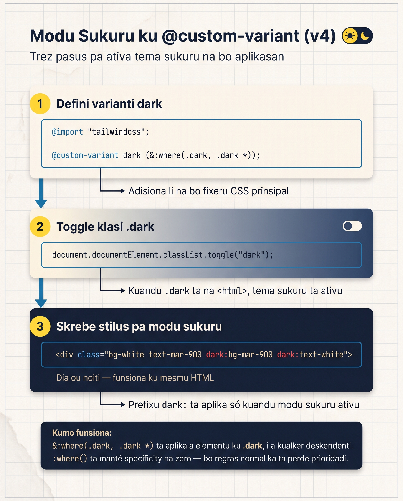

# Modu Sukuru ku @custom-variant

Resort Brava ta brilha na ekran klaru. Ma muitu vizitanti — espesialmente di noiti — preferi temas sukuru. Tailwind ta da-nu un sistema kompletu di dark mode, **inkluindu un toggle ki ta guarda skolha entri vizitas**.

I li ven **otra mudansa fundamentu di v4:** `darkMode: 'class'` na JS config **é antigu**. v4 ta uza `@custom-variant`.

<SectionHeading variant="concept" seq={1}>Kuze ki Muda: `darkMode` di v3 pa `@custom-variant`</SectionHeading>



Na v3, bu konfigura dark mode na `tailwind.config.js`. Na v4 kel linha sumiu — bu ta defini un **custom variant** diretu na CSS:

<CodeDiff
  lang="css"
  filename="di v3 config pa v4 @custom-variant"
  title="Dark mode: di v3 pa v4"
  note="v3 ta pega `darkMode: 'class'` na JavaScript config; v4 ta uza `@custom-variant` na bu blok `<style type='text/tailwindcss'>`."
  diff={[
    { type: "del", t: "/* v3 — ka ta funsiona na v4 */" },
    { type: "del", t: "module.exports = {" },
    { type: "del", t: "  darkMode: 'class',  // ou 'media'" },
    { type: "del", t: "}" },
    { type: "add", t: "/* v4 — na bu blok <style type=\"text/tailwindcss\"> */" },
    { type: "add", t: "@custom-variant dark (&:where(.dark, .dark *));" },
  ]}
/>

Faz sentidu?

- `@custom-variant dark` ta defini varianti txomadu `dark:`
- Ku padran `&:where(.dark, .dark *)`, ta aplika a elementu ki **ten klasi `dark`** ou ki **é aninhadu di un kuadradu ku klasi `dark`**

**Es padran = "selector-based dark mode"** — bo kontrola ku klasi.

<SectionHeading variant="concept" seq={2}>Sintaxi `dark:` na Prátika</SectionHeading>

Adisiona klasi `dark:` a kualker utilidadi:

```html
<div class="bg-white dark:bg-slate-900 text-slate-900 dark:text-slate-100">
  Klaru por default, sukuru kuando `<html class="dark">`
</div>
```

Ativa: adisiona klasi `dark` na `<html>`:

```html
<html class="dark">
```

Tudu klasi ku `dark:` ta aplika.

<MisconceptionConfront
  belief="Pa dark mode funsiona, bu só meste adisiona klasis `dark:` — Tailwind ta deteta sistema operativu sozinhu i ta troka pa modu sukuru."
  myth="Basta poi `dark:` na kada utilidadi, i Tailwind ta odja ki bu sistema sta en dark mode i ta muda a página otomatikamenti."
  real="Ku `@custom-variant dark (&:where(.dark, .dark *))`, nada ka ta kontise te ki klasi `dark` sta na `<html>`. É bu JavaScript ki ten ki poi el li — Tailwind ka ta odja sistema sozinhu."
  proof={[
    "<html>              -> página klaru (sen klasi dark)",
    "<html class=\"dark\"> -> dark: variantis ta aplika",
  ]}
  takeaway="Klasis `dark:` ta spera pa klasi `dark` na `<html>`. É bu JavaScript ki ta poi el — i `prefers-color-scheme` só ta konta si bu kódiku ta odja-l ku `matchMedia`."
/>

<SectionHeading variant="concept" seq={3}>Toggle ku JavaScript Vanilla</SectionHeading>

Vamos konstruir un boton ki ta troka light/dark:

```html
<button id="dark-toggle" class="px-3 py-1 rounded-md bg-slate-200 dark:bg-slate-700">
  <span class="dark:hidden">🌙</span>
  <span class="hidden dark:inline">☀️</span>
</button>

<script>
  document.getElementById('dark-toggle').addEventListener('click', () => {
    document.documentElement.classList.toggle('dark');
  });
</script>
```

**Pasus:**
1. Boton ku dos ikon: 🌙 (sumi en dark) i ☀️ (apareci en dark)
2. JavaScript deteta klike, troka klasi `dark` na `<html>`

Klika no boton — pajina muda kompletu. Klika di novu — volta.

<SectionHeading variant="concept" seq={4}>Guarda Skolha ku `localStorage`</SectionHeading>

Problema: si vizitanti muda pa dark, refresh apaga skolha. Solusan: salva na browser. Repara kada linha di lojika:

<AnnotatedCode
  lang="html"
  filename="dark-mode.js"
  title="Karega, troka i salva a skolha"
  code={[
    { t: "if (localStorage.theme === 'dark' ||", m: 1 },
    { t: "    (!('theme' in localStorage) && window.matchMedia('(prefers-color-scheme: dark)').matches)) {", m: 1 },
    { t: "  document.documentElement.classList.add('dark');", m: 2 },
    { t: "}", m: 0 },
    { t: "", m: 0 },
    { t: "document.getElementById('dark-toggle').addEventListener('click', () => {", m: 3 },
    { t: "  document.documentElement.classList.toggle('dark');", m: 3 },
    { t: "  localStorage.theme = document.documentElement.classList.contains('dark') ? 'dark' : 'light';", m: 4 },
    { t: "});", m: 0 },
  ]}
  notes={[
    { m: 1, title: "Karega a preferénsia", body: "Si `localStorage.theme` é `dark`, **OU** si ka ten nada salva i sistema operativu sta en dark mode, ativa dark." },
    { m: 2, title: "Poi a klasi", body: "Adisiona klasi `dark` na `<html>` — gosi tudu utilidadi `dark:` ta aplika." },
    { m: 3, title: "Toggle no klike", body: "No klike, `toggle` ta poi ou tira a klasi `dark`." },
    { m: 4, title: "Salva a skolha", body: "Grava a nova skolha na `localStorage` pa próxima vizita mante-l." },
  ]}
/>

Es padran é **padran pa produsan**: kompleta i sólidu.

:::callout{type=tip}
Adisiona kel script na `<head>` (antes di `<body>`) pa evita "flash of unstyled content" — ekran ta fika klaru por mili-segundus antes di JS ativa. Bo kre dark mode aplikadu **antes** di pajina renderiza.
:::

<SectionHeading variant="concept" seq={5}>Stilus pa Dark Mode</SectionHeading>

Pa kada utilidadi, pensa: "ki kor funsiona en dark mode?"

| Utilidadi klaru | Dark mode |
|---|---|
| `bg-white` | `dark:bg-slate-900` (o slate-800) |
| `bg-slate-50` | `dark:bg-slate-900` |
| `bg-slate-100` | `dark:bg-slate-800` |
| `text-slate-900` | `dark:text-slate-100` |
| `text-slate-700` | `dark:text-slate-300` |
| `text-slate-600` | `dark:text-slate-400` |
| `border-slate-200` | `dark:border-slate-700` |
| `border-slate-100` | `dark:border-slate-800` |
| Kores klaru (`bg-sky-500`) | manten o muda pa más sukuru (`dark:bg-sky-600`) |

**Regra geral:** klaru ↔ sukuru, ma manten kontrasti adekuadu (5:1 mínimu pa textu sob fundu).

<SectionHeading variant="install">Aplika Dark Mode a Resort Brava</SectionHeading>

Es é **fin di Módulu 3.** Resort Brava ki dja tinha identidadi de marka gosi ten **modu sukuru** kompletu.

### Pasu 1: Adisiona `@custom-variant dark` na `@theme`

```html
<style type="text/tailwindcss">
  @custom-variant dark (&:where(.dark, .dark *));

  @theme {
    /* ... tokens di marka di Lisan 21 ... */
  }

  @keyframes fade-up { ... }
</style>
```

### Pasu 2: Adisiona `dark:` variantis a tudu kores prinsipal

```html
<body class="min-h-screen bg-sol-100 dark:bg-mar-900 text-slate-900 dark:text-slate-100">

<section id="kuartus" class="space-y-2 bg-white dark:bg-slate-800 p-6 shadow-sm rounded-lg border border-slate-100 dark:border-slate-700 hover:shadow-lg hover:scale-105 transition duration-200 ease-out">
  <h3 class="font-display text-mar-700 dark:text-mar-300 text-2xl font-semibold">Kuartus</h3>
  <p class="text-slate-600 dark:text-slate-300">Três tipus di kuartus...</p>
</section>

<p class="font-display text-sol-700 dark:text-sol-300 text-3xl ...">Ben Vindo</p>
<p class="text-slate-700 dark:text-slate-300 text-base md:text-lg ...">Vive Brava...</p>
```

### Pasu 3: Adisiona boton di toggle no header

```html
<button id="dark-toggle" class="px-2 py-1 rounded-md bg-mar-800/50 dark:bg-mar-700 text-white hover:bg-mar-800 transition-colors" aria-label="Alterna modu sukuru">
  <span class="dark:hidden">🌙</span>
  <span class="hidden dark:inline">☀️</span>
</button>
```

### Pasu 4: Adisiona script na `<head>`

```html
<script>
  if (localStorage.theme === 'dark' || 
      (!('theme' in localStorage) && window.matchMedia('(prefers-color-scheme: dark)').matches)) {
    document.documentElement.classList.add('dark');
  }

  document.addEventListener('DOMContentLoaded', () => {
    document.getElementById('dark-toggle').addEventListener('click', () => {
      document.documentElement.classList.toggle('dark');
      localStorage.theme = document.documentElement.classList.contains('dark') ? 'dark' : 'light';
    });
  });
</script>
```

Resultadu: Resort Brava ten un toggle no header (🌙/☀️). Klika troka light/dark. Skolha persisti dipos di refresh. Vizitanti ki ten sistema en dark mode di seu mac/windows ta odja Brava en dark mode otomatikamenti.

<SectionHeading variant="concept" seq={6}>Fin di Módulu 3</SectionHeading>

Bo kompletu Módulu 3 — **Layout i Movimentu.** Resort Brava gosi ten:

- Interatividadi (hover, focus, transisan)
- Disenhu responsivu (mobile, tablet, desktop)
- Flexbox no nav i hero
- Grid pa kards (1 koluna mobile → 3 desktop)
- Transformasan + transisan (hover lift)
- Animasan (fade-up entrada)
- Tokens di marka (`mar-*`, `sol-*`, `font-display`)
- Modu sukuru kompletu ku toggle ki ta guarda skolha

Sen JavaScript framework. Sen build tool. Tudu Tailwind v4 + 12 linhas di vanilla JS — un UI kompletu, di marka, ku interasan rica, en HTML simples.

<SectionHeading variant="practice">Tenta Gosi</SectionHeading>
<TentaGosi showHeader={false} />

<SectionHeading variant="quiz">Verifika Bo Kunhesimentu</SectionHeading>
<QuizSet showHeader={false}>
  <Quiz position={0} />
  <Quiz position={1} />
  <Quiz position={2} />
</QuizSet>

<SectionHeading variant="summary">Rezumu</SectionHeading>
<KeyTakeaways showHeader={false}>
  <RezumuItem variant="gold" term="`@custom-variant`">`darkMode: 'class'` é antigu na v4 — uza `@custom-variant dark (&:where(.dark, .dark *));`.</RezumuItem>
  <RezumuItem term="Prefixu `dark:`">aplika a kualker utilidadi — `bg-white dark:bg-slate-900`, `text-slate-900 dark:text-slate-100`.</RezumuItem>
  <RezumuItem term="Toggle vanilla">`document.documentElement.classList.toggle('dark')` no klike di un boton.</RezumuItem>
  <RezumuItem term="Persistensia">`localStorage` guarda a skolha + `prefers-color-scheme` kumo default via `matchMedia`.</RezumuItem>
  <RezumuItem variant="warning" term="Errus kumuns">só klasis `dark:` ka ta txiga — te ki klasi `dark` sta na `<html>`, nada ka ta muda.</RezumuItem>
  <RezumuItem variant="tip" term="Pista">poi o script na `<head>` (antes di `<body>`) pa evita o "flash of unstyled content".</RezumuItem>
</KeyTakeaways>
