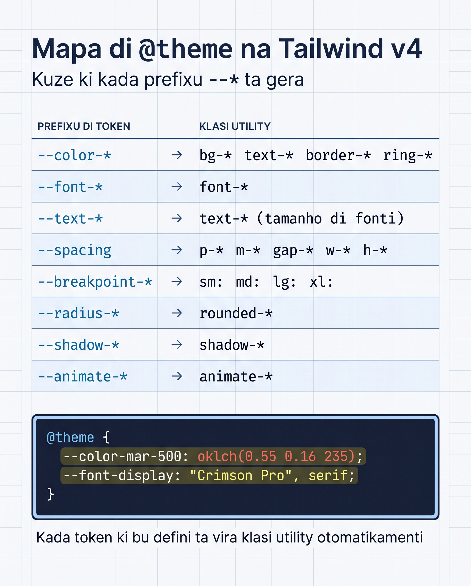

# `@theme` di Profundidade

Na Lisan 21 nu kria Resort Brava ku tokens di marka — `--color-mar-*`, `--color-sol-*`, `--font-display`. Es funsiona, ma nu konxe só un kantu di `@theme`. Es lisan ta abri janela kompletu: **kada namespace, kumo el ta mapeia pa utilidadis, i kumo bo ta tira ou substitui padran.**

Pensamentu xavi di v4: **`@theme` ka ta konfigura Tailwind — el ta defini variavel CSS ki Tailwind ta uza pa gera utilidadis.** Si bo kompriende es, tudu resta ta bira intuitivu.

<SectionHeading variant="concept" seq={1}>Namespaces di @theme</SectionHeading>



Kada prefixu di variavel ta korresponde pa un família di utilidadis. Es é tabela kompletu — guarda kumo referénsia.

| Namespace | Utilidadis ki gera |
|---|---|
| `--color-{nomi}-{tom}` | `bg-{nomi}-{tom}`, `text-*`, `border-*`, `ring-*`, `fill-*`, `stroke-*`, `outline-*`, `decoration-*`, `from-*`, `via-*`, `to-*`, etc. |
| `--font-{nomi}` | `font-{nomi}` (ex. `font-display`) |
| `--text-{tamanho}` | `text-{tamanho}` (font-size) |
| `--font-weight-{nomi}` | `font-{nomi}` (ex. `font-bold`) |
| `--tracking-{nomi}` | `tracking-{nomi}` (letter-spacing) |
| `--leading-{nomi}` | `leading-{nomi}` (line-height) |
| `--breakpoint-{nomi}` | `{nomi}:` variant responsivu (ex. `lg:`) |
| `--container-{nomi}` | `@{nomi}:` variant di container query |
| `--spacing` | **Tudu** `p-*`, `m-*`, `gap-*`, `w-*`, `h-*`, `size-*`, `top-*`, etc. |
| `--radius-{nomi}` | `rounded-{nomi}` (ex. `rounded-md`) |
| `--shadow-{nomi}` | `shadow-{nomi}` (ex. `shadow-sm`) |
| `--blur-{nomi}` | `blur-{nomi}` |
| `--animate-{nomi}` | `animate-{nomi}` |
| `--ease-{nomi}` | `ease-{nomi}` |
| `--aspect-{nomi}` | `aspect-{nomi}` |

**Padran:** kria un variavel ku prefixu sertu → utilidadis ta aparece otomátiku. Sen registru en JavaScript, sen mexe en konfig.

<CodeCloze
  lang="css"
  title="Kal prefixu ta gera kal utilidadi?"
  prompt="Inche kada prefixu pa ki o token gera a utilidadi komentadu na direita."
  template={[
    "@theme {",
    "  {{0}}-marka: #1e90ff;   /* → bg-marka, text-marka, border-marka */",
    "  {{1}}: 0.25rem;           /* → p-*, m-*, w-*, h-*, gap-* */",
    "  {{2}}-card: 1rem;         /* → rounded-card */",
    "}",
  ]}
  answers={["--color", "--spacing", "--radius"]}
  hints={["Namespace di kores", "Base universal di tamanhu (sen sufiksu)", "Namespace di kantu redondu"]}
  solved="Sertu! Kada prefixu ta mapeia pa un família di utilidadis — sen JavaScript, sen konfig."
/>

<SectionHeading variant="concept" seq={2}>O Token --spacing é Mágiku</SectionHeading>

Es é talvez token más poderozu di tudu v4. **Un só variavel ki ta kontrola spacing pa tudu utilidadi di tamanhu.**

```css
@theme {
  --spacing: 0.25rem;   /* defaultu: 4px */
}
```

Kada utilidadi numérika ta multiplika es base:

| Utilidadi | Kálkulu | Rezultadu (padran) |
|---|---|---|
| `p-1` | 1 × 0.25rem | 0.25rem (4px) |
| `p-4` | 4 × 0.25rem | 1rem (16px) |
| `m-8` | 8 × 0.25rem | 2rem (32px) |
| `w-64` | 64 × 0.25rem | 16rem (256px) |
| `gap-2.5` | 2.5 × 0.25rem | 0.625rem (10px) |

Si bo muda `--spacing`, tudu ta atualiza:

```css
@theme {
  --spacing: 0.2rem;   /* sistema más kompaktu */
}
```

Gosi `p-4` ta sai 0.8rem en bez di 1rem. Un linha → txeu utilidadis ta muda.

:::callout{type=tip}
Pa skala personalizadu (ex. base di 8px na bez di 4px): konsidera si **tudu** dezenhu presiza skala diferenti, ou só algun komponentes. Si é só algun, uza valor arbitráriu (`p-[10px]`) en bez di muda `--spacing` global.
:::

<SectionHeading variant="concept" seq={3}>Tira Tokens Padran</SectionHeading>

Tailwind ta ben ku txeu tokens padran (kores Material/Tailwind, fonti `sans/serif/mono`, etc). Si bo presiza **só** tokens di bo marka, **tira-s.**

### Tira un família inteiru

```css
@theme {
  --color-*: initial;     /* nada di kores padraun */
  --color-blanku: #ffffff;
  --color-marka: oklch(0.55 0.22 250);
}
```

Dipos di es konfigurasan, **`bg-red-500` ka ta funsiona** — paleta padran foi tiradu. Só `bg-blanku` i `bg-marka` ta izisti.

### Tira tudu i kumesa di zero

```css
@theme {
  --*: initial;           /* zerar tudu */
  --spacing: 4px;
  --color-primáriu: oklch(0.55 0.22 250);
  --font-body: "Inter", sans-serif;
}
```

Es é "tema kompletu personalizadu". Útil pa un sistema di dezenhu fitxadu (ex. un dashboard interno) unde bo ka kre risku di klasi padran aparece.

**Kuandu uza:**

- `--color-*: initial;` — bo marka ten paleta diferenti i bo ka kre kores Tailwind ta mistura ku bo klasis
- `--*: initial;` — sistema dezenhu kompletu personalizadu, sen herda nada

:::callout{type=tip}
Komesa **sen** `initial`. Adisiona só si bo realmenti kre kontrolu absolutu. Tira tudu padran ta forsa-bo defini ká bez utilidadi báziku manualmenti.
:::

<SectionHeading variant="concept" seq={4}>@theme inline — kuandu un value ten var()</SectionHeading>

Kazu komuns na frameworks moderno: bo ten un fonti personalizadu ki `next/font` ta karrega ou outro mekanismu, i el ta mete un variavel CSS na `:root`. Si bo skrebe es value ku `@theme {}` normal, Tailwind ta salva o `var()` literalmenti — ma `var(--font-inter)` ka izisti na momentu di build, só na browser. Rezultadu: utilidadis ki ka funsiona ou klasi kebradu.

<CodeDiff
  lang="css"
  filename="input.css"
  title="var() na value: @theme normal vs @theme inline"
  note="A únika mudansa é a palavra `inline`. Ku el, Tailwind ta avalia o `var()` na tempu di build en bez di salva-l literalmenti."
  diff={[
    { type: "del", t: "/* @theme normal — KA ta resolvi var() */" },
    { type: "del", t: "@theme {" },
    { type: "add", t: "/* @theme inline — resolvi var() na tempu di build */" },
    { type: "add", t: "@theme inline {" },
    { type: "ctx", t: "  --font-sans: var(--font-inter);" },
    { type: "ctx", t: "}" },
  ]}
/>

`@theme inline` ta avalia kada referénsia direta, en bez di salva-l literalmenti. Utilidadis ta sai limpu.

**Regra di ouro:** **si o value ten un `var()`, uza `@theme inline {}`.** Kazu kontráriu, `@theme {}` normal.

<SectionHeading variant="concept" seq={5}>Esemplu Prátiku — sistema brand-heavy</SectionHeading>

Vamos imagina ki Resort Brava ten kontratu di marka kompletamenti spesífiku. Nu kre **só** nos paleta, **só** nos fonti, i **só** nos skala di spacing.

<AnnotatedCode
  lang="css"
  filename="input.css"
  title="Un @theme di marka kompletu, linha-pa-linha"
  code={[
    { t: '/* input.css */', m: 0 },
    { t: '@import "tailwindcss";', m: 0 },
    { t: '', m: 0 },
    { t: '@theme {', m: 0 },
    { t: '  --color-*: initial;', m: 1 },
    { t: '  --font-*: initial;', m: 1 },
    { t: '', m: 0 },
    { t: '  --color-mar-50:  oklch(0.97 0.02 235);', m: 2 },
    { t: '  --color-mar-500: oklch(0.55 0.16 235);', m: 2 },
    { t: '  --color-mar-900: oklch(0.22 0.10 235);', m: 2 },
    { t: '  --color-sol-300: oklch(0.85 0.13 75);', m: 2 },
    { t: '  --color-sol-700: oklch(0.55 0.18 75);', m: 2 },
    { t: '  --color-areia:   oklch(0.94 0.03 85);', m: 2 },
    { t: '  --color-koral:   oklch(0.65 0.20 25);', m: 2 },
    { t: '', m: 0 },
    { t: '  --font-display: "Crimson Pro", serif;', m: 3 },
    { t: '  --font-body: "Inter", system-ui, sans-serif;', m: 3 },
    { t: '', m: 0 },
    { t: '  --spacing: 0.3rem;', m: 4 },
    { t: '', m: 0 },
    { t: '  --radius-card: 1rem;', m: 5 },
    { t: '  --radius-button: 0.625rem;', m: 5 },
    { t: '', m: 0 },
    { t: '  --animate-fade-up: fade-up 0.6s ease-out forwards;', m: 6 },
    { t: '}', m: 0 },
    { t: '', m: 0 },
    { t: '@keyframes fade-up {', m: 6 },
    { t: '  from { opacity: 0; transform: translateY(12px); }', m: 6 },
    { t: '  to { opacity: 1; transform: translateY(0); }', m: 6 },
    { t: '}', m: 0 },
  ]}
  notes={[
    { m: 1, title: "Zerar padran", body: "`--color-*: initial` i `--font-*: initial` ta **tira** tudu kor i fonti padran di Tailwind. Só o ki bo defini djuntu ta izisti dipos." },
    { m: 2, title: "Nosa paleta", body: "Kada `--color-mar-*`, `--color-sol-*`, `--color-areia` i `--color-koral` ta gera `bg-*`, `text-*`, `border-*`, `from-*`, etc. automátiku." },
    { m: 3, title: "Nosa fonti", body: "Só dos famílias: `--font-display` ta da `font-display`, `--font-body` ta da `font-body`." },
    { m: 4, title: "Skala di spacing", body: "`--spacing: 0.3rem` ta faze `p-4` = 4 × 0.3rem = 1.2rem — un skala más larga ki o padran." },
    { m: 5, title: "Raios kustomizadu", body: "`--radius-card` i `--radius-button` ta da `rounded-card` i `rounded-button`." },
    { m: 6, title: "Token di animasaun", body: "`--animate-fade-up` ta da a klasi `animate-fade-up`; o `@keyframes` ta fika **fora** di `@theme`." },
  ]}
/>

**Tudu utilidadi gera automátiku:**

- `bg-mar-500`, `text-sol-700`, `border-koral`, `from-areia`, etc.
- `font-display`, `font-body`
- `p-4` = 4 × 0.3rem = 1.2rem
- `rounded-card`, `rounded-button`
- `animate-fade-up`

Klasi tipu `bg-red-500` ka ta funsiona aki — paleta padran foi tiradu.

<SectionHeading variant="install">Inspesiona o ki Tailwind ta gera</SectionHeading>

Pa odja lista kompletu di tokens ki bo tema ta mostra:

```bash
pnpm run build
# Dipos abri dist/style.css i prokura ":root {"
```

Bo ta odja tudu `--color-*`, `--font-*`, etc. ki Tailwind kompila pa CSS. Es é forma más rápida di konfirma **o ki realmenti ta gera**.

:::callout{type=tip}
DevTools di Chrome/Firefox ta mostra es variavel kuandu bo inspesiona `:root` no elementu HTML. Bo pode mesmu muda-s temporariamenti pa testa mudansas sen rebuild.
:::

<SectionHeading variant="concept" seq={6}>Padron Komuns pa Referénsia</SectionHeading>

Vira kada karta pa lembra o padran ki ta rezolvi kada kazu di kada dia.

<Flashcard
  title="Padron komuns di @theme"
  deckId="tailwind-theme-padron-komuns"
  cards={[
    { term: "Adisiona kor novu pa marka", def: "Un token --color-* ta gera bg-*, text-*, border-*.", code: "@theme { --color-marka: oklch(0.55 0.22 250) }", lang: "css" },
    { term: "Muda skala di spacing global", def: "Un só linha ta muda tudu p-*, m-*, w-*, h-*.", code: "@theme { --spacing: 0.2rem }", lang: "css" },
    { term: "Adisiona breakpoint personalizadu", def: "Un token --breakpoint-* ta gera un variant responsivu novu.", code: "@theme { --breakpoint-3xl: 120rem }", lang: "css" },
    { term: "Referensia var() externu (next/font)", def: "Value ku var() ten ki uza @theme inline pa resolvi na build.", code: "@theme inline { --font-sans: var(--font-inter) }", lang: "css" },
    { term: "Tira tudu kores padran", def: "initial ta apaga a paleta padran di Tailwind.", code: "@theme { --color-*: initial }", lang: "css" },
    { term: "Tema kompletu personalizadu di zero", def: "--*: initial ta reseta tudu tema, dipos bo ta defini di novu.", code: "@theme { --*: initial; ... }", lang: "css" },
  ]}
/>

<SectionHeading variant="practice">Tenta Gosi</SectionHeading>
<TentaGosi showHeader={false} />

<SectionHeading variant="quiz">Verifika Bo Kunhesimentu</SectionHeading>
<QuizSet showHeader={false}>
  <Quiz position={0} />
  <Quiz position={1} />
  <Quiz position={2} />
</QuizSet>

<SectionHeading variant="summary">Rezumu</SectionHeading>
<KeyTakeaways showHeader={false}>
  <RezumuItem variant="gold" term="@theme" code>ta defini variavel CSS — Tailwind ta uza-s pa gera utilidadis, sen `tailwind.config.js`.</RezumuItem>
  <RezumuItem term="Namespaces">kada prefixu (`--color-*`, `--spacing`, `--font-*`, etc.) ta mapeia pa un família di utilidadis.</RezumuItem>
  <RezumuItem term="--spacing" code>base universal — un linha kontrola tudu `p-*`, `m-*`, `w-*`, `h-*`, `gap-*`.</RezumuItem>
  <RezumuItem term="initial" code>`--color-*: initial` ta tira tudu kor padran; `--*: initial` ta reseta tudu tema.</RezumuItem>
  <RezumuItem variant="warning" term="var()" code>si un value ten un `var()`, uza `@theme inline {}` — `@theme {}` normal ta salva-l literalmenti i klasi ta sai kebradu.</RezumuItem>
  <RezumuItem variant="tip" term="Pista">pa konfirma o ki realmenti ta gera, faze `pnpm run build` i abri `dist/style.css` na `:root {`.</RezumuItem>
</KeyTakeaways>
