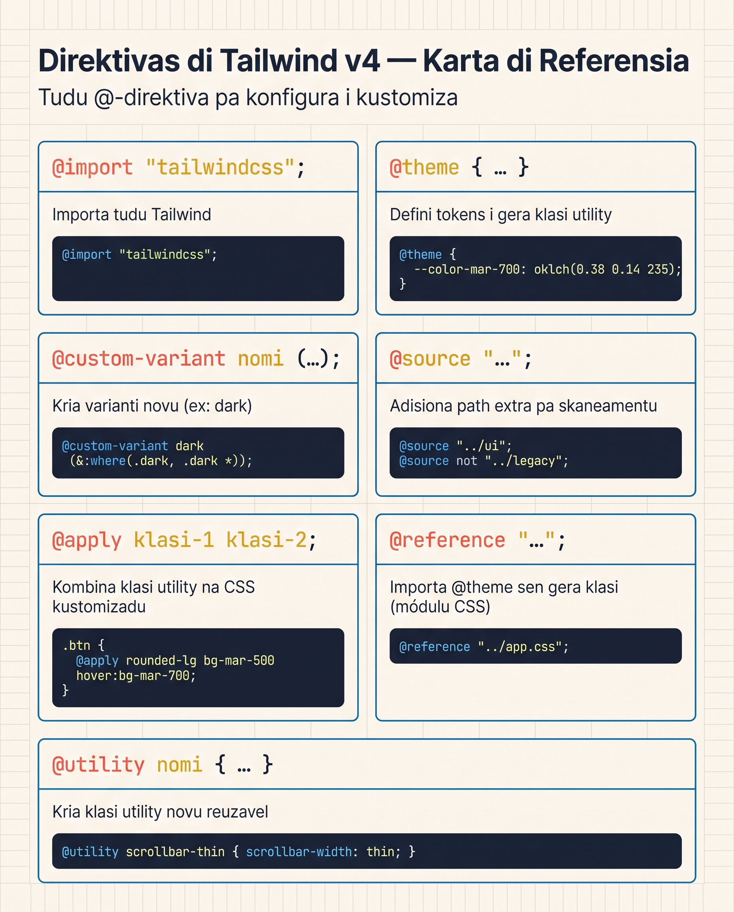

# Direktivas i Funsan v4

`@theme`, `@import`, `@custom-variant` — bo dja konxe es. Es lisan ta kompleta bo **vokabuláriu v4**: tudu direktiva, ki valor ta produzi, i kuandu uza ká kual.

Pensa na es ferramentas kumo **regras spesial di CSS** ki Tailwind ta kompriende. Browser ta ignora-s — só Tailwind ta ler i kompila-s pa CSS verdadeiru.

<SectionHeading variant="concept">Panorama di Direktivas</SectionHeading>



| Direktiva | Funsan | Lisan |
|---|---|---|
| `@import "tailwindcss";` | Karega tudu Tailwind (substitui trez direktivas v3) | Lisan 23 |
| `@theme { ... }` | Defini tokens (kores, fonti, spacing, etc) | Lisan 21, Lisan 24 |
| `@theme inline { ... }` | Defini tokens ki uza `var()` externu | Lisan 24 |
| `@custom-variant nomi (...)` | Kria un variant novu | Lisan 22 |
| `@source "../path"` | Adisiona path extra pa skaneamentu | Lisan 23 |
| `@source not "..."` | Salta path di skaneamentu | Es lisan |
| `@source inline("...")` | Safelist klasi spesífiku | Es lisan |
| `@apply` | Kompoe klasi ku tudu utilidadis dadu | Es lisan |
| `@reference "..."` | Importa tokens sen duplika CSS | Es lisan |
| `@utility nomi { ... }` | Kria un utilidadi personalizadu | Es lisan |
| `@plugin "nomi"` | Karega un plugin (raru) | Es lisan |

<SectionHeading variant="concept" seq={1}>@import — Es Linha é Majika</SectionHeading>

Un só linha karega:

- **Preflight** (CSS reset)
- **Tokens padran** (kores, fonti, breakpoint, etc.)
- **Tudu utilidadi** (`bg-*`, `p-*`, `flex`, etc.)
- **Suporti pa variantis** (`hover:`, `md:`, `dark:`, etc.)

Si bo presiza só un parti, imports parsial ta funsiona:

```css
@import "tailwindcss/preflight";    /* só CSS reset */
@import "tailwindcss/utilities";    /* só klasi utilidade */
@import "tailwindcss/theme";        /* só variavel padraun */
```

**Kuandu uza:** raru. Pa kazu spesífiku tipu "tema mínimu sen reset", uza imports parsial. Pa tudu resta — `@import "tailwindcss";` simples.

<SectionHeading variant="concept" seq={2}>@apply — Funsiona ma Ka Rekomendadu</SectionHeading>

`@apply` ta kompoe un klasi novu ku utilidadis ki bo dja konxe:

```css
.btn-primáriu {
  @apply bg-mar-700 text-white font-semibold rounded-md px-4 py-2;
  @apply hover:bg-mar-800 focus:ring-2 focus:ring-mar-500;
}
```

```html
<button class="btn-primáriu">Reserva gosi</button>
```

Es klasi ta funsiona — ma Tailwind v4 **ka ta rekomenda-l** pa maioria di kazu. Pamodi?

<MisconceptionConfront
  belief="`@apply` é a manera rekomendadu pa reutiliza stilus na Tailwind."
  myth="Kria un klasi ku `@apply` (ex. `.btn-primáriu`) é sénpri midjór ki repeti utilidadis na HTML."
  real="Tailwind é utility-first di propósitu — `@apply` ta torna-bu pa CSS tradisional ku nomis di klasi, i ta da **dos sítius** pa manté (no CSS i no HTML). Komponentes (React/Vue/Svelte) dja ta da-u klasi reutilizavel sen inventa nomis."
  takeaway="Uza `@apply` só kuandu bu realmenti **ka pode** uza un komponenti — ex. kompoe klasi pa HTML jeradu pa un biblioteka di markdown."
/>

:::callout{type=tip}
Uza `@apply` só pa kazu unde bo realmenti **ka pode** uza un komponenti — ex. kompoe klasi pa biblioteka di markdown ki ta gera HTML diretu. Pa resta: skrebe utilidadis no HTML i komponentes na React/Vue.
:::

<SectionHeading variant="concept" seq={3}>@reference — Pa Komponenti Scoped</SectionHeading>

Bo ta skrebe Vue, Svelte, ou CSS Modules? Es uzu style blocks **izoladu** — Tailwind ka ten asesu pa tokens kuandu el ta kompila kel block. Si bo uza `@apply` li, ta da eru.

**Solusan:** `@reference` no topo di style block.

```vue
<!-- KomponentiBotaun.vue -->
<template>
  <button class="botaun-marka"><slot /></button>
</template>

<style scoped>
@reference "../assets/input.css";

.botaun-marka {
  @apply bg-mar-700 text-white px-4 py-2 rounded-md;
}
</style>
```

```css
/* botaun.module.css */
@reference "../assets/input.css";

.botaun {
  @apply bg-mar-700 text-white px-4 py-2 rounded-md;
}
```

**O ki `@reference` ta faze:** ta importa tokens i klasi **só pa konsulta** — sen duplika CSS na output. Sen el, bo ta perde-r tokens, ou — más mau — ta duplika tudu preflight na kada komponenti.

**Regra:** kuandu bo skrebe `@apply` fora di `input.css` prinsipal, bo PRESIZA `@reference` no topu di kel fixeru.

<SectionHeading variant="concept" seq={4}>@source — Adisiona Path di Skaneamentu</SectionHeading>

Tailwind ta skaneia tudu fixeru di kódiku otomátiku — ma só dentru di projetu. Si bo uza un biblioteka di UI na `node_modules/`, klasi di li ka ta sai no output:

```css
@import "tailwindcss";

/* Skaneia un libraria externu */
@source "../node_modules/@minha-libraria/ui";

/* Skaneia un diretóriu jeradu */
@source "../dist";
```

**Variantis novu (v4.1+):**

```css
/* Eskluí un path (ka skaneia) */
@source not "../legado/komponentes";

/* Safelist — forsa klasi a aparecer mesmu si ka ten no kódiku */
@source inline("underline");
@source inline("{hover:,focus:,}bg-mar-{500,700,900}");
```

**Kuandu uza:**
- `@source "..."` — adisiona path fora di projetu
- `@source not "..."` — salta path antigu
- `@source inline(...)` — safelist klasi dinámiku (ex. gera pa API)

<SectionHeading variant="concept" seq={5}>@custom-variant — Re-vizitadu</SectionHeading>

Dja nu odja na Lisan 22 pa modu sukuru:

```css
@custom-variant dark (&:where(.dark, .dark *));
```

Forma jeneral:

```css
@custom-variant nomi (seletor-CSS);
```

Izemplus prátiku:

```css
/* Tema "midnight" — alternativa di dark mode */
@custom-variant midnight (&:where([data-theme="midnight"], [data-theme="midnight"] *));

/* Stado popover aberto */
@custom-variant popover-open (&:popover-open);

/* Estru spesífiku: telefones túchi */
@custom-variant tukabel (@media (hover: none) and (pointer: coarse));
```

Uzu no HTML:

```html
<div class="bg-white midnight:bg-mar-900 tukabel:p-6">
```

<SectionHeading variant="concept" seq={6}>@utility — Kria Utilidadis Personalizadu</SectionHeading>

Si bo presiza un klasi ki **ka izisti** na Tailwind padran (ex. `tab-4` pa `tab-size: 4`), uza `@utility`:

```css
@utility tab-4 {
  tab-size: 4;
}

@utility content-auto {
  content-visibility: auto;
}
```

Uzu:

```html
<pre class="tab-4 hover:content-auto md:tab-4">
```

**Por ke `@utility` i ka `@layer utilities`?**

- `@utility` ta dá suporti otomátiku pa **tudu variantis** (`hover:`, `md:`, `dark:`, `group-*:`, etc.)
- `@layer utilities` (v3) ka tinha esi suporti — klasi ka ta funsiona ku variantis

:::callout{type=tip}
Si bo kre un klasi ki **dja izisti** na Tailwind, **ka uza `@utility`** — só usa direta. `@utility` é pa kaza unde Tailwind ka ten kel utilidadi, ka pa muda nomi di utilidadis padran.
:::

<SectionHeading variant="concept" seq={7}>Funsan v4 — --theme() i --alpha()</SectionHeading>

Tailwind ta mostra **funsan CSS** ki bo pode uza dentru di kualker valor:

### `--theme(...)` — Ler un token

```css
.card {
  background: --theme(--color-mar-100);
  padding: calc(--theme(--spacing) * 4);   /* 4 × --spacing */
}
```

Útil kuandu bo presiza un valor di tema dentru di un regra CSS ki ka é utility — ex. un `@keyframes`:

```css
@keyframes pulsar-mar {
  0%, 100% { background-color: --theme(--color-mar-500); }
  50%      { background-color: --theme(--color-mar-300); }
}
```

### `--alpha(...)` — Aplika transparénsia

```css
.card {
  background: --alpha(--theme(--color-mar-700) / 50%);
}
```

Es é o mesmu ki `bg-mar-700/50` ta gera internamenti, ma uza-l dentru di CSS personalizadu.

:::callout{type=tip}
Es funsan ten prefixu `--` (`--theme`, `--alpha`) — es é intensional, pa ka kolidi ku funsan CSS padran. Es é diferenti di v3 (`theme()` ku parêntesis simple).
:::

<SectionHeading variant="concept" seq={8}>@plugin — Karregamentu di Plugin</SectionHeading>

Pa biblioteka espesializadu (ex. `@tailwindcss/typography`):

```css
@import "tailwindcss";
@plugin "@tailwindcss/typography";
```

Dipos bo pode uza klasi tipu `prose prose-lg`. Sen registru en JS, sen `tailwind.config.js`.

**Plugins komuns:**

| Plugin | Pa ki sirbi |
|---|---|
| `@tailwindcss/typography` | Klasi `prose-*` pa konteúdu markdown/HTML |
| `@tailwindcss/forms` | Reseta di stilus di formuláriu |
| `@tailwindcss/aspect-ratio` | (Dja na núcleu v4 — ka presiza) |

<SectionHeading variant="concept">Izemplu Prátiku — Resort Brava ku Komponentes</SectionHeading>

Vamus reorganiza Resort Brava pa un versan unde boton "Reserva" é un komponenti. Repara kumo un só fixeru `input.css` ta djunta várias direktivas:

<AnnotatedCode
  lang="css"
  filename="input.css"
  title="Várias direktivas na un fixeru só"
  code={[
    { t: '@import "tailwindcss";', m: 1 },
    { t: "", m: 0 },
    { t: "@custom-variant dark (&:where(.dark, .dark *));", m: 2 },
    { t: "", m: 0 },
    { t: "@theme {", m: 3 },
    { t: "  --color-mar-700: oklch(0.38 0.14 235);", m: 0 },
    { t: "  --color-mar-800: oklch(0.30 0.12 235);", m: 0 },
    { t: "  --color-sol-300: oklch(0.85 0.13 75);", m: 0 },
    { t: '  --font-display: "Crimson Pro", serif;', m: 0 },
    { t: "}", m: 0 },
    { t: "", m: 0 },
    { t: ".boton-rezerva {", m: 4 },
    { t: "  @apply bg-sol-300 text-mar-900 font-display font-semibold;", m: 0 },
    { t: "  @apply px-6 py-3 rounded-lg hover:bg-sol-500 transition-colors;", m: 0 },
    { t: "}", m: 0 },
    { t: "", m: 0 },
    { t: "@utility lema-marka {", m: 5 },
    { t: "  font-family: --theme(--font-display);", m: 0 },
    { t: "  background: linear-gradient(", m: 0 },
    { t: "    to bottom,", m: 0 },
    { t: "    --theme(--color-mar-700),", m: 0 },
    { t: "    --theme(--color-mar-800)", m: 0 },
    { t: "  );", m: 0 },
    { t: "  background-clip: text;", m: 0 },
    { t: "  color: transparent;", m: 0 },
    { t: "}", m: 0 },
  ]}
  notes={[
    { m: 1, title: "Karega Tailwind", body: "`@import` ta traze tudu Tailwind — preflight, tokens i utilidadis — na un só linha." },
    { m: 2, title: "Variant novu", body: "`@custom-variant` ta kria o variant `dark:` (nu odja-l na Lisan 22)." },
    { m: 3, title: "Tokens", body: "`@theme` ta defini os tokens (`--color-mar-700`, `--font-display`) ki ta vira klasis." },
    { m: 4, title: "Klasi kompozit", body: "`@apply` ta kompoe un klasi reutilizavel ku utilidadis ki dja izisti." },
    { m: 5, title: "Utilidadi novu", body: "`@utility` ta kria un utilidadi ku CSS gradienti — ku suporti pa variantis. `--theme(...)` ta ler os tokens dentru di kel regra." },
  ]}
/>

```html
<h2 class="lema-marka text-4xl">Ben-vindu na Brava</h2>
<button class="botaun-rezerva">Reserva Agora</button>
```

<SectionHeading variant="concept">Repete pa Lembra: Direktivas v4</SectionHeading>

Odja kada direktiva i tenta lembra o ki el ta faze antis di vira o karton:

<Flashcard
  showHeader={false}
  deckId="tailwind-v4-direktivas"
  cards={[
    { term: '@import "tailwindcss";', def: "Karega tudu Tailwind — preflight, tokens i utilidadis. Substitui trez direktivas di v3." },
    { term: "@theme { }", def: "Defini tokens (kores, fonti, spacing) ki ta vira klasis di utilidadi." },
    { term: "@apply", def: "Kompoe un klasi ku utilidadis ki dja izisti. Funsiona, ma evita — prefire komponentes." },
    { term: "@reference", def: "Importa tokens só pa konsulta na komponenti scoped (Vue, Svelte, CSS Modules), sen duplika CSS." },
    { term: "@source", def: "Adisiona un path extra pa Tailwind skaneia, ex. un libraria na node_modules." },
    { term: "@custom-variant", def: "Kria un variant novu, sima dark ou popover-open." },
    { term: "@utility", def: "Kria un utilidadi personalizadu ku suporti pa tudu variantis." },
    { term: "--theme()", def: "Ler un token di tema dentru di CSS personalizadu." },
    { term: "--alpha()", def: "Aplika transparénsia a un kor dentru di CSS personalizadu." },
    { term: "@plugin", def: "Karega un plugin, ex. @tailwindcss/typography, sen konfigurason JS." },
  ]}
/>

<SectionHeading variant="practice">Tenta Gosi</SectionHeading>
<TentaGosi showHeader={false} />

<SectionHeading variant="quiz">Verifika Bo Kunhesimentu</SectionHeading>
<QuizSet showHeader={false}>
  <Quiz position={0} />
  <Quiz position={1} />
  <Quiz position={2} />
</QuizSet>

<SectionHeading variant="summary">Rezumu</SectionHeading>
<KeyTakeaways showHeader={false}>
  <RezumuItem variant="gold" term="@apply" code>funsiona ma **evita** — el ta rompe utility-first. Komponentes (React/Vue) é a forma rekomenda pa reutiliza stilus.</RezumuItem>
  <RezumuItem term="@import" code>un só linha ta karega tudu Tailwind — substitui trez direktivas di v3.</RezumuItem>
  <RezumuItem term="@source" code>ta adisiona path (`@source`), salta (`@source not`) ou safelist (`@source inline()`).</RezumuItem>
  <RezumuItem term="@custom-variant" code>ta kria variantis novu (dark mode, popover-open, etc.).</RezumuItem>
  <RezumuItem term="--theme() i --alpha()">ta da-u asesu pa tokens dentru di CSS personalizadu.</RezumuItem>
  <RezumuItem variant="warning" term="@reference" code>obrigatóriu kuandu bu uza `@apply` na Vue/Svelte/CSS Modules — sen el, ta da eru ou ta duplika CSS.</RezumuItem>
  <RezumuItem variant="tip" term="@utility" code>ta kria klasi novu ku suporti pa **tudu variantis** — diferenti di o v3 `@layer utilities`.</RezumuItem>
</KeyTakeaways>
