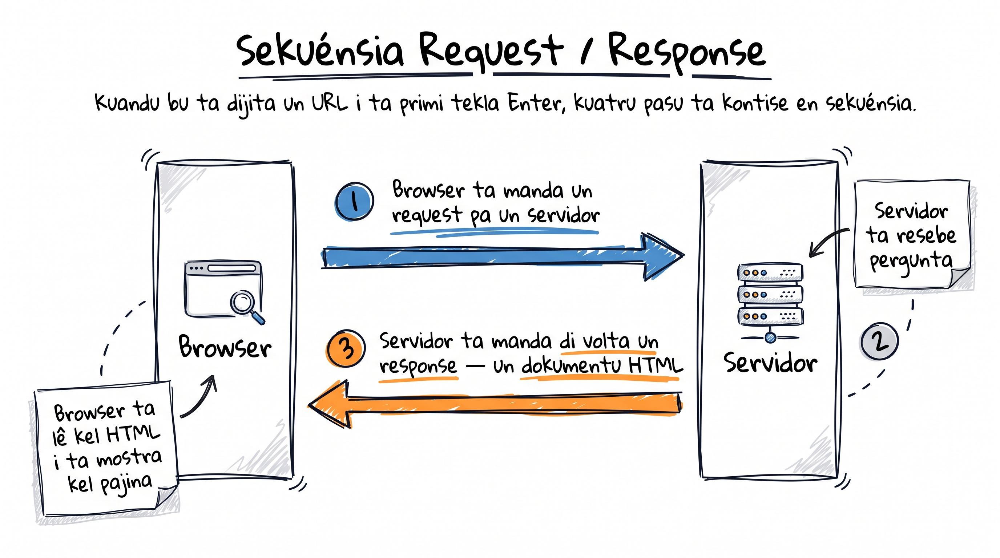

# Kumo Web ta funsiona

Tudu website ki bu ta vizita — di **nosilha.com** ate pajina di Facebook ki bu ta uza — é fetu ku trez linguajen: HTML, CSS i JavaScript. Na es kursu, bu ta aprende kel dos primeru, ki é fundasan di tudu kuza ki ta korre na un browser.

## Request → response

Antis di bu skrebe un linha di kódiku, bu ten ki ten un mental model klaru di kuze ki ta akontese kuandu bu ta abri un website.

<GlossaryText
  text="Kuandu bu ta dijita un [[URL]] — enderesu di un website, kumo `nosilha.com` — na bu browser i ta primi Enter, **kuatru kuza ta akontese en sekuénsia**, kuazi instantáneu. Bu **browser** ta manda un [[request]] pa un [[servidor]] — un komputador algures na mundu ki ten kel website gravadu. Servidor ta resebe pergunta i ta manda di volta un [[response]]: un dokumentu HTML. Pa fin, bu browser ta [[parse]] kel HTML i ta dezenha pajina na bu tela."
  terms={{
    URL: { en: "URL", definition: "Enderesu di un pajina web — kel ki bu ta dijita na browser, kumo nosilha.com." },
    request: { en: "request", definition: "Pergunta ki browser ta manda pa servidor pa pidi un pajina ou rekursu." },
    servidor: { en: "server", definition: "Komputador sempri ligadu ki ta sirvi website i ta responde pa request di browser." },
    response: { en: "response", definition: "Repostu ki servidor ta manda di volta — pa un pajina web, é un dokumentu HTML." },
    parse: { en: "parse", definition: "Le i interpreta kódiku HTML pa transforma-l na pajina vizual." },
  }}
/>

## Internet ka é Web

Un konfuzan kumun: txeu algen ta pensa ki "internet" i "web" é mesmu kuza. Es ka é.

:::callout{type=tip}
**Internet** i **Web** é ka mesmu kuza. Internet é infrastrutura — kabu, sinal di rádiu i protokolu ki ta liga tudu komputador di mundu. Web é un kamada en sima di internet, fetu di pajina HTML ligadu un ku otru via link. Email i WhatsApp ta uza internet, ma es ka é parti di Web.
:::

## Kada linguajen ku se responsabilidadi

Kada pajina web ta djunta trez linguajen. Pensa na es moda trez kamada di mesmu kuza:

<ConceptDiagram
  showHeader={false}
  areas={[
    { label: "HTML", sub: "Konteúdu — substantivu di pajina (titulu, paragrafu, imajen)", icon: "code", accent: "blue" },
    { label: "CSS", sub: "Stilu — adjetivu (kor, tamanhu, pozisan)", icon: "layout", accent: "teal" },
    { label: "JavaScript", sub: "Lojika — verbu (kuandu bu klika, algu ta akontese)", icon: "cpu", accent: "orange" },
  ]}
/>

Es kursu ta foka HTML i CSS. JavaScript ta ben dispós, na un kursu separadu (`intro-javascript`).

:::callout{type=tip}
HTML **é ka un "programming language"** — é un *markup language*. Ta marka konteúdu; ka ten lojika nen kondisional.
:::

## Front-end i back-end

Kada bez ki bu ta uza un website, ten dos ladu envolvidu:

- **Front-end** é tudu kuza ki ta korre na bu browser: HTML, CSS, JS. É kuza ki bu ta odja i ta klika.
- **Back-end** é tudu kuza ki ta korre na servidor: bazi di dadus, lojika di autentifikasan, kalkulu. Bu ka ta odja-l, ma sen el website ka ta funsiona.

Kuandu bu ta entra na bu konta di banku, front-end (HTML/CSS) ta mostra-bu un formuláriu di login. Bu username i password ta bai pa back-end ki ta verifika es i ta manda di volta bu saldo.

## Website statiku vs website dinámiku

<CompareTable
  showHeader={false}
  cornerLabel="Kritériu"
  cols={[
    { name: "Statiku", accent: "blue" },
    { name: "Dinámiku", accent: "orange" },
  ]}
  rows={[
    { label: "Konteúdu", kind: "text", vals: ["Mesmu pa tudu kel ki ta vizita", "Ta muda konformi kel ki sta ligadu"] },
    { label: "Presiza back-end?", kind: "bool", vals: [false, true] },
    { label: "Izemplu", kind: "text", vals: ["Landing page di un restoranti na Mindelo", "Bu feed di Facebook"] },
    { label: "Linguajen", kind: "text", vals: ["So HTML i CSS", "HTML, CSS **i** JavaScript + back-end"] },
  ]}
/>

Tudu kuza ki nu ta konstrui na es kursu é statiku. É fundasan di tudu framework moderno (React, Vue, Next.js).

<SectionHeading variant="practice">Tenta gosi</SectionHeading>
<TentaGosi showHeader={false} />

<SectionHeading variant="quiz">Testa bu konhesimentu</SectionHeading>
<QuizSet showHeader={false}>
  <Quiz position={0} />
  <Quiz position={1} />
  <Quiz position={2} />
  <Quiz position={3} />
  <Quiz position={4} />
</QuizSet>

<SectionHeading variant="summary">Rezumu</SectionHeading>
<KeyTakeaways showHeader={false}>
  <RezumuItem term="Request / response">Browser ta manda un request; servidor ta manda di volta un response — kel response é HTML.</RezumuItem>
  <RezumuItem term="Trez linguajen" variant="gold">HTML é konteúdu, CSS é stilu, JavaScript é lojika.</RezumuItem>
  <RezumuItem term="Front vs back">Front-end ta korre na browser; back-end ta korre na servidor.</RezumuItem>
  <RezumuItem term="Statiku vs dinámiku">Statiku = mesmu pa tudu vizitanti; dinámiku = ta muda pa kada uzuáriu.</RezumuItem>
  <RezumuItem term="Internet ≠ Web" variant="warning">Internet é rede (infrastrutura); Web é un kamada en sima, fetu di pajina HTML — ka konfundi-s.</RezumuItem>
  <RezumuItem term="Fundasan" variant="tip">Es kursu ta foka statiku ku HTML i CSS — fundasan di tudu framework moderno (React, Vue, Next.js).</RezumuItem>
</KeyTakeaways>
