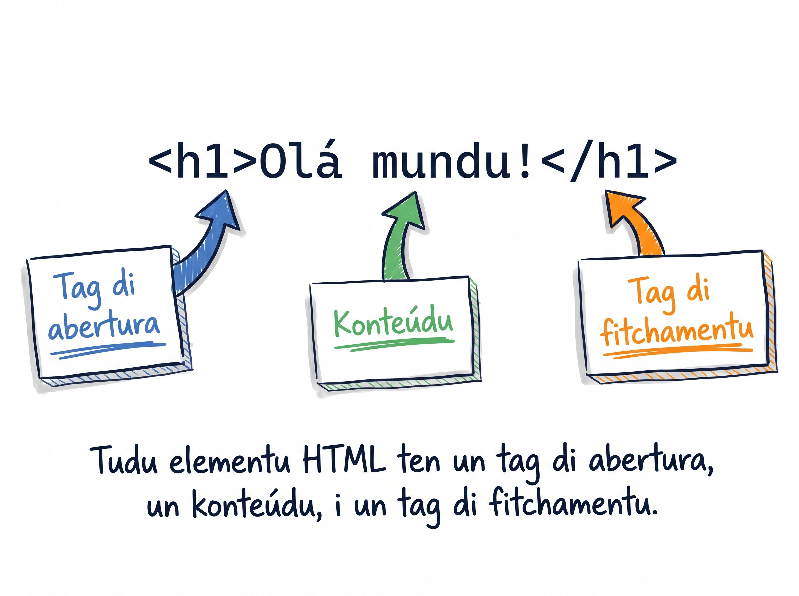

# Kria bu primeru pajina HTML

Gosi nu ta pasa pa prátika: bu ta skrebe bu primeru kódiku HTML i odja rezultadu diretu na browser. É un pasu inportanti ki ta marka inísiu di kaminhada di kualker dezenvolvedor web.

<SectionHeading variant="concept">Emmet — scaffolding instantáneu</SectionHeading>

<GlossaryText
  text="VS Code ten un ferramenta interna xamadu [[Emmet]] ki ta [[scaffold]] HTML pa bo: skrebe `!` i primi Tab."
  terms={{
    "Emmet": { en: "Emmet", definition: "Un ferramenta na VS Code ki ta spandi atalhu kurtu na kódiku HTML/CSS kompletu." },
    "scaffold": { en: "scaffold", definition: "Jera otomatikamenti strutura baz di un ficheru, pa bu ka ten ki skrebe-l tudu na mon." },
  }}
/>

Emmet ta scaffold tudu skeleton di HTML5. Ben nu odja, linha-pa-linha, kuze ki kada parti ta faze:

<AnnotatedCode
  lang="html"
  filename="index.html"
  title="Le skeleton linha-pa-linha"
  code={[
    { t: "<!DOCTYPE html>", m: 1 },
    { t: '<html lang="en">', m: 2 },
    { t: "<head>", m: 3 },
    { t: '  <meta charset="UTF-8" />', m: 4 },
    { t: '  <meta name="viewport" content="width=device-width, initial-scale=1.0" />', m: 0 },
    { t: "  <title>Document</title>", m: 5 },
    { t: "</head>", m: 0 },
    { t: "<body>", m: 6 },
    { t: "", m: 0 },
    { t: "</body>", m: 0 },
    { t: "</html>", m: 0 },
  ]}
  notes={[
    { m: 1, title: "DOCTYPE", body: "`<!DOCTYPE html>` ta fra pa browser «es é HTML5»." },
    { m: 2, title: "Elementu root", body: '`<html lang="en">` é root element di tudu pajina. `lang="en"` ta indika screen readers ki testu sta na inglés (nu ta muda-l pa `kea` mas tardi).' },
    { m: 3, title: "Kabésa (head)", body: "`<head>` ta karega **metadata**: ka é konteúdu visivel, el ta leba informason sobri pajina (titulu, charset, link pa CSS)." },
    { m: 4, title: "charset", body: "`<meta charset=\"UTF-8\" />` ta garante ki karater spesial (sima `á`, `é`, `ô`, `ñ`) ta parse dretu. **Krítiku pa Kriolu i Portuguez.**" },
    { m: 5, title: "Títulu", body: "`<title>` é kel ki ta parse na tab di browser i na rezultadu di Google. El é fundamiental pa SEO (modi ki bu pajina ta rankia)." },
    { m: 6, title: "Korpu (body)", body: "`<body>` — tudu konteúdu visivel di pajina ta vai li dentu." },
  ]}
/>

:::callout{type=tip}
Emmet ta skrebe `lang="en"` automatikamenti. Ma bu pajina sta na Kriolu — troka-l pa `lang="kea"`. Na Lisan 4 nu ta faze-l na mon i splika pamodi.
:::

<SectionHeading variant="concept">Anatomia di un element</SectionHeading>

Tudu kuza ki bu ta skrebe entri `<body>` i `</body>` é un **element**. Kada element ten trez parti:

- **Opening tag** — abertura, ku nome di element entri `<` i `>`. Ex: `<h1>`.
- **Konteúdu** — testu (ou otru element) entri tag.
- **Closing tag** — fechu, ku barra antis di nome. Ex: `</h1>`.

Djunta tudu: `<h1>Olá mundu!</h1>`.

Es é so un primeru odjada na elementu — na Módulu 2 nu ta entra fundu na tag, atributu i strutura.

<SectionHeading variant="practice">Tenta ao vivu</SectionHeading>

<LivePreview
  storageKey="web-foundations-03-kria"
  html={"<h1>Olá, mi é Adilson!</h1>\n
N ta mora na <strong>Praia</strong>, na ilha di Santiago. N ta studa pa bira un dezenvolvedor web.
\n
Trez kuza ki N ta gosta: <em>tira foto</em>, <em>múzika</em>, i <em>txeu sol</em>.
"}
  showHeader={true}
  eyebrow="Tenta ao vivu"
  title="Edita HTML i odja rezultadu gosi mesmu!"
/>

<Steps
  variant="phases"
  showHeader={true}
  title="Faze-l na bu komputador"
  phaseWord="Pasu"
  chrome="inline"
  showAccentRule={false}
  steps={[
    {
      title: "Kria i salva ficheru",
      content: [
        { type: "prose", t: "Na VS Code, ku bu pasta `web-foundations` abertu, klika **File → New File**." },
        { type: "prose", t: "Salva ficheru imediatamenti ku `Cmd+S` / `Ctrl+S` i da-l nomi `index.html`." },
        { type: "callout", sev: "info", t: "Pamodi `index.html`? Servidor web ta sempri prokura un ficheru xamadu `index.html` kuandu un uzuáriu ta vizita un pasta." }
      ]
    },
    {
      title: "Jera strutura HTML5",
      content: [
        { type: "prose", t: "Na ficheru `index.html` vaziu, skrebe so `!` (esklamasan) i primi **Tab** pa Emmet jera skeleton." }
      ]
    },
    {
      title: "Skrebe primeru konteúdu",
      content: [
        { type: "prose", t: "Muda `<title>Document</title>` pa `<title>Pajina di Adilson</title>`." },
        { type: "prose", t: "Kopia kódiku di playground `Tenta ao vivu` na riba i kola dentru di `<body>`." },
        { type: "prose", t: "Salva (`Cmd+S` / `Ctrl+S`) — Prettier ta indenta tudu dretu." }
      ]
    },
    {
      title: "Abri pajina na browser",
      content: [
        { type: "prose", t: "Na Explorer di VS Code (skerda), klika ku boton direitu na `index.html`." },
        { type: "prose", t: "Skodje **Open with Live Server** (ou klika **Go Live** na status bar baixu)." },
        { type: "prose", t: "Chrome ta abri automatikamenti na URL `http://localhost:5500/index.html`." }
      ]
    }
  ]}
/>

Bu ta odja:

- Titulu grandi: **Olá, mi é Adilson!**
- Dos paragrafu, ku palavra "Praia" na bold i trez palavra en itáliku.
- Tab di browser ta mostra **"Pajina di Adilson"**.

:::callout{type=tip}
Live Server ten un truk ki ta da gostu: kada bez ki bu salva `index.html`, browser ta refresh sozinhu. Tenta-l — muda `Olá` pa `Bon dia`, salva, i odja browser atualiza imediatamenti.
:::

<TentaGosi showHeader={true} chrome="inline" />

Responde di kabésa antis di bu kontinua.

<QuizSet showHeader={true} chrome="inline">
  <Quiz position={0} />
  <Quiz position={1} />
  <Quiz position={2} />
  <Quiz position={3} />
  <Quiz position={4} />
</QuizSet>

## Erus kumuns

- **Salva ficheru sen `.html`** — ta bira un text file simples i ka ta parse na browser.
- **Da otru nomi ki ka é `index.html`** — ta funsiona lokal (Live Server ta abri kualkér ficheru), ma na un servidor real, konvensan é sempri `index.html`.
- **Skise `<meta charset="UTF-8" />`** — palavra ku asentu sima "São Vicente" ta parese `São Vicente` ou `S?o Vicente`.

<KeyTakeaways showHeader={true} chrome="inline">
  <RezumuItem term="index.html">Nomi ofisial pa pajina di entrada di un website.</RezumuItem>
  <RezumuItem term="Emmet">`!` + Tab ta scaffold tudu skeleton di HTML5 nun klik.</RezumuItem>
  <RezumuItem term="Element" variant="gold">Kada element ten opening tag, konteúdu i closing tag: `<h1>...</h1>`.</RezumuItem>
  <RezumuItem term="Salva ku .html" variant="warning">Sen extension `.html`, ficheru ta bira text simples i ka ta parse na browser.</RezumuItem>
  <RezumuItem term="Live Server">Ta abri pajina na browser i ta atualiza el ku kada save.</RezumuItem>
  <RezumuItem term="charset" variant="tip">`<meta charset="UTF-8" />` é krítiku pa karater spesial di Kriolu i Portuguez.</RezumuItem>
</KeyTakeaways>
