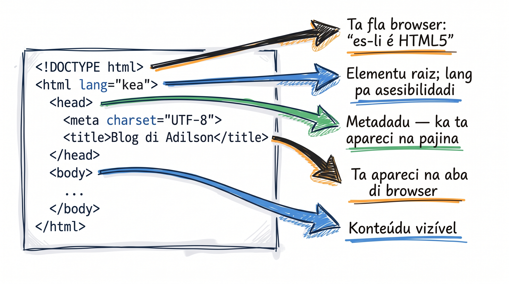

# Strutura di un dokumentu HTML

Na lisan pasadu, Emmet jera kel skeleton interu pa bo. Gosi nu ta ben konxe kada parti pa bu intende kuze ki bu sta skrebe.

## Skeleton HTML5 — na mon

Kria un ficheru novu `blog.html` (na mesmu pasta di `index.html`). Es bez, ka bu uza Emmet — bu ta skrebe skeleton na mon, linha pa linha:

```html
<!DOCTYPE html>
<html lang="kea">
  <head>
    <meta charset="UTF-8" />
    <title>Blog di Adilson</title>
  </head>
  <body>
    <!-- Konteúdu visivel ta vai li -->
  </body>
</html>
```

Skrebe-l dibagar i, pa kada linha, fla na voz altu kuze ki el ta faze. Kopia i kola ka ta trena memória muskular.

## Kada parti, splikadu

<AnnotatedCode
  lang="html"
  filename="blog.html"
  title="Kada linha di skeleton, splikadu"
  code={[
    { t: "<!DOCTYPE html>", m: 1 },
    { t: '<html lang="kea">', m: 2 },
    { t: "  <head>", m: 3 },
    { t: '    <meta charset="UTF-8" />', m: 4 },
    { t: "    <title>Blog di Adilson</title>", m: 5 },
    { t: "  </head>", m: 0 },
    { t: "  <body>", m: 6 },
    { t: "    <!-- Konteúdu visivel ta vai li -->", m: 0 },
    { t: "  </body>", m: 0 },
    { t: "</html>", m: 0 },
  ]}
  notes={[
    { m: 1, title: "Skrebe-l na mon", body: "Na Lisan 3 Emmet ta jera es linha pa bu; gosi bu ta skrebe-l. `<!DOCTYPE html>` ta indika browser ki é **HTML5** — sen el, ta entra na modu quirks i layout ta kebra." },
    { m: 2, title: 'lang="kea", ka "en"', body: 'Emmet ta po `lang="en"` automatikamenti. Na mon, skrebe `lang="kea"` — bu pajina sta na Kriolu, i screen reader ta uza-l pa pronunsia dretu.' },
    { m: 3, title: "head — recap", body: "Kumo bu odja na Lisan 3: `<head>` é metadata invizivel. Nada ki sta la dentru ta parse na pajina." },
    { m: 4, title: "charset — un void element", body: '`<meta charset="UTF-8" />` ka ten closing tag (un **void element** — odja mas baxu). Sen el, `São Vicente` ta parse `São Vicente`. Po-l kumo primeru linha di `<head>`.' },
    { m: 5, title: "title", body: "Nomi na tab di browser i na rezultadu di Google. Skrebe-l klaru i deskritivu." },
    { m: 6, title: "body", body: "Tudu konteúdu visivel ta vai dentru di `<body>`." },
  ]}
/>

:::callout{type=tip}
Skrebe sempri `<!DOCTYPE html>` ku letra minúskula pa `html`. Forma kumo `<!DOCTYPE HTML5>` ou `<!DOCTYPE>` ka é válidu — browser ka ta da-bu eru, ma el ta volta pa *quirks mode* sen fla nada.
:::



## Container vs void elements

Na Lisan 3 bu prende ki kada elementu ten **opening tag**, **konteúdu**, i **closing tag** — kumo `<p>Olá!</p>`. Un elementu ki ten konteúdu dentru asin é un **container element**.

Ma ka é tudu elementu ki ta sigi es forma. **Void elements** ka ten konteúdu nen closing tag — es é so opening tag (kumo `<meta charset="UTF-8" />` ki bu skrebe la riba):

- `<br />` — kebra di linha
- `<hr />` — linha orizontal di divizan
- `` — imajen (lisan 6)
- `<meta />` — metadata
- `<link />` — referensia pa ficheru externu

Void elements ka ten closing tag. Spesifikasan di HTML5 ta permiti dos forma:

- `<br>` (sen barra)
- `<br />` (ku barra — XHTML-style)

Bu pode uza kualkér forma. Es kursu ta uza `<br />` ku barra pa konsistensia ku ferramenta di formatasan kumo Prettier.

## Indentasan: konfortu di leitura

Browser ka ta preokupa ku spasu extra ou kebra di linha. Kes trez forma li ta da mesmu rezultadu:

```html
<p>Olá</p>
```

```html
<p>
  Olá
</p>
```

```html
<p>     Olá   </p>
```

Ma pa **bu** (i kel ki ta le bu kódiku mas tardi), indentasan ta da tudu. Konvensan: 2 spasu pa kada nivel di nesting. Prettier ta faze-l pa bu automatikamenti.

## Erus komun pa evita

- **Skise `<meta charset="UTF-8" />`** — palavra ku asentu ta parse kodifikadu mariadu (`São Vicente`, `pa?xa`).
- **`<!DOCTYPE HTML5>` ou `<!DOCTYPE>`** — ka é válidu. Sempri `<!DOCTYPE html>`, letra minúskula pa `html`.
- **Konteúdu dentru di `<head>`** — kuza visivel kumo `<h1>` ka ta parse si el sta na `<head>`.
- **`lang` ka definidu** — screen reader ta asumi inglés i ta pronunsia palavra Kriolu eradamenti.

<TentaGosi showHeader={true} chrome="inline" />

<QuizSet showHeader={true} chrome="inline">
  <Quiz position={0} />
  <Quiz position={1} />
  <Quiz position={2} />
  <Quiz position={3} />
</QuizSet>

<KeyTakeaways showHeader={true} chrome="inline">
  <RezumuItem term="Skeleton HTML5">Sinku parti: `<!DOCTYPE>`, `<html>`, `<head>`, `<title>`, `<body>`.</RezumuItem>
  <RezumuItem term="head vs body">`<head>` ten metadata invizivel; `<body>` ten konteúdu visivel.</RezumuItem>
  <RezumuItem term="charset UTF-8" variant="warning">`<meta charset="UTF-8" />` é krítiku pa palavra ku asentu Kriolu i Portuguez — sen el, `São` ta parse `São`.</RezumuItem>
  <RezumuItem term="lang=kea">`lang="kea"` ta indika browser i screen reader ki konteúdu sta na Kriolu.</RezumuItem>
  <RezumuItem term="Void elements" variant="gold">Element sen konteúdu (`<br />`, `<hr />`, ``, `<meta />`) ten so opening tag.</RezumuItem>
</KeyTakeaways>
