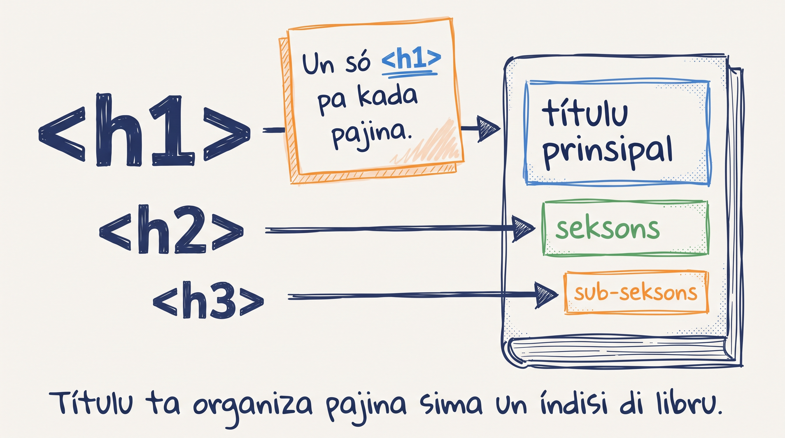

# Elementus di testu: titulu, paragrafu, lista

Bu sta ta ben skrebe un blog post sobre **Cesária Évora**, reina di morna. Pa bu faze-l dretu, bu ten ki sabe marka kada parti di testu ku element korretu.

## Hierarkia di titulu: `<h1>` ti `<h6>`

HTML ten seis nivel di titulu, `<h1>` (mas grandi) ti `<h6>` (mas pikinoti).

- `<h1>` — titulu prinsipal di pajina (so **un** pa pajina inteiru!)
- `<h2>` — titulu di seksan grandi
- `<h3>` — sub-seksan
- `<h4>`, `<h5>`, `<h6>` — usadu raramenti, so pa hierarkia bem fundu

Pensa na el kumo índisi di un livru: kapítulu (`<h1>`), seksan (`<h2>`), sub-seksan (`<h3>`).



:::callout{type=tip}
**Regra di ouro: so un `<h1>` pa pajina.** Es é regra di SEO (Google ta uza-l pa intende tópiku prinsipal) i di asesibilidadi (screen reader ta uza-l pa anunsia título di pajina). Si bu presiza mas titulu na mesmu nivel visual, uza `<h2>` ou klases CSS pa imita tamanhu.
:::

## Paragrafu i énfasi

### `<p>` — paragrafu

Kuandu bu ten un blokku di testu, marka el ku `<p>`. Kada paragrafu é un `<p>` separadu.

```html
<p>Cesária Évora nase na Mindelo, ilha di São Vicente, na 1941.</p>
<p>El kanta morna pa mas di sinkuenta anu i ganha Grammy na 2004.</p>
```

### `<strong>` vs `<b>`, `<em>` vs `<i>`

HTML ten **dos paris** di element ki ta parese mesmu visualmenti, ma ki ten signifikadu diferenti:

| Element | Semantika | Parese |
|---|---|---|
| `<strong>` | "Es testu é importanti" | **Negritu** |
| `<b>` | "So poi-l en negritu, sen signifikadu" | **Negritu** |
| `<em>` | "Es testu ten énfasi" | *Itáliku* |
| `<i>` | "So poi-l en itáliku, sen signifikadu" | *Itáliku* |

**Sempri prefere forma semántika** (`<strong>`, `<em>`). Screen reader ta da-l intonasan apropriada; Google ta uza-l pa peso na SEO. `<b>` i `<i>` ta sirvi so pa kazu tipográfiku spesífiku (nomi di livru, termu strangeru).

## Lista

Web é fetu di lista. Menu di navegasan, lista di kompras, pasu di un tutorial — tudu é lista.

### `<ul>` — un-ordenadu (bullet points)

Uza kuandu **ordi ka ta importa**:

```html
<ul>
  <li>Lápis</li>
  <li>Káderno</li>
  <li>Borracha</li>
</ul>
```

Parse kumo:

- Lápis
- Káderno
- Borracha

### `<ol>` — ordenadu (numeradu)

Uza kuandu **ordi ta importa** (resipi, instrusan, ranking):

```html
<ol>
  <li>Ferve agua.</li>
  <li>Adisiona arroz.</li>
  <li>Mexe i tampa.</li>
</ol>
```

Parse kumo:

1. Ferve agua.
2. Adisiona arroz.
3. Mexe i tampa.

### Pai i fidju

`<ul>` (ou `<ol>`) é **parent**; kada `<li>` é **child**. Es relasan ta importa kuandu nu ta xega na CSS — bu ta pode skrebe selector kumo `ul li` pa stila itens.

## Kometáriu HTML

Kuandu bu ten ki anota algu pa **bu propi** (ou pa otru dezenvolvedor) sen ki ta parese na pajina, uza kometáriu:

```html
<!-- Es seksan ta lista diskus famozu di Cesária -->
<h2>Diskus mas famozu</h2>
```

Kometáriu HTML ka ta parse. Es ta sirvi tambén pa "diskonekta" temporariamenti un blokku di kódiku sen apaga-l:

```html
<!--
  <p>Es paragrafu ka ta parese, ma sta li pa testi mas tardi.</p>
-->
```

## Prátika: blog di Cesária Évora

Kria un ficheru novu, `cesaria.html`, ku skeleton HTML5 (kumo lisan 4). Dentru di `<body>`, konstrui un blog post kompletu:

```html
<h1>Cesária Évora — Reina di Morna</h1>

<p>
  Cesária Évora nase na <strong>Mindelo</strong>, na ilha di
  <em>São Vicente</em>, na 27 di Agostu di 1941.
</p>

<p>
  El ta txomadu "<em>diva di pe diskaltsu</em>" pamodi el ta sempri
  kanta na palku <strong>sen sapatu</strong>.
</p>

<p>
  Na 2004, el ganha <strong>Grammy Award</strong> pa Best
  Contemporary World Music Album ku diski "Voz d'Amor".
</p>

<h2>Diskus mas famozu</h2>

<ol>
  <li>Miss Perfumado (1992)</li>
  <li>Cabo Verde (1997)</li>
  <li>Café Atlantico (1999)</li>
  <li>São Vicente di Longe (2001)</li>
  <li>Voz d'Amor (2003)</li>
</ol>

<h2>Razan pa skuta-l</h2>

<ul>
  <li>Voz roukenha i marcanti, úniku na mundu</li>
  <li>Letras profundu sobre saudadi i emigrasan</li>
  <li>Riprezentasan di Kabu Verdi na palku internasional</li>
  <li>Stilu di kantar diskaltsu — simbolu di humilidadi</li>
</ul>

<!-- Byline -->
<p><em>Skrebedu pa Djamila Tavares.</em></p>
```

Salva i abri ku Live Server. Bu ta odja titulu grandi, dos seksan ku titulu di nivel dos, lista numeradu di sinku diski, i lista ku kuatru bullet point.

## Erus komun pa evita

- **Mas di un `<h1>` na pajina** — ta kebra SEO i asesibilidadi. Si bu ten dúvida, ten so un.
- **Skesi closing tag** — si bu po `<strong>importanti<p>` (skesi `</strong>`), tudu kuza dispós ta sta en negritu ti fim di dokumentu. DevTools (Chrome) ta mostra eru.
- **Uza `<b>` i `<i>` kuandu bu ta keria signifikadu** — `<strong>` i `<em>` é forma korreta. Es ta parese mesmu, ma semantika é diferenti.
- **Lista sen `<li>`** — `<ul><strong>kuza</strong></ul>` ka é HTML válido. Tudu item di lista ten ki sta dentru di un `<li>`.

<SectionHeading variant="practice">Tenta gosi</SectionHeading>
<TentaGosi showHeader={false} />

<SectionHeading variant="quiz">Testa bu konhesimentu</SectionHeading>
<QuizSet showHeader={false}>
  <Quiz position={0} />
  <Quiz position={1} />
  <Quiz position={2} />
  <Quiz position={3} />
</QuizSet>

<SectionHeading variant="summary">Rezumu</SectionHeading>
<KeyTakeaways showHeader={false}>
  <RezumuItem term="Hierarkia di titulu" variant="gold">`<h1>` (uniku) → `<h2>` (seksan) → `<h3>` (sub-seksan).</RezumuItem>
  <RezumuItem term="strong vs b" variant="warning">Pa testu ku **signifikadu** di importansia: `<strong>` (ka `<b>`).</RezumuItem>
  <RezumuItem term="em vs i">Pa testu ku énfasi: `<em>` (ka `<i>`).</RezumuItem>
  <RezumuItem term="Lista ka-ordenadu">`<ul>` ku `<li>` dentru — kuandu ordi ka ta importa.</RezumuItem>
  <RezumuItem term="Lista ordenadu">`<ol>` ku `<li>` dentru — kuandu ordi ta importa.</RezumuItem>
  <RezumuItem term="Kometáriu">`<!-- ... -->` — ka ta parse na pajina.</RezumuItem>
</KeyTakeaways>
