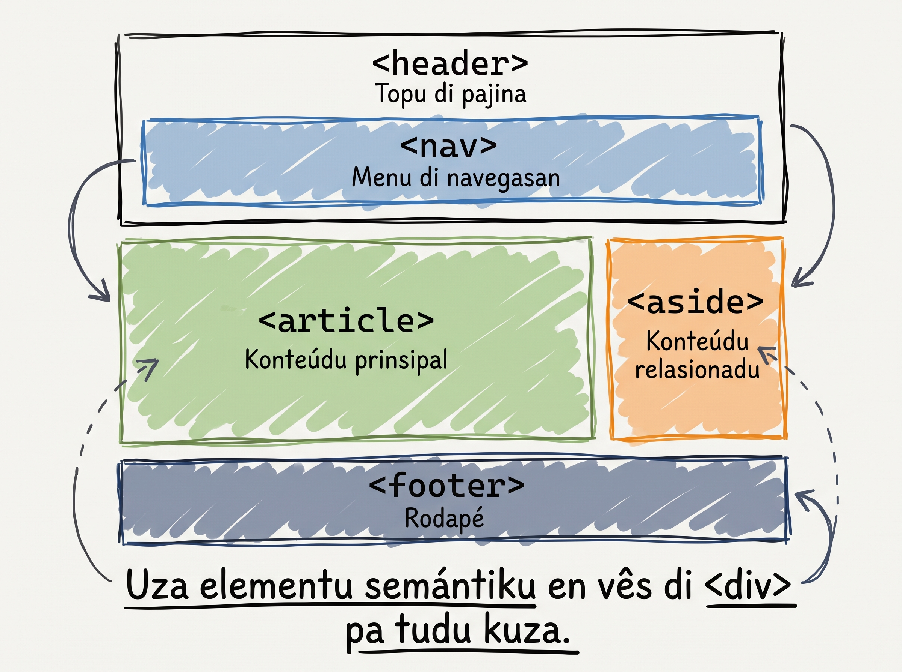

# HTML semantiku

Ti gosi, blog é un monton di tag. Pa screen reader, pa Google, ou pa un dezenvolvedor ki nunka odja bu kódiku, kel é un dokumentu opaku. **Semantic HTML** é kumo nu ta da-l strutura ki kualkér komputador ta konsigui intende.

## `<div>` vs element semántika

Ten un element jeneriku ki ta sirvi so pa **grupar** kuza: `<div>`.

```html
<div>
  <div>...</div>
  <div>...</div>
</div>
```

El ka ta diz **nada** sobre kuze ki ta sta dentru. Pa browser, é so un kaixa.

HTML5 trazi un familia di element **semántika** ki ta diz pa **kualkér komputador** kuze ki é kada parti:

| Element | Signifikadu |
|---|---|
| `<header>` | Topu di pajina ou topu di un artigu |
| `<nav>` | Navegasan — link prinsipal di website |
| `<main>` | Konteúdu prinsipal i úniku di pajina |
| `<article>` | Konteúdu independenti (blog post, karton di produtu) |
| `<aside>` | Konteúdu sekundáriu (sidebar, "artigu relasionadu") |
| `<footer>` | Pé di pajina ou pé di un artigu |



:::callout{type=tip}
`<header>` i `<footer>` ka é so pa pajina inteiru. Es ta funsiona dentru di kualkér container. Un `<article>` pode ten **se propi** `<header>` (ku titulu i data) i **se propi** `<footer>` (ku author byline). Pensa na es kumo "topu" i "pé" di kualkér seksan.
:::

## Pamodi semantic HTML ta importa

### 1. SEO

Google ta le `<article>` i ta sabe "es é un pesa di konteúdu independenti". Ta le `<nav>` i ta sabe "es é navegasan — ka un parti prinsipal di konteúdu". Es klareza ta djuda Google rankea bu website mas dretu.

### 2. Asesibilidadi

Screen reader (ferramenta ki pesoa segu ta uza) ta da uzuáriu un **menu di navegasan**:

- "Salta pa `<main>` — konteúdu prinsipal"
- "Salta pa `<nav>` — menu"
- "Salta pa `<footer>` — pé di pajina"

Sen element semántika, screen reader ta perde — uzuáriu ten ki skuta tudu pajina di topu pa fundu.

### 3. Manutensan

Odja kódiku di seis mes ti gosi. `<div class="header">` ta presiza ki bu lembra di un sistema di nomeasan. `<header>` ta sta li, óbviu i klaru. Bu futuru-ti ta agradesi.

## HTML entities — karater spesial

Alguns karater ten signifikadu spesial na HTML i ka pode parese diretu. Pa skrebe es, uza **HTML entities**:

| Entity | Karater | Pamodi |
|---|---|---|
| `&copy;` | © | Simbolu di copyright |
| `&rarr;` | → | Flecha direita |
| `&larr;` | ← | Flecha skerda |
| `&amp;` | &amp; | E komersial (sen entity, browser ta intende kumo entity-inísiu) |
| `&lt;` | &lt; | Menor-ki (sen entity, browser ta intende kumo abertura di tag) |
| `&gt;` | &gt; | Maior-ki |
| `&nbsp;` | (spasu) | Spasu ki ka ta kebra linha |

## `<button>` — preparasan pa JavaScript

`<button>` é un element ki ta parese kumo boton klikavel. Pa gosi, ka ten lojika — kel ta ben na kursu di JavaScript. Ma é importanti adisiona el na strutura korreta gosi:

```html
<button>Klika li</button>
```

## Prátika: refaktoriza `cesaria.html` ku semantika

Volta pa `cesaria.html`. Vai reorganiza kódiku sen muda konteúdu visivel:

```html
<!DOCTYPE html>
<html lang="kea">
  <head>
    <meta charset="UTF-8" />
    <title>Blog di Adilson — Cesária Évora</title>
  </head>
  <body>
    <header id="main-header">
      <h1>Blog di Adilson</h1>
      <nav>
        <a href="index.html">Inísiu</a>
        <a href="blog.html">Blog</a>
        <a href="sobre.html">Sobre</a>
      </nav>
    </header>

    <main>
      <article>
        <header>
          <h2>Cesária Évora — Reina di Morna</h2>
          <p><em>Skrebedu pa Djamila Tavares, 2026.</em></p>
        </header>

        

        <p>Cesária Évora nase na <strong>Mindelo</strong>...</p>
        <!-- ... resto di konteúdu ... -->

        <footer>
          <button>Subiskreve pa novidadi</button>
        </footer>
      </article>

      <aside>
        <h2>Artigus relasionadu</h2>
        <ul>
          <li><a href="#">Funaná na Santiago</a></li>
          <li><a href="#">Pico do Fogo — un aventura</a></li>
          <li><a href="#">Pratus tradisional di Kabu Verdi</a></li>
        </ul>
      </aside>
    </main>

    <footer>
      <p>&copy; 2026 Blog di Adilson. Tudu direitu rezervadu.</p>
      <p>Konstruidu na Mindelo &rarr; pa mundu inteiru.</p>
    </footer>
  </body>
</html>
```

Salva i abri ku Live Server. **Apariénsia ka muda nada** (CSS ta ben na próximu módulu), ma strutura é gosi semántika i prontu pa stilizasan.

:::callout{type=tip}
Bu odja kumo `<article>` ten **se propi** `<header>` (ku titulu i byline) i **se propi** `<footer>` (ku boton)? Es é poder di semantic HTML — kontextu ta importa, ka so pozisan na pajina.
:::

## Erus komun pa evita

- **"Divitis"** — uza `<div>` pa tudu kuza kuandu existi un element semántika. Si konteúdu é independenti, é `<article>`. Si é navegasan, é `<nav>`. Si é sekundáriu, é `<aside>`.
- **Mas di un `<main>` pa pajina** — `<main>` é úniku, kumo `<h1>`.
- **`<nav>` foru di kontextu** — kualkér grupu di link **prinsipal** é `<nav>`. Lista di link na rodapé jeralmenti ka é `<nav>` (ka é prinsipal di website).

<SectionHeading variant="practice">Tenta gosi</SectionHeading>
<TentaGosi showHeader={false} />

<SectionHeading variant="quiz">Testa bu konhesimentu</SectionHeading>
<QuizSet showHeader={false}>
  <Quiz position={0} />
  <Quiz position={1} />
  <Quiz position={2} />
  <Quiz position={3} />
</QuizSet>

<SectionHeading variant="summary">Rezumu</SectionHeading>
<KeyTakeaways showHeader={false}>
  <RezumuItem term="Element semántika" variant="gold">`<header>`, `<nav>`, `<main>`, `<article>`, `<aside>`, `<footer>` ta da signifikadu, ka so vizual.</RezumuItem>
  <RezumuItem term="Pamodi ta importa">Es ta djuda SEO, asesibilidadi i manutensan — sen kustu nenhun.</RezumuItem>
  <RezumuItem term="header i footer">`<header>` i `<footer>` é skopu-dependenti — pode existi na nivel di pajina ou di artigu.</RezumuItem>
  <RezumuItem term="HTML entities" variant="tip">HTML entities (`&copy;`, `&rarr;`, `&amp;`) é pa karater spesial.</RezumuItem>
  <RezumuItem term="button">`<button>` ta marka un asan klikavel — lojika ta ben na JavaScript.</RezumuItem>
</KeyTakeaways>

**Konklui Módulu 2!** Bu ten un pajina HTML kompletamenti struturadu ku semantika.
