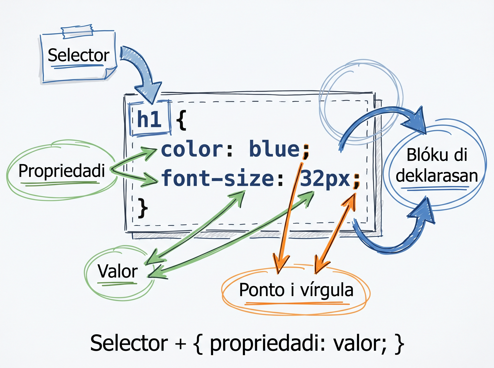

# CSS: sintaksi i kumo liga-l ku HTML

Ti gosi, blog di Adilson é funsional ma é feiu. Tudu testu pretu, fundu branku, sen font, sen spasing. Gosi ta entra parti divertidu: **CSS — Cascading Style Sheets**. CSS ta da kor, font, spasing i layout. Si HTML é osu, CSS é peli.

## Kuze ki é CSS

**CSS** (Cascading Style Sheets) é un linguajen separadu di HTML ki ta diskreve **apariénsia** di pajina. HTML ta diz "kel-li é un titulu, kel-li é un paragrafu"; CSS ta diz "titulu é azul, paragrafu ten 16px di font, fundu é beji".

Es separasan ten un nomi: **separation of concerns**.

| Linguajen | Responsabilidadi |
|---|---|
| HTML | Strutura i signifikadu (osu) |
| CSS | Apariénsia i layout (peli) |
| JavaScript | Lojika i interasan (musku — ta ben dipos) |

Mantén kada un na se ficheru pa kódiku fika ki manten i fásil di muda.

<SectionHeading variant="concept">Anatomia di un regra CSS</SectionHeading>

Un regra CSS ten dos parti: **selector** (ken nu ta stila) i **bloku di deklarasan** (kuze ki nu ta muda).

```css
h1 {
  color: blue;
  font-size: 32px;
}
```

- `h1` — **selector**: ta diz "tudu element `<h1>` na pajina".
- `{ ... }` — **bloku di deklarasan**: tudu kuza ki ta entra entri es kuétxa.
- `color: blue;` — un **deklarasan**, ki ten un **propriedadi** (`color`) i un **valor** (`blue`), separadu pa `:`.
- `;` na fin di kada linha — **obrigatóriu** entri deklarasons.



:::callout{type=tip}
Nunka skesi `;` na fin di kada deklarasan. Si bu skesi, browser ka ta da erru — el ta **silensiozamenti inora** próximu regra. É un di bugs mas frustranti pa novatu. Hábitu: skrebe sempri `;`, mêsmu na última deklarasan di un bloku.
:::

## Trez manera di skrebe CSS

CSS pode mora na trez lugaris diferenti. Nu ta ve kada un i splika pamodi nu ta skoji un só.

### 1. Inline — `style="..."` diretu na tag

```html
<h1 style="color: blue; font-size: 32px;">Blog di Adilson</h1>
```

- **Vantajen:** rápidu pa testa un kuza isoladu.
- **Disvantajen:** ta mistura strutura ku stilu. Si bu ten 20 `<h1>` na website i bu kre muda kor, bu ten ki edita 20 lugaris diferenti.
- **Kuandu uza:** kuazi nunka. Evita-l.

### 2. Internal — `<style>` dentru di `<head>`

```html
<head>
  <meta charset="UTF-8" />
  <title>Blog di Adilson</title>
  <style>
    h1 {
      color: blue;
    }
  </style>
</head>
```

- **Vantajen:** sentralizadu na un só ficheru.
- **Disvantajen:** ta funsiona só pa kel pajina HTML. Si bu ten `blog.html`, `cesaria.html` i `sobre.html`, bu ta presiza repeti stilu na kada un.
- **Kuandu uza:** experimentu rápidu, ou un pajina úniku.

### 3. External — un ficheru `.css` separadu (RECOMENDADU)

Stilu ta mora na se propi ficheru, normalmenti txamadu `style.css`. Kada pajina HTML ta **liga-l** ku un tag `<link>` na `<head>`.

```html
<head>
  <meta charset="UTF-8" />
  <title>Blog di Adilson</title>
  <link rel="stylesheet" href="style.css" />
</head>
```

- **Vantajen:** un só ficheru ta stila tudu pajina di website. Bu muda kor na `style.css` un bez i tudu pajina ta atualiza.
- **Disvantajen:** nenhun pa projetu real.
- **Kuandu uza:** **99% di tempu.** É padran na mundu real.

:::callout{type=tip}
`<link rel="stylesheet">` é un tag **void** (sen tag di féxa, kumo ``). El ta vivi dentru di `<head>`, nunka dentru di `<body>`. Atributu `rel="stylesheet"` ta diz pa browser "kel ficheru li é folha di stilu", i `href` ta diz undi ta otxa-l.
:::

## Komentáriu na CSS

CSS ten se propi sintaksi di komentáriu, diferenti di HTML:

```css
/* Es é un komentáriu na CSS */
h1 {
  color: blue; /* komentáriu inline pode mora aki tanbé */
}
```

| Linguajen | Komentáriu |
|---|---|
| HTML | `<!-- komentáriu -->` |
| CSS | `/* komentáriu */` |

Komentáriu ka ta afeta nada na browser — é só pa bu le dipos.

<SectionHeading variant="install">Prátika: kria style.css i liga-l ku blog</SectionHeading>

Vamu da primeru kor pa blog di Adilson.

### Pasu 1 — kria ficheru `style.css`

Na VS Code, na mêsmu pasta undi sta `cesaria.html`, klika **File → New File**. Salva ku nomi **`style.css`** (`Cmd+S` / `Ctrl+S`). Ficheru ta sta vaziu pa gosi.

Strutura di pasta:

```
web-foundations/
├── index.html
├── blog.html
├── cesaria.html
├── sobre.html
└── style.css          ← novu
```

### Pasu 2 — liga `style.css` ku HTML

Abri `cesaria.html`. Dentru di `<head>`, dipos di `<title>`, adisiona:

```html
<head>
  <meta charset="UTF-8" />
  <title>Blog di Adilson — Cesária Évora</title>
  <link rel="stylesheet" href="style.css" />
</head>
```

Salva. Faze mêsmu mudansa na `blog.html`, `index.html` i `sobre.html` — kada pajina di blog ta liga ku mêsmu `style.css`.

### Pasu 3 — skrebe primeru regra

Na `style.css`, skrebe:

```css
/* style.css — stilu pa blog di Adilson */
body {
  background-color: #f7f7f7;
}

h1 {
  color: #1098ad;
}
```

Salva. Abri `cesaria.html` ku Live Server. **Bu ta odja:**

- Fundu di pajina ta muda di branku pa beji klaru (`#f7f7f7`).
- `<h1>` ta muda di pretu pa azul-mar (`#1098ad`) — un ton inspiradu na bandera di Kabu Verdi.

Si nada ka muda, kontrola:

- Ficheru `style.css` é na mêsmu pasta ki `cesaria.html`?
- `href="style.css"` ta skritu sen erru di skritura?
- Live Server ta korre? (Ten un mensajen na rodapé di VS Code.)

## Erus komun pa evita

- **Konfundi `<link rel="stylesheet">` ku `<a href>`.** Tudu dos ten "link" na nomi, ma `<link>` ta karega rekursu (CSS, ícon), `<a>` ta kria-l navegasan klikavel.
- **Skesi atributu `href`** na `<link>` → silensiozamenti ka ta karega nada.
- **Poi `<style>` ou `<link>` dentru di `<body>`** — sempri na `<head>`.
- **Skrebe stilu inline (`style="..."`)** kuandu bu sabe ki ta uza el na mas di un website. Hábitu difisil di kuebra dipos.
- **Stilu na regra CSS sen `;` na fin di deklarasan.** Próximu regra ta keda inoradu.

<SectionHeading variant="practice">Tenta gosi</SectionHeading>
<TentaGosi showHeader={false} />

<SectionHeading variant="quiz">Testa bu konhesimentu</SectionHeading>
<QuizSet showHeader={false}>
  <Quiz position={0} />
  <Quiz position={1} />
  <Quiz position={2} />
  <Quiz position={3} />
</QuizSet>

<SectionHeading variant="summary">Rezumu</SectionHeading>
<KeyTakeaways showHeader={false}>
  <RezumuItem term="separation of concerns" variant="gold">HTML pa strutura (osu), CSS pa apariénsia (peli) — mantén separadu.</RezumuItem>
  <RezumuItem term="Regra CSS">`selector { propriedadi: valor; }` — kada deklarasan ta fexa ku `;`.</RezumuItem>
  <RezumuItem term="Trez manera">inline (evita), internal (`<style>` na `<head>`), external (`<link>` + `.css` — padran).</RezumuItem>
  <RezumuItem term="link stylesheet" variant="tip">`<link rel="stylesheet" href="style.css" />` é tag void ki ta vivi na `<head>`.</RezumuItem>
  <RezumuItem term="Komentáriu">CSS é `/* … */`, diferenti di HTML `<!-- … -->`.</RezumuItem>
</KeyTakeaways>
