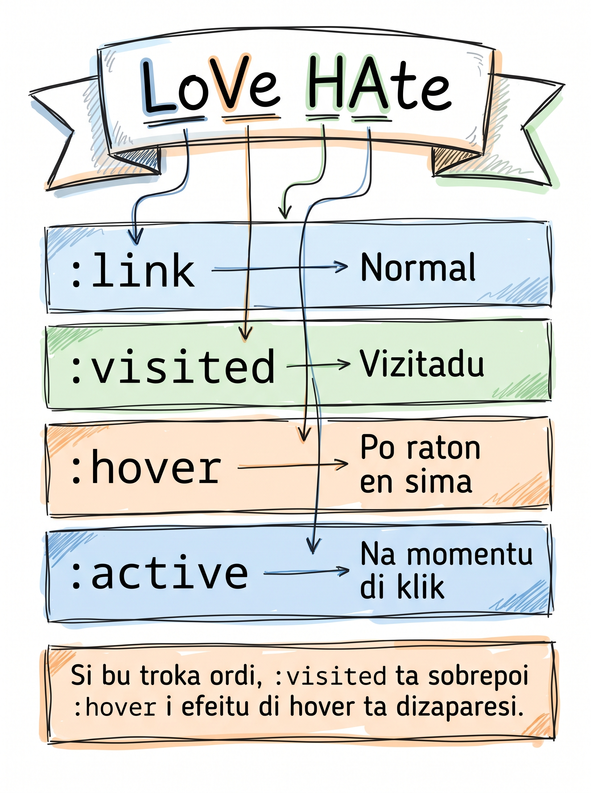

# Tipus di selectors na CSS

Ti gosi, nu sta stila tudu `<h2>` di mêsmu manera, tudu `<p>` di mêsmu manera. Ma si nu kre stila so un `<h2>` spesífiku? Ou tudu link ku un nomi spesífiku? Pa kel-li nu ten **selectors** — diferenti manera di apunta CSS pa elementu kortu.

## Trez tipus básiku di selector

### Element selector

Ta kojí tudu elementu di un tipu — `<h1>`, `<p>`, `<nav>`, etc.

```css
h1 { color: #1098ad; }     /* tudu <h1> na pajina */
p  { line-height: 1.5; }   /* tudu <p> na pajina */
```

### Class selector — `.nomi`

Ta kojí elementus ki ten un atributu `class` igual. **Reutilizavel** — un mesmu class pode aparesi na muitu elementu.

```html
<p class="post-meta">Publikadu na 12 di Maiu, 2026</p>
<p class="post-meta">Tempu di letura: 5 minutu</p>
```

```css
.post-meta {
  color: #777;
  font-size: 14px;
}
```

### ID selector — `#nomi`

Ta kojí un elementu úniku ku atributu `id`. **Úniku na pajina** — kada `id` pode aparesi só un bez.

```html
<header id="main-header">...</header>
```

```css
#main-header { padding: 20px; }
```

## Preferi class sobri id pa stilu

| | Class (`.nomi`) | ID (`#nomi`) |
|---|---|---|
| Reutilizavel? | Sen — pode aparesi muitu bez | Nau — un só bez na pajina |
| Especificidadi | Baxu — fásil di sobrescrebe | Altu — difisil di sobrescrebe |
| Uzu rekomendadu | Stilu | Anker di link, JavaScript targeting |

**Regra prátiku:** uza class pa kuaze tudu stilu. Uza id so kuandu bu presiza identifika un elementu úniku (pa link interno, ou pa JavaScript).

## Múltiplu class na un elementu

Un elementu pode ten mas di un class, separadu pa spasu:

```html
<a class="btn btn-primary">Ler artigu</a>
```

```css
.btn         { padding: 10px 20px; }
.btn-primary { background-color: #1098ad; color: #fff; }
```

## Konvensan di nomi: kebab-case

Pa nomi di class, uza **kebab-case** (palavra separadu pa traseuk):

| Bon | Ruim |
|---|---|
| `.author-name` | `.authorName` (camelCase) |
| `.related-posts` | `.related_posts` (snake_case) |
| `.post-meta` | `.PostMeta` (PascalCase) |

Skoji un stilu i fika kel-li pa tudu projetu.

## Kombina selectors

### Lista — `,`

Aplika mêsmu stilu na vários elementu di bez:

```css
h1, h2, h3 {
  color: #333;
  font-family: sans-serif;
}
```

### Descendent — spasu

Kojí kualkér elementu **dentru di** otru. `footer p` = "kualkér `<p>` dentru di `<footer>`".

```css
footer p {
  font-size: 14px;
  color: #777;
}
```

### Irmon adjasenti — `+`

Kojí elementu ki ben **imediatamenti dipos** di otru, na mêsmu nivel.

```css
h2 + p {
  font-weight: bold;     /* só primeru <p> dipos di kada <h2> */
}
```

:::callout{type=tip}
Evita selectors profundamenti aninhadu kumo `nav ul li a`. Es ta **kola** strutura HTML na CSS — si bu muda HTML (poi un `<div>` extra), CSS ta sprega. Mas tarde, kuandu bu sabe mas, uza un só class na elementu ki bu kre stila.
:::

## Pseudo-classes — `:`

Pseudo-classes ta kojí elementus baseadu na un **stadu** ou un **pozisan**.

### Pseudo-classes struturais

| Pseudo-class | Kuze ki ta kojí |
|---|---|
| `:first-child` | Primeru fidju di un pai |
| `:last-child` | Últimu fidju di un pai |
| `:nth-child(2)` | Sigundu fidju |
| `:nth-child(odd)` | Kada fidju ímpar (1, 3, 5...) |
| `:nth-child(even)` | Kada fidju par (2, 4, 6...) |

```css
li:nth-child(odd) {
  background-color: #f7f7f7;   /* zebrar lista */
}
```

### Pseudo-classes di interasan (so pa `<a>`)

| Pseudo-class | Stadu di link |
|---|---|
| `:link` | Link ki nunka foi visitadu |
| `:visited` | Link ki dja foi visitadu |
| `:hover` | Rato ta sobre link |
| `:active` | Link ta sendu klikadu na kel momentu |

<SectionHeading variant="concept">LVHA — ordi obrigatóriu di stilu di link</SectionHeading>

Si bu stila tudu kuatru stadu, bu **debe skrebe es na ordi spesífiku**: **L**ink, **V**isited, **H**over, **A**ctive. Si nau, `:hover` ka ta funsiona (`:visited` ta sobrescrebe).

Mnemoniku: **LoVe HAte** ("LoVe" = Link, Visited; "HAte" = Hover, Active).



```css
a:link    { color: #1098ad; }
a:visited { color: #777; }
a:hover   { color: #ad1090; text-decoration: underline; }
a:active  { color: #800; }
```

:::callout{type=tip}
Si bu skesi mnemoniku **LoVe HAte**, lembra: na vida real, primeru bu ta gosta (Love = Link + Visited), dipos bu ta odia (Hate = Hover + Active). CSS ta sigui mêsmu ordi.
:::

<SectionHeading variant="install">Prátika: stila link i lista di cesaria.html</SectionHeading>

### Pasu 1 — adisiona classes na `cesaria.html`

Abri `cesaria.html`. Adisiona class na byline i na lista relasionadu:

```html
<header>
  <h1>Cesária Évora — Reina di Morna</h1>
  <p class="post-meta">
    <em class="author-name">Skrebedu pa Djamila Tavares</em>, 12 di Maiu, 2026.
  </p>
</header>
```

I na `<aside>`:

```html
<aside class="related-posts">
  <h2>Artigus relasionadu</h2>
  <ul>
    <li><a href="#">Funaná na Santiago</a></li>
    <li><a href="#">Pico do Fogo — un aventura</a></li>
    <li><a href="#">Pratus tradisional di Kabu Verdi</a></li>
  </ul>
</aside>
```

### Pasu 2 — adisiona regras na `style.css`

```css
/* Byline i meta-informasan */
.author-name {
  font-style: italic;
  color: #1098ad;
}

.post-meta {
  font-size: 14px;
  color: #777;
}

/* Lista di artigus relasionadu */
.related-posts {
  border-top: 2px solid #ddd;
}

.related-posts li:nth-child(odd) {
  background-color: #fff;
}

/* Link — ordi LVHA OBRIGATÓRIU */
a:link    { color: #1098ad; }
a:visited { color: #777; }
a:hover   { color: #ad1090; text-decoration: underline; }
a:active  { color: #800; }

/* Header prinsipal di pajina */
#main-header {
  padding: 20px;
}
```

Salva. Abri `cesaria.html` ku Live Server.

- Byline ta keda azul-mar, itáliku. "Djamila Tavares" ta destaka di restu di linha.
- Lista di artigus relasionadu ta keda zebrada (alternansa di fundu).
- Pasa rato sobre kualkér link — kor ta muda pa púrpura i sublinhadu ta apareci.
- Klika i sigura un link — kor ta keda vermedju (`:active`).

## Erus komun pa evita

- **Ordi LVHA kuebradu** é **#1 footgun** di CSS pa novatu. Si bu skrebe `:hover` antis di `:visited`, hover ta dezaparesi pa link ki dja foi visitadu. **Memoriza: LoVe HAte.**
- **`article p:first-child`** ka é "primeru `<p>` dentru di `<article>`". É "un `<p>` ki é **primeru fidju** di se pai". Si `<article>` ta kumesa ku `<header>`, regra **nunka** ta kasa.
- **Mistura kebab-case ku camelCase** na nomi di class. Skoji un.
- **Uza id pa stilu di kuza ki ta repeti** (kumo boton) — id é úniku. Uza class.
- **Selector profundu** kumo `nav ul li a` ta kola CSS na strutura HTML. Prefere un class na elementu diretu.

<SectionHeading variant="practice">Tenta gosi</SectionHeading>
<TentaGosi showHeader={false} />

<SectionHeading variant="quiz">Testa bu konhesimentu</SectionHeading>
<QuizSet showHeader={false}>
  <Quiz position={0} />
  <Quiz position={1} />
  <Quiz position={2} />
  <Quiz position={3} />
</QuizSet>

<SectionHeading variant="summary">Rezumu</SectionHeading>
<KeyTakeaways showHeader={false}>
  <RezumuItem term="Trez tipus">element (`h1`), class (`.nomi`), id (`#nomi`).</RezumuItem>
  <RezumuItem term="Preferi class">pa stilu — reutilizavel, baxu especificidadi.</RezumuItem>
  <RezumuItem term="Kombina selectors">lista (`,`), descendent (spasu), irmon adjasenti (`+`).</RezumuItem>
  <RezumuItem term="Pseudo-classes">struturais (`:first-child`, `:nth-child(odd)`) ta kojí pa pozisan.</RezumuItem>
  <RezumuItem term="LVHA" variant="gold">link ta sigui sempri ordi `:link`, `:visited`, `:hover`, `:active` (LoVe HAte).</RezumuItem>
  <RezumuItem term="kebab-case">nomi di class na minúskula ku traseu (`.author-name`, ka `.authorName`).</RezumuItem>
</KeyTakeaways>
