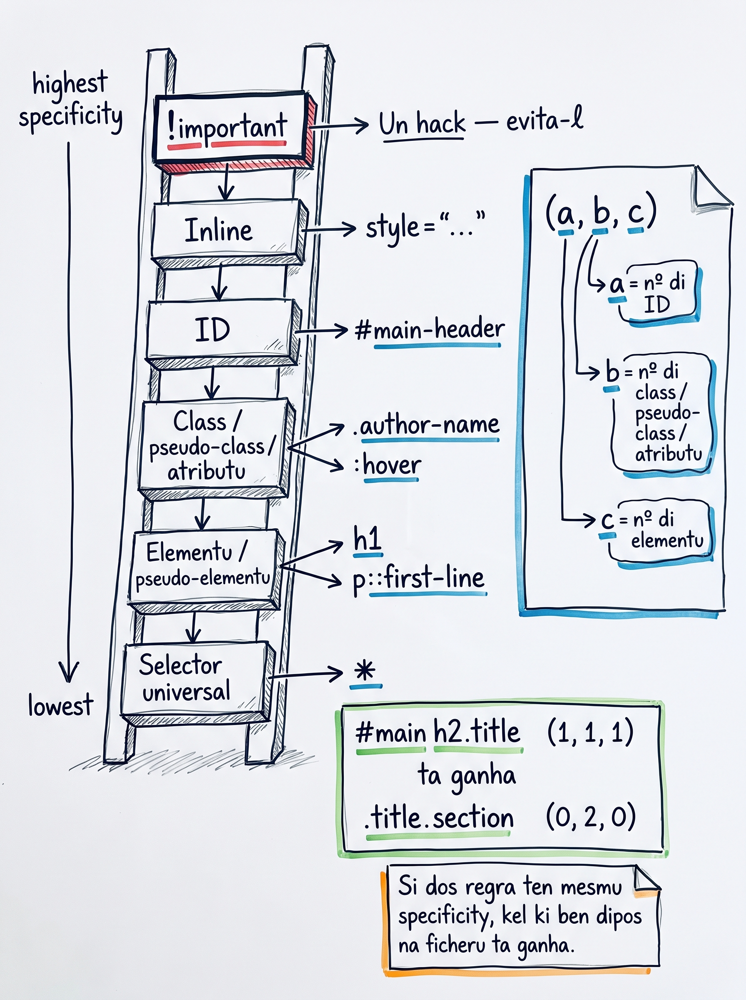

# Konflitu i "inheritance" na CSS

Kuandu dos regra di CSS ta dizinhá pa mêsmu elementu, ken ta ganha? I pamodi un `color` ki nu mete na `<body>` ta apareci na tudu paragrafu sen nu repeti-l? Es lisan li ta splika es dos mistériu — **konflitu di selectors** i **"inheritance"**.

:::callout{type=tip}
**Nota di linguajen:** na kursu li nu ta uza palavra ingles **"inheritance"** diretu, sen tradusan, pamodi é asin ki tudu dokumentasan di CSS (MDN, Stack Overflow, livru) ta uza-l. Ka nu tradzudu pa "herdansa" — kuandu bu Google probléma di CSS, palavra ki bu ten ki sabe é "inheritance".
:::

<SectionHeading variant="concept">Konflitu di selectors — ken ta ganha?</SectionHeading>

Kuandu dos regras ta apunta pa mêsmu elementu ku deklarasons konflitudu (egzemplu, dos `color` diferenti), browser ta uza un **ordi di especificidadi** pa dicidi.

### Skala di especificidadi — di mas altu pa mas baxu

1. `!important` — un hack. **Evita.**
2. **Inline** — atributu `style="..."` diretu na tag HTML
3. **ID** — `#main-header`
4. **Class / pseudo-class / atributu** — `.author-name`, `:hover`, `[type="text"]`
5. **Element / pseudo-element** — `h1`, `p::first-line`
6. **Universal** — `*`



Mas altu na skala = mas pezu = ta ganha.

### Vetor di especificidadi `(a, b, c)`

Kada selector ta resebi un vetor di trez númeru:

| Pozisan | Konta |
|---|---|
| `a` | Kuantu ID na selector |
| `b` | Kuantu class, pseudo-class, atributu |
| `c` | Kuantu element, pseudo-element |

Konpara di skerda pa direita; primeru kolun ku diferensa ta dicidi.

**Egzemplus:**

| Selector | `(a, b, c)` |
|---|---|
| `p` | `(0, 0, 1)` |
| `.author-name` | `(0, 1, 0)` |
| `#main-header` | `(1, 0, 0)` |
| `h2.title` | `(0, 1, 1)` |
| `#main h2.title` | `(1, 1, 1)` |
| `.title.section` | `(0, 2, 0)` |

`#main h2.title` `(1, 1, 1)` **ta ganha sobre** `.title.section` `(0, 2, 0)`, pamodi un úniku ID na kolun `a` ta sobrepasa kualkér kuantidadi di class.

### Ordi di fonti — pa kuebra impati

Kuandu dos regra ten especificidadi **igual**, regra ki ta apareci **mas tarde** na ficheru (ou na ficheru karegadu mas tarde) ta ganha.

```css
p { color: blue; }
p { color: red; }    /* ta ganha — ben dipos */
```

## "Inheritance" na CSS

Alguns propriedadis di CSS ta **kaska di pai pa fidju** automatikamenti. Si bu poi `color: #333` na `<body>`, kada `<p>`, `<h1>`, `<em>` dentru di `<body>` ta inheri kel kor sen bu ten ki repeti-l.

### Propriedadis ki ta inheri

| Propriedadi | Inheri? |
|---|---|
| `color` | Sen |
| `font-family` | Sen |
| `font-size` | Sen |
| `font-weight` | Sen |
| `font-style` | Sen |
| `line-height` | Sen |
| `text-align` | Sen |
| `letter-spacing` | Sen |

### Propriedadis ki **ka** ta inheri

| Propriedadi | Inheri? |
|---|---|
| `border` | Nau |
| `margin` | Nau |
| `padding` | Nau |
| `background` | Nau |
| `width` | Nau |
| `height` | Nau |

**Estratéjia prátiku:** poi propriedadis di testu (`font-family`, `color`, `line-height`) na `<body>`. Es ta kaska na tudu fidju. Sen repetisan.

```css
body {
  font-family: sans-serif;
  color: #333;
  line-height: 1.5;
}

/* h1, h2, p ka ten ki repeti font-family ô color — es ta inheri */
```

:::callout{type=tip}
"Inheritance" é so pa **alguns propriedadi** — kuazi tudu kuza relasionadu ku **testu**. Bordu, spasu, fundu, dimensan ka ta inheri. Si bu poi `border: 2px solid red` na `<body>`, **nada di fidju** ka ta resebi border. É pamodi nu ten selector universal `*` pa kazu kumo es.
:::

## Selector universal — `*`

`*` ta kasa **kada elementu** na pajina. Ten especificidadi `(0, 0, 0)` — mas baxu posivel.

```css
* {
  box-sizing: border-box;
  margin: 0;
}
```

`*` ta **aplika** regra diretu pa kada elementu. É util pa propriedadis ki **ka ta inheri** ma ki nu kre na tudu lugar — egzemplu, `box-sizing` (nu ta odja-l na Lisan 14).

**Importanti:** uza `*` so pa reset. Pa stilu jeral di testu, uza `body` + inheritance — é mas leve.

## `!important` — un hack ki bu ta arrependi

Si bu adisiona `!important` na fin di un valor, regra ta ganha tudu — **inora skala di especificidadi**.

```css
p { color: red !important; }    /* ta sobrepasa kualkér otru regra */
```

**Ka uza-l.** É un sinal ki bu sta luta kontra cascade. Si bu ten ki uza `!important`, solusan korreta é **simplifika selector** ou **muda ordi di regras**.

<SectionHeading variant="install">Prátika: refaktoriza i konfirma konflitu na DevTools</SectionHeading>

### Pasu 1 — mové propriedadis di testu pa `body`

Abri `style.css`. Move tudu `font-family` i `color` di regras individual (`h1`, `h2`, `p`) pa `body`. Sti ten ki sta así:

```css
body {
  background-color: #f7f0e6;
  color: #333;
  font-family: sans-serif;
  font-size: 16px;
  line-height: 1.5;
}

/* h1 ka ten mas color ô font-family — es ta inheri di body */
h1 {
  font-size: 36px;
  text-transform: uppercase;
  text-align: center;
}
```

Salva. Abri `cesaria.html`. **Apariénsia ka muda nada.** É inheritance ta funsiona.

### Pasu 2 — reset universal

Adisiona na topu di `style.css`:

```css
* {
  box-sizing: border-box;
}
```

Pa gosi, regra ka ta muda nada visivel (nu ta splika `box-sizing` na Lisan 14). Ma é hábitu profisional poi reset na topu di tudu folha di stilu.

### Pasu 3 — demo di konflitu propozitalmenti

Adisiona na fin di `style.css`:

```css
/* Demo: si nu adisiona konflitu propozitalmenti */
p           { color: #555; }       /* (0, 0, 1) */
.author-name { color: #1098ad; }   /* (0, 1, 0) — ta ganha */

/* Si dimas algun dia nu sostitui byline pa un convidada kumo Cesária Lima,
   class .author-name ta kontinua aplika — pamodi (0,1,0) > (0,0,1) */
```

Salva. Abri DevTools (`Cmd/Ctrl+Opt+I`), klika ku rato direita na byline → **Inspect**. Na painel **Styles**, bu ta odja:

```text
.author-name { color: #1098ad; }     ← ta aplika
p { color: #555; }                    ← tachiadu, sobrepasadu
```

Kel-li é **konflitu di especificidadi visualizadu**. Browser ta mostra kel ki ganha i kel ki perde.

### Pasu 4 — proba `!important` un bez i remove

```css
p { color: red !important; }
```

Salva. Byline ta ben vermedju, mêsmu ku `.author-name` ki tinha `(0, 1, 0)`. **Remove kel `!important` imediatamenti.** Bu so uza-l pa odja efeitu.

### Pasu 5 — konfirma ki `border` ka ta inheri

Adisiona na `body`:

```css
body {
  /* ... */
  border: 4px solid red;
}
```

Salva. Bu ta odja un border vermedju **so na elementu `<body>`** — kada `<p>`, `<h1>`, `<aside>` **ka ta resebi border**. Bordu ka ta inheri. Remove kel linha dipos di konfirma.

## Erus komun pa evita

- **Spera ki tudu propriedadi ta inheri.** `color` ta inheri di `<body>`; `border` nau. Si bu poi `border` na `<body>` i bu ta spera ki paragrafu ta resebi un border, bu ta dezilude.
- **Uza `!important` kumo solusan.** El ta funsiona un bez i dipos ta kuebra kada sobrescrita ki bu skrebe dipos. Si bu kumesa alkansa-l, solusan é simplifika selector.
- **Konta especificidadi mal.** Un ID ta sobrepasa kualkér número di class. `#x` ta ganha `.a.b.c.d.e`. Na duvida, konta `(a, b, c)` di skerda pa direita.
- **Skesi ki ordi di fonti ta kuebra impati.** Dos regras ku especificidadi igual → kel ki ta ben **mas tarde** ta ganha. Reordena regras pode silensiozamenti muda lojika.
- **Uza `*` pa stilu ki ta inheri.** Pa `color` ou `font-family`, uza `body` (mas leve, ta inheri). `*` é so pa propriedadis ki **ka ta inheri** ma ki bu kre pa kada elementu.

<SectionHeading variant="practice">Tenta gosi</SectionHeading>
<TentaGosi showHeader={false} />

<SectionHeading variant="quiz">Testa bu konhesimentu</SectionHeading>
<QuizSet showHeader={false}>
  <Quiz position={0} />
  <Quiz position={1} />
  <Quiz position={2} />
  <Quiz position={3} />
</QuizSet>

<SectionHeading variant="summary">Rezumu</SectionHeading>
<KeyTakeaways showHeader={false}>
  <RezumuItem term="especificidadi" variant="gold">Konflitu di selectors ta resolvi pa especificidadi: `!important` > inline > id > class > element > universal.</RezumuItem>
  <RezumuItem term="Vetor `(a, b, c)`">Konta ID, class+pseudo, element — konpara di skerda pa direita.</RezumuItem>
  <RezumuItem term="Ordi di fonti">Ta kuebra impati: regra mas tarde ta ganha.</RezumuItem>
  <RezumuItem term="inheritance">Ta funsiona pa propriedadis di testu (`color`, `font-family`, `line-height`). Ka ta funsiona pa `border`, `margin`, `padding`, `background`.</RezumuItem>
  <RezumuItem term="Estratéjia">Poi stilu jeral di testu na `<body>` i deixa inheritance faze trabalhu.</RezumuItem>
  <RezumuItem term="Selector universal `*`">Ten especificidadi `(0,0,0)`. Uza só pa reset.</RezumuItem>
  <RezumuItem term="`!important`" variant="warning">Ka uza-l. Si bu ta tenta-l, simplifika selector.</RezumuItem>
</KeyTakeaways>
