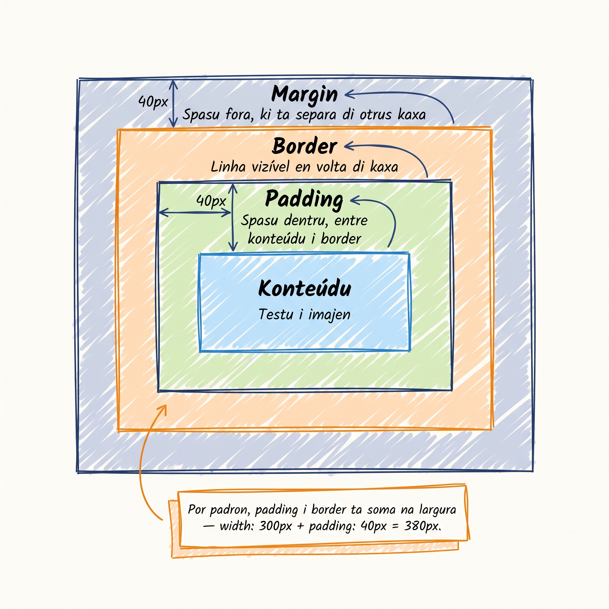

# Box model: spasu i tamanhu di elementu

Kada elementu HTML é un **kaixa**. I es kaixa li ten kuatru kamada — kontéudu, padding, border, margin. Si bu intende kel kuatru, bu ta kontrolá tudu spasing i tamanhu na website.

<SectionHeading variant="concept">Anatomia di box model</SectionHeading>

Pensa na un foto na un parede:

- **Content** — kontéudu propi (testu, imajen). Foto.
- **Padding** — spasu **dentru** di kaixa, entri kontéudu i border. Marko di foto.
- **Border** — linha vizível, mas ou menus grosu. Bordu di marko.
- **Margin** — spasu **fora** di kaixa, entri es kaixa i otus. Spasu entri foto i otru foto na parede.



**Area di fil (fill area)** = `content + padding + border`. É undi `background-color` ta pinta. `margin` é **fora** di fill — sempri transparenti.

:::callout{type=tip}
**Box model padron ta adisiona padding i border na width.** Si bu defini `width: 300px` i `padding: 40px`, kaixa ta okupa **380px** (300 + 40 + 40), nau 300. Es ka é intuitivu — nu ta resolvi-l na Lisan 14 ku `box-sizing: border-box`.
:::

## Padding — spasu internu

### Forma kurtu

```css
padding: 20px;                  /* tudu kuatru ladu */
padding: 20px 40px;             /* top/bottom = 20, left/right = 40 */
padding: 10px 20px 30px;        /* top, left/right, bottom */
padding: 10px 20px 30px 40px;   /* top, right, bottom, left — relógiu */
```

Pa lembra ordi di kuatru valor: kumesa na **topu** i sigui na sentidu di **relógiu** (top → right → bottom → left).

### Forma só un lado

```css
padding-top:    10px;
padding-right:  20px;
padding-bottom: 10px;
padding-left:   20px;
```

## Margin — spasu sternu

Sintaksi é igual ki padding (forma kurtu 1/2/4 valor, ou forma só un lado).

```css
margin: 0;                  /* sen spasu */
margin: 20px;               /* tudu kuatru ladu */
margin: 0 auto;             /* top/bottom = 0, left/right = auto (sentra) */
margin-bottom: 16px;
```

**Nota:** kuandu valor é `0`, **ka presiza unidadi**. `0` é igual `0px`.

### Kolapsu di margin vertikal

Es é particularidadi di CSS ki ta surprende novatu:

Kuandu **dos elementu adjasenti** ten margin vertikal (`margin-bottom` na un, `margin-top` na otru), browser **ka ta soma** es dos. **Ta toma só kel mas grandi.**

```css
h2 { margin-bottom: 40px; }
p  { margin-top:    30px; }
```

Spasu entri `<h2>` i `<p>` ta keda **40px** (ka 70px). Es é txamadu **collapsing margins** ou **kolapsu di margin**.

**Prátika rekomendadu:** uza só `margin-bottom` (sen `margin-top`) pa vertikal. Asin bu kontrola ritmu sen sorpreza.

:::callout{type=tip}
Kolapsu ta funsiona só pa **margin vertikal** (top + bottom). Margin horizontal (left + right) **sempri ta soma**. Padding **nunka** ta kolapsa.
:::

## Width i height — dimensan

```css
width:  300px;     /* 300 pixel fixu */
width:  50%;       /* 50% di largura di pai */
height: 200px;
```

- **`px`** — pixel absolutu. Bon pa kontrolu preziso.
- **`%`** — porsentajen di pai. Foundation pa responsive design (un kursu futuru).

**Importanti:** `width` i `height` ta aplika só na elementu **bloku** (`<div>`, `<p>`, `<h1>`, `<section>`). Pa elementu **inline** (`<span>`, `<a>`, `<em>`), browser ta inora `width` i `height`. Nu ta ben falar mas di display na Módulu 4.

## Sentra un container ku `margin: 0 auto`

Truk klásiku: pa sentra horizontalmenti un elementu di largura fixu, uza `margin: 0 auto`.

```css
.container {
  width: 1200px;
  margin: 0 auto;   /* top/bottom = 0; left/right = auto */
}
```

**Kumo ta funsiona:** `auto` ta diz pa browser "kalkula margin igual na dos ladu", ki ta resulta na sentrajen. Pa funsiona, **elementu ten ki ten un `width` definidu** (ou `max-width`). Sen width, kaixa dja é tudu largura disponivel — ka ta sentra nada.

<SectionHeading variant="install">Prátika: adisiona container i spasing na blog</SectionHeading>

### Pasu 1 — anrola tudu na un container

Abri `cesaria.html`. Mete tudu kontéudu dentru di un `<div class="container">`:

```html
<body>
  <div class="container">
    <header id="main-header">
      <h1>Blog di Adilson</h1>
      <nav>...</nav>
    </header>

    <main>
      <article>...</article>
      <aside class="related-posts">...</aside>
    </main>

    <footer>...</footer>
  </div>
</body>
```

### Pasu 2 — stila container i spasing

Adisiona na `style.css`:

```css
.container {
  max-width: 1200px;
  margin: 0 auto;
  padding: 40px;
}

p {
  margin-bottom: 16px;
}

h2 {
  margin-bottom: 24px;
}

.related-posts {
  margin-top: 60px;
  padding: 20px;
  border-top: 2px solid #1098ad;
}

.related-posts li {
  padding: 12px;
  margin-bottom: 8px;
  background-color: #fff;
  border: 1px solid #ddd;
}
```

Salva. Abri `cesaria.html` ku Live Server. Bu ta odja:

- Kontéudu **sentradu** na pajina, ku largura máximu di 1200px.
- 40px di **padding** entri kontéudu i bordu di pajina.
- Kada paragrafu ku 16px di spasu pa baxu.
- Lista di artigus relasionadu ku kaixa branku, border klaru, padding internu.

### Pasu 3 — proba kolapsu di margin na DevTools

Adisiona temporariamenti es kódiku na `style.css`:

```css
h2 { margin-bottom: 40px; }
.related-posts h2 + p { margin-top: 30px; }
```

Salva. Abri DevTools, klika ku rato direita na primeru `<h2>` di artigu, **Inspect**. Na painel **Computed**, ou na painel di box model (kantu inferior direitu), bu ta odja spasu entri `<h2>` i próximu `<p>` é **40px**, ka 70px. Es é **kolapsu** ta funsiona.

Remove kes dos linha temporal dipos di konfirma.

## Erus komun pa evita

- **Box model padron ta adisiona padding na width.** `width: 300px` + `padding: 40px` = 380px na pajina. Vai stragar layout. Solusan ta ben na Lisan 14: `box-sizing: border-box`.
- **Kolapsu di margin vertikal** ta deixa novatu konfusu — "pamodi gap ka ta krese sima ki nu spera?". Lembra: ta toma kel mas grandi, ka soma.
- **`margin: 0 auto` sen width** ka ta faze nada vizível. Bloku elementu padron dja okupa tudu largura.
- **Margin vertikal i padding vertikal na inline elementus** (`<span>`, `<a>` sen display:block) ta keda inoradu. Browser ka ta da erru, so ka ta aplika.
- **Skesi ki margin é transparenti.** `background-color` ka ta apareci na margin — só na content + padding + border (fill area).

<SectionHeading variant="practice">Tenta gosi</SectionHeading>
<TentaGosi showHeader={false} />

<SectionHeading variant="quiz">Testa bu konhesimentu</SectionHeading>
<QuizSet showHeader={false}>
  <Quiz position={0} />
  <Quiz position={1} />
  <Quiz position={2} />
  <Quiz position={3} />
</QuizSet>

<SectionHeading variant="summary">Rezumu</SectionHeading>
<KeyTakeaways showHeader={false}>
  <RezumuItem term="Kuatru kamada" variant="gold">**content → padding → border → margin** (di dentru pa fora) — kada elementu HTML é un kaixa di kuatru kamada.</RezumuItem>
  <RezumuItem term="Fill area">`content + padding + border` é undi `background-color` ta apareci. Margin é fora, sempri transparenti.</RezumuItem>
  <RezumuItem term="Forma kurtu">Padding/margin ten forma di 1, 2 ou 4 valor (relógiu: top → right → bottom → left).</RezumuItem>
  <RezumuItem term="Kolapsu di margin">Dos margin vertikal adjasenti ta toma só kel mas grandi, ka soma. Padding nunka ta kolapsa.</RezumuItem>
  <RezumuItem term="Dimensan">`width` i `height` ta aplika na elementus bloku; inline elementus ta inora-l.</RezumuItem>
  <RezumuItem term="Sentrajen" variant="tip">Pa sentra horizontalmenti: elementu ten ki ten `width` (ou `max-width`) + `margin: 0 auto`.</RezumuItem>
  <RezumuItem term="Pendenti" variant="warning">Box-sizing padron ta soma padding i border na width — Lisan 14 ta resolvi-l ku `box-sizing: border-box`.</RezumuItem>
</KeyTakeaways>
