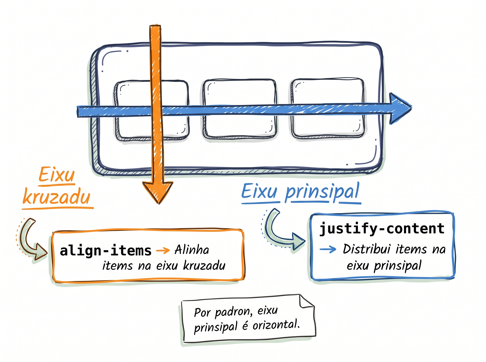

# Flexbox: un dimensan

Kola dos kaixa (divs) ladu a ladu na web sempre foi un tortura. Durante anus, dezenvolvedores uza truks konplikadu pa obriga browser a pozisiona kuzas dretu. Ti ki, finalmenti, parse un eroi: **Flexbox**. El nase pa uniku propozitu di dispo elementus na linha ou na koluna ku total flexibilidadi, sen dor di kabesa.

## Sobre floats — só nota di literasia

Antigamenti, layout na CSS é fetu ku `float: left` i `float: right`. El ta funsiona, ma é trapadju, ten muitu bug, i kódiku fika difisil di manten. Bu ta odja-l na websites bedju, ma pa kódiku novu, sempri uza Flexbox ou CSS Grid.

## Primeru: koreta box model ku `box-sizing: border-box`

Lembra di Lisan 12 — `width: 300px` + `padding: 40px` = 380px na pajina. Es é defualt **konfundenti**.

Solusan é un linha:

```css
* {
  box-sizing: border-box;
}
```

`box-sizing: border-box` ta faze `width` signifika **largura final** di elementu. Padding i border ta **subtrai** di kontéudu, ka adisiona. Si bu defini `width: 300px` + `padding: 40px`, kaixa **ta okupa 300px**, ku padding **dentru** di kel 300px.

**Aplika es reset un bez na topu di kada folha di stilu — i skise.** Nu dja preve es regra na Lisan 11, gosi nu ta intende kuze ki el ta faze.

```css
/* style.css — topu di ficheru */
* {
  box-sizing: border-box;
}

body {
  /* ... */
}
```

## Flexbox — kumo el ta funsiona

### Aktiva ku `display: flex`

Aplika `display: flex` na un container. Tudu fidju **diretu** ta torna **flex items** automatikamenti.

```html
<div class="row">
  <p>Item 1</p>
  <p>Item 2</p>
  <p>Item 3</p>
</div>
```

```css
.row {
  display: flex;
}
```

Resultadu: trez paragrafu ta poza **un lado di otru** (horizontal), nau enpilhadu vertikal.

### Dos eixu — main axis i cross axis

Kada flex container ten **dos eixu**:

| Eixu | Direksan default |
|---|---|
| **Main axis** | Horizontal — skerda → direita |
| **Cross axis** | Vertikal — topu → fundu |



Tudu propriedadi di Flexbox ta opera **na un di es dos eixu**.

## Propriedadis di container

### `justify-content` — distribui items na main axis

| Valor | Lojika |
|---|---|
| `flex-start` | Items na komesu (default) |
| `center` | Items sentradu |
| `flex-end` | Items na fin |
| `space-between` | Spasu entri items, sen spasu nas pontas |
| `space-around` | Spasu igual na roda di kada item |
| `space-evenly` | Spasu kompletamenti igual entri tudu items |

### `align-items` — alinha items na cross axis

| Valor | Lojika |
|---|---|
| `stretch` | Items ta stika pa nxe altura (default) |
| `center` | Items sentradu vertikalmenti |
| `flex-start` | Items na topu |
| `flex-end` | Items na fundu |

:::callout{type=tip}
**Sentra vertikal** — antes di Flexbox, é un di problema mas frustranti di CSS. Gosi é un linha: `align-items: center`. Lembra: `justify-content` é horizontal (main), `align-items` é vertikal (cross). Si bu konfundi-l, troka es dos.
:::

### `gap` — spasu entri items

`gap` ta da spasu **entri** items sen txuga padding ou margin individual.

```css
.row {
  display: flex;
  gap: 24px;
}
```

Mas limpu ki `margin-right` na kada item (ka ten trailing margin no últimu).

## Propriedadis di item

### `align-self` — sobrepasa `align-items` pa un item

```css
.special-item {
  align-self: flex-end;     /* es item só ta keda na fundu */
}
```

### `order` — reorganiza vizualmenti

```css
.first-visible {
  order: -1;                /* ta moveu pa komesu, sen muda HTML */
}
```

`order` negativu ta mové pa komesu; pozitivu pa fin. Default é `0`.

## Prátika 1 — Flex header na `cesaria.html`

Abri `cesaria.html`. Adisiona class `main-header` na `<header>` di topu:

```html
<header id="main-header" class="main-header">
  <h1>Blog di Adilson</h1>
  <nav>
    <a href="index.html">Inísiu</a>
    <a href="blog.html">Blog</a>
    <a href="sobre.html">Sobre</a>
  </nav>
</header>
```

Na `style.css`, adisiona reset universal (na topu, antes di tudu) i regras pa header:

```css
* {
  box-sizing: border-box;
}

.main-header {
  display: flex;
  justify-content: space-between;
  align-items: center;
  padding: 20px 40px;
  background-color: #fff;
  border-bottom: 2px solid #1098ad;
}

.main-header nav {
  display: flex;
  gap: 24px;
}
```

Salva. Bu ta odja titulu na skerda, nav na direita, **alinhadu vertikalmenti**. Trez link di nav ku spasu igual entri kada un.

## Prátika 2 — byline ku foto

Refaktoriza byline di artigu pa adisiona foto di autora:

```html
<header>
  <h1>Cesária Évora — Reina di Morna</h1>
  <div class="author">
    
    <p class="author-name">Djamila Tavares</p>
  </div>
</header>
```

Na `style.css`:

```css
.author {
  display: flex;
  align-items: center;
  gap: 16px;
}

.author-photo {
  border-radius: 50%;       /* rondu */
}
```

Salva. Foto ta keda redondu, lado-a-lado ku nomi, **sentradu vertikalmenti**. 16px di spasu entri foto i nomi.

:::callout{type=tip}
**Flexbox pa byline ku foto + nomi é standard na web.** Kada blog di profisional ta uza es eksatu pattern: `display: flex; align-items: center; gap: 16px;`. Memoriza-l.
:::

## Erus komun pa evita

- **Skise reset di box-sizing.** Sen `* { box-sizing: border-box; }`, kada `padding` ta silensiozamenti kebra largura. **Adisiona na kada projetu, kada bez.**
- **Troka `justify-content` ku `align-items`.** `justify-content` é **main axis** (horizontal default). `align-items` é **cross axis** (vertikal default). Si bu konfundi, sentra horizontal i vertikal ta troka.
- **`align-items: center` ka sentra nada vizível** kuandu container ten altura `auto`. Items ta determina altura, i ka ten nada pa sentra. Defini un altura na container ou aseita ki items é altura.
- **Uza `text-align: center` pa sentra un elementu inline** — só sentra **testu dentru**. Pa sentra elementu, uza Flexbox.
- **Tenta Flexbox kuandu un layout dos dimensan** (grid di kartas) — vai presiza ti aninhar Flexbox dentru di Flexbox. Es é sinal di ki bu kre **CSS Grid** (Lisan 16).

<TentaGosi showHeader={true} chrome="inline" />

<QuizSet showHeader={true} chrome="inline">
  <Quiz position={0} />
  <Quiz position={1} />
  <Quiz position={2} />
  <Quiz position={3} />
</QuizSet>

<KeyTakeaways showHeader={true} chrome="inline">
  <RezumuItem term="Floats é legasi" variant="warning">Uza Flexbox i Grid pa kódiku novu.</RezumuItem>
  <RezumuItem term="Reset universal" variant="gold">`* { box-sizing: border-box; }` — aplika sempri na topu di stilu.</RezumuItem>
  <RezumuItem term="Aktiva Flexbox">`display: flex` na container → fidju diretu ta torna flex items.</RezumuItem>
  <RezumuItem term="Dos eixu">**Main axis** = horizontal default; **cross axis** = vertikal default.</RezumuItem>
  <RezumuItem term="Propriedadis di container">`justify-content` (main), `align-items` (cross), `gap` (entri items).</RezumuItem>
  <RezumuItem term="Propriedadis di item">`align-self` (sobrepasa), `order` (reorganiza vizual).</RezumuItem>
  <RezumuItem term="Sentra vertikal">`align-items: center` — un linha só.</RezumuItem>
</KeyTakeaways>
