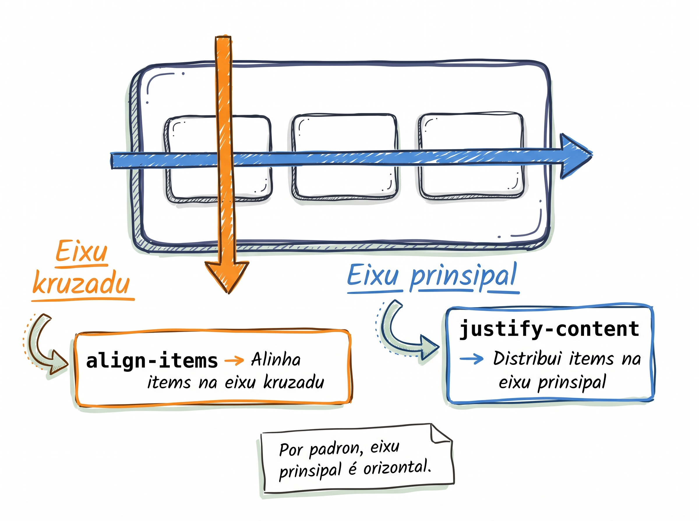
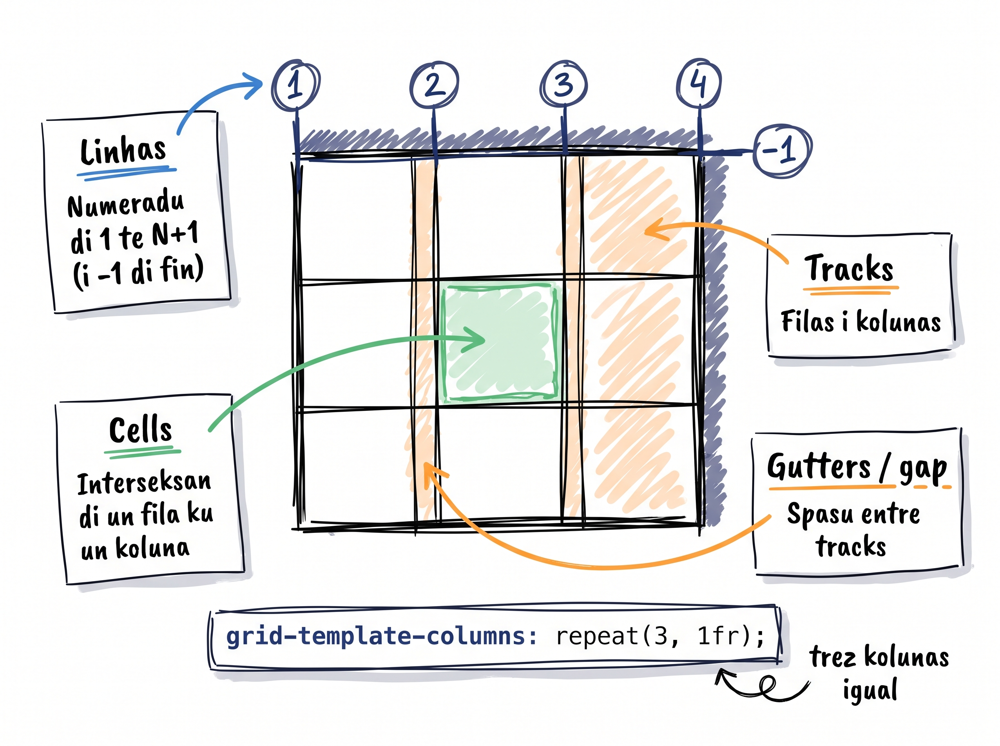

# Visita Kabu Verdi: layout i stilu ku CSS

Lisan final. Bu website sta tudu li, ma fe-feiu — un dokumentu longu sen layout. **Gosi ben kel parti satisfaktóriu:** nu ben da-l vida seksan pa seksan, i no fin bu ta ten un website profissional ki bu pode posta na CodePen, deploy-l na GitHub Pages, ou mostra pa un intrevistador di trabadju.

:::callout{type=tip}
**Kapstone é mas longu — i é normal.** Lisan kombinadu (teach + prátika) ta totaliza 45 minutu na ritmu di profesor, ma **mas studanti solu ta gasta 50–60 minutu**, prinsipalmenti na seksan di testimunhu undi Grid + Flexbox ta kombina. Kel-li é eksatamenti kel tenpu ki ta presisa. Salva freketamenti i inspekciona kada seksan ku DevTools antes di passa pa próximu.
:::

## Pasu 0 — Reset + baz tipográfiku

Abri `style.css` (vaziu desdi L18). Kosta li, na ordi:

```css
/* 0. Reset universal — box-sizing + margin/padding zeradu */
* {
  box-sizing: border-box;
  margin: 0;
  padding: 0;
}

/* 1. Baz di body — inherita pa tudu */
body {
  font-family: sans-serif;
  color: #333;
  line-height: 1.5;
  background-color: #f7f0e6; /* areia */
}

/* 2. Container utility — limita largura, sentra horizontalmenti */
.container {
  max-width: 1200px;
  margin: 0 auto;
  padding: 0 24px;
}

/* 3. Spasu vertikal pa kada seksan */
section,
header.hero,
footer {
  padding: 64px 0;
}

/* 4. Títulus di seksan */
h2 {
  font-size: 32px;
  text-align: center;
  margin-bottom: 32px;
  color: #1098ad; /* teal di L8 */
}
```

**Pamodi `* { box-sizing: border-box }` é o primeru?** Callback di L14: sen reset, kada `padding` ta silensiozamenti **adisiona** pa largura, i grid di 5 koluna ta kuebra. Aplika reset un vés, kosta sintidu.

**Pamodi defini só `font-family` i `color` na `body`?** Callback di L11: kada `<h2>`, `<p>`, `<h3>` dentru di body ta inherita es propriedadi automatikamenti. Bu ka presiza repeti-l na kada selector.

Salva. Refresh. Pajina ta kontinua sen layout, ma tipografia i kor di títulu ta muda — sandy beige na fundu, títulus na teal, sentradu.

## Pasu 1 — Header i Hero ku Flexbox

Hero ten dos trabadju: poi logo + nav nun fila horizontal (1D Flexbox), i mostra un headline + CTA grandi.



```css
.hero {
  background-color: #fff;
  text-align: center;
}

.main-nav {
  display: flex;
  justify-content: space-between;
  align-items: center;
  padding: 20px 0;
  max-width: 1200px;
  margin: 0 auto;
}

.main-nav .logo {
  font-weight: bold;
  font-size: 20px;
  color: #1098ad;
}

.main-nav ul {
  display: flex;
  gap: 24px;
  list-style: none;
}

.main-nav a {
  text-decoration: none;
  color: #333;
}

.main-nav a:hover {
  color: #1098ad;
}

.hero-text h1 {
  font-size: 56px;
  margin-top: 64px;
}

.hero-text .tagline {
  font-size: 20px;
  color: #555;
  margin-bottom: 32px;
}

.hero-text button {
  background-color: #1098ad;
  color: white;
  padding: 16px 32px;
  border: none;
  cursor: pointer;
  font-size: 18px;
  border-radius: 8px;
}

.hero-text button:hover {
  background-color: #0a7888;
}
```

Salva. Refresh. Bu ta odja logo na skerda, nav links na direita, headline grandi sentradu, boton teal mas tarde.

**Order di pseudo-classes (callback L10):** si bu adisiona `:link`, `:visited`, `:hover`, `:active` na link di nav, **uza ordi LVHA**. Tlon — Long Vests Hardly Aware. Si nau, `:hover` ta keda ofuskadu por `:visited`.

:::callout{type=tip}
**`justify-content: space-between` é o padron di header.** Logo skerda, nav direita, ku tudu spasu sobra na meiu — automátiku. Memoriza-l, bu ta repeti es kombinasan en kada projetu.
:::

## Pasu 2 — Ilhas grid (5×2) ku CSS Grid

Aki é undi Grid gana o kursu. 10 ilhas, 5 koluna, 2 linha — **un linha di CSS**.



:::callout{type=tip}
Es kapstone ta uza tres propriedadi nobu — `border-radius`, `box-shadow` i `object-fit` — ki nu ka prende na M1–M4. Es é bu primeru "Google-it" di verdadi (callback L13): abri MDN, prokura kada un, i odja ki ta faze. Skill di developer ka é sabe tudu di kor — é sabe undi prokura.
:::

```css
.islands-grid {
  display: grid;
  grid-template-columns: repeat(5, 1fr);
  gap: 24px;
}

.island-card {
  background-color: white;
  padding: 16px;
  border-radius: 8px;
  box-shadow: 0 2px 4px rgba(0, 0, 0, 0.05);
}

.island-card img {
  width: 100%;
  height: 180px;
  object-fit: cover;
  border-radius: 4px;
  margin-bottom: 12px;
}

.island-card h3 {
  font-size: 18px;
  margin-bottom: 4px;
}

.island-card p {
  font-size: 14px;
  color: #555;
}
```

`repeat(5, 1fr)` = 5 koluna di largura igual. `gap: 24px` = spasu entri kada karta na ambus eixus. 10 kartas dentru ta otomátikamenti enxe 2 linhas.

Salva. Refresh. **Es é o momentu wow.** 10 ilhas ta snap nun grid limpu, organizadu, profisional.

**DevTools check:** klika batch "grid" na `.islands-grid` na painel Elements. Bu ta odja line numbers 1 ti 6 horizontal i 1 ti 3 vertikal. Konfirma ki é igual ki bu ta speraba.

## Pasu 3 — Komida ku Flexbox 2-koluna

Seksan di komida é 1D (foto skerda, testu direita) — Flexbox é ferramenta korretu (callback L15):

```css
.food-row {
  display: flex;
  align-items: center;
  gap: 48px;
}

.food-row img {
  flex: 0 0 400px;        /* largura fixu di 400px, sen krese sen enkolhe */
  height: 300px;
  object-fit: cover;
  border-radius: 8px;
}

.food-text {
  flex: 1;                 /* absorbi spasu sobra */
}

.food-text h3 {
  font-size: 24px;
  margin-bottom: 12px;
  color: #1098ad;
}
```

`flex: 0 0 400px` = ka krese (`0`), ka enkolhe (`0`), baz 400px. Imajen ta keda fiksu na 400px sen importa kuze ki akontese. `flex: 1` na testu = absorbi tudu spasu ki sobra (callback eksatu di L15 pattern).

Salva. Refresh. Foto na skerda, testu na direita, sentradu vertikal.

## Pasu 4 — Muzika ku CSS Grid 3-koluna

Trez kartas di musika — Grid pamodi kada karta é o se própriu sela:

```css
.music-row {
  display: grid;
  grid-template-columns: repeat(3, 1fr);
  gap: 32px;
}

.music-card {
  background-color: white;
  padding: 32px 24px;
  border-radius: 8px;
  text-align: center;
  display: grid;
  place-items: center;     /* sentra kontéudu di kada karta (callback L17) */
  gap: 12px;
}

.music-card h3 {
  font-size: 22px;
  color: #1098ad;
}

.music-card p {
  font-size: 15px;
  color: #555;
}
```

**`place-items: center`** = shorthand di L17 pa sentra **vertikal i horizontal** dentru di kada sela. Un linha en bez di trez.

Salva. Refresh. Trez kartas igual, sentradu, balansadu.

## Pasu 5 — Testimunhu: Grid + Flexbox kombinadu

Aki é undi tudu kursu konverji. **Grid pa o eskema grandi** (3 koluna externa). **Flexbox pa o eskema interno di kada karta** (foto, sitasan, atribuisan enpilhadu vertikal).

```css
/* Externa: Grid 3 koluna */
.testimonials-grid {
  display: grid;
  grid-template-columns: repeat(3, 1fr);
  gap: 24px;
}

/* Interna: Flexbox vertikal dentru di kada karta */
.testimonial {
  display: flex;
  flex-direction: column;
  align-items: center;
  gap: 16px;
  padding: 32px 24px;
  background-color: white;
  border-radius: 8px;
  text-align: center;
}

.testimonial img {
  width: 80px;
  height: 80px;
  border-radius: 50%;       /* rondu kompletu */
  object-fit: cover;
}

.testimonial blockquote {
  font-style: italic;
  color: #555;
  font-size: 15px;
}

.testimonial cite {
  font-size: 14px;
  color: #1098ad;
  font-weight: bold;
  font-style: normal;       /* sobrepasa italic padron di <cite> */
}
```

**Kuze ki es duplo abordajen ta da:**

| Nivel | Display | Direksan | Pa kuze |
|---|---|---|---|
| Externu (`.testimonials-grid`) | `grid` | 2D | 3 kartas lado-a-lado |
| Internu (`.testimonial`) | `flex` (`column`) | 1D vertikal | foto → quote → cite |

**`border-radius: 50%`** ta faze imajen rondu kompletu (callback di L13 sobre azar di propriedadis na MDN — si bu ka konxe, **abri MDN i prokura**).

:::callout{type=tip}
**Grid pa o grandi, Flexbox pa o pikinu.** Sempri si bu sta indeskidu — pinta o mapa: bu kre 2D? Grid. 1D? Flexbox. Es regra ta resolvi 90% di dezision di layout.
:::

Salva. Refresh. Trez kartas profisional, sitasan en italiku, foto rondu di 80px, atribuisan ku nomi i lugar di kada persona.

## Pasu 6 — Footer ku Flexbox 3-koluna

```css
footer {
  background-color: #1d2a35;
  color: #f7f0e6;
}

.footer-cols {
  display: flex;
  justify-content: space-between;
  gap: 48px;
}

.footer-col h3 {
  font-size: 18px;
  margin-bottom: 16px;
  color: white;
}

.footer-col p {
  margin-bottom: 8px;
  font-size: 14px;
  color: #ccc;
}

.copy {
  text-align: center;
  padding-top: 32px;
  margin-top: 32px;
  border-top: 1px solid #555;
  font-size: 14px;
  color: #888;
}
```

Salva. Refresh. **Pajina sta konpletu.**

## Prátika — pasu, salva, inspekciona

Trabalha kada pasu pa pasu, en ordi. Salva i refresh dipos di **kada pasu**, ka tudu na fin. Pamodi:

1. Pasu 0 (reset) — bu ta odja kor i tipografia muda.
2. Pasu 1 (hero) — bu ta odja nav alinhadu, headline grandi.
3. Pasu 2 (ilhas) — **wow moment**. Grid 5×2.
4. Pasu 3 (komida) — foto i testu lado-a-lado.
5. Pasu 4 (muzika) — trez kartas igual.
6. Pasu 5 (testimunhu) — **seksan mas konplikadu**. Toma bu tenpu. Grid primeru, depós Flexbox dentru.
7. Pasu 6 (footer) — projetu konkluí.

**Fin pas — polimentu vizual.** Abri pajina. Tudu sta balansadu? `gap`, `padding`, `font-size` — tweaka ti pajina ta parese profisional. Tudu studanti ta gasta 5 minutu di polimentu fin, i é o ki faze diferensa entri "ta funsiona" i "ta mostra".

**Debug é esperadu (callback L13).** Pa-lo menus un seksan ta dá problema. Abri DevTools, prokura regra ganhador (callback L11 ku specificity), e fika fixu. Ka tenta `!important` — fika ku ferramenta.

## Erus komun pa evita

- **Skesi reset universal.** Sen `* { box-sizing: border-box }`, kada `padding` ta kuebra grid di ilhas silensiozamenti. Primeru kuza pa adisiona, primeru kuza pa kontrola si layout sta kuebra.
- **`start`/`end` (Grid) vs `flex-start`/`flex-end` (Flexbox).** Studantes ta troka es na seksan di testimunhu, undi dos sistema ta kombina. Si alinhamentu ta parece eradu, **es é primeru kuza pa kontrola**.
- **Tenta Flexbox pa grid 5×2.** Funsiona — ma fragil. Si bu muda pa 6 koluna mas tarde, layout ta kuebra. Pa 2D, **Grid**. Sempri.
- **`grid-column: 1 / 6` en bez di `1 / -1` pa "tudu largura".** L17 callback — `1 / -1` é trik majiku. Funsiona indipendentamenti di kuantas koluna existi. Sempri prefer.
- **Aninha Grid dentru di Flexbox dentru di Grid sen konsentrasan.** Na seksan di testimunhu, é fásil perde mapa. **Komenta CSS:** `/* Externa: Grid / Interna: Flexbox */`. Si bu refaktoriza mas tarde, komentariu ta salva-bu.
- **Skesi DevTools.** Abri grid overlay pa kada `.islands-grid`, `.music-row`, `.testimonials-grid`. Konfirma line numbers. Si overlay ka aparece, bu skesi `display: grid`.
- **`!important` ta volta.** Si bu sta tenta uza-l pa "fija un stilu xikadu", **para**. Inspekciona ku DevTools, prokura regra ganhador, otimiza selector (callback L11 ku specificity), ka aniquila ku `!important`.
- **Skipa polimentu fin.** Website "ta funsiona" ka é mêsmu kuza ki "sta polidu". Gasta 5 minutu na fin a fika `gap`, `padding`, `font-size`. Es 5 minutu ta faze diferensa.

<SectionHeading variant="practice">Tenta gosi</SectionHeading>
<TentaGosi showHeader={false} />

<SectionHeading variant="quiz">Testa bu konhesimentu</SectionHeading>
<QuizSet showHeader={false}>
  <Quiz position={0} />
  <Quiz position={1} />
  <Quiz position={2} />
  <Quiz position={3} />
</QuizSet>

<SectionHeading variant="summary">Rezumu</SectionHeading>
<KeyTakeaways showHeader={false}>
  <RezumuItem term="Reset primeru" variant="warning">`* { box-sizing: border-box; margin: 0; padding: 0; }` — sempri o primeru regra.</RezumuItem>
  <RezumuItem term="body ta inherita">Defini `font`, `color`, `line-height` un vés na `body`; tudu fidju ta inherita.</RezumuItem>
  <RezumuItem term=".container">`max-width: 1200px; margin: 0 auto;` limita largura i sentra kada seksan.</RezumuItem>
  <RezumuItem term="Flexbox = 1D">Header, fila di komida, koluna di footer, i dentru di kada testimunhu.</RezumuItem>
  <RezumuItem term="Grid = 2D">Ilhas (5×2), muzika (3×1), testimunhu (3×1 externa).</RezumuItem>
  <RezumuItem term="Grid + Flexbox" variant="gold">Padron profisional: Grid pa o eskema externu, Flexbox pa o internu.</RezumuItem>
  <RezumuItem term="grid-column: 1 / -1">"Spani tudu largura" sen importa kuantas koluna existi.</RezumuItem>
  <RezumuItem term="place-items: center">Sentra na o dos eixu dentru di kada sela di Grid.</RezumuItem>
  <RezumuItem term="DevTools">Grid/Flex overlay pa konfirma ki tudu ta funsiona kumo bu skrebe.</RezumuItem>
  <RezumuItem term="Polimentu fin">5 minutu na `gap`, `padding`, `font-size` ki ta faze diferensa.</RezumuItem>
</KeyTakeaways>

:::callout{type=tip}
**Próximu pasus:**

Parabéns! Bu ja konklui kursu Fundamentus di Web. Bu sabe HTML semantiku, CSS, "inheritance" + specificity, Flexbox, i CSS Grid — tudu kuze ki bu presisa pa kostrui websites statikus profisional. Bu pode mostra es projetu pa amigus, posta-l na CodePen, ou deploy-l gratis na GitHub Pages.

**Próximu rota: JavaScript.** Pa bu faze un website **interativu** — kuandu un usuariu klika "Bem visita-nu", un kuza ta akontese; kuandu un usuariu skrolha, animasons ta apareci; kuandu un usuariu inche un formuláriu, dadus ta valida i ta manda pa servidor. Tudu kel-li é JavaScript.

Skola sta ta prepara un kursu dedikadu, **Introdusan na JavaScript** (`intro-javascript`), ki ta ben ku mêsmu kuidadu i mêsmu kultura kabuverdianu — ku Djássi, Adilson, Djamila, Mário, Cesária Lima, Kátia, Manuel Furtado, i tudu personas familiar. Ti lá — pratika kel-li li, mostra bu website pa amigus i família, posta-l na CodePen, i si bu ten un portfolio página na GitHub, poi bu link la. Nu ta spera-bu na próximu kursu!
:::
