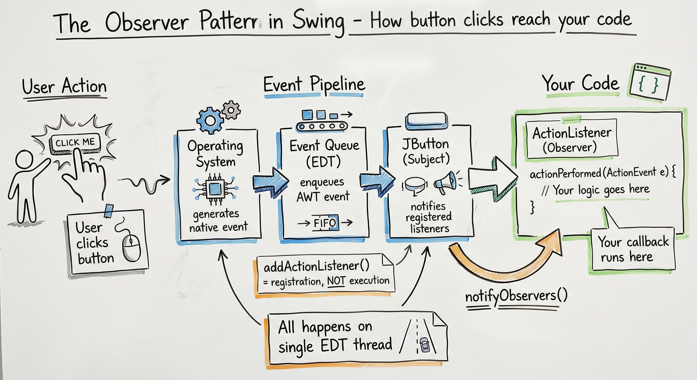
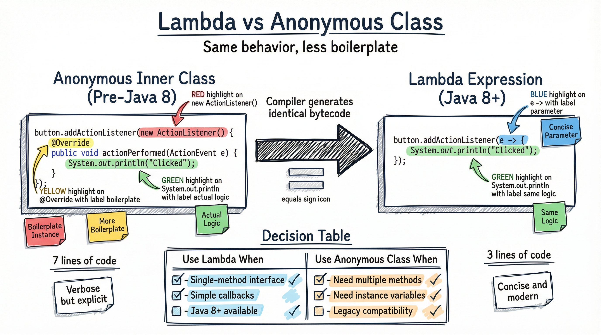
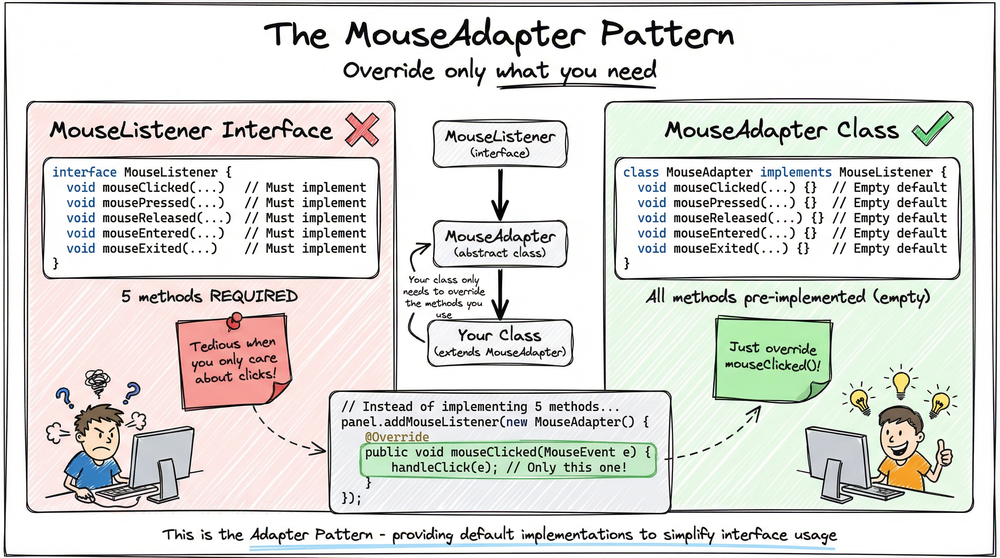

# Event-Driven Architecture in Java Swing

Welcome to Chapter 3! In the previous chapters, you learned to create windows with `JFrame` and arrange components with layout managers. But a static window isn't very useful—users need to *interact* with your application.

In this chapter, you'll learn how Swing responds to user actions: clicks, keystrokes, and mouse movements. By the end, you'll understand the event-driven paradigm that powers all modern GUIs.

## Learning Objectives

After completing this chapter, you will be able to:

- Explain how the **Observer pattern** enables event handling in Swing
- Implement **ActionListener** using both anonymous classes and lambda expressions
- Create global keyboard shortcuts with **Key Bindings** (not KeyListener!)
- Use **MouseAdapter** to simplify mouse event handling

---

## 1. The Observer Pattern in Swing

Unlike console applications that run top-to-bottom and exit, GUI applications are **event-driven**. They sit in a loop, waiting for signals from the operating system—a mouse click, a keystroke, a window resize.

### How Events Flow Through Swing

When a user clicks a button, here's what happens behind the scenes:

1. **Operating System** detects the physical click
2. **Event Queue** on the EDT (Event Dispatch Thread) receives an event object
3. **JButton** (the *Subject*) notifies all registered listeners
4. **Your ActionListener** (the *Observer*) receives the callback

This is the **Observer Pattern**: objects (*observers*) register their interest with a *subject*, and the subject notifies them when something happens.



### The Registration vs Execution Insight

A common misconception among beginners:

```java
button.addActionListener(myListener);  // This does NOT run the listener!
```

Calling `addActionListener()` is **registration**, not execution. Your listener's code runs later, when the user actually clicks the button.

> **Key Takeaway:** The Observer pattern decouples the *source* of events (buttons, menus) from the *handlers* of events (your code). This makes your application flexible and maintainable.

---

## 2. ActionListener: The Workhorse

The `ActionListener` interface is the most common way to handle user actions in Swing. It has a single method:

```java
public interface ActionListener {
    void actionPerformed(ActionEvent e);
}
```

This interface handles **semantic events**—"the user commanded an action"—regardless of *how* they did it (mouse click, keyboard Enter, accessibility tool).

### Pre-Java 8: Anonymous Inner Class

Before Java 8, implementing ActionListener required verbose syntax:

```java
JButton saveBtn = new JButton("Save");

saveBtn.addActionListener(new ActionListener() {
    @Override
    public void actionPerformed(ActionEvent e) {
        System.out.println("Saving...");
    }
});
```

That's 7 lines just to print a message! The `new ActionListener()` and `@Override` are pure boilerplate.

### Java 8+: Lambda Expressions

With lambdas, the same code becomes:

```java
saveBtn.addActionListener(e -> {
    System.out.println("Saving via Lambda!");
    saveBtn.setText("Saved!");
});
```

Down to 3 lines. The compiler knows `ActionListener` has only one method, so it figures out what you mean.



### When to Use Each

| Use Lambda When... | Use Anonymous Class When... |
|--------------------|----------------------------|
| Single-method interface | Need multiple methods |
| Simple callbacks | Need instance variables |
| Java 8+ available | Legacy compatibility required |

> **Key Takeaway:** For modern Java development, prefer lambda expressions for ActionListener and other single-method interfaces. They're concise, readable, and the industry standard.

---

## 3. Key Bindings vs KeyListener

Now let's tackle keyboard shortcuts. Your first instinct might be to use `KeyListener`:

```java
// DON'T DO THIS for shortcuts!
panel.addKeyListener(new KeyListener() {
    @Override
    public void keyPressed(KeyEvent e) {
        if (e.isControlDown() && e.getKeyCode() == KeyEvent.VK_S) {
            doSave();
        }
    }
    // ... two more required methods ...
});
```

### The Focus Problem

This approach has a fatal flaw: **KeyListener only works when the component has focus.**

Consider this scenario:
1. User presses Ctrl+S → works fine
2. User clicks a text field to type something
3. User presses Ctrl+S → **nothing happens!**

The text field now has focus, not your panel. Your shortcut is broken.

### The Solution: Key Bindings

Key Bindings solve this with a three-layer architecture:

1. **InputMap**: Maps physical keystrokes to logical action names
2. **ActionMap**: Maps action names to actual code
3. **Focus Scope**: Defines when the binding is active


### Implementing Ctrl+S the Right Way

```java
JPanel panel = new JPanel();
String saveKey = "ACTION_SAVE";

// Step 1: Map the keystroke to a logical name
InputMap inputMap = panel.getInputMap(JComponent.WHEN_IN_FOCUSED_WINDOW);
inputMap.put(KeyStroke.getKeyStroke("control S"), saveKey);

// Step 2: Map the logical name to an action
ActionMap actionMap = panel.getActionMap();
actionMap.put(saveKey, new AbstractAction() {
    @Override
    public void actionPerformed(ActionEvent e) {
        doSaveLogic();
    }
});
```

### Understanding Focus Scopes

The `getInputMap()` method accepts a focus condition:

| Constant | When It Works |
|----------|---------------|
| `WHEN_FOCUSED` | Only when this exact component has focus |
| `WHEN_ANCESTOR_OF_FOCUSED_COMPONENT` | When this component or any child has focus |
| `WHEN_IN_FOCUSED_WINDOW` | Anywhere in the window (use this for global shortcuts!) |

For application-wide shortcuts like Ctrl+S, Ctrl+N, Ctrl+Q, always use `WHEN_IN_FOCUSED_WINDOW`.

> **Key Takeaway:** Never use KeyListener for keyboard shortcuts. Key Bindings work regardless of which component has focus, making them reliable for real applications.

---

## 4. MouseAdapter: The Convenience Pattern

The `MouseListener` interface has five methods you must implement:

```java
public interface MouseListener {
    void mouseClicked(MouseEvent e);
    void mousePressed(MouseEvent e);
    void mouseReleased(MouseEvent e);
    void mouseEntered(MouseEvent e);
    void mouseExited(MouseEvent e);
}
```

But what if you only care about clicks? Implementing empty methods for the other four is tedious:

```java
// Tedious: 4 empty methods just to handle clicks
panel.addMouseListener(new MouseListener() {
    @Override public void mouseClicked(MouseEvent e) { handleClick(e); }
    @Override public void mousePressed(MouseEvent e) { }
    @Override public void mouseReleased(MouseEvent e) { }
    @Override public void mouseEntered(MouseEvent e) { }
    @Override public void mouseExited(MouseEvent e) { }
});
```

### Enter MouseAdapter

`MouseAdapter` is an abstract class that implements all five methods as empty no-ops. You extend it and override only what you need:

```java
// Clean: Override only mouseClicked
panel.addMouseListener(new MouseAdapter() {
    @Override
    public void mouseClicked(MouseEvent e) {
        handleClick(e);
    }
});
```



### The Adapter Pattern

This is an example of the **Adapter design pattern**—providing default implementations to simplify interface usage. Swing includes several adapters:

- `MouseAdapter` for `MouseListener`
- `KeyAdapter` for `KeyListener`
- `WindowAdapter` for `WindowListener`
- `FocusAdapter` for `FocusListener`

> **Key Takeaway:** When implementing listener interfaces with multiple methods, check if an Adapter class exists. It saves boilerplate and makes your intent clearer.

---

## 5. Practice Exercise: Counter App

Time to apply what you've learned! Build a counter application with these requirements:

### Requirements

1. **Display**: Show the current count (starting at 0)
2. **Buttons**:
   - "+" button increments the count
   - "-" button decrements the count
3. **Keyboard Shortcuts**:
   - Ctrl+Up Arrow increments
   - Ctrl+Down Arrow decrements
4. **Constraint**: Count cannot go below 0

### Starter Template

```java
import javax.swing.*;
import java.awt.*;
import java.awt.event.*;

public class CounterApp {
    private int count = 0;
    private JLabel countLabel;

    private void createAndShowGUI() {
        JFrame frame = new JFrame("Counter");
        frame.setDefaultCloseOperation(JFrame.EXIT_ON_CLOSE);

        JPanel panel = new JPanel(new BorderLayout(10, 10));

        // TODO: Create countLabel and add to CENTER

        // TODO: Create button panel with + and - buttons
        //       Use ActionListener (lambda!) for each button

        // TODO: Set up Key Bindings for Ctrl+Up and Ctrl+Down
        //       Use WHEN_IN_FOCUSED_WINDOW scope

        frame.add(panel);
        frame.pack();
        frame.setLocationRelativeTo(null);
        frame.setVisible(true);
    }

    private void increment() {
        count++;
        updateLabel();
    }

    private void decrement() {
        if (count > 0) {
            count--;
            updateLabel();
        }
    }

    private void updateLabel() {
        countLabel.setText(String.valueOf(count));
    }

    public static void main(String[] args) {
        SwingUtilities.invokeLater(() -> new CounterApp().createAndShowGUI());
    }
}
```

### Hints

<details>
<summary>Hint 1: Creating the label</summary>

```java
countLabel = new JLabel("0", SwingConstants.CENTER);
countLabel.setFont(new Font("Segoe UI", Font.BOLD, 48));
panel.add(countLabel, BorderLayout.CENTER);
```

</details>

<details>
<summary>Hint 2: Button listeners with lambdas</summary>

```java
JButton plusBtn = new JButton("+");
plusBtn.addActionListener(e -> increment());

JButton minusBtn = new JButton("-");
minusBtn.addActionListener(e -> decrement());
```

</details>

<details>
<summary>Hint 3: Key Bindings for Ctrl+Up</summary>

```java
InputMap inputMap = panel.getInputMap(JComponent.WHEN_IN_FOCUSED_WINDOW);
ActionMap actionMap = panel.getActionMap();

inputMap.put(KeyStroke.getKeyStroke("control UP"), "increment");
actionMap.put("increment", new AbstractAction() {
    @Override
    public void actionPerformed(ActionEvent e) {
        increment();
    }
});
```

</details>

---

## 6. Summary

In this chapter, you mastered event-driven programming in Java Swing:

- **Observer Pattern**: Swing components (subjects) notify registered listeners (observers) when events occur. `addActionListener()` is registration, not execution.

- **ActionListener with Lambdas**: Modern Java code uses lambda expressions (`e -> { ... }`) instead of verbose anonymous inner classes.

- **Key Bindings over KeyListener**: For keyboard shortcuts, use InputMap/ActionMap with `WHEN_IN_FOCUSED_WINDOW`. KeyListener breaks when focus changes.

- **MouseAdapter Pattern**: Use adapter classes to implement only the listener methods you need.

---

## What's Next?

In **Chapter 4: Input, Validation, and Dialogs**, you'll learn to:

- Build robust forms with JTextField, JComboBox, and JCheckBox
- Implement real-time validation with DocumentListener
- Create professional dialogs with JOptionPane

Your event handling knowledge will be essential as we connect user input to application logic!

---

*This tutorial is part of the [Modern Java Swing Development](/tutorials/java-swing) series by Skola.dev*
