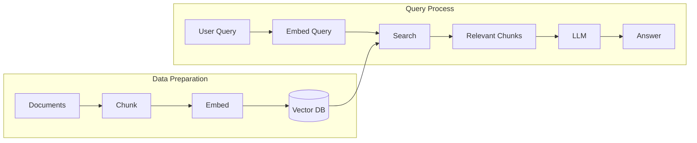
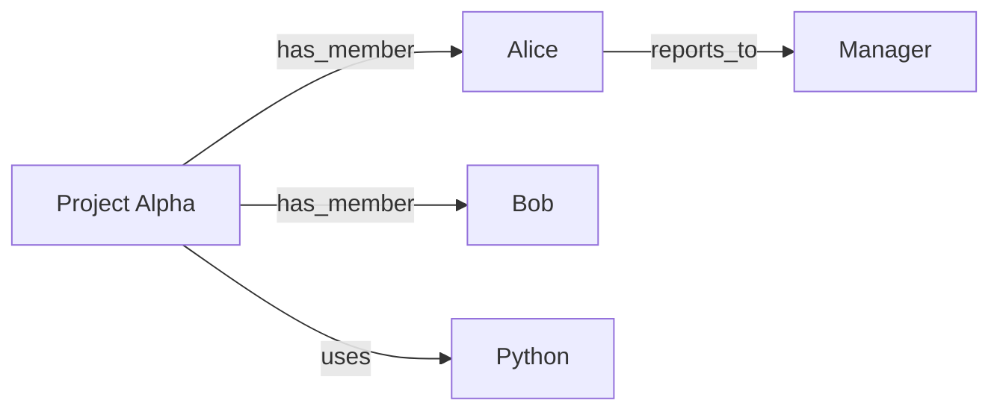
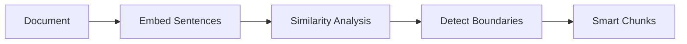
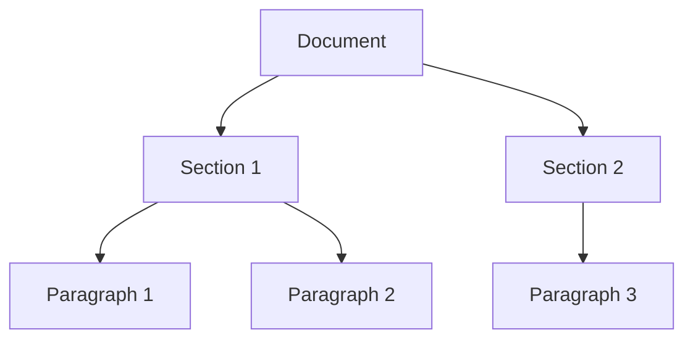

# RAG Strategies Overview

**11 Strategies to Optimize Your AI Knowledge Retrieval**

<br>

A concise guide to Retrieval Augmented Generation patterns

<div class="abs-bl m-6 text-sm opacity-50">
Based on "Every RAG Strategy Explained in 13 Minutes"
</div>

---

# What is RAG?

**Retrieval Augmented Generation** gives AI agents the ability to search and leverage your knowledge and documents.

<v-clicks>

- **Problem**: LLMs have knowledge cutoffs and can't access private data
- **Solution**: Retrieve relevant context, then generate with that context
- **Use Case**: "What are the action items from our last meeting?"

</v-clicks>

<br>

> The optimal solution usually combines **3-5 RAG strategies** together

---

# The RAG Pipeline



<v-clicks>

- **Data Prep**: Documents → Chunks → Embeddings → Vector DB
- **Query**: User Query → Embed → Search → Augment LLM → Answer

</v-clicks>

---

# 1. Re-ranking

**Two-step retrieval with a specialized re-ranker model**

<v-clicks>

- Pull a **large number of chunks** from vector DB (e.g., 50+)
- Use a **cross-encoder model** to find the most relevant ones
- Return only the **top few** to the LLM

</v-clicks>

<br>

**Trade-offs**
| Pros | Cons |
|------|------|
| Consider more knowledge without overwhelming LLM | Slightly more expensive (second model) |
| Higher relevance precision | Added latency |

<br>

> First strategy to use in almost every RAG implementation

---

# 2. Agentic RAG

**Agent dynamically chooses how to search the knowledge base**

<v-clicks>

- Agent can do **semantic search** on chunks
- Or **read entire documents** when needed
- Agent picks based on the question type

</v-clicks>

<br>

```python
# Example: Agent has multiple search tools
tools = [
    semantic_search_chunks,  # Fine-grained search
    get_full_document,       # Read entire doc
    list_documents,          # Browse available docs
]
```

<br>

**Trade-off**: Very flexible but less predictable - needs clear instructions

---

# 3. Knowledge Graphs

**Combine vector search with entity relationship search**

<v-clicks>

- Build a **graph of entities and relationships** using an LLM
- Search both **vector similarity** and **relationship paths**
- Great for **interconnected data** (people, concepts, events)

</v-clicks>

<br>



<br>

**Trade-off**: Slower and more expensive to build (LLM extraction), but powerful for connected data

---

# 4. Contextual Retrieval

**LLM enriches each chunk with document context**

<v-clicks>

- Use LLM to generate a **context prefix** for each chunk
- Prefix describes how the chunk fits with the rest of the document
- Embed the enriched chunk (context + original content)

</v-clicks>

<br>

```text
[Context: This chunk is from the Q3 financial report,
specifically discussing revenue growth in APAC region.]
~~~
Revenue increased 15% YoY driven by new enterprise deals...
```

<br>

**Trade-off**: Slower indexing (LLM call per chunk), but significant retrieval accuracy gains

---

# 5. Query Expansion

**LLM expands the user query before searching**

<v-clicks>

- Take user query → LLM adds **relevant details**
- More specific query → **better precision** in retrieval
- Define instructions for how to improve queries

</v-clicks>

<br>

```python
# Original: "meeting notes"
# Expanded: "meeting notes action items decisions
#           attendees follow-up tasks Q4 planning"
```

<br>

**Trade-off**: Extra LLM call before every search, but improves relevance

---

# 6. Multi-Query RAG

**Generate multiple query variants in parallel**

<v-clicks>

- LLM generates **multiple different versions** of the query
- Run all queries **in parallel** against the vector DB
- Combine and deduplicate results

</v-clicks>

<br>

```python
# Original: "How do I reset my password?"
queries = [
    "password reset instructions",
    "forgot password recovery steps",
    "change account password guide",
]
results = parallel_search(queries)
```

<br>

**Trade-off**: More comprehensive coverage, but more DB queries

---

# 7. Context-Aware Chunking

**Use embeddings to find natural document boundaries**

<v-clicks>

- Don't just split every N characters
- Use **embedding similarity** to detect topic shifts
- Split at **natural boundaries** (sections, paragraphs)

</v-clicks>

<br>



<br>

**Trade-off**: More complex than fixed-size chunking, but maintains document structure

> **Tip**: Use `dockling` library for hybrid chunking in Python

---

# 8. Late Chunking

**Embed the document before chunking**

<v-clicks>

- Apply embedding model to **full document first**
- Then chunk the **token embeddings** (not the text)
- Each chunk retains **full document context**

</v-clicks>

<br>

```
Traditional: Chunk → Embed each chunk (loses context)
Late:        Embed full doc → Chunk embeddings (keeps context)
```

<br>

**Trade-off**: Most complex strategy, but best for maintaining document context. Requires longer-context embedding models.

---

# 9. Hierarchical RAG

**Parent-child chunk relationships**

<v-clicks>

- Store chunks at **multiple granularities** (paragraph → section → doc)
- Search at **fine granularity** for precision
- Return **parent chunks** for more context

</v-clicks>

<br>



<br>

**Trade-off**: Search small (precise), return big (context). Can be combined with Agentic RAG.

---

# 10. Self-Reflective RAG

**Self-correcting search loop with quality grading**

<v-clicks>

- Perform initial search
- LLM **grades relevance** of results (e.g., 1-5 scale)
- If grade < threshold → **refine and retry**

</v-clicks>

<br>

```python
while True:
    chunks = search(query)
    grade = llm.grade_relevance(chunks, query)
    if grade >= 3:
        return chunks
    query = llm.refine_query(query, feedback)
```

<br>

**Trade-off**: Self-correcting, but more LLM calls and potential latency

---

# 11. Fine-Tuned Embeddings

**Train embedding model on domain-specific data**

<v-clicks>

- Fine-tune on your **domain** (legal, medical, etc.)
- 5-10% accuracy gains possible
- Small fine-tuned model can beat large generic ones

</v-clicks>

<br>

**Example: Sentiment-based similarity**
```
Pre-trained:  "order was late" ≈ "shipping was fast" (both about orders)
Fine-tuned:   "order was late" ≈ "items always sold out" (both negative)
```

<br>

**Trade-off**: Requires training data and ongoing maintenance

---

# Strategy Comparison

| Strategy | Best For | Trade-off |
|----------|----------|-----------|
| Re-ranking | General use | +cost, +latency |
| Agentic RAG | Flexible search needs | Less predictable |
| Knowledge Graphs | Interconnected data | Slow to build |
| Contextual Retrieval | Accuracy boost | LLM per chunk |
| Query Expansion | Precision | +1 LLM call |
| Multi-Query | Coverage | More DB queries |
| Context-Aware Chunking | Document structure | Complex setup |
| Late Chunking | Full context preservation | Very complex |
| Hierarchical RAG | Variable context needs | Storage overhead |
| Self-Reflective RAG | Quality assurance | Latency |
| Fine-Tuned Embeddings | Domain-specific | Training required |

---

# Recommended Starter Combo

Start with these **3 strategies** for most use cases:

<v-clicks>

### 1. Re-ranking
The foundational strategy - use in almost every implementation

### 2. Agentic RAG
Give your agent flexibility in how it searches

### 3. Context-Aware Chunking
Specifically **hybrid chunking with `dockling`** for Python

</v-clicks>

<br>

> Combine 3-5 strategies for optimal results in production

---

# Resources

**Source Video**
- [Every RAG Strategy Explained in 13 Minutes](https://www.youtube.com/watch?v=tLMViADvSNE)

**Tools Mentioned**
- **Neon** - Postgres with PG Vector
- **dockling** - Hybrid chunking library (Python)
- **Graffiti** - Knowledge graph library

**Further Reading**
- Anthropic's Contextual Retrieval research
- Cross-encoder models for re-ranking

---
layout: center
---

# Questions?

<br>

**Next Steps**
1. Start with Re-ranking + Agentic RAG + Context-Aware Chunking
2. Measure retrieval quality with your data
3. Add more strategies based on specific needs

<br>

<div class="text-sm opacity-50">
Slides created with Slidev
</div>
